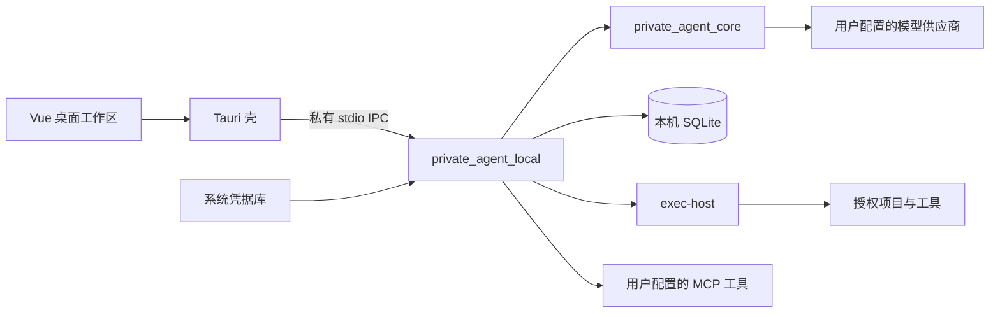

# PrivateAgent｜本机桌面 Agent

PrivateAgent 使用 Tauri 2、Vue 3 和 TypeScript 提供桌面工作区，以 Python 本机执行器和共享 AgentRuntime 运行任务。用户配置自己的 API Key，模型请求从电脑直接发送给所选供应商；项目、会话、工具执行和记忆保存在本机 SQLite。

> 当前源码边界：2026-09-20。旧 `personal_assistant` 服务端、MySQL/Alembic、RAG/个人中枢业务、服务器部署入口及桌面旧后端启动链已移除。历史文档和既有用户数据保留，不代表当前功能或部署状态。接手请先读 [AGENTS.md](AGENTS.md)、[项目状态快照](docs/project-state.md)及[本次变更说明](docs/solutions/2026-09-20-local-only-context.md)。

## 使用方式

1. 打开含本机执行器的桌面客户端，自动进入 Coding 工作区，无需平台账号。
2. 在模型设置中添加供应商、地址、API Key 和模型，选择默认模型。支持 OpenAI 兼容 Chat Completions、Claude Messages 和 Ollama Chat；本机兼容服务允许沿用可选密钥规则。
3. 打开本机项目后创建任务。文件变更、命令、Git 和技术文档 MCP 沿用现有权限、审批与执行证据规则。

系统凭据库存储供应商密钥，SQLite 保存配置及凭据引用。提示词、代码片段和工具结果可能发送给所选供应商，因此并非完全离线。旧账号空间不自动合并，本机空间及既有密钥命名保持兼容。详见[本机模型说明](docs/direct-model-execution.md)。

## 当前能力

- Coding 工作区：任务全文搜索与归档、流式回答、运行中草稿保留、暂停恢复、可调整宽度的审阅面板与行级反馈、worktree 隔离与交接。见[工作台使用说明](docs/workbench-guide.md)。
- 本机工具：授权目录读取、搜索、文件版本检查、补丁审批、进程执行、Git、通过 `/skill` 按需使用 Skills、通用 MCP、公开页面读取与本机浏览器证据，详见[工具系统](docs/local-tool-system.md)。
- 上下文：按目录发现受信 `AGENTS.md` / `AGENTS.override.md`，完整请求预算，安全边界压缩，带来源的工作摘要和可分页续读的原始记录。
- 长期记忆：使用和后台生成独立控制，默认关闭，支持项目知识、跨项目偏好、会话排除、编辑和遗忘。详见[记忆设计](docs/memory-design.md)。
- 桌面体验：窗口与托盘、独立更新通道、内置壁纸主题。壁纸保存在本机，预览后应用，停用保留副本，恢复默认不删除原图。

## 架构与目录



| 目录 | 职责 |
| --- | --- |
| `apps/desktop` | Vue 工作区、Tauri 生命周期与凭据边界 |
| `apps/exec-host` | 本机命令执行与平台隔离 |
| `src/private_agent_core` | 模型契约、适配器、Agent 循环、上下文预算 |
| `src/private_agent_local` | SQLite、项目与会话、IPC、本机工具、模型路由、上下文与记忆 |
| `tests/unit`、`tests/packaging`、`tests/coding_acceptance` | 本机单元、打包与隔离评测；不使用真实用户数据 |
| `scripts` | 协议生成、本机验证、打包与签名辅助 |
| `docs`、`docs/archive/legacy` | 当前本机说明与集中归档的旧架构、部署资料 |

FastAPI 用于本机请求分发及可选回环 HTTP 入口，不再承载独立旧服务器。Python wheel 只包含两个本机包；旧数据库和向量库依赖不进入新锁文件。

## 开发与验证

主要交付平台是 Windows 10/11 x64。源码开发需要 Python 3.12+、uv、Node.js 20+、Rust/MSVC Build Tools；桌面运行需要 WebView2，项目自身的构建与测试工具仍由项目提供。macOS/Linux 不作为本次验证结论。

首次准备环境：

```powershell
uv sync --locked --all-extras
npm ci --prefix apps/desktop
```

在仓库根运行本机隔离测试与协议检查：

```powershell
.venv\Scripts\python.exe -B scripts/run_coding_validation.py --suite context-alignment
.venv\Scripts\python.exe -B scripts/run_coding_validation.py --suite all
.venv\Scripts\python.exe -B scripts/protocol_codegen.py --check
node --test scripts/build-remote-client.test.cjs
npm test --prefix apps/desktop
npm run build --prefix apps/desktop
```

测试运行器为每次调用新建 `.run/coding-agent-validation` 子目录，使用临时 SQLite 和模型替身。需要操作系统支持的执行宿主测试可能有环境限制；完整命令、实际结果及已知失败见[验证记录](docs/solutions/2026-09-20-local-only-context.md)。`npm run dev --prefix apps/desktop` 只提供界面开发服务，普通浏览器不具备本机执行能力。

## 构建

```powershell
scripts\build-client.cmd
scripts\build-client.cmd --preview-installer --version 1.0.0
```

默认生成未签名便携验证目录，第二条生成未签名安装器供本机验证。版本仅为参数示例，不表示已发布。构建目录包含桌面程序、`private-agent-local.exe`、`exec-host.exe`、宿主校验摘要和源码清单；便携运行须保持这些文件同目录。

`build-release.bat` 现在转发到同一本机入口。底层 `build-remote-client.cjs` 保留旧桌面标识的构建兼容选项，生成的执行器也仅使用本机 API Key。两种标识的更新目标仍隔离；正式统一客户端必须显式提供独立 `--update-url`，并满足干净工作区与签名校验要求。默认和预览构建不配置更新源，不上传、不安装、不发布。

发布清单从明确指定的构建目录生成：

```powershell
.venv\Scripts\python.exe scripts/generate_release_manifest.py --bundle <本次构建目录> --write
```

清单不将产物存在当作测试或签名验收通过。SignPath 工作流改用本机打包链，发布环境需设置 `PRIVATEAGENT_UPDATE_URL`；历史服务器更新脚本已删除。源码变更不会自动更新已安装副本。

## 上下文行为与边界

自动压缩阈值受输入硬预算约束，始终为输出和安全余量留出空间；可通过 `context_limits.auto_compact_token_limit` 提前触发。活跃任务默认尝试一次带来源的模型工作摘要，失败回退事实索引；摘要调用计入任务次数、用量和时间预算，会产生额外供应商费用。`semantic_compaction=false` 可关闭语义摘要，空闲手动压缩只生成事实索引。

用户原文和最近完整工具组保留，原始历史不删除；旧事实索引与全文可分页续读。摘要是可能有误的参考数据，不授予权限、不替代执行证据。此实现借鉴 Codex 的预算、摘要和来源管理思路，不调用 OpenAI 的专有 compaction 接口，也不宣称复制其内部算法。详见[上下文设计](docs/context-design.md)。

## 许可与签名政策

项目采用 [Apache License 2.0](LICENSE)。隐私说明见 [PRIVACY.md](PRIVACY.md)。

Free code signing is provided by [SignPath.io](https://signpath.io/), with a certificate provided by the [SignPath Foundation](https://signpath.org/). 签名政策与人工审批要求见 [CODE_SIGNING_POLICY.md](CODE_SIGNING_POLICY.md)。本次源码工作不代表签名、安装升级或真实模型验收已完成。

[文档中心](docs/README.md)保留旧设计与历史部署记录；涉及 MySQL、Alembic、Chroma 和旧服务器的历史步骤不适用于当前源码。
