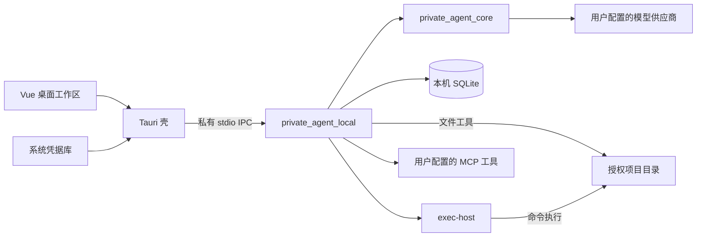

# PrivateAgent｜本机桌面 Agent

PrivateAgent 是使用自备 API Key 的本机 AI 编程工作台。桌面界面由 Tauri 2、Vue 3 和 TypeScript 构建，Python 本机执行器与共享 AgentRuntime 负责模型调用和工具执行，可用于理解项目、修改代码、运行验证及审查差异。

项目文件留在用户选择的本机目录；项目元数据、会话、执行记录和记忆保存在本机 SQLite，供应商密钥由系统凭据库管理。模型请求从电脑直接发送给所选供应商，无需 PrivateAgent 平台账号。

> 本文按 2026-09-22 的源码整理。自 2026-09-20 起，项目仅保留 API Key 本机桌面链；旧 `personal_assistant` 服务端、MySQL/Alembic、RAG/个人中枢业务及服务器部署入口已移除。源码能力、测试结果、安装包与正式发布状态需分别核对，详见[本机化说明](docs/solutions/2026-09-20-local-only-context.md)。

[快速开始](#快速开始) · [开发环境](#开发环境) · [测试与验证](#测试与验证) · [构建与更新](#构建与更新) · [文档导航](#文档导航)

## 快速开始

1. 启动包含本机执行器的桌面客户端，自动进入 Coding 工作区。源码构建方式见[构建与更新](#构建与更新)。
2. 打开“设置 → 模型”，添加供应商地址、API Key 和模型 ID，选择默认模型；按供应商支持情况设置 API 格式与模型能力。
3. 添加本机项目并确认授权目录，创建任务后描述目标。需要修改文件、执行命令或调用外部工具时，按当前权限模式确认审批。
4. 在“环境与变更”中查看差异、工具记录和验证结果；需要补充修改意见时可添加行级反馈。运行期间可保留输入草稿，任务结束后发送。

| 模型接口 | 配置说明 |
| --- | --- |
| OpenAI 兼容 Chat Completions | 使用供应商 API 根地址及模型 ID；既有 OpenAI 配置默认沿用此格式 |
| OpenAI Responses | 在“API 格式”中显式选择 Responses；仅适用于供应商明确支持该接口的情况，不自动探测或失败回退 |
| Claude Messages | 选择 Claude 协议并配置对应地址、密钥与模型 |
| Ollama Chat | 连接本机回环地址，并填写模型上下文容量 |

远程模型端点要求 HTTPS；本机回环 OpenAI 兼容服务支持可选密钥。连接测试只检查模型列表，工具能力探测及真实任务会产生供应商请求，可能计费。完整配置与兼容规则见[本机模型说明](docs/direct-model-execution.md)。

## 主要能力

| 能力 | 当前范围 |
| --- | --- |
| 项目与任务 | 本机项目管理、任务全文搜索、归档恢复、流式回答、草稿保留、暂停与继续 |
| 文件与命令 | 授权目录读取和搜索、文件版本校验、补丁审批、进程执行、Git 操作与执行证据 |
| 审阅与工作区 | 可调整宽度的审阅面板、行级反馈、独立 worktree、预览后交接到项目根目录 |
| Skills 与 MCP | 在“插件”中管理 Skills 和 MCP，通过 `/skill` 按需加载技能；支持 HTTPS、经信任确认的 stdio MCP 和工具授权 |
| 网页与浏览器 | 审批后读取公开 HTTPS 页面；对已启动的本机预览执行有限浏览器检查，保留断言和截图证据 |
| 上下文与记忆 | 受信项目规则、请求预算、带来源的压缩摘要及原文续读；长期记忆默认关闭，可控制使用、生成、编辑和遗忘 |
| 桌面体验 | 窗口与托盘、壁纸主题、按客户端目标隔离的更新检查与验签 |

操作入口及限制见[工作台使用说明](docs/workbench-guide.md)和[本机工具系统](docs/local-tool-system.md)。网页搜索需要用户配置相应 MCP 工具；浏览器检查仅适用于其支持的本机流程，截图生成不代表视觉验收通过。

## 架构与目录



| 目录 | 职责 |
| --- | --- |
| [`apps/desktop`](apps/desktop/README.md) | Vue 工作区、Tauri 生命周期与凭据边界 |
| `apps/exec-host` | 本机命令执行与平台隔离 |
| `src/private_agent_core` | 模型契约、适配器、Agent 循环、上下文预算 |
| `src/private_agent_local` | SQLite、项目与会话、IPC、本机工具、模型路由、上下文与记忆 |
| [`tests`](tests/README.md) | `unit`、`packaging`、`coding_acceptance`：本机单元、打包与隔离评测 |
| [`scripts`](scripts/README.md) | 协议生成、本机验证、打包与签名辅助 |
| [`docs`](docs/README.md) | 当前使用说明、专题记录及 `archive` 中的历史资料 |

FastAPI 用于本机请求分发及可选回环 HTTP 入口。Python wheel 只包含 `private_agent_core` 和 `private_agent_local`；运行本机客户端无需部署旧后端、MySQL 或向量数据库。

完整目录职责见[目录说明](docs/repository-layout.md)。`.run/`、`.tmp/`、`dist/` 保存本机生成材料并被 Git 忽略，不随源码克隆分发；历史验证证据的归档位置和保留规则见[整理记录](docs/solutions/2026-09-22-project-cleanup.md)。

## 开发环境

主要交付平台是 **Windows 10/11 x64**，桌面运行需要 WebView2。源码开发需要 Python 3.12+、uv、Node.js 20+、Rust 和 MSVC Build Tools；项目自身使用的构建与测试工具也需在本机可用。macOS/Linux 尚不在本文验证范围内。

以下命令均在仓库根目录执行。首次安装锁定的开发依赖：

```powershell
uv sync --locked --all-extras
npm ci --prefix apps/desktop
```

仅调试前端界面：

```powershell
npm run dev --prefix apps/desktop
```

Vite 浏览器预览不提供本机执行与凭据能力。桌面联调和 Windows 辅助入口见[桌面端说明](apps/desktop/README.md)及[脚本索引](scripts/README.md)；完整客户端使用下方统一构建入口。

## 测试与验证

按改动选择隔离套件，常用入口如下；这些是复跑命令，不是本次全部通过的声明：

```powershell
.venv\Scripts\python.exe -B scripts/run_coding_validation.py --suite direct-models
.venv\Scripts\python.exe -B scripts/run_coding_validation.py --suite context-alignment
.venv\Scripts\python.exe -B scripts/protocol_codegen.py --check
node --test scripts/build-remote-client.test.cjs
npm test --prefix apps/desktop
npm run build --prefix apps/desktop
```

Python 运行器每次创建独立的 `.run/coding-agent-validation/<套件>-<随机标识>/`，过滤环境变量并使用临时数据与合成模型，不加载仓库 `.env` 或真实用户数据库。需要命令执行的测试依赖 Rust 执行宿主；缺失时在已初始化 MSVC 的终端构建：

```powershell
cargo build --release --locked --manifest-path apps/exec-host/Cargo.toml
```

运行包含打包验证的套件前，还需在已有 Rust 依赖缓存及 MSVC 环境中准备验签器：

```powershell
cargo build --offline --locked --release --manifest-path scripts/windows/updater-signature-verifier/Cargo.toml
.venv\Scripts\python.exe -B scripts/run_coding_validation.py --suite desktop-packaging
```

`--suite all` 汇总去重后的套件，排除 `duration` 和 `execution-duration` 两个长时间套件，单次上限 900 秒，超时返回 124。完整套件映射、浏览器测试入口和已知失败见[测试指南](docs/testing-guide.md)。隔离测试、前端构建、原生安装升级和真实供应商验收是不同结论。

## 构建与更新

统一入口为 `scripts\build-client.cmd`。先查看支持的参数，再按需要构建便携目录或本机预览安装器：

```powershell
node scripts/build-client.cjs --help
.\scripts\build-client.cmd
.\scripts\build-client.cmd --preview-installer --version 1.0.0
```

默认构建生成未签名便携验证目录，`--preview-installer` 生成未签名安装器；示例版本不表示已经发布。脚本会打印本次 `.run/unified-client-*` 输出位置，其中包含桌面程序、`private-agent-local.exe`、`exec-host.exe`、宿主校验摘要和源码清单；便携运行须保持这些文件同目录。前端与执行器应来自同一次构建。

| 构建模式 | 签名与更新边界 |
| --- | --- |
| 默认便携验证包 | 未签名，不预置更新源 |
| `--preview-installer` | 未签名，默认不预置更新源；统一预览可显式传入 `--update-url` 测试更新检查，不生成可发布的签名和更新清单 |
| `--release` | 要求干净工作区、已有受保护签名环境及明确更新源，生成 Tauri 签名更新产物 |

只核对正式构建参数，不签名或生成安装包：

```powershell
node scripts/build-client.cjs --release --version 1.0.0 --github-repo lkuliuying/PrivateAgent --dry-run
```

正式构建由维护者通过 `scripts\build-client.cmd --release` 执行。`--github-repo lkuliuying/PrivateAgent` 配置 GitHub Release 的 `latest.json` 更新入口，与自定义 `--update-url` / `--download-base-url` 互斥；地址已配置不代表远端更新产物已经可用。

“设置 → 关于与更新”可查看实际客户端版本及配置匹配的更新源。统一客户端目标为 `unified-windows-x86_64`，旧联网客户端为 `remote-windows-x86_64`，独立候选版不能切换为正式通道。历史 `build-release.bat` 转发到统一入口；`build-remote-client.cjs` 保留旧桌面标识兼容选项，产物同样使用本机 API Key 链。不同标识的数据目录和更新目标不能混用。

发布清单从明确指定的本次构建目录生成，不根据文件存在推断测试或签名验收通过：

```powershell
.venv\Scripts\python.exe scripts/generate_release_manifest.py --bundle "<本次构建目录>" --write
```

预览更新测试、离线验签和草稿资产发布步骤见[发布操作说明](docs/releases/v1.0.0/github-release.md)。正式流程使用 Tauri 更新签名，不依赖 SignPath 或 `PRIVATEAGENT_UPDATE_URL`；工作流仅手动触发，验签后向已有非预发布草稿附加资产，不自动发布或设置 Latest。构建脚本本身不上传、不安装、不发布，源码变更不会自动更新已安装副本。

## 数据与权限

- 项目文件、运行记录和记忆保存在本机；SQLite 保存配置及凭据引用，不保存供应商明文密钥。旧账号空间不会自动合并，既有本机空间及密钥命名保持兼容。
- 提示词、代码片段和工具结果可能发送给模型供应商或经授权的外部工具，因此“本机运行”不等于完全离线。
- 文件写入、命令和 MCP 工具受授权范围、权限模式及审批约束。Skills 和工具返回内容不能扩大任务权限；进程信任与应用内审批也不能替代操作系统隔离。
- 长期记忆默认关闭，使用和后台生成可独立控制，并支持会话排除、编辑和遗忘，详见[记忆设计](docs/memory-design.md)。

## 上下文行为与边界

自动压缩阈值受输入硬预算约束，始终为输出和安全余量留出空间；可通过 `context_limits.auto_compact_token_limit` 提前触发。活跃任务默认尝试一次带来源的模型工作摘要，失败回退事实索引；摘要调用计入任务次数、用量和时间预算，会产生额外供应商费用。`semantic_compaction=false` 可关闭语义摘要，空闲手动压缩只生成事实索引。

用户原文和最近完整工具组保留，原始历史不删除；旧事实索引与全文可分页续读。摘要是可能有误的参考数据，不授予权限、不替代执行证据。当前采用本机预算管理、事实索引与供应商通用文本摘要，不调用供应商专有 compaction 接口。详见[上下文设计](docs/context-design.md)。

## 文档导航

| 需要了解 | 入口 |
| --- | --- |
| 工作台、Skills、MCP、worktree 与更新操作 | [工作台使用说明](docs/workbench-guide.md) |
| 模型协议、凭据与本机身份空间 | [模型直连说明](docs/direct-model-execution.md) |
| 工具、审批与执行边界 | [本机工具系统](docs/local-tool-system.md) |
| 上下文与长期记忆 | [上下文设计](docs/context-design.md) · [记忆设计](docs/memory-design.md) |
| 开发、验证与文件保留规则 | [目录说明](docs/repository-layout.md) · [测试指南](docs/testing-guide.md) |
| 发布、验签与更新清单 | [发布操作说明](docs/releases/v1.0.0/github-release.md) |
| 全部文档与历史记录 | [文档中心](docs/README.md) · [交付记录](docs/solutions/README.md) |

接手开发先读 [AGENTS.md](AGENTS.md) 和[项目状态记忆](docs/project-state.md)。状态记忆保留 2026-09-19 及更早的历史事实，当前实现需与源码及后续交付记录交叉核对。旧 MySQL、Alembic、Chroma 和服务器部署资料位于历史归档，不适用于当前本机链。

## 许可与签名政策

项目采用 [Apache License 2.0](LICENSE)。隐私说明见 [PRIVACY.md](PRIVACY.md)。

正式更新使用 Tauri 签名校验安装包；当前流程没有 Windows Authenticode 签名，安装时可能出现系统安全提示。SignPath 申请材料仅作历史记录，不代表已获得签名服务。现行政策见 [CODE_SIGNING_POLICY.md](CODE_SIGNING_POLICY.md)。源码与离线检查通过不代表正式产物、安装升级或真实模型验收已完成。
