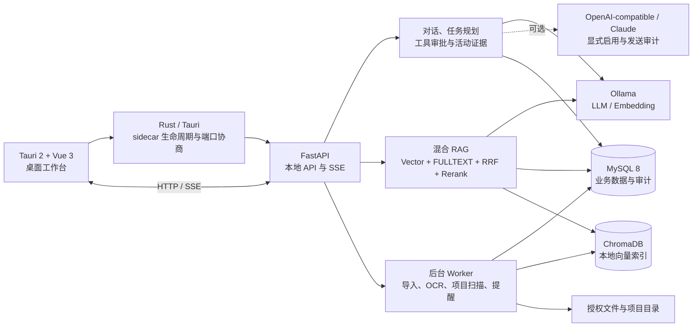

# PrivateAgent｜本地优先的桌面个人智能体

PrivateAgent 是一款面向个人知识、学习、任务和代码项目的本地优先桌面 Agent。项目以 Tauri + Vue 构建桌面工作台，以 FastAPI sidecar 承载本地业务服务，通过 Ollama、MySQL 和嵌入式 ChromaDB 完成流式对话、混合 RAG、长期记忆、任务编排与受控工具执行。

项目强调“可控”而不是无边界自动化：文件访问受授权路径约束，写入和命令执行必须经过审批，高风险任务保留计划、状态、输出和证据；远程 Provider 默认关闭，诊断包和发布流程包含脱敏、签名与完整性检查。

> 当前版本：`1.0.0` · 源码数据库迁移：`0035 (head)` · 主交付平台：Windows 10/11 x64

## 目录

- [项目概览](#项目概览)
- [核心能力](#核心能力)
- [项目亮点](#项目亮点)
- [系统架构](#系统架构)
- [技术栈](#技术栈)
- [目录结构](#目录结构)
- [快速开始](#快速开始)
- [配置说明](#配置说明)
- [测试与质量保障](#测试与质量保障)
- [构建与发布](#构建与发布)
- [安全与隐私](#安全与隐私)
- [当前交付边界](#当前交付边界)
- [开源许可与代码签名政策](#开源许可与代码签名政策)
- [文档导航](#文档导航)

## 项目概览

PrivateAgent 将日常信息管理、知识检索和 Agent 执行整合到同一个桌面工作台中：

- 对用户：提供对话、知识库、项目、学习、任务、记忆、今日、集成、诊断、扩展和备份等工作区。
- 对 Agent：提供可编辑计划、工具审批、授权目录、白名单命令、多文件补丁、失败重试、回滚和执行证据。
- 对数据：业务数据存储在 MySQL，文档向量存储在本地 ChromaDB，配置、日志和备份位于本机数据目录。
- 对交付：提供 Python sidecar、Tauri/NSIS 安装包、应用内更新、发布检查、升级演练和可选代码签名。

当前代码规模（按源码静态统计）：

| 指标 | 当前规模 |
|---|---:|
| FastAPI 路由模块 | 36 |
| API 接口定义 | 257 |
| SQLAlchemy ORM 模型 | 62 |
| Alembic 迁移 | 20 |
| Python 测试函数 | 493 |
| Vitest / Playwright 用例定义 | 43 |

## 核心能力

### 1. Agent 工作台

- 以“理解任务 → 执行操作 → 整理结果 → 完成检查”组织执行计划，并把用户请求、Agent 回复、工具调用、引用来源和结果集中到活动时间线中。
- 工具卡片展示参数、风险、状态和输出；待审批期间阻止新任务交错写入，切换会话或重新加载后仍可恢复未决审批。
- 桌面端启动时读取 `/capabilities`：Agent Runtime 接管聊天后，新消息直接进入 `/chat/stream`，不会再先调用旧 `/tools/plan`；旧后端和 Runtime 关闭模式继续兼容原规划链。
- 左侧导航同时承载功能入口和最近任务，支持 `240px` 完整模式与 `72px` 紧凑模式。
- 右侧检查器提供 `Files`、`Context`、`Artifacts` 三个视图，用于授权路径、查看执行上下文和定位产物。
- 窗口宽度低于 `1320px` 时自动收起检查器，并支持键盘焦点、语义化状态和 `prefers-reduced-motion`。

### 2. 对话与模型 Provider

- 基于 SSE 的流式对话，支持多轮上下文、停止生成、会话历史、首轮自动标题和消息持久化。
- 默认关闭的持久化 Agent 聊天路径已接入 Ollama 原生 NDJSON delta；首个增量后不自动重试，工具回合先隔离中间草稿，最终完整回答仍持久化并可重连恢复。首次投影与并发重连通过 run 行锁和 `chat.output_persisted` 事件绑定同一 message，避免重复插入回答。
- 可信工作流启用 JSON Schema 或 RAG 引用验证时，统一模型契约会把同一固定 Schema 下发为 OpenAI Chat Completions `response_format`、Claude `output_config.format` 或 Ollama `format`；Provider 约束后仍由 Runtime 本地复核，能力不支持时在发起网络请求前失败关闭。
- 默认使用本地 Ollama；可显式启用 OpenAI-compatible 或 Claude Provider，并在远程调用前展示隐私范围。
- 对远程调用记录耗时、token 估算、失败分类和 fallback 信息；远程 Provider 异常时可降级到本地 Ollama。
- 健康检查覆盖 API、Ollama、MySQL 和 ChromaDB，后端在 Ollama 暂不可用时仍可启动并提供诊断。

### 3. 知识库与混合 RAG

- 支持 PDF、Word、Markdown、TXT 和常见 Python/JS/TS/Vue/Rust/Go/Java/C/C++/C# 代码文件导入，包含去重、结构优先切片、token 估算、向量化、失败重试、批量导入、启停控制和删除一致性。
- 组合 ChromaDB 向量召回与 MySQL FULLTEXT `ngram` 词法召回，经 RRF 融合后使用本地 embedding 批量语义重排。
- 检索支持文档类型、主题、标签、语言和项目过滤，并返回命中渠道、关键词、相关分数和原文引用。
- 版本化索引保留 PDF 页码、Markdown/DOCX 标题路径、Markdown 围栏代码块、DOCX 表格、字符/行范围、解析器版本和独立来源哈希；缺失或被篡改的来源记录拒绝参与版本化检索。
- 同时启用 Agent RAG 工具与输出验证时，引用验证只从本次 run 已成功持久化且通过 SHA-256 复核的检索工具结果加载证据；未知 chunk、伪造 quote 或被篡改的工具结果都会失败关闭。
- 同时再启用聊天 Runtime 后，`knowledge_base=true` 的兼容聊天进入同一 durable RAG 工具循环；候选 JSON 验证通过后才投影为旧 SSE 的可读答案与可信来源，任一开关未开启时仍回退旧 RAG 路径。
- 任一路召回或重排失败时保留可用链路，避免单点异常导致整个 RAG 不可用；无可靠内容时不编造来源。
- 提供文档集合、章节摘要、术语表、行动项、关键观点、代码片段抽取、文档对比和 Markdown 报告导出。

### 4. 项目 Agent 与受控编码

- 授权本地项目后，可浏览目录树、搜索文件名和内容、读取片段并查看 Git 状态与 diff。
- `propose_patch` 只生成有界变更建议，超长 diff 会显式标记截断；真正写入时校验授权路径和 `expected_old_sha256`，防止过期补丁覆盖新内容。
- 支持多文件 patch set、逐次审批、拒绝、失败诊断和回滚。
- 命令执行受白名单约束，仅允许 pytest、前端构建、Cargo check 等预定义命令，并对输出做长度控制和审计。
- 多步任务支持生成/编辑计划、批准整体计划、暂停、取消、继续、指定步骤恢复、失败重试和 Markdown 证据报告。

### 5. 学习、记忆与个人中枢

- 学习工作区支持学习路线、笔记、练习题、答题记录、复习卡片、错题本、掌握度和学习周报。
- 长期记忆支持创建、检索、编辑、禁用、删除和候选确认；敏感或禁用记忆不会被注入远程上下文。
- 今日工作台聚合提醒、收件箱、目标、简报、复习、失败活动、候选记忆和维护健康状态。
- 收件箱事项可转为任务或提醒；提醒支持一次性、每日、每周和每月规则，以及 snooze、完成和后台 tick。
- 目标支持优先级、状态、check-in 和跨对象关联，并可生成任务草稿或目标简报。

### 6. 数据治理与可扩展集成

- 全局搜索覆盖会话、文档、切片、任务、证据、记忆、收件箱、目标和简报，并提供最近搜索与命令面板。
- 快速捕获支持文本/剪贴板输入并转收件箱、提醒或记忆候选；OCR 任务使用独立队列和可诊断状态。
- 诊断中心汇总版本、健康、迁移、最近错误、Provider 失败、数据完整性和当前进程兼容路径计数，并可导出脱敏诊断包。
- 数据体检可发现软引用悬空、索引不一致等问题，先生成修复计划，再由用户确认执行。
- 扩展注册表统一管理 command、diagnostic 和 maintenance 扩展；ICS 日历导入提供预览、来源追踪和撤销能力。
- 备份包包含 manifest 和完整性信息，支持恢复预览、恢复演练和迁移 runbook。

## 项目亮点

1. **本地优先的桌面 Agent 架构**：使用 Tauri 承载桌面壳并管理 Python sidecar 生命周期，开发模式使用固定端口，安装版动态选择空闲端口；业务数据、向量索引和日志默认保留在本机，兼顾桌面体验与 Python AI 生态。

2. **兼顾语义与精确关键词的混合检索**：将 ChromaDB 向量召回、MySQL FULLTEXT/ngram 词法召回、RRF 融合和 embedding 重排串成完整检索链路，既能理解自然语言，也能召回中文短语、函数名和错误串，并返回可解释的引用证据。

3. **以授权、审批和证据为核心的 Agent 安全边界**：通过可信路径、路径穿越校验、风险分级、审批状态机、白名单命令、内容哈希校验、补丁回滚和活动审计控制副作用，避免 Agent 直接获得无约束的文件与命令权限。

4. **从模型能力扩展为完整个人工作流**：将对话、知识库、学习、记忆、提醒、目标、简报、项目开发和任务编排连接为统一工作台，让 AI 输出能够继续转化为收件箱事项、复习计划、编码补丁或可追踪任务。

5. **面向桌面交付的完整工程链路**：项目覆盖后端、组件、E2E、Rust 和迁移检查，并提供 sidecar 打包、NSIS 安装、updater 清单、签名、性能基线、升级 smoke、诊断脱敏和 JSON/Markdown 发布证据报告。

6. **可维护的模块化与降级设计**：FastAPI 路由、业务服务、Repository、后台 Worker 和前端 API 分层组织；Ollama、检索、OCR、代码签名和外部环境异常均有明确状态或降级路径，减少单一依赖故障对主流程的影响。

## 系统架构



### 关键数据流

| 场景 | 数据流 |
|---|---|
| 普通对话 | Vue → FastAPI SSE → Provider → 消息持久化 → 流式渲染 |
| RAG 问答 | 查询向量化 → Vector/BM25 双路召回 → RRF → embedding 重排 → 引用注入 → 流式回答 |
| 工具执行 | 计划工具 → 风险判断 → 用户审批 → 授权校验 → 执行 → 活动与证据入库 |
| 文档导入 | 授权文件 → 解析/切片 → MySQL 原文 → Chroma 向量 → ready/failed 状态 |
| 桌面启动 | Tauri 选择端口 → 启动 Python sidecar → 自动迁移 → `/health` 轮询 → 进入工作台 |

## 技术栈

| 层 | 技术 |
|---|---|
| 桌面端 | Tauri 2、Rust、Vue 3、TypeScript、Vite |
| UI 与交互 | Phosphor Icons、CSS Design Tokens、anime.js、响应式与 reduced-motion |
| 本地 API | Python 3.12+、FastAPI、Uvicorn、SSE、Pydantic Settings、Structlog |
| AI / Provider | LangChain、langchain-ollama、Ollama、OpenAI-compatible HTTP、Claude HTTP |
| RAG | ChromaDB、MySQL FULLTEXT/ngram、RRF、bge-m3 embedding 重排 |
| 数据层 | MySQL 8、SQLAlchemy 2 Async、aiomysql、Alembic |
| 文档处理 | pypdf、python-docx、Markdown、OCR Worker |
| 测试 | pytest、pytest-asyncio、Vitest、Vue Test Utils、Playwright、Cargo check |
| 构建发布 | uv、npm、PyInstaller、Tauri CLI、NSIS、updater、signtool（可选） |

> `langgraph` 已纳入依赖，当前聊天主链路仍使用轻量的流式 Provider 调用；复杂任务由项目内的任务计划器和审批状态机编排。

## 目录结构

```text
Agent/
├── apps/desktop/
│   ├── src/                   # Vue 工作台、组件、API、状态与动效
│   ├── e2e/                   # Playwright 浏览器模式 smoke
│   └── src-tauri/             # Rust 桌面壳、sidecar、NSIS 与 updater 配置
├── src/personal_assistant/
│   ├── api/                   # FastAPI 路由
│   ├── core/                  # 领域服务、Repository、RAG、权限与任务编排
│   ├── workers/               # 导入、OCR、项目扫描等后台任务
│   ├── main_api.py            # FastAPI 应用入口
│   └── server_entry.py        # sidecar 启动与迁移入口
├── alembic/                   # MySQL 数据库迁移（当前 head: 0035）
├── tests/                     # 后端、RAG、治理、发布和升级测试
├── scripts/                   # 开发、构建、签名、发布检查与 smoke 脚本
├── docs/                      # 需求、阶段计划、使用和发布文档
├── pyproject.toml             # Python 项目与依赖规范
├── requirements.txt           # pip 兼容依赖清单
└── uv.lock                    # uv 锁文件
```

## 环境要求

- Python 3.12 或更高版本，推荐使用 [uv](https://docs.astral.sh/uv/)
- Node.js 20 LTS 或更高版本
- MySQL 8.0+
- [Ollama](https://ollama.com/) 及所需模型
- Rust stable、MSVC Build Tools 和 WebView2（Tauri 开发/打包需要）

Windows 常用工具安装：

```powershell
winget install --id astral-sh.uv -e
winget install --id Ollama.Ollama -e
winget install --id Rustlang.Rustup -e
winget install --id Microsoft.VisualStudio.2022.BuildTools `
  --override "--quiet --wait --add Microsoft.VisualStudio.Workload.VCTools --includeRecommended"
```

拉取默认模型：

```powershell
ollama pull qwen2.5:14b-instruct-q4_K_M
ollama pull bge-m3
```

创建数据库：

```sql
CREATE DATABASE personal_assistant
  CHARACTER SET utf8mb4
  COLLATE utf8mb4_unicode_ci;
```

## 快速开始

### 1. 配置环境变量

```powershell
Copy-Item .env.example .env
```

源码开发时至少修改 `.env` 中的 `PA_DB_URL`。`.env` 已被 Git 忽略，请勿提交数据库密码、API key 或签名凭据；Windows 安装版不使用该明文密码路径。

### 2. 安装后端依赖

推荐使用锁文件：

```powershell
uv sync --extra dev
```

也可以使用 pip：

```powershell
py -3.12 -m venv .venv
.\.venv\Scripts\Activate.ps1
python -m pip install --upgrade pip
python -m pip install -r requirements.txt
```

`pyproject.toml` 是 Python 依赖的规范来源；修改依赖时应同步 `requirements.txt` 并更新 `uv.lock`。

### 3. 执行数据库迁移

```powershell
uv run alembic upgrade head
uv run alembic current
```

预期输出包含 `0035 (head)`。

### 4. 启动本地 API

```powershell
uv run uvicorn personal_assistant.main_api:app --reload --host 127.0.0.1 --port 8000
```

启动后可访问：

- `http://127.0.0.1:8000/health`：API、Ollama、MySQL 和 ChromaDB 健康状态
- `http://127.0.0.1:8000/docs`：OpenAPI / Swagger 文档

### 5. 启动桌面端

```powershell
Set-Location apps\desktop
npm ci
Set-Location ..\..
scripts\run-tauri-dev.bat
```

`run-tauri-dev.bat` 会定位 MSVC 环境、补充 Cargo PATH，并执行 `npm run tauri dev`。开发模式连接 `127.0.0.1:8000`；安装版由 Tauri 选择空闲端口并启动 sidecar。

### 6. 仅预览 Agent 工作台界面

```powershell
Set-Location apps\desktop
npm run dev
```

访问 `http://127.0.0.1:1420/?workspace-preview=running`。该入口仅在 Vite 开发模式下启用，使用本地预览数据，不改变生产数据路径或后端 API。

## 配置说明

| 环境变量 | 默认值 | 说明 |
|---|---|---|
| `PA_API_HOST` | `127.0.0.1` | 本地 API 监听地址 |
| `PA_API_PORT` | `8000` | 开发模式 API 端口 |
| `PA_API_ALLOW_NON_LOOPBACK_BIND` | `false` | 仅允许经过认证的容器在自身网络命名空间绑定 unspecified wildcard；桌面/源码模式保持关闭 |
| `PA_API_TOKEN_FILE` | 空 | 可选容器 secret file；不能与 `PA_API_TOKEN` 同时配置 |
| `PA_DB_URL` | 无可用密码默认值 | 仅源码开发/测试使用的 MySQL async 连接字符串；安装版由 Rust 进程注入 |
| `PA_DB_PASSWORD_FILE` | 空 | 可选容器数据库密码文件；启用时 `PA_DB_URL` 不得再包含密码 |
| `PA_OLLAMA_BASE_URL` | `http://127.0.0.1:11434` | Ollama 地址 |
| `PA_LLM_MODEL` | `qwen2.5:14b-instruct-q4_K_M` | 默认对话模型 |
| `PA_EMBED_MODEL` | `bge-m3` | 默认 embedding 模型 |
| `PA_LLM_TEMPERATURE` | `0.7` | 生成温度 |
| `PA_LLM_CONTEXT_LENGTH` | `8192` | 上下文长度 |
| `PA_DATA_DIR` | 开发模式 `./data` | ChromaDB、日志等本地数据目录 |
| `PA_KB_ENABLED_BY_DEFAULT` | `false` | 新会话是否默认启用知识库 |
| `PA_AGENT_RUNS_API_ENABLED` | `false` | 开启持久化 AgentRun 开发 API；默认不改变旧入口 |
| `PA_AGENT_RUN_READ_ONLY_TOOLS_ENABLED` | `false` | 向 Agent 注册 5 个 safe 无副作用工具及 2 个需审批的本地读取工具；与聊天 Runtime 同开时从旧 planner 排除这些工具 |
| `PA_AGENT_RAG_TOOLS_ENABLED` | `false` | 向 Agent 注册 4 个只读 RAG 工具（搜索、片段详情、文档详情、知识库列表）；模型按需调用，可按文档集合隔离 |
| `PA_AGENT_OUTPUT_VERIFICATION_ENABLED` | `false` | 对 Agent API 与兼容聊天的最终答案启用固定非空验证；失败候选不会发送给 UI |
| `PA_AGENT_OUTPUT_VERIFICATION_MAX_RETRIES` | `1` | 验证失败后的修正次数，范围 0–2；审批恢复不重置预算 |
| `PA_CHAT_AGENT_RUNTIME_ENABLED` | `false` | 让普通聊天进入持久化 AgentRuntime；RAG 工具与输出验证也开启时接管知识库请求 |
| `PA_CONVERSATION_SUMMARY_WORKER_ENABLED` | `false` | 在 schema 0017+ 上启动可追溯会话摘要 worker；保留原消息与来源哈希 |
| `PA_CONVERSATION_SUMMARY_ALLOW_REMOTE_PROVIDER` | `false` | 单独允许自动摘要把受预算约束的消息发送给已启用的远程 provider；本地 Ollama 不需要 |
| `PA_MCP_ENABLED` | `false` | 开启 MCP 注册表与客户端 API；每个服务器仍需显式信任、启用和工具 allowlist |
| `PA_VERSIONED_RAG_INDEXING_ENABLED` | `false` | 在 schema 0021+ 使用带来源追溯的旁路版本构建；先于 retrieval 开启 |
| `PA_VERSIONED_RAG_RETRIEVAL_ENABLED` | `false` | 有 active head 的文档读取版本化索引，无 head 文档回退 legacy |
| `PA_VERSIONED_RAG_RETENTION_DAYS` | `14` | retired 索引版本的最短保留天数 |
| `PA_VERSIONED_RAG_MIN_RETIRED_VERSIONS` | `1` | 每文档至少保留的 retired 回滚版本数 |
| `PA_LOG_LEVEL` | `INFO` | 日志级别 |

运行时数据位置：

| 场景 | 配置 | 数据 |
|---|---|---|
| 源码开发 | 项目根目录 `.env` | 项目根目录 `data/` |
| Windows 安装版 | `%APPDATA%\personal-assistant\.env`（仅非敏感字段和固定凭据引用） | `%APPDATA%\personal-assistant\`；秘密位于 Windows 凭据管理器 |
| 可选 Compose | `.env.container`（只含 secret 路径和非敏感值） | MySQL/Chroma/Ollama 命名卷；秘密位于 `.secrets/` 挂载文件 |

安装版首次启动会通过配置向导写入非敏感配置；数据库密码、远程 Provider key 和 MCP 凭据通过 Windows 原生凭据窗口直接进入凭据管理器，Vue 渲染进程只接收是否已配置。MCP 数据库记录只保存固定引用，支持 stdio secret env、HTTP Bearer 和受限 API-key header；新增或替换 MCP 凭据后需重启桌面 sidecar，缺失引用会失败关闭。应用退出时，Tauri 会清理本次启动的 sidecar 进程；覆盖安装、自动更新和默认卸载均保留用户数据目录。

## 测试与质量保障

### 常用验证命令

```powershell
# 后端
uv run pytest -q
uv run alembic current

# 版本化 RAG：迁移默认只预览，评测命令只读
uv run python scripts/migrate_versioned_rag.py --limit 25
uv run python scripts/evaluate_rag.py --cases docs/examples/rag-evaluation-cases.example.json --retrieval versioned

# 实际语料审计：只输出聚合；canonicalization 仅生成干跑计划
uv run python scripts/profile_rag_data_quality.py --output data/analysis/rag-profile.json
uv run python scripts/validate_rag_data_quality.py --profile data/analysis/rag-profile.json --output data/analysis/rag-validation.json
uv run python scripts/plan_rag_canonicalization.py --output data/analysis/rag-canonicalization.json

# 前端类型检查、生产构建、组件测试与浏览器 smoke
Set-Location apps\desktop
npm run build
npm run test
npm run e2e
Set-Location ..\..

# Tauri / Rust
scripts\cargo-check-tauri.bat
```

### 发布前检查

```powershell
# 快速检查：pytest、前端构建、Cargo check、迁移状态
scripts\release-check.bat

# 完整证据链：pytest / Ruff / compileall / 前端构建与测试 / E2E / Rust check+test /
# sidecar smoke / 迁移 head / git diff / 诊断脱敏 / Compose 配置 / updater 清单
scripts\release-check-full.bat

# 由 release-check-<version>.json 生成/刷新发布 manifest（先跑完整检查，再刷新 manifest）
uv run python scripts/generate_release_manifest.py --write
```

完整检查会在 `dist/` 生成 `release-check-<version>.json`（机器事实源）和 `release-check-<version>.md`，记录 commit、schema、各步骤状态、耗时和错误摘要；release manifest 的 validation checklist 由该报告步骤结果生成，不人工勾选。测试覆盖包括：

- 对话 SSE、RAG、文档导入和检索降级
- 授权路径、路径穿越、审批状态机、工具调用和补丁写入
- 学习、记忆、任务、提醒、目标、简报和今日聚合
- Provider 错误分类、隐私审计、诊断脱敏和数据完整性
- 备份恢复、扩展注册、ICS 导入、性能阈值、发布签名和升级 smoke
- Vue 组件、响应式交互、后端断开场景和 Playwright 浏览器 smoke

## 构建与发布

### 构建 Python sidecar

```powershell
scripts\build-sidecar.bat
```

### 构建 Windows 安装包

```powershell
scripts\build-release.bat
```

### 可选容器后端

容器模式是独立的单机部署面，不替代 Tauri 默认 sidecar，也不会连接现有桌面主库。它使用 Compose secret files、非 root/只读 API 容器、宿主 loopback 端口、MySQL/Chroma 持久卷和可选的 NVIDIA Ollama profile：

```powershell
Copy-Item .env.container.example .env.container
uv run python scripts/generate_container_secrets.py --yes
docker compose --env-file .env.container --profile ollama-gpu config --quiet
docker compose --env-file .env.container up --detach --build
```

需要容器化 Ollama 时，将 `.env.container` 中的地址改为 `http://ollama:11434`，并在启动命令加入 `--profile ollama-gpu`。完整安全边界、模型拉取、备份和停止方式见 `docs/deployment-guide.md` §8。

构建流程包含 sidecar 打包、MSVC 检测、Tauri/NSIS 构建、可选 Authenticode 签名、updater 签名和发布清单生成。主要产物：

```text
apps/desktop/src-tauri/target/release/bundle/nsis/
dist/release-manifest-<version>.md
dist/codesign-status-<version>.json
dist/latest.json
```

没有配置代码签名证书时仍可生成安装包，但发布状态会明确记录 `code_signed: no`，Windows SmartScreen 可能显示未知发布者。详细流程见：

- `docs/release-checklist.md`
- `docs/signing-and-keys.md`
- `docs/cross-platform.md`

### Windows 卸载

在 Windows“设置 → 应用 → 已安装的应用”中选择 `PrivateAgent` 并点击“卸载”，或从开始菜单运行卸载程序。默认卸载会移除应用程序文件，但保留 `%APPDATA%\personal-assistant` 中的配置和用户数据，防止误删知识库；如需完全清除，请先备份，再由用户手动删除该数据目录。

## 安全与隐私

- 本地 API 默认只监听 loopback，不应直接暴露到公网。
- 文件读取依赖可信路径；相对路径、路径穿越和未授权目录会被拒绝。
- 写文件、运行命令、应用补丁和高风险任务步骤必须经过审批。
- 补丁写入前校验旧内容哈希，降低并发修改和过期补丁覆盖风险。
- 远程 Provider 默认关闭；启用后记录发送范围、耗时、结果和失败原因。
- 敏感记忆不会注入远程上下文，设置接口不回显原始 API key。
- Windows 安装版使用系统原生凭据窗口和凭据管理器；数据库、HTTP、备份及 Vue/Tauri 调用载荷都不持有明文秘密。
- Tauri CSP 默认拒绝外部脚本、对象和非本地连接，只开放动态 loopback sidecar 与必要的本地资源协议。
- 诊断包默认不导出数据库密码、API key、完整聊天、文档原文或敏感记忆。
- `.env`、Tauri updater 私钥、PFX 证书、密码文件和其他凭据不得提交到仓库。
- 容器部署的 `.env.container` 只保存 secret 文件路径；`.secrets/` 中的 API/MySQL 秘密不得提交、复制进镜像或写入 Compose 展开结果。

## 当前交付边界

- Windows NSIS、Python sidecar、动态端口、发布清单、updater、无证书透明策略和自动化检查已实现。
- Windows 真实 `v0.1.2 → v0.2.0` 安装升级、数据保留、卸载/重装回滚和 updater 签名负面验证已完成（2026-08-05，升级 smoke run #26）。GitHub Release 真实远程 updater 交付仍需仓库发布权限后以真实远程资产补一次 smoke；当前本地镜像证据不代表已部署生产 Release。
- 可选容器后端已有锁定镜像、Compose secrets、loopback 发布、持久卷与配置门禁；它是独立单机拓扑，不代表公网或多租户支持。容器 GPU profile 的真实 GPU healthcheck 尚未完成（见 `docs/archive/planning/remaining-work-plan-20260806.md` §5.2）。
- Authenticode 签名逻辑已接入，但正式证书实签需要在发布环境执行；当前如实标记 `unsigned`，SmartScreen 可能显示未知发布者。
- macOS/Linux 的数据目录适配、构建脚本和发布清单结构已准备，尚未完成实机构建与 smoke，因此当前不宣称正式跨平台交付。
- `externalBin` 变化后，同版本覆盖安装应先完成真实验证；未验证前建议卸载旧版本再安装新包。

## 开源许可与代码签名政策

PrivateAgent 采用 [Apache License 2.0](LICENSE) 发布。隐私与可选网络访问边界见 [隐私政策](PRIVACY.md)。

### Code signing policy

Free code signing is provided by [SignPath.io](https://signpath.io/), with a certificate provided by the [SignPath Foundation](https://signpath.org/). 代码签名仅覆盖从本公开仓库、由 GitHub 托管执行器按入库工作流构建的 PrivateAgent 发布产物；每个签名请求均需人工批准。团队角色、可信构建、密钥隔离和事件处置规则见 [Code signing policy](CODE_SIGNING_POLICY.md)。

应用更新清单和安装包统一发布在本仓库的 [GitHub Releases](https://github.com/lkuliuying/PrivateAgent/releases)。旧的独立更新仓库不再作为更新源。

## 常见问题

- `UnicodeDecodeError: 'gbk'`：在 PowerShell 中设置 `$env:PYTHONUTF8='1'` 后重试。
- MySQL `Access denied`：源码开发检查项目 `.env` 的 `PA_DB_URL`；Windows 安装版在连接配置向导中重新输入系统凭据并核对主机、端口、用户名和数据库名。
- `link.exe not found`：安装 MSVC Build Tools，并使用 `scripts\run-tauri-dev.bat`。
- `tauri build` 首次下载 NSIS 超时：确认 GitHub 网络可达，必要时为当前终端配置 `HTTPS_PROXY`。
- Ollama 状态异常：确认 `ollama serve` 正在运行，并已拉取对话模型和 `bge-m3`。`/health` 的 `ollama` 项
  会区分服务未启动（`ollama_not_running`）/ 超时（`ollama_timeout`）/ 模型缺失（`missing_models`），
  详见 `docs/ollama-lifecycle.md`；可运行 `uv run python scripts/ollama_lifecycle_check.py` 自查。
- `uv` 缓存无权限：把 `UV_CACHE_DIR` 指向当前用户可写目录后重试。

## 文档导航

- `docs/README.md`：文档中心、当前版本入口与目录维护规则
- `docs/usage-guide.md`：最终用户与开发者完整使用说明
- `docs/requirements.md`：项目需求基线与已落地范围
- `docs/archive/phases/phase2-requirements.md` ～ `docs/archive/phases/phase8-requirements.md`：阶段需求
- `docs/archive/phases/phase1-plan.md` ～ `docs/archive/phases/phase8-plan.md`：阶段开发与验收计划
- `docs/release-checklist.md`：安装、升级、发布和回滚检查清单
- `docs/signing-and-keys.md`：updater、代码签名和密钥治理
- `docs/cross-platform.md`：Windows、macOS、Linux 平台状态与差异
- `docs/database-upgrade-runbook.md`：全库克隆、schema 升级、RAG 小批 rollout 与回滚
- `docs/agent-runtime.md`：持久化 Agent Runtime、ModelGateway、事件、恢复和 LangGraph 决策
- `docs/tool-system.md`：ToolSpec、权限、审批和 durable execution
- `docs/context-design.md`：上下文优先级、预算、信任边界和会话摘要
- `docs/memory-design.md`：结构化记忆、版本、冲突、候选和语义索引
- `docs/rag-design.md`：legacy/versioned RAG、真实数据质量和上线门禁
- `docs/ollama-lifecycle.md`：Ollama 外部交付模式的安装检测、故障分类与测量基线
- `docs/mcp-design.md`：MCP 客户端、审批、安全边界、回滚与未完成项
- `docs/database-design.md`：MySQL/Chroma 职责、迁移、一致性和数据保留
- `docs/security-model.md`：本地 API、凭据、工具、RAG、MCP、CSP 与发布威胁模型
- `docs/testing-guide.md`：后端、前端、Rust、迁移、RAG 和发布验证
- `docs/deployment-guide.md`：开发启动、Windows 交付、分阶段启用和回滚
- `docs/api-reference.md`：API 安全约束、端点分组和现代化能力边界
- `docs/troubleshooting.md`：启动、认证、Ollama、RAG、MCP 和构建故障排查
- `docs/archive/ui/personal-agent-ui-refactor-prompt.md`：Agent 工作台界面重构说明
- `design-qa.md`：桌面工作台视觉、交互、响应式与无障碍验收记录
