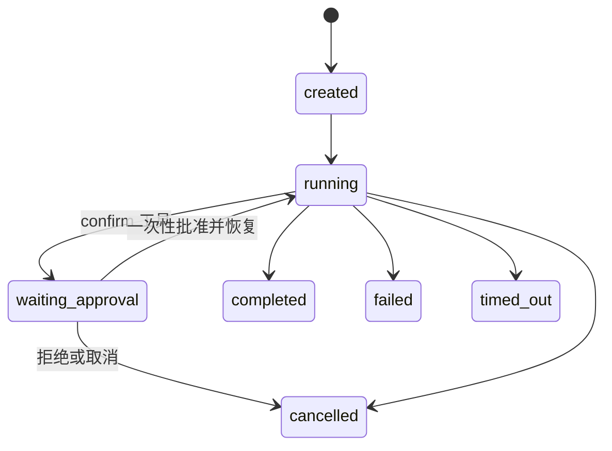

# Agent Runtime 设计与运行手册

> 状态（2026-08-05）：代码与测试已完成；应用主库已为 Alembic `0020`（2026-08-05 授权迁移，48 张原表行数零变化，回滚克隆 `personal_assistant_preupgrade_20260805111304` 保留）。Agent Runtime 及其全部接入开关（Agent API、只读工具、ContextBuilder、输出验证、RAG 工具、聊天接管）仍默认关闭，尚未生产启用；MCP 与自动摘要 worker 同样保持默认关闭。

## 1. 目标与边界

Agent Runtime 把模型调用、工具循环、审批等待、取消、限制和审计收敛到后端唯一执行闭环。API、旧聊天兼容层和未来工作流入口都只能调用该运行时，不能各自实现第二套 Agent 循环。

核心实现：

- `src/personal_assistant/agents/contracts.py`：run、step、event、模型消息、工具调用和限制契约。
- `src/personal_assistant/agents/runtime.py`：`AgentRuntime`、`CancellationToken` 和有界循环。
- `src/personal_assistant/agents/repository.py`：`AgentRunRepository`、事务性事件投影和 `PersistentAgentRunner`。
- `src/personal_assistant/agents/coordinator.py`：进程内后台执行、取消和关闭收拢。
- `src/personal_assistant/llm/gateway.py`：统一的 `ModelGateway`。
- `src/personal_assistant/llm/adapters.py`：Ollama、OpenAI-compatible、Claude 适配器。
- `src/personal_assistant/api/routes_agent_runs.py`：默认关闭的 `/agent-runs` API。

## 2. 执行模型



一次 run 由有序 step 构成。`AgentRuntime` 在每轮执行以下步骤：

1. 校验 `AgentRunLimits`，组装 `ModelRequest`。
2. 调用 `ModelClient`；生产适配通过 `ModelGateway` 统一路由、重试和错误归一化。
3. 如果模型返回结构化 `tool_calls`，交给 `ValidatedToolDispatcher`；不解析自由文本中的伪工具语法。
4. 持久化 step 和公开事件，再进入下一轮。
5. 命中最终响应、取消、墙钟时间、最大 step、最大工具数或 token 上限时确定性终止。

运行时不会把模型隐式推理写入事件。公开事件只包含状态、最小必要摘要、usage、trace 和经过脱敏的工具结果。

## 3. 持久化、回放与恢复

迁移 `alembic/versions/0013_agent_runtime_persistence.py` 新增：

- `agent_runs`：运行状态、限制、usage、trace 和取消意图。
- `run_steps`：严格排序的模型或工具步骤。
- `agent_run_events`：带单调 `sequence` 的公开事件。

迁移 `0015_agent_run_checkpoints.py` 新增 `agent_run_checkpoints`。等待审批时，checkpoint 与 `tool.approval_required` 事件在同一事务提交；恢复时从 checkpoint 和已持久化步骤继续，成功终态删除 checkpoint。

事件读取支持 `after_sequence`，SSE 断线后可从最后确认序号重放。相同序号和相同载荷幂等，不同载荷冲突会失败关闭。

当前恢复边界：

- 同进程审批恢复、刷新后审批恢复和已提交工具结果回放已实现。
- Agent-enabled API 启动时持有数据库目标专属的 MySQL named lock；第二个进程不能同时创建/恢复 run。连接级 owner 丢失后监控会收拢本进程任务，并让新的创建/恢复请求返回 503。
- 新 owner 启动时 reconciler 只处理旧 owner 留下的 `running`：普通运行标为 `failed/process_restarted`，已有取消意图的运行标为 `cancelled/process_restarted_after_cancel`；`waiting_approval` checkpoint 保持可恢复，尚未开始的 `created` 记录保持可审计。
- 悬空的幂等工具执行标为 failed；无法证明是否已产生副作用的非幂等执行标为 unknown，并清除 claim token/lease。系统不会自动重放未知模型调用或非幂等副作用。
- `AgentRunCoordinator` 关闭时会取消并收拢本进程任务。

进程 guard 依赖 `0016+` 的 execution lease schema；若功能开关打开但 schema 更旧，应用 fail closed。该 guard 面向当前单机单 API 实例拓扑，不等于分布式调度器或水平扩容许可。

## 4. ModelGateway 契约

`src/personal_assistant/llm/contracts.py` 定义显式能力、重试策略、请求和错误类型。适配器必须声明是否支持原生工具、结构化输出、usage 和取消；业务代码不能根据 provider 名称猜能力。

`ModelGateway` 只对调用前失败或幂等模型请求执行有界重试，不会因为模型请求重试而重复提交工具副作用。远程 endpoint 由 `src/personal_assistant/llm/url_policy.py` 校验；默认要求 HTTPS，并拒绝环回、链路本地、私网和云元数据地址，除非具体配置被显式授权。

三类适配器均实现原生 `complete_stream`：Ollama 解析 `/api/chat` NDJSON；OpenAI-compatible 解析 Chat Completions SSE 的 text/tool-call 增量、`[DONE]` 和可选最终 usage；Claude 解析 Messages SSE 的 message/content-block 生命周期、text delta、partial tool JSON 和累计 usage。Claude thinking/signature 不作为可见回答发布。所有解析器都有单行、单事件、累计文字和工具参数上限，缺终止帧或未闭合 block 会失败关闭。`ModelGateway` 只允许在首个 delta 发布前重试瞬时失败；首个 delta 发布后失败会直接终止，避免界面收到重复文本。旧聊天兼容 Provider 也消费真实远程 SSE，不再把整段结果伪装成单个流式片段。

聊天兼容层使用最多 256 个片段的进程内队列把 delta 转为旧 SSE `token`。无工具回合可实时转发；注册了工具的回合会先缓冲，只有确认该回合没有 `tool_calls` 后才发布，避免把工具调用前的草稿误当成最终回答。启用 RAG 引用验证时，结构化候选整体缓冲，验证通过后只把 `answer` 投影为旧 token/done，并从 durable 工具证据投影 sources；原始 `{answer,citations}` 仍保留为 run 输出，不写入旧消息正文。逐 token 数据不写入 `agent_run_events`，最终完整响应和运行终态仍是持久化事实；进程重启或队列不可用时，重连从已持久化的完整输出恢复。首次完成与 continuation 使用 run 行锁串行化消息投影，成功后在既有事件流追加只含 message ID 的 `chat.output_persisted`；重复或并发重连复核 session/role/content 后返回同一 message，不重复写入。当前增量队列仍是单消费者；完成后的 durable continuation 可并发安全读取。

### 4.1 受控输出验证

`AgentRuntime` 可显式注入 `OutputVerifier`，默认不注入。`PA_AGENT_OUTPUT_VERIFICATION_ENABLED=true` 时，Agent API 与 AgentRuntime 兼容聊天由 coordinator 固定启用非空最终答案验证，并使用 `PA_AGENT_OUTPUT_VERIFICATION_MAX_RETRIES`（0–2，默认 1）；开始和审批恢复路径读取同一进程固定策略，不让模型或请求载荷选择验证器。验证器还包括 Draft 2020-12 JSON Schema、有序组合和 RAG 引用验证，供可信工作流显式注入。RAG 验证要求结构化答案中的 `(index_version_id, chunk_id)` 来自给定召回集，且 quote 是对应 chunk 的精确子串；它验证可追溯性，不声称证明全部推论。验证器返回有界 `code/message/correction`，不能执行工具或改变 capability/审批策略。候选输出在验证完成前不会进入 UI；失败反馈以内部标记消息返回模型，达到上限后以 `output_validation_failed` 终结。

带固定 `output_schema` 的验证器会生成 provider-neutral `ModelOutputFormat`。ModelGateway 在适配器未声明 `structured_output` 时、网络调用发生前以 `unsupported_capability` 拒绝；支持时分别映射为 OpenAI Chat Completions `response_format.json_schema`、Claude Messages `output_config.format` 和 Ollama `/api/chat` 的 `format`，普通与原生流式路径使用同一契约。Schema 根必须是 object，限制为 64 KiB、32 层和 2,048 个节点，只允许本地 `$ref`/`$dynamicRef`，并先通过 Draft 2020-12 元 Schema 校验。Provider 原生约束只是第一道门：Runtime 仍用可信验证器本地复核最终文本并执行有界修正，因此拒答、截断、Provider 仅支持 Schema 子集或协议不兼容都会失败关闭，而不会把未验证输出标为完成。

每次验证写入 `output.validation_started/passed/failed`，关联原 model step，记录 verifier、结果、修正建议、attempt、retry count、是否继续和最终 run 状态。持久化投影校验计数与字段上限，不需要新表；审批 checkpoint 通过已保存的内部反馈重建已用重试数，因此暂停/恢复不会重置预算。通用非空策略已接入入口；当 `PA_AGENT_RAG_TOOLS_ENABLED` 与 `PA_AGENT_OUTPUT_VERIFICATION_ENABLED` 同时开启时，durable Agent 会组合 RAG 引用验证。每次验证只从同一 run 中状态为 succeeded 的 `search_knowledge_base/get_document_chunk` 执行记录加载模型实际看到的文本，并复核 `output_size_bytes` 与 `output_sha256`；未知、冲突、超限或被篡改的证据失败关闭，普通运行与审批恢复使用同一持久化事实。再开启 `PA_CHAT_AGENT_RUNTIME_ENABLED` 后，`knowledge_base=true` 的兼容聊天也使用这条链；缺少任一开关或带旧 `tool_result` 时继续回退 ChatService。代码测试、文件 diff、Shell、API 和数据库仍未选择领域验证器。这些接入必须由可信调用方固定，不能让模型自行声明“验证通过”。验证启用时会牺牲候选答案的实时逐 token 展示，以避免向用户发送随后被判无效的内容。

## 5. API 与功能开关

所有新入口默认关闭：

| 配置 | 默认值 | 作用 |
|---|---:|---|
| `PA_AGENT_RUNS_API_ENABLED` | `false` | 开放 `/agent-runs` 创建、读取、事件和取消 API |
| `PA_AGENT_RUN_READ_ONLY_TOOLS_ENABLED` | `false` | 注册 5 个 safe 无副作用工具及需审批的 `read_file`、`read_code_file`；聊天 Runtime 同时开启时旧 planner 排除这 7 个工具 |
| `PA_AGENT_RAG_TOOLS_ENABLED` | `false` | 注册严格 schema 的搜索/片段/文档/知识库列表工具；模型按需调用并可按 collection 隔离 |
| `PA_AGENT_CONTEXT_BUILDER_ENABLED` | `false` | 使用有预算的 `ContextBuilder` |
| `PA_AGENT_OUTPUT_VERIFICATION_ENABLED` | `false` | Agent API/兼容聊天固定启用非空最终答案验证 |
| `PA_AGENT_OUTPUT_VERIFICATION_MAX_RETRIES` | `1` | 验证失败后最多修正 0–2 次 |
| `PA_CHAT_AGENT_RUNTIME_ENABLED` | `false` | 普通聊天进入持久化 runtime；桌面端据 `/capabilities` 直接调用聊天流而不再预调用旧 planner；RAG 工具与输出验证也开启时接管知识库聊天，旧 `tool_result` 仍走兼容路径 |

关键端点见 `src/personal_assistant/api/routes_agent_runs.py`：

- `POST /agent-runs`
- `GET /agent-runs/{run_id}`
- `GET /agent-runs/{run_id}/events`
- `POST /agent-runs/{run_id}/cancel`
- 审批列表、批准和拒绝端点

API 开关打开并不自动开放工具。工具仍需注册、capability 策略和风险审批三层同时通过。

`GET /capabilities` 是桌面端的轻量执行模式协商面。`agent_runtime` 信号使所有新消息只有一条规划/执行链；旧 planner 只在明确 legacy 模式或不支持该端点的旧后端使用。会话重载仍读取旧 pending tool call，仅用于耗尽升级前状态，不会为 Runtime 新消息创建旧调用。

## 6. LangGraph 决策

Phase 6 当前结论为“不引入运行时依赖”。已有 `AgentRuntime`、持久化 checkpoint、条件审批恢复和有界重试已能清晰表达当前流程；仓库没有 `StateGraph` 运行代码。

仅在出现以下证据时重新评估：

- 同一业务流程存在多处分支、循环和并行汇合，轻量状态机已难维护。
- 需要跨进程、跨重启自动领取并继续长任务。
- 同一步必须进行多次检索—验证—修正循环。
- 存在职责、权限和状态真正独立的多 Agent 协作。

即使引入，LangGraph 也只能作为 `AgentRuntime` 内部实现；API、数据库、工具协议和 UI 不能依赖框架私有状态。

## 7. 验证与回滚

主要回归：

```powershell
uv run pytest -q tests/test_agent_runtime.py tests/test_agent_run_repository.py `
  tests/test_agent_runs_api.py tests/test_chat_agent_runtime_compat.py `
  tests/test_model_gateway.py
```

数据库迁移由 `0013`、`0015` 和工具相关迁移共同支撑。上线时先保持所有开关为 `false`，升级 schema 后依次打开原生 API、只读工具、ContextBuilder 和聊天兼容映射。任一阶段异常时关闭当前开关即可回到旧聊天路径；schema 回滚按 `docs/database-upgrade-runbook.md` 执行，不能在有新增运行事实时盲目 downgrade。
