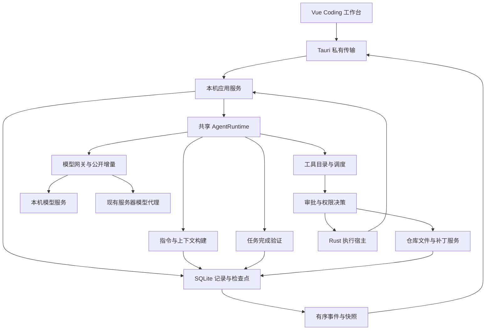

# PrivateAgent Coding Agent 改造计划书：总体路线

> 编制日期：2026-09-08（Asia/Shanghai）。
> 状态：S0 基线与契约开发已交付，S1–S6 待实施；见 [S0 验证报告](./s0-validation-report.md)。本文件不构成发布、生产操作或付费模型调用授权。
> 源码基线：`F:\Program\Agent`，`dev/1.0.0`，HEAD `8dcfa7f`；编制前工作区干净。
> 适用产品：当前统一桌面客户端及其本机 Coding 执行链。历史普通版和 Remote 安装包单独核对。
> S0 已实现的纯类型和生成校验见 [契约决议](./s0-contract-decisions.md)，尚未接入业务 API；其他新增字段、事件和接口仍为拟议设计。

## 1. 阅读顺序与文件组成

先读本文确定改造方向、依赖与交付标准，再进入对应阶段。阶段文档可以作为后续开发任务的输入，但开始实现前仍须核对当时源码和用户授权。

| 顺序 | 文档 | 解决的问题 | 前置条件 |
| --- | --- | --- | --- |
| 0 | [S0：执行基线与契约收敛](./s0-baseline-and-contracts.md) | 明确真正运行的链路，建立可复现基线 | 无 |
| 1 | [S1：可信完成与验证闭环](./s1-completion-and-verification.md) | 区分回答结束、操作结果与任务目标达成 | S0 |
| 2 | [S2：项目指令与上下文管理](./s2-instructions-and-context.md) | 遵守项目规则，支持长任务和多轮接续 | S1 |
| 3 | [S3：仓库检索与多文件编辑](./s3-repository-and-patches.md) | 精确读写代码，保护已有修改 | S1、S2 的契约冻结 |
| 4 | [S4：持续终端、流式输出与权限](./s4-execution-streaming-and-permissions.md) | 正常运行开发工具，建立可验证执行边界 | S1–S3 |
| 5 | [S5：恢复、运行中协作与变更审查](./s5-recovery-steering-and-review.md) | 中断后继续，接收新指令，审查任务变更 | S2–S4 |
| 6 | [S6：真实编码评测与交付验收](./s6-evaluation-and-delivery.md) | 用实际任务证明可用性，检查安装与升级 | S0–S5 |

本专项采用日期标识，不预先分配产品版本号。旧版本计划继续保留历史；本文只更新统一桌面 Coding 主链的后续路线，不覆盖旧部署或验收结论。

## 2. 改造目标与范围

### 2.1 用户最终应能完成的流程

用户选择项目，提出明确开发需求后，Agent 能读取适用规则和代码，自行定位实现位置，提出必要计划，按权限执行修改，运行相关验证，根据失败继续修复，最终交付可核对的 diff、测试结果和未完成项。用户可以在执行中补充约束、停止任务，或在重启后检查现场并继续。

“能正常使用”不要求每个模型解决所有问题。它要求执行系统正确处理成功、失败、阻塞与不确定结果，并通过固定模型和任务集合验证实际成功率。

### 2.2 保留的架构与产品约束

- 保留 Tauri 2、Vue 3、TypeScript、Python/FastAPI、现有模型网关与 Rust exec-host。
- Coding 文件、命令和工作记录在本机；服务器继续负责现有账号、模型配置和业务服务。
- Coding 本机记录使用按账号隔离的 SQLite 与内容文件；业务 MySQL/ChromaDB 不纳入本次迁移。
- 保留服务端旧导入路径与已有公共接口的兼容性；按能力逐项接通，不复制第二套 Agent 循环。
- 不因接入本机模型而变更固定账号入口、身份归属或供应商凭据边界。
- 不默认提交、推送、发布或部署 Agent 生成的代码；授权规则保持独立。

### 2.3 不进入本轮主线的事项

不重做品牌和整套导航，不建设完整 IDE/LSP/调试器，不整体重写 Rust Agent 核心，不删除知识库等旧业务，不迁移业务数据库，不建设插件市场或多 Agent 编排。Skills、MCP、浏览器和子 Agent 作为 S6 后的扩展候选，另行明确工具权限与验收计划。

## 3. 当前基线与缺口

### 3.1 已存在且应复用的能力

| 能力 | 当前证据 | 使用边界 |
| --- | --- | --- |
| 共享 Agent 循环与模型契约 | [共享运行时](../../../src/private_agent_core/runtime.py)、[契约](../../../src/private_agent_core/contracts.py) | 支持工具循环和可选验证器，不代表桌面已连接全部能力 |
| 本机项目、会话、运行与记录 | [本机 API](../../../src/private_agent_local/app.py)、[Store](../../../src/private_agent_local/store.py) | SQLite schema 为 3，源码事实，不是生产数据库检查 |
| 四种权限、审批、撤权 | [策略](../../../src/private_agent_local/policy.py)、[本机运行时](../../../src/private_agent_local/runtime.py) | 工具策略不等于 OS 沙箱 |
| 文件预览与写后校验 | [文件工具](../../../src/private_agent_local/files.py) | 专用写入是整文件替换，保护主要覆盖预览至落盘期间 |
| 私有管道与进程管理 | [IPC](../../../src/private_agent_local/ipc.py)、[Tauri 宿主](../../../apps/desktop/src-tauri/src/local_executor.rs) | 当前默认不是开放本机 TCP API |
| Rust 命令宿主 | [exec-host](../../../apps/exec-host/src/main.rs)、[客户端](../../../src/private_agent_core/execution/exec_host_client.py) | 存在 stdin/PTY 等底层协议；桌面接通程度须分开判断 |
| 编码工作台与事件投影 | [Coding 功能目录](../../../apps/desktop/src/features/coding/) | 不把 UI 组件、模拟预览当作真实运行证据 |
| 完成契约、工具目录、补丁领域模型 | [agent_v2](../../../src/personal_assistant/agent_v2/) | 部分接入服务端路径，须适配本机存储与生命周期 |

### 3.2 缺口与阶段映射

| 编号 | 经源码或隔离探针确认的缺口 | 影响 | 负责阶段 |
| --- | --- | --- | --- |
| G01 | 桌面 `AgentRuntime` 未传入完成验证器 | 仅文字回复也可结束为 completed | S1 |
| G02 | 命令非零退出码仍包装为工具成功，缺少独立业务结果 | 测试失败与任务成功可能混淆 | S1 |
| G03 | 新运行仅取最近 12 条消息、每条截取 16000 字符，未重建跨轮工具历史 | 丢失约束、执行事实和失败尝试 | S2 |
| G04 | 上下文 UI 主要展示最近 usage，未接入请求预算和自动压缩 | 长任务超限、无法稳定继续 | S2 |
| G05 | 无正式的项目指令发现与分层加载过程 | 项目规则依赖用户反复解释 | S2 |
| G06 | 专用文件工具缺少行范围、多文件补丁和模型读取版本绑定 | 大文件、重构及并发编辑风险较高 | S3 |
| G07 | 搜索输出有界但缺少续读，登记命令限制部分常见开发操作 | 仓库探索与 monorepo 操作受阻 | S3、S4 |
| G08 | 命令固定 120 秒，宿主逐命令关闭，输出结束后集中返回 | 长构建、交互输入和开发服务器受限 | S4 |
| G09 | 桌面适配器使用 complete，模型公开文本未形成端到端增量链 | 等待期间反馈不足 | S4 |
| G10 | 脚本间接文件/网络行为不能靠命令白名单隔离 | 自动执行缺少充分保护 | S4 |
| G11 | 重启将活动任务标失败，未接入安全续跑 | 无法利用已完成工作接续 | S5 |
| G12 | 账号运行时全局单任务，缺少运行中追加指令与任务级隔离 | 多项目使用和过程纠正受限 | S5 |
| G13 | 服务端既有门禁未完整覆盖当前桌面入口 | 模块测试通过仍可能交付断链 | S0、S6 |

G01/G02 的隔离探针使用内存假模型与假命令，证明状态路径，不证明真实模型必然做出虚假声明。非零退出码也不总是错误，例如搜索的“未匹配”需要按工具语义解释。

前轮定向 pytest 得到 4 passed、4 errors，错误发生在 Windows 临时目录权限；更换隔离目录仍受阻。该结果不是完整回归通过，也不说明业务代码必然失败。S0 必须重新建立可执行测试环境。

### 3.3 历史文档冲突的处理

[项目状态记忆](../../project-state.md)是 2026-08-31 的历史快照，其工作区、HEAD 和部分能力描述已落后于当前源码。[统一客户端说明](../../unified-desktop-runtime.md)更接近当前执行方式，但其中历史验收仍不能继承到本机。以“当前文件、调用路径、隔离测试、实际安装验证”分别记录事实，不将文档中的规划改写为已完成。

原计划编制阶段只新增计划和索引；后续 S0 开发的实际改动与新证据见 [S0 验证报告](./s0-validation-report.md)。按仓库入口约定，不自动改写 `docs/project-state.md`；将来需要维护共享状态时，应在明确授权下记录新增证据及其环境。

## 4. 技术路线与 Codex 参考方式

### 4.1 推荐路线：演进当前共享核心

把已有的纯领域逻辑和契约按需移入或适配到 `private_agent_core`，由 `private_agent_local` 提供 SQLite、工作区、审批与进程服务适配器。纯核心不依赖 FastAPI、MySQL 会话或桌面 UI。服务端原路径保留兼容入口并跑回归。

不要求 S0 一次性迁移所有模块。S1 只迁移完成判定必要逻辑，S3 再接入补丁，S4 再连接执行能力。每阶段只有一个正式运行和终态事实来源。

| 方案 | 收益 | 主要代价 | 决策 |
| --- | --- | --- | --- |
| 演进现有 Python 核心 | 保留多 Provider、账号、SQLite 和测试资产 | 需要补齐工具与生命周期连接 | 本计划主线 |
| 适配 Codex App Server | 可验证成熟执行协议与能力复用价值 | Provider、授权、状态归属和交付兼容需要实测 | S0 可安排有界技术验证，失败不阻断主线 |
| 全量重写 Rust Agent | 可统一为 Rust 栈 | 迁移范围大，重复实现模型和业务契约 | 不采用 |

App Server 技术验证必须限定独立测试目录、固定上游版本、单一执行器和单一授权事实源。不得在正式任务中同时驱动两个循环。若结果足以推翻主线，先修订本总路线及后续阶段，再开展替代实现。

### 4.2 值得借鉴的上游机制

参考源码冻结到 `openai/codex@95327467c3af9533ac25b171b3496b951fe425ed`，不把持续变化的 main 当兼容承诺。

| 参考机制 | 本项目采用方式 | 来源 |
| --- | --- | --- |
| 项目指令发现、层级与来源 | 定义本项目的受信任规则加载与上下文来源 | [agents_md.rs](https://github.com/openai/codex/blob/95327467c3af9533ac25b171b3496b951fe425ed/codex-rs/core/src/agents_md.rs) |
| 压缩检查点、历史替换与初始上下文重建 | 保存可追溯摘要，压缩后重新绑定约束 | [compact.rs](https://github.com/openai/codex/blob/95327467c3af9533ac25b171b3496b951fe425ed/codex-rs/core/src/compact.rs) |
| 多文件补丁与审批边界 | 复用本项目结构化 PatchOperation，逐项核验副作用 | [apply_patch.rs](https://github.com/openai/codex/blob/95327467c3af9533ac25b171b3496b951fe425ed/codex-rs/core/src/apply_patch.rs) |
| 持续进程、输入续写、输出缓冲 | 将现有 Rust 宿主接入受管理的终端会话 | [unified_exec/mod.rs](https://github.com/openai/codex/blob/95327467c3af9533ac25b171b3496b951fe425ed/codex-rs/core/src/unified_exec/mod.rs) |
| Thread/Turn/Item、steer、中断、事件流 | 参考语义，保留既有 Session/Run 标识和传输适配 | [App Server 官方文档](https://learn.chatgpt.com/docs/app-server) |

参考架构不等于复制所有功能或替换本项目模型协议。源码复制若确有必要，再按[上游采用清单](../../third-party/codex-adoption-manifest.md)登记来源与许可材料；本次没有复制上游实现。

## 5. 目标架构与责任归属

| 层 | 负责 | 不负责 |
| --- | --- | --- |
| Vue | 用户输入、状态与 diff 展示、批准/拒绝/继续等意图 | 自行推测工具成功或驱动第二套循环 |
| Tauri | 进程启动、私有通信、平台集成、退出清理 | 判定编码任务目标达成 |
| 本机应用服务 | 身份绑定、持久化事务、工作区锁、工具适配、生命周期 | 持有服务器供应商密钥 |
| 共享核心 | 模型/工具循环、上下文策略、完成判定契约 | 直接导入数据库连接或 UI 状态 |
| Rust 宿主 | 进程、输入输出、超时、取消、可用隔离机制 | 模型调用、审批决定、业务完成判定 |
| 服务器 | 既有账号与模型配置、远程推理、原业务服务 | 执行 Windows 本机项目路径 |

## 6. 跨阶段必须一致的设计规则

### 6.1 状态、事实与业务结果

保留现有 `session_id`、`run_id`，新增语义先通过版本化可选字段表达。`completed` 只表示运行正常结束；UI 必须结合明确的 `goal_outcome` 显示“已验证完成”“已回答”“未完成”或“受阻”。旧记录没有该字段时显示“历史运行已结束，未记录目标验证”，不能补成已验证成功。

拟议业务结果：`answered | verified | unmet | blocked | unknown`。执行仍保留退出码、超时、取消和副作用事实。执行协议错误不与“测试发现失败”混成同一错误码。S1 冻结准确映射。

### 6.2 副作用与重试

模型请求失败可以按错误类型有界重试；已经开始公开增量后不得静默重放为同一文本。只读工具可按声明重试。写入、删除、命令和网络副作用必须有 operation ID、授权绑定与结果核对，未知结果不得仅凭幂等键自动重放。

### 6.3 数据与事件

SQLite 与文件系统不是一个事务。先记录意图，再执行副作用，再持久化结果；崩溃窗口由 S3 操作日志和 S5 检查点解决。事件序号由本机存储统一分配，UI 快照与事件消费不得形成第二个独立计数器。

摘要、补丁和输出正文采用有界内容引用。不得每个输出字符重写整个运行 JSON；S0 测量现状，S4 接入分块存储。新增表/索引通过现有迁移机制演进，不在计划中预占最终 schema 版本。

### 6.4 模型、配置与权限快照

每次运行固定模型身份、能力与配置版本，避免工具轮次间默认模型漂移。权限撤销和账号失效仍需实时生效，不能借快照绕过停用。模型切换原则上在回合边界生效；S2 重新计算预算，S5 定义活动回合处理。

### 6.5 协议演进

保留现有本机路径和私有传输。新字段、事件及 API 在阶段文档中是提案，S0 应选定唯一 Schema 来源并实现生成/校验。未知可选事件可记录诊断后忽略；缺少必需能力时明确阻止启动。新 UI 必须与新运行时完成握手，不能只替换前端宣称支持新能力。

## 7. 实施顺序、里程碑与工作量

验收数据集在 S0 建立，此后每阶段补充用例，S6 做最终整体验收。S3 的搜索实现可以在 S2 契约冻结后开展，但不得在尚无可靠上下文绑定时默认启用新写入路径。S4 的 Windows 隔离探针应在 S0 提前验证可行性，避免到后期才发现环境不可支持。

| 阶段 | 初步工程量（人日） | 阶段交付 |
| --- | --- | --- |
| S0 | 3–5 | 调用链、能力矩阵、基准任务、协议与测试环境决策 |
| S1 | 5–8 | 有证据的完成与失败反馈 |
| S2 | 8–12 | 项目规则、工具历史、预算和压缩 |
| S3 | 8–12 | 大文件与多文件可靠编辑 |
| S4 | 12–18 | 持续终端、增量输出、明确权限边界 |
| S5 | 10–15 | 安全续跑、steer、任务 diff 与工作区协调 |
| S6 | 8–12 | 固定评测集、安装与升级验收、交付决议 |
| 合计 | 54–82 | 不含后续扩展、生产发布排队和外部服务等待 |

这是待 S0 校准的工作量区间，包含实现、阶段测试和文档。不是已承诺排期。若由两名熟悉 Python/Vue 与 Rust/Windows 的工程师配合测试支持，初步按 8–12 个自然周安排；单人按 12–18 周安排。Windows 隔离、模型兼容或迁移出现实质问题时必须重新估算，不能靠减少验收内容维持日期。

| 里程碑 | 达成条件 | 可以承诺的使用范围 |
| --- | --- | --- |
| M0 | S0–S1 完成 | 原有受限工具下，结果更可信；还不是完整 Coding Agent |
| M1 | S0–S4 完成，阶段端到端门禁通过 | 单任务开发试用；重启续跑等限制须公开 |
| M2 | S0–S5 完成 | 日常开发候选版，支持过程纠正和安全恢复 |
| M3 | S6 全部门禁通过 | 可提出受控交付申请；正式发布仍需既有授权 |

## 8. 统一验收标准

以下是建议目标，不是当前成绩。S0 可根据固定机器和模型校准性能/质量阈值，但必须保留理由与变更记录；不能在看到失败后临时降低标准。

| 维度 | 建议门槛 | 证据 |
| --- | --- | --- |
| 完成真实性 | 确定性“假完成”负例 100% 被正确识别 | 本机 API 回归、落盘事实、UI 结果 |
| 用户工作保护 | 固定并发修改与 dirty 仓库用例中 0 次静默覆盖 | 前后摘要、diff、操作日志 |
| 副作用恢复 | 崩溃注入用例中 0 次自动重复副作用 | operation ID、checkpoint 与重启记录 |
| 事件一致性 | 重连、重复帧、输出截断下，无静默缺口、重复终态 | 有序事件、快照、游标校验 |
| 取消 | 可控测试进程树在 5 秒内退出；无法回收时明确报错并阻止冲突执行 | PID/Job 观测，不只检查取消请求返回 |
| 终端 | 10 分钟命令、持续服务、stdin、Unicode 和大输出用例通过 | 真 exec-host 集成测试 |
| 交互增量 | 已收到宿主输出到 UI 可见的延迟 p95 不超过 1 秒 | 时间戳链；不把供应商首 token 延迟算入该指标 |
| 编码质量 | 固定 30 个任务、每模型各 3 次，默认模型独立完成率初始目标至少 80% | 按模型分组的 90 次记录；编码分母依 S6 预先定义，失败与人工介入保留 |
| 隔离 | 所宣称支持的文件/网络/子进程边界用例全部通过 | 被拒绝与获准对照组；不作超出测试范围的保证 |
| 交付 | 干净 Windows 环境首次运行、旧 schema 升级、回退策略验收通过 | 打包产物版本/摘要与演练报告 |

“独立完成”允许完成任务本就需要的明确审批和澄清，不允许人工指出应改哪行、手工修补代码后计为 Agent 成功。没有权限或基础环境不满足的情况单列，不混入成功分子。

## 9. 风险、决策点与退出策略

| 风险 | 处理方式 | 决策阶段 |
| --- | --- | --- |
| Windows 隔离不可用或破坏开发工具链 | 提前做真实对照测试；区分受限执行与显式可信项目执行，禁止静默降级 | S0、S4 |
| 多 Provider 的工具/流式/用量契约不一致 | 按模型能力暴露工具；协议失败关闭，记录支持矩阵 | S0、S2、S4 |
| 新旧本机记录兼容问题 | 加性迁移、SQLite backup、旧记录标明未验证；不盲目恢复旧库覆盖新增数据 | 每次数据变更 |
| 完成门禁误伤分析或用户明确不测试的任务 | 分开目标、证据要求和操作授权；允许有据标为未验证，不能编造通过 | S1 |
| 压缩丢失用户约束或改变授权 | 约束独立保存、摘要有来源、压缩不产生授权 | S2 |
| 多文件写入部分成功 | 操作日志与摘要保护回滚，保留部分结果与用户后续改动 | S3、S5 |
| 长任务持续耗费模型调用 | 单运行预算、重试上限、无进展检测和用户可见停止原因 | S2、S4、S5 |
| App Server 接入产生双执行器 | 仅隔离验证；采用前重新决定唯一运行与授权所有者 | S0 决策 |

阶段退出不是“所有文件写完”。每阶段必须提供：对应工作项完成表、实际变更、执行命令、结果、失败归因、兼容说明、未决问题、文档同步情况。阻断门禁未通过时不能把阶段标为完成。

## 10. 开工与交接规则

1. 读取本文和目标阶段；先核对最新工作区，不照搬本计划基线的 Git 状态。
2. 明确本次授权到哪个工作项。写计划书不意味着本轮已经执行所有阶段。
3. 按工作项提出最小实现方案，复核拟议接口与当前契约的冲突，再修改代码。
4. 每个工作项交付实现、真实边界测试与对应文档，避免积攒到阶段末一次验证。
5. 共享数据库结构或协议变更由单一负责人整合；具体工作负责人开工时填写，本文不虚构人员。
6. 提交、推送、部署、生产迁移和真实付费验收按会话授权单独判断，不由里程碑自动触发。
7. 开始下一阶段前填写前置验收结论；已失败或未执行的测试不得由历史成绩替代。

S0 已交付的范围、剩余限制与复跑入口见 [阶段交接](./s0-validation-report.md)。下一阶段为 S1 桌面主链完成判定，保持现有权限与工具范围。
