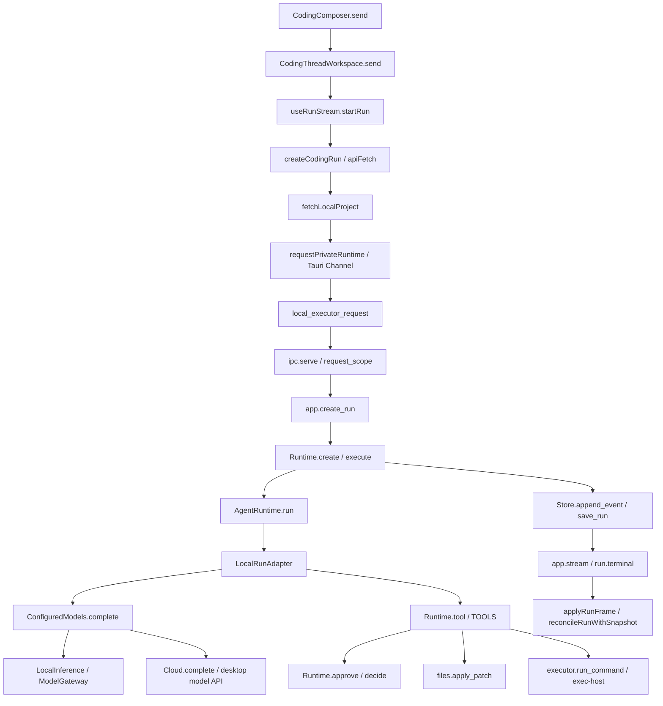

# S0 执行基线与能力矩阵

核对日期：2026-09-08，工作区 `F:\Program\Agent`，分支 `dev/1.0.0`，HEAD `8dcfa7f`。开工时 `docs/README.md` 已修改，本专项计划目录未跟踪；这些内容全部保留。未 fetch，不能据本地跟踪引用推断远端实时状态。

本文件记录当前源码；实际测试见 [S0 验证报告](s0-validation-report.md)，契约决议见 [S0 契约](s0-contract-decisions.md)。不继承历史安装、服务器或付费模型验收成绩。

## 1. 真实调用链（S0-01）

路径以下均相对仓库根目录；符号来自当前文件核对。

| 节点 | 文件与符号 | 数据与责任 |
| --- | --- | --- |
| 用户发送 | `apps/desktop/src/features/coding/components/CodingComposer.vue`，`send` 事件；`CodingHome.vue:submitFirstTurn`；`CodingThreadWorkspace.vue:send` | 首轮创建/选择会话，随后提交模型、权限和用户消息 |
| 创建与订阅 | `features/coding/composables/useRunStream.ts:useRunStream/startRun`；`features/coding/api/runs.ts:createCodingRun/streamRunEvents` | POST 后按同一个 run 订阅事件，断线重新水合快照 |
| 本机路由 | `apps/desktop/src/api/http.ts:apiFetch`；`services/localExecutor.ts:isLocalProjectPath/fetchLocalProject` | 项目、会话、运行、能力、授权留在本机；不可用时不回退云端 |
| 私有传输 | `services/privateTransport.ts:requestPrivateRuntime`；`apps/desktop/src-tauri/src/local_executor.rs:local_executor_request` | 请求 ID、正文与 Channel 帧；transport 协议为 2 |
| 本机入口 | `src/private_agent_local/ipc.py:request_scope/serve`；`app.py:create_app/create_run` | 私有帧构造 ASGI 请求；身份绑定到账号隔离 Store；health 协议为 1 |
| 运行所有者 | `src/private_agent_local/runtime.py:Runtime.create/execute` | 全局单活动任务；最近 12 条消息，每条截取 16000 字符；写用户消息与运行记录后创建 asyncio task |
| 共享循环 | `src/private_agent_core/runtime.py:AgentRuntime.run`；`core_adapter.py:LocalRunAdapter.complete/execute/emit` | 限制 72 steps、48 tools、3600 秒；适配器额外限制 24 模型请求、90 messages、1.5 MB 请求；未传完成验证器 |
| 推理路由 | `src/private_agent_local/local_models.py:ConfiguredModels.complete/LocalInference.complete`；`cloud.py:Cloud.complete` | 首轮选定 profile ID 写回 run；本机模型经共享网关，远端经 `/desktop/model/complete`；配置仍逐请求读取 |
| 工具注册 | `runtime.py:TOOLS/WRITE_TOOLS/Runtime.tool` | 5 个基本工具，Windows 多 1 个 PowerShell 工具；readonly 排除写入和命令 |
| 文件副作用 | `files.py:patch_preview/apply_patch` | 整文件替换；审批预览至写入的 SHA 保护，不等于模型读取版本保护 |
| 命令副作用 | `executor.py:run_command`；`private_agent_core/execution/exec_host_client.py:ExecHostClient`；`apps/exec-host/src/main.rs:handle_start` | 每命令独立宿主、argv、默认关闭 stdin、120 秒；命令结束后集中返回输出；非零 returncode 目前仍包装为工具成功 |
| 审批 | `runtime.py:approve/decide`；`app.py:decide`；`CodingThreadWorkspace.vue:onApprove` | Future 由本机 Runtime 消费；绑定调用、参数、预览、项目位置；待审批最长 600 秒；重复或迟到决定拒绝 |
| 取消 | `useRunStream.ts:cancelActive` → `cancelCodingRun` → `app.py:cancel` → `Runtime.cancel` | 取消 asyncio task；命令 finally 关闭宿主回收后代；已完成写入保留；UI 不先猜终态 |
| 落盘 | `store.py:Store.transaction/append_event/_save_run`；`runtime.py:finish` | SQLite schema 3、WAL/FULL；大于 32 KiB 的对象转 SHA 内容文件；消息和最终 run 状态共享事务 |
| 事件消费 | `app.py:events/stream`；`model/runProjector.ts:applyRunFrame/reconcileRunWithSnapshot` | 当前 Runtime 计算序号，Store 核验连续；UI 按最大已见序号去重，尚不能保证中间缺口必被发现 |
| 重启 | `store.py:Store._recover` | 活动 run 失败、待审批取消、运行中执行记 unknown、撤销 full_access；不自动重放 |

`run.terminal` 是流结束提示，当前使用 `cursor + 1` 合成，并未落库。它与 durable `run.completed` 不同；S0 不修这个旧路径，S4 应移除合成帧对 durable 游标的影响。

UI 基线经 `RunS0Baseline.spec.ts` 挂载真实组件核对：零工具 completed 已显示“不含执行证据”提示；命令卡对 returncode=1 显示红色退出码，旧 status=completed 仍原样显示。缺口在运行层缺少目标判定，不能夸大成 UI 完全隐藏了执行事实。

## 2. 能力状态（S0-02）

“测试”只指本轮隔离入口和实际命令。所有能力本轮均**未进行安装包验收**；真实模型均未调用。

| 能力 | 代码存在/复用入口 | 当前桌面接入 | 默认启用 | 本轮测试证据 |
| --- | --- | --- | --- | --- |
| 文件读、目录、搜索 | `files.py`、`TOOLS` | 是，输出有界，无行范围/续读 | 是 | local + S0-T03；尾部目标不可见被保留 |
| 文件写 | `patch_preview/apply_patch` | 是，整文件替换 | 按四种权限策略 | local + S0-T06/07，拒绝/过期/并发改动保护 |
| 多文件 patch | 服务端 `agent_v2/domain`、`agents/patchset*` | 未接入 | 否 | 无桌面多文件验收；不沿用服务端成绩 |
| shell/开发命令 | `policy.command_plan`、exec-host argv | 登记命令接入；通用 shell 字符串未接入 | 按权限 | 真实 Rust 宿主输出/超时/取消/后代回收 |
| stdin | `ExecHostClient.write_stdin`、宿主协议 | 桌面工具未接入 | 否 | 真实宿主 nonce 拒绝与 Unicode 正对照 |
| PTY | `sandbox.rs:pty_environment_ready/spawn_pty` | 桌面未接入 | 否 | argv 对照成功；环境探针拒绝，记 skipped/不可用 |
| 模型公开增量 | 共享网关/Provider 的 stream | 桌面适配器只调用 complete | 否 | 未进行端到端增量验收 |
| 输出增量 | 宿主 delta/output/read | `run_command` 缓冲到结束 | 否 | 底层真实输出测试通过；UI 增量链未接入 |
| 压缩 | 旧服务端 context/compaction 路径 | 本机只有 usage UI 和硬上限 | 否 | S0-T04 24 请求硬上限；非压缩验收 |
| 恢复 | 共享 checkpoint 契约、Store 重启处理 | 仅安全结束，不续跑 | 不自动重放 | S0-T06 与 Store 回归 |
| worktree | 服务端 Git 相关能力 | 本机仅根工作区和本地分支 | worktree false | 能力声明已核对；分支安装验收未执行 |
| MCP | 服务端 MCP/tool engine | 不在本机 TOOLS | 否 | 无桌面测试，延期 S6 后 |
| 目标完成验证 | 共享 `verification.py`；服务端 `_build_output_verifier_factory` | 未传入桌面 AgentRuntime | 否 | S0-T01/T02 严格 xfail |
| OS 文件/网络隔离 | Rust Low MIC / AppContainer 实验代码 | 桌面使用 inherit + approved | 否 | HOST-FILE/NETWORK 严格 xfail；不宣称安全沙箱 |

复用时保留旧 `personal_assistant` 公共导入入口，但本机测试和新纯领域代码直接依赖 `private_agent_core`。旧包 `agents.__init__` 的间接导入会触发业务配置，本轮仅修正一份本机模型测试的导入，不搬迁业务模块。

## 3. G01–G13 的后续归属

| 缺口 | 本轮核实 | 后续阶段 |
| --- | --- | --- |
| G01/G02 | 零工具假完成、退出码 1 均可 completed，负例已保留 | S1 |
| G03/G04/G05 | 历史截断、硬上限、缺少规则发现与压缩 | S2 |
| G06/G07 | 整文件写入、截断搜索且无续读、命令登记范围 | S3/S4 |
| G08/G09 | 固定超时、逐命令宿主、模型 complete、输出集中返回 | S4 |
| G10 | 项目脚本可越过工具层文件/网络限制；真实对照已复现 | S4，维持不宣称 OS 沙箱 |
| G11/G12 | 重启不续跑、账号全局单活动 run、无 steer | S5 |
| G13 | 本轮加入桌面隔离入口与探针；实际安装链仍未验收 | S0/S6 |

## 4. 存储测量口径

S0-T04 以同一空项目执行 24 次目录工具调用，使用 SQLite trace 统计 run 行写入、执行行读取和事件数，仅保存计数，不保存 SQL 正文。数字见 `s0-evidence.json`。

当前热路径确实只追加新事件，但 `_save_run` 仍遍历既有 executions/approvals 并逐项检查；不是每次重写全部事件，也不是已经实现分块输出持久化。S4 增量接入前应以相同夹具比较放大倍数，不能将本轮单任务计数当作吞吐基准。
