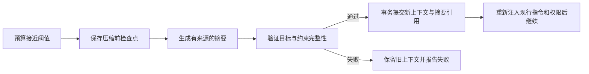

# S2：项目指令与上下文管理开发计划

> 状态：待实施。依赖：S1 完成、S0 上下文契约已冻结。预计：8–12 人日。
> 返回：[总体路线](./README.md)。上一阶段：[S1](./s1-completion-and-verification.md)。下一阶段：[S3](./s3-repository-and-patches.md)。

## 1. 阶段目标

使 Agent 能自动遵守项目规则，在多轮和长任务中保留目标、约束及执行事实，并在上下文接近容量时压缩和继续。解决 G03–G05，为多文件修改和恢复提供可靠输入。

本阶段不建设通用长期记忆系统，不导入整仓代码或全部 RAG，不把自动压缩视为用户授权，也不承诺小模型通过扩大窗口获得更强推理能力。

## 2. 当前限制与可复用实现

[本机 Runtime](../../../src/private_agent_local/runtime.py)仅取最近 12 条消息并截取正文；[适配器](../../../src/private_agent_local/core_adapter.py)最多允许 24 次模型请求、90 条消息和有界请求体；[本机 context](../../../src/private_agent_local/context.py)主要计算最近 usage 展示。

可审查复用[ContextBuilder](../../../src/personal_assistant/context/builder.py)、[上下文契约](../../../src/personal_assistant/context/contracts.py)、[预算逻辑](../../../src/personal_assistant/core/context_budget.py)、[摘要逻辑](../../../src/personal_assistant/core/context_summaries.py)。其中数据库、配置和 RAG 依赖不能直接带入纯共享核心；只复用适合本机主链的算法与接口。

Codex 的[指令加载](https://github.com/openai/codex/blob/95327467c3af9533ac25b171b3496b951fe425ed/codex-rs/core/src/agents_md.rs)和[压缩](https://github.com/openai/codex/blob/95327467c3af9533ac25b171b3496b951fe425ed/codex-rs/core/src/compact.rs)提供机制参考。本项目的优先级和授权规则以自身用户约定为准。

## 3. 工作分解

| 工作项 | 具体开发内容 | 前置 | 交付物 |
| --- | --- | --- | --- |
| S2-01 指令契约 | 指令来源、适用目录、内容摘要、信任状态与优先级 | S0-04 | 指令解析和冲突规则测试 |
| S2-02 指令加载器 | 项目根与子目录 AGENTS.md 发现、有界读取、缓存失效、错误报告 | S2-01 | 本机加载器与工具前检查 |
| S2-03 上下文记录 | 保存有序消息、工具调用/结果关联与内容引用；旧记录迁移策略 | S1 | SQLite 与模型历史适配 |
| S2-04 请求预算 | 按模型窗口与输出预留预算，规范截断与计量来源 | S2-03 | 预算器、适配器、配置校验 |
| S2-05 压缩与继续 | 自动/手动压缩、结构化摘要、检查点、失败保留旧历史 | S2-01/03/04 | 压缩服务与事件 |
| S2-06 循环控制 | 统一模型/工具次数、时长、费用预算和无进展检测 | S2-04/05 | 可解释停止原因与预算快照 |
| S2-07 界面与端到端 | 指令来源、预算估算/实测、压缩状态、失败提示 | S2-02 至 S2-06 | UI 与完整链路回归 |

S2-03 的存储契约先冻结，再进行 S3 补丁的读取版本关联。不要让 S3 为同一文件历史另建一套无关联记录。

## 4. 项目指令详细设计

### 4.1 发现范围与优先级

首先确定用户选择的规范化项目根。仅在授权项目范围内查找，不越过根目录。项目根规则适用于项目；子目录规则只适用于其子树。涉及多个文件时分别计算适用规则，不能把不相干的兄弟目录规范混在一起。

本项目应用明确的顺序：系统与应用边界 → 用户本次明确要求 → 适用项目指令 → 普通文档与源码内容。更具体的目录规则仅在其适用范围覆盖较一般的项目规则，不能覆盖用户禁止写入、权限撤销或秘密保护。

先支持 `AGENTS.md`；如需 `AGENTS.override.md` 或其他文件名，通过受审查配置定义，不宣称天然完全兼容所有 Agent。原始代码/日志/网页仍为不可信数据，不能仅因包含“忽略之前指令”升级为指令。可信项目规则应通过独立上下文项注入，不混同普通文件工具输出。

### 4.2 信任、变化与加载异常

首次项目授权时明确是否信任项目级指令，记录来源路径和摘要。未信任仓库的规则只供阅读和展示，不自动执行其脚本或引入额外权限。信任是对规则来源的处理，不能代替每次操作的权限检查。

缓存键包含规范化项目身份、规则路径及摘要；新任务和涉及新子目录的操作前检查。规则在活动任务中变化时发事件并使相关上下文失效；扩大动作范围的变化不得偷偷继承旧批准。删除规则也要记录，不沿用永久缓存。

初始总读取预算建议 64 KiB，单文件上限和数量上限在 S0/S2 测量后冻结。超限、编码错误、不可读、链接路径应提供明确诊断；关键规则不能静默丢弃后继续写入。不得自动访问规则中任意绝对路径或网络地址。

## 5. 历史与内容引用设计

### 5.1 拟议 ContextItem

字段至少包括：`item_id`、`session_id`、`run_id`、`ordinal`、`role`、`kind`、`tool_call_id`、`content_ref`、`content_sha256`、`source`、`created_at`。持久化顺序独立于 UI 当前渲染顺序；同一模型 item 不因重连被重复插入。

在现有 SQLite schema 上增量添加上下文项/检查点及必要索引，或复用可满足查询的已有事件；S2-03 通过检索和恢复成本确定最终结构。禁止一边以 events 重建，一边以另一张表独立生成不同事实。

### 5.2 历史重建规则

- 保留 assistant tool call 与对应 tool result 的关联，不能裁掉其中一半。
- 失败、拒绝、取消和结果未知也要进入上下文，避免重复尝试同一动作。
- 已提交的最终回答不同时从消息表与事件表重复注入。
- 工具大输出先落有界内容文件，再在上下文中放摘要与续读引用；模型只能经受控工具按当前账号和任务范围读取，不能获得任意本机内部路径。
- 旧消息可导入为 legacy 来源；旧工具正文缺失时明确缺失，不从聊天文字伪造 execution。
- 秘密和有效授权不进入摘要；权限从运行时现态取得，不能从历史回答重建授权。

## 6. 请求预算与模型约束

### 6.1 预算计算

请求输入预算 = 已确认模型上下文容量 − 输出预留 − 协议与安全余量。输入计量必须包含指令、工具 schema、消息、工具结果和供应商特有开销。

有适用 tokenizer 时使用对应估计；没有时使用明确标注的保守估算和误差余量。供应商 input usage 用于校准下一请求与 UI 实测展示，不能把上一请求精确值当作下一请求的精确计数。

初始压缩触发建议为可用输入预算的 80%，硬门槛为 100%；这两个数是待校准默认值。压缩必须给压缩请求本身预留容量。模型容量未知时允许明确受限的小请求策略或阻止长任务，不能制造一个虚假的大窗口。

`ModelRequest` 若需新增输出 token 上限，应同步检查模型契约、Provider 适配器、服务器 DTO 和请求校验，不能只在 UI 增加一个不生效的配置项。不支持的能力提前报告。

### 6.2 上下文裁剪顺序

优先移除已过期的重复检索、已被新版本替代的文件片段和可通过引用重新读取的大输出；其次压缩已完成历史。保留当前用户目标、禁止项、活跃操作、未解决失败和最近必要代码上下文。

不得从截断位置继续发送半个 JSON 工具调用。不可压缩的必需输入本身超限时停止并说明限制，请求缩小范围或更换明确支持的模型。

## 7. 压缩流程与失败处理

拟议摘要结构：`original_goal`、`active_constraints`、`completed_work`、`changed_files`、`verification_state`、`failed_attempts`、`pending_work`、`source_item_ids`。模型生成的摘要不直接修改原始用户约束；约束和关键执行事实由程序保留并校验。

自动压缩每次阈值触发只允许有界尝试，建议单次失败最多再尝试 1 次；失败后禁止“压缩失败 → 不压缩重发同一超限请求”的无限循环。断流或取消时不提交半份摘要；原上下文可读取并保持摘要版本关系。

多次压缩应能追溯到原始 items，而非只引用上一份无法验证的总结。恢复时采用最后一个完整提交的检查点。

## 8. 接口、预算与界面

拟议 API：在现有 `/sessions/{id}/context-budget` 增加估计输入、输出预留、来源、压缩状态和模型配置版本；新增手动压缩入口建议位于 `/sessions/{id}/context/compact`，准确名称在 schema 冻结时确定。

运行中手动压缩只能在安全的模型请求边界执行；与工具副作用、另一压缩请求互斥。重复请求应返回同一活动压缩任务，不能并发替换历史。

统一预算包括模型请求次数、工具次数、有效执行时长与可用费用上限。供应商缺少价格时费用显示未知，并依靠 token/轮次等其他上限；不能把未知费用当零。等待用户批准期间的计时与执行时长分开，仍保留会话空闲保护。

无进展检测识别相同参数、相同状态和相同失败反复出现，先反馈模型，再以明确原因结束；不能用过于宽泛的“连续两次读同一文件”规则拦截正常工作。

UI 展示哪些规则生效、预算为估算还是实测、压缩开始/完成/失败。只展示公开状态和摘要，不要求暴露模型隐藏推理。

## 9. 预计修改范围

现有：本机 `runtime.py`、`core_adapter.py`、`context.py`、`store.py`、`app.py`；共享模型契约与网关/适配器；必要时 `routes_desktop_model.py` 的 DTO；桌面 ContextDrawer、上下文模型和状态投影。

拟新增：共享上下文组装模块、本机指令发现模块、压缩检查点适配器；`test_local_instructions.py`、`test_local_compaction.py`、`test_local_context_history.py`。纯算法从旧实现按需提取，不整体移动 RAG 服务。

## 10. 测试矩阵

| 用例 ID | 场景 | 核心断言 |
| --- | --- | --- |
| S2-T01 | 根与嵌套 AGENTS.md 冲突 | 仅目标子树规则覆盖，一般文件不能升级权限 |
| S2-T02 | 规则超限、不可读、链接、变化 | 明确错误或失效，不能静默忽略关键规则 |
| S2-T03 | 跨 12 条消息后引用早期禁止项 | 禁止项仍存在且生效 |
| S2-T04 | 多工具、失败、拒绝与重连 | call/result 成对，无重复、无伪造事实 |
| S2-T05 | 小窗口、大工具 schema、未知容量 | 请求前预算正确，未知值不伪造精度 |
| S2-T06 | 两次连续压缩后继续修改 | 原目标、约束与未完成项可追溯 |
| S2-T07 | 压缩断流/取消/写库失败 | 旧历史完整，半成品不被采用 |
| S2-T08 | 不支持 usage 或输出上限的 Provider | 正确能力提示，不发送伪造参数 |
| S2-T09 | 30 次模型请求的可推进夹具任务 | 在明确足够预算下继续，不受旧 24 次隐形门槛截停 |
| S2-T10 | 重复失败与真实进展交错 | 只终止无进展循环，预算不无限重置 |
| S2-T11 | 模型切换、账号撤销 | 重算预算，不混用旧 usage，撤销立即阻断 |
| S2-T12 | 日志/代码中含注入文本 | 保留数据属性，不获得规则或授权地位 |

在 S0 隔离环境运行新增测试与 `test_local_context.py`、模型契约/路由测试，涉及共享适配器时增加 ModelGateway 回归。集成测试使用假服务；真实模型质量另由 S6 验收。

## 11. 阶段验收与回滚

- S2-T01 至 S2-T12 通过，完整请求可解释其上下文来源和裁剪过程。
- 压缩后继续任务能使用已有文件/测试证据，不需要用户重新粘贴全部约束。
- 字符估算与供应商实测分开显示，缓存计费统计与上下文窗口占用不混用。
- 旧历史只读可访问，新格式迁移有备份和中断回归；历史授权不恢复。
- 压缩可停止启用并回到最后完整上下文；若原始历史超限，明确阻塞，不能退回静默硬截断。
- 程序回退先检查新 schema 支持；不能通过删除新上下文表“回滚”。
- 更新上下文设计和统一客户端说明，保留历史记忆边界；记录实际模型与窗口支持范围。
