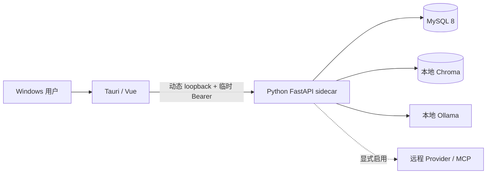

# 开发、部署、升级与回滚指南

CentOS Stream 9 源码部署、Supervisor 进程管理和 Nginx `6000` TLS 反向代理请直接参见 [`centos-stream9-deployment.md`](centos-stream9-deployment.md)。FastAPI 是 ASGI 应用，因此该方案使用 Uvicorn，不使用仅面向 WSGI 的 uWSGI。

> 支持两种部署模型：Windows 桌面应用 + 本地 Python sidecar，以及服务器端多用户 API。服务器模式仍只让后端监听 loopback，由外部 HTTPS Nginx 或容器反向代理提供公网入口；两种模式不共享秘密存储或生命周期假设。

## 1. 运行拓扑



桌面壳负责端口选择、sidecar 生命周期、临时 API token、系统凭据和更新。sidecar 只监听 loopback；MySQL 和 Ollama 是用户可管理的本地依赖。

## 2. 开发启动

前置：Python 3.12+、uv、Node 20+、MySQL 8、Ollama、Rust/MSVC/WebView2。

```powershell
Copy-Item .env.example .env
uv sync --extra dev
ollama pull qwen2.5:14b-instruct-q4_K_M
ollama pull bge-m3
uv run alembic upgrade head
uv run uvicorn personal_assistant.main_api:app --reload --host 127.0.0.1 --port 8000
```

另一个终端：

```powershell
Set-Location apps\desktop
npm ci
Set-Location ..\..
scripts\run-tauri-dev.bat
```

若应用主库未获升级授权，不要执行上面的 `alembic upgrade head`；改用专用开发/测试库，或保持功能开关关闭并只做只读检查。

## 3. Windows 生产构建

```powershell
scripts\release-check-full.bat
scripts\build-sidecar.bat
scripts\build-release.bat
```

输出包括 NSIS 安装包、updater `.sig`、`dist/latest.json`、release manifest 和代码签名状态。没有 Authenticode 证书时可以生成测试安装包，但发布说明必须标记 unsigned 和 SmartScreen 风险。

详细签名与发布步骤见 `docs/release-checklist.md` 和 `docs/signing-and-keys.md`。

## 4. 首启与秘密

安装版数据目录为 `%APPDATA%\personal-assistant\`。连接向导把数据库密码和远程 provider key 写入 Windows Credential Manager；`.env` 只保存非敏感字段或固定 `secret://` 引用。

Tauri 每次启动生成新的 API token，选择空闲 loopback 端口并启动 sidecar。sidecar 在提供可写 API 前执行 Alembic upgrade；迁移失败时拒绝启动，避免未知 schema 上继续写入。

## 5. 数据库升级

正式升级前按 `docs/database-upgrade-runbook.md`：

1. 停止所有写入进程；
2. 创建并核验完整 MySQL clone；
3. 在 clone 上演练 upgrade/downgrade；
4. 记录主库 revision 和关键计数；
5. 获取明确的 schema 变更授权；
6. 升到目标 head（当前 `0021`），立即检查 `/health`、schema 和数据计数；
7. 所有新功能开关仍保持 false（已获授权的灰度开关除外）。

截至 2026-08-02，应用主库仍为 `0012`。已通过的 clone 演练不能替代第 5 步授权。

截至 2026-08-05：已获明确授权完成第 5 步。schema 克隆演练（`0012 → 0020 → 0012`）、RAG 端到端演练（`data/rehearsals/versioned-rag-canonical-0020-20260805.json`，`rollout_ready=true`）均通过后，主库已迁移到 `0020`（48 张原表行数零变化），versioned indexing/retrieval 已启用，生产 hybrid 评测通过。回滚克隆 `personal_assistant_preupgrade_20260805111304` 保留。

## 6. 分阶段启用

建议顺序：

1. `PA_AGENT_RUNS_API_ENABLED=true`，仅内部测试无工具 run。
2. `PA_AGENT_RUN_READ_ONLY_TOOLS_ENABLED=true`。
3. `PA_AGENT_CONTEXT_BUILDER_ENABLED=true`。
4. `PA_CHAT_AGENT_RUNTIME_ENABLED=true`，小范围普通聊天。
5. `PA_VERSIONED_RAG_INDEXING_ENABLED=true`，只做旁路小批构建。
6. 人工复核 benchmark 且延迟/质量通过后，`PA_VERSIONED_RAG_RETRIEVAL_ENABLED=true`。
7. MCP 先验证 OS keyring 引用、目标服务静态认证/证书/限流，并取得当前 head `0021` 的主库迁移授权；OAuth 或高安全远程目标还需补齐授权生命周期和网络栈级约束后，才考虑 `PA_MCP_ENABLED=true`。

每一步观察错误率、P95、取消/审批恢复、数据库/向量一致性和 UI 兼容性。任一异常先关闭当前开关，不同时推进下一项。

## 7. 回滚

- 功能回滚：关闭最近打开的 feature flag；legacy API、聊天和 RAG fallback 保留。
- 应用回滚：恢复旧 release/updater manifest 或安装旧版；用户数据目录默认保留。
- 数据库回滚：无必须保留的新写入时，停机后切换到已核验 clone；有新写入时先做新备份和差异迁移设计。
- RAG 回滚：切回 previous verified index head，或关闭 versioned retrieval 回退 legacy；不要先删当前/旧向量。

不要把 Alembic downgrade 当作无条件回滚。`0013`–`0021` 的 downgrade 会删除新事实表（`0021` 为纯新增 telemetry 表，旧应用可忽略；`0013`–`0020` 删除 Agent/MCP/版本化 RAG 事实表）。

## 8. 可选 Docker / Compose 部署

`Dockerfile` 和 `compose.yaml` 是与 Tauri sidecar 分离的单机部署面：Python 3.13.13、uv 0.11.26、MySQL 8.0.41 和可选 Ollama 0.32.3 均锁定版本；应用依赖使用 `uv.lock --frozen`。API 以 UID/GID 10001 运行，根文件系统只读、capabilities 全部移除，并只把容器端口发布到宿主 `127.0.0.1`。MySQL 不发布宿主端口，Chroma、MySQL 和 Ollama 各使用独立命名卷。

### 8.1 生成秘密并检查配置

```powershell
Copy-Item .env.container.example .env.container
uv run python scripts/generate_container_secrets.py
uv run python scripts/generate_container_secrets.py --yes
docker compose --env-file .env.container --profile ollama-gpu config --quiet
```

第一次命令只输出 preview，第二次创建 `.secrets/api_token`、`mysql_password`、`mysql_root_password`。脚本拒绝项目外路径和覆盖已有文件，输出只有路径，不包含秘密值；`.env.container` 仅保存这些文件的路径。`.env.container` 和 `.secrets/` 都被 Git/Docker build context 排除。Windows 上还应确认目录 ACL 仅授予当前账户与管理员；正式编排平台应改用其原生 secret provider。

### 8.2 启动与验证

使用宿主现有 Ollama：

```powershell
docker compose --env-file .env.container up --detach --build
docker compose --env-file .env.container ps
```

如旧 Ollama Desktop 不能稳定启动，可把 `.env.container` 中的 `PA_OLLAMA_BASE_URL` 改为 `http://ollama:11434`，使用 NVIDIA GPU profile：

```powershell
docker compose --env-file .env.container --profile ollama-gpu up --detach --build
docker compose --env-file .env.container exec ollama ollama pull qwen2.5:14b-instruct-q4_K_M
docker compose --env-file .env.container exec ollama ollama pull bge-m3
```

API 内部维护令牌从 `/run/secrets/api_token` 读取；token 不进入镜像 metadata 或 Compose 展开输出。容器内必须显式设置 `PA_API_ALLOW_NON_LOOPBACK_BIND=true` 才能绑定 `0.0.0.0`，代码只允许 unspecified wildcard 且强制认证。宿主端口仍固定绑定 loopback；不要把 `ports` 改成 `0.0.0.0`，公网入口应由同机 HTTPS 反向代理转发。

### 8.3 数据、迁移与停止

API 单实例启动时执行 `alembic upgrade head`；MySQL 健康前不会启动 API。该 Compose 默认创建全新 `personal_assistant` 卷，不连接当前桌面主库，也不能用作绕过主库迁移授权的路径。多副本、滚动 schema 迁移和远程文件授权尚未设计，因此不要扩容 API replicas。

```powershell
docker compose --env-file .env.container stop
docker compose --env-file .env.container down
```

`down` 保留命名卷。删除卷会不可恢复地删除容器数据库、Chroma 和模型，必须先做可恢复备份并获得明确删除授权；正常操作文档不提供自动 `down --volumes`。MySQL volume 不是备份，升级前仍需 `mysqldump`/恢复演练和计数校验。

### 8.4 多用户远程客户端

服务端仍只在宿主 loopback 发布 `PA_DOCKER_API_PORT`，由 Nginx/Caddy/Traefik 在同一台服务器终止 TLS。以 Nginx 为例：

```nginx
location / {
    proxy_pass http://127.0.0.1:8000;
    proxy_http_version 1.1;
    proxy_set_header Host $host;
    proxy_set_header X-Forwarded-For $proxy_add_x_forwarded_for;
    proxy_set_header X-Forwarded-Proto $scheme;
    proxy_buffering off;
}
```

`.env.container` 至少按真实域名设置：

```dotenv
PA_API_ALLOWED_HOSTS=agent.example.com,127.0.0.1,localhost
PA_API_ALLOWED_ORIGINS=https://tauri.localhost,tauri://localhost,http://tauri.localhost
PA_ALLOW_PUBLIC_REGISTRATION=true
PA_AUTH_SESSION_TTL_HOURS=168
PA_LOG_RETENTION_DAYS=30
PA_AUDIT_LOG_RETENTION_DAYS=90
```

执行 `alembic upgrade head`（Compose 启动入口会自动执行）后，访问客户端注册首个账号；首个账号成为管理员。管理员注册完成后，如不再允许自助注册，把 `PA_ALLOW_PUBLIC_REGISTRATION=false` 并重启 API。不要在公开服务长期保留一个无人管理的“等待首个管理员注册”窗口。

登录/注册页不再提供服务器地址输入。未配置时客户端默认启动本地 sidecar；部署服务器版时，在 `apps/desktop/.env.production.local` 中固定远程地址并重新构建安装包：

```dotenv
VITE_API_BASE_URL=https://agent.example.com
```

生产构建拒绝非 loopback 的明文 HTTP。配置远程 URL 后，客户端会跳过本地 sidecar；数据库、Chroma、模型调用和业务逻辑都留在服务器，客户端只向当前配置的 API 域名发送 Bearer 会话。每个业务行由 `owner_user_id` 隔离；旧库中 owner 为空的数据默认不会暴露给新账号。仅在可信迁移前设置 `PA_CLAIM_LEGACY_DATA_ON_FIRST_USER=true`，才会由首个管理员认领旧数据。

注册验证码使用 SMTP 发送。复制仓库根目录的 `smtp.env.example` 为 `smtp.env`，填写 SMTP 主机、邮箱与服务商授权码；源码/服务器进程会在主 `.env` 后读取该文件。Windows 安装版应将同样的 `smtp.env` 放到 `%APPDATA%\personal-assistant\smtp.env` 并重启应用。验证码为 6 位字母数字组合，5 分钟有效。

所有 HTTP 操作都会写入 `audit_logs`（不保存请求正文、密码、token、聊天全文或密钥），管理员端可查看用户统计、健康状态和审计记录。数据库审计按 `PA_AUDIT_LOG_RETENTION_DAYS` 清理，文件日志每日轮转并按 `PA_LOG_RETENTION_DAYS` 清理。

当前环境已用最新源码重建 API 镜像并完成隔离 Compose 实机门禁：镜像内关键 Python/ONNX/Chroma 依赖可导入，运行用户为 `10001:10001`；临时项目中的 MySQL 与 API 均达到 `healthy`，新库自动迁移到 `0020`（63 张表），未认证/已认证根请求分别返回 401/200，`/health` 中 API、MySQL、Chroma 为 true。验证同时确认只读根文件系统、`cap_drop: ALL` 和 `no-new-privileges` 生效，结束后该项目的容器、网络、测试卷和短生命周期秘密已全部删除。可选 `ollama-gpu` profile 已通过配置门禁，但本轮没有拉取其镜像、模型或执行 GPU healthcheck，不能据此声称容器 GPU 路径已验收。

## 9. 平台边界

Windows 10/11 x64 是当前硬验收平台。macOS/Linux 有数据目录适配、sidecar 构建脚本和发布清单结构，但尚未实机构建、签名和 smoke；不得宣称正式支持。详见 `docs/cross-platform.md`。

## 10. 观测与故障排查

运行期查看 `/health`、诊断中心、结构化日志、Agent run/events、MCP call log 和版本化索引状态。日志和报告不得包含密码、token、文档正文或完整模型提示。

常见故障和安全处理见 `docs/troubleshooting.md`；API 入口见 `docs/api-reference.md`。
