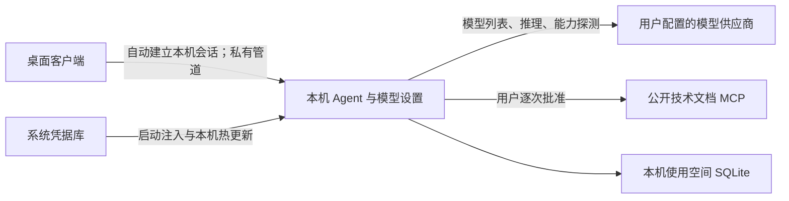

# 本机模型直连与升级说明

更新日期：2026-09-20。当前源码仅保留 API Key 本机桌面链；旧完整服务端已删除。本文记录源码行为，不代表已发布安装包、部署服务器或通过真实供应商验收。

## 调用链



启动后直接进入 Coding 工作区，在“设置 → 模型”添加供应商、接口地址、API Key 和模型即可使用。桌面登录、注册、管理员页面及平台切换入口已经删除；旧 `/login`、`/register`、`/admin` 地址统一返回工作区。自动化入口及页面移除；插件页提供 Skills 与 MCP，内置壁纸主题位于“设置 → 外观”。桌面不访问账号服务器。

提示词、代码上下文、工具结果及模型密钥从用户电脑直接发送给所配置的模型供应商。支持 OpenAI Responses、OpenAI 兼容 Chat Completions、Claude Messages、Ollama Chat；保留本机兼容服务的可选密钥规则，不把移除平台账号解释成取消现有模型协议。

## 原生推理与决策续接

OpenAI 协议增加 `api_format="responses"`，在“设置 → 模型 → API 格式”选择 Responses，Base URL 填供应商 API 根地址（例如以 `/v1` 结尾），适配器调用其 `/responses`。仅在供应商明确支持时使用；旧配置继续使用 Chat Completions，不自动探测、迁移或失败回退到另一接口。

- 请求使用 `store: false`，显式请求 `reasoning.encrypted_content`，透传已声明的 `reasoning_effort` 和输出 token 上限；结构化输出使用 `text.format`，函数工具使用 Responses 原生结构。此接口不发送全局温度参数，避免向不支持该参数的推理模型提交无效请求。
- 同一供应商端点、模型和凭据下，完整输出条目原样续接，包括加密推理状态、助手 `phase` 和函数调用 ID；工具执行后按 `call_id` 返回结果。不解析加密状态，不将其放进聊天正文、公开决策摘要、历史续读工具或历史导出。
- `commentary` 表示继续处理；`final_answer` 才进入最终回答与现有完成验收。同一响应包含多个阶段时，只取最终阶段正文作为回答，原生完整条目仍用于续接。未提供阶段的模型保持原有“有工具则执行、无工具则验收”行为。
- 流式调用必须收到完整 `response.completed` 才提交工具决策。桌面通过独立公开消息通道按消息 ID 分开显示 `commentary` 和 `final_answer` 的增量；旧文本回调仍只包含最终选中的正文。断流、截断、错误、参数损坏和未支持的托管工具输出都不能触发工具执行或成功结论；公开任一消息后不自动重试供应商请求。
- 运行中修改协议格式、端点或模型会停止后续模型请求。新任务切换路由或凭据时仅发送通用公开历史，不将旧路由的加密状态交给另一服务。旧恢复检查点缺少当前路由指纹时可能要求重新发起任务，不能借升级重放工具。

这是对齐 Codex 公开 Responses 机制和 Agent 决策循环的实现，不代表复制其模型内部推理、托管工具或完整产品能力。上下文仍使用本机事实索引与工作摘要压缩，不调用供应商 `/responses/compact`。原生链路边界使用隔离协议和本机集成测试验证，真实供应商效果、延迟和费用需要另行验收。

依据：[OpenAI 推理与无状态续接](https://developers.openai.com/api/docs/guides/reasoning)、[函数工具调用](https://developers.openai.com/api/docs/guides/function-calling)。专项验证入口：`.venv/Scripts/python.exe -B scripts/run_coding_validation.py --suite reasoning`。

## 输出消息与文件交付

输出对齐 Codex 公开的消息阶段与最终状态机制，保留本机权限、完成证据及事务提交边界，不等于复制 Codex 的模型能力或托管工具。

- `model.output.delta` 保留 `attempt_id` 和 `delta`，新增稳定 `message_id`、`phase` 与 `generation`；同一次模型请求中的多条公开消息分别展示。`model.output.finished` 的 `messages` 保存消息阶段，`model.output.interrupted` 关闭该请求已显示的片段。隐藏推理、加密续接状态和工具参数不进入公开正文通道。
- `final_answer` 是模型提出的候选交付。只有完成验收与持久化终态确认后，才成为正式结果。终态和快照中的 `final_output_attempt_id` 标识实际采用的回答，前端据此去重；证据不足时仍保留候选说明和受阻结果。旧记录缺少新字段时沿用原有恢复规则。
- 公开单条消息展示超过 64,000 字符时保留末尾并提示截断；最终交付独立保存。断线恢复继续使用事件序号、快照纠偏和缺口补读。
- 回答中的 Markdown 文件链接及带 `rel_path` 的产物可以打开当前任务工作区的只读预览，支持 `src/main.py:12`、`src/main.py#L12` 及工作区内绝对路径。含空格的链接目标可用 `<...>` 包裹。路径穿越、危险协议、UNC 路径及工作区外目标不打开；后端继续核验授权、受保护路径与文件摘要。
- 文件预览支持目标行定位；未加载到目标行时提示继续读取，不自动读取整份文件。二进制、非 UTF-8 和不可访问文件沿用明确的不可预览状态；不执行生成的 HTML 或脚本。代码块可单独复制。

## 可选 JSON Schema 交付

程序调用 `POST /agent-runs` 时可以传入 `output_schema`，省略时保留原来的 Markdown/自由文本输出。例如在现有项目、工作区和会话绑定之外加入：

```json
{
  "output_schema": {
    "type": "object",
    "properties": { "summary": { "type": "string" } },
    "required": ["summary"],
    "additionalProperties": false
  }
}
```

这是一段请求字段示例，不是完整创建请求。当前模型必须已声明 `supports_structured_output=true`，否则在模型请求和工具执行前明确失败；不自动换模型或降级格式。

Schema 复用共享 `ModelOutputFormat` 约束：根类型为 object、最多 64 KiB、深度 32、节点数 2048，仅允许本地引用；创建任务时检查引用目标和重复锚点。支持 JSON Schema 2020-12 的类型、属性、必填、附加属性、数组项、长度/数量/数值边界、枚举、常量和逻辑组合；暂不支持正则、格式断言、唯一项和未求值属性规则，未支持的关键字明确拒绝，避免同步校验失控。

最终结果必须是完整且符合 Schema 的 JSON 对象，最多 1 MiB、4096 个节点、深度 32。校验限制为 20000 个计算单位和累计 16 MiB 实例检查量；组合与枚举按分支数预留预算，复杂 Schema 可能提前达到限制。代码围栏、重复字段、非有限数值和截断正文不作为有效结果。格式不符使用现有最多两次完成纠错机会，并共享任务预算；历史任务中无法解析的 Schema 引用停止纠错。

结构正确之后仍执行原完成证据检查。只有真正采用的最终回答才与 `structured_output` 一起事务提交到终态和快照；取消、失败、受阻兜底或提交失败不产生结构化成功结果。继续原任务继承 Schema，新任务默认不继承。重复请求 ID 不能换用另一个 Schema。

桌面会将已提交的结构化结果显示为格式化 JSON，候选正文不提前标记成功。当前入口为本机任务 API，没有新增全局格式设置，也没有以 Schema 校验替代业务、语义或视觉验收。

公开机制参考：[Codex App Server](https://learn.chatgpt.com/docs/app-server)、[Codex 结构化输出](https://learn.chatgpt.com/docs/non-interactive-mode)。本机验证入口为 `--suite output`、`--suite reasoning`、`--suite streaming`；真实供应商的效果、时延和费用不由这些隔离测试证明。

## 本机会话与 401

- 启动链等待本机执行器就绪，再通过 `POST /identity/local` 建立随机会话，保存令牌后才挂载工作区。并发启动共享一个过程；失败保留错误和重试入口。
- 该接口仍位于原有私有管道或回环启动凭证边界内，不接受客户端指定用户或目录。平台绑定 `POST /identity` 已删除；执行器 CLI 不再接受 `--server`。
- 本机使用空间仍由 `privateagent://local-device` 和固定所有者计算，已有本机项目、模型配置和凭据引用可复用。执行器重启产生新令牌，旧令牌失效；重复绑定当前空间不会替换有效令牌。
- 前端清理历史平台令牌与模式选择偏好，仅在当前窗口会话中保存本机令牌。内部标识 `http://privateagent.localhost` 只用于请求分流，不发起 DNS 或网络访问；本机令牌不能发送到外部服务。
- 已删除的服务器功能请求返回 `410 feature_removed`，不再制造平台登录 401。模型设置不再请求服务器全局设置、备份或旧 MCP 管理接口。
- 仅明确带有 `X-PrivateAgent-Session: expired` 的本机 401 触发重新连接；旧请求的迟到 401 不能清除新令牌。失败请求不会自动重放，以免重复写入。
- 供应商的 401 表示 API Key 或供应商权限问题，保留工作区并显示模型错误，不清空本机会话或跳转登录。
- 项目范围、工具审批、限时授权、文件版本和执行沙箱保持原规则。普通浏览器缺少原生执行器时不能操作本机项目。

## 技术文档 MCP

在“设置 → MCP”选择当前项目，明确配置公开 HTTPS 文档服务，发现目录并选择启用的工具。调用进入现有 Agent 工具链，每次执行仍须审批，拒绝不请求文档工具；执行结果保存在已有运行记录中。API Key 模式使用本机会话完成上述权限校验，不需要平台账号。

此公开文档入口继续仅支持 HTTPS 无认证服务。2026-09-21 增加了独立的通用 MCP 管理，提供 stdio、OAuth 和逐工具权限；使用方式与限制见[工作台说明](workbench-guide.md)。所有 MCP 返回内容都按不可信外部资料处理。

## 壁纸主题

在“设置 → 外观”选择本机 PNG、JPG 或 WebP 图片（不超过 10 MB），预览后点击“应用主题”。插件从图片提取配色并自动决定明暗外观，壁纸居中等比例铺满；导航和页面底板轻度透出，输入框、代码块、菜单和弹窗保持实色。页面尺寸、字体、布局与业务功能不变。灰度图片使用中性面板和原有青蓝强调色，并校正文字对比度。

壁纸处理为长边不超过 3840px 的静态图片，连同配色和启用状态写入本机 IndexedDB（`privateagent-wallpaper-theme`）。不使用后端接口，不依赖原图路径，不上传或跨设备同步。首次默认关闭；选图、取消和离开未保存预览均不会改变当前主题。保存成功后才切换；失败保留旧配置并提示。启动异步恢复主题，不阻塞执行器启动。

关闭“启用壁纸主题”会恢复原样式并保留已保存壁纸；“恢复默认”清除插件保存的图片副本和配置，不删除用户原图。浏览器预览与桌面 WebView 的存储相互独立，清理对应应用的浏览数据也会清除壁纸。此入口不提供插件市场、第三方代码加载、动态壁纸或编辑裁切功能。

## 本机配置与凭据

- 模型元数据位于应用本地数据目录 `local-projects/<本机身份摘要>/model-settings.sqlite3`，项目记录沿用 `projects.sqlite3`，本次没有修改项目数据库 schema。
- 密钥由现有系统凭据服务保存；引用绑定本机空间、供应商 ID、协议和规范化端点。修改端点后需要输入对应密钥。
- SQLite 不保存明文密钥。Rust 通过受控启动环境注入执行器，Python 立即移除该环境变量；运行时更新只走本机管道，用户工具进程不能继承密钥。
- 不自动合并旧平台账号空间、不复制旧平台凭据、不删除历史项目。已有本机使用空间继续复用；仅有旧平台配置的用户需要在本机重新添加供应商。
- “连接测试”检查供应商模型列表，不证明推理或工具能力。工具能力探测由用户显式触发，会产生供应商请求；保存设置不自动调用推理。

远程模型端点要求 HTTPS，不允许 URL 内嵌凭据、query 或 fragment；Ollama 限回环地址，回环 OpenAI 兼容接口支持可选密钥。连接不自动继承环境代理、不跟随重定向。模型响应限制为 2 MiB，最多同时执行 8 个供应商操作；每次生成最多发送一次供应商请求，不自动重试。未知用量保持未知。

Ollama 的实际上下文为模型容量与本机 `llm_context_length` 的较小值，对运行期公布的上下文预算与请求中的 `num_ctx` 一致。运行中的模型 ID 固定在运行记录中，失败不会切换服务器代理或其他供应商。

## 旧后端与构建边界

`src/personal_assistant`、旧服务器模型代理、Alembic 迁移源码、容器/服务器部署入口及旧 UI 已删除。现行 Python 包只有 `private_agent_core` 和 `private_agent_local`，不再安装 SQLAlchemy/MySQL/Chroma/LangChain 依赖。这里只删除源码和专属测试、配置、脚本，没有删除实际数据库或用户历史，也未操作服务器。

当前入口为 `scripts/build-client.cmd`；`build-release.bat` 转发到该本机入口。底层 `scripts/build-remote-client.cjs` 保留桌面标识兼容，但所有产物都使用本机执行器。参数不接受平台 API 源站，不注入平台令牌，元数据记录 `accessMode: api-key`。默认及预览不启用 updater，正式统一客户端要求显式独立更新地址。前端和执行器须来自同一源码构建，旧已安装副本不会自动获得修改。

```powershell
node scripts/build-remote-client.cjs --help
node scripts/build-remote-client.cjs --preview-installer --version 1.0.4 --dry-run
```

第二条仅为参数校验示例，不代表已确定新的发布版本。本次未打包安装器、发布更新或部署服务器。

## 验证入口

从仓库根目录运行 `.venv/Scripts/python.exe scripts/run_coding_validation.py --suite direct-models`，覆盖三种模型协议、本机绑定、持久化、撤销、错误和凭据边界；使用隔离目录和 HTTP 替身，不加载业务配置。`--suite tool-evolution` 包含真实 MCP SDK 协议和 API Key 工作区内批准/拒绝文档工具的回归。

桌面端在 `apps/desktop` 使用 Vitest、`npm run build` 和 Playwright。`npm run e2e -- local-access.spec.ts documentation-mcp.spec.ts --retries=0` 验证实际页面和路由，仅模拟原生 IPC 边界，不等同安装包或真实模型验收。

具体测试结果、已发现的既有失败与交付限制见[API Key 单模式交付记录](./solutions/2026-09-19-api-key-only.md)。

## 本机项目与会话管理（2026-09-19）

项目侧栏提供编辑、置顶／取消置顶和删除。编辑弹窗读取 `GET /projects/{id}`，通过 `PATCH /projects/{id}` 保存名称；更换目录时同时提交 `root_path` 和用户确认后的 `authorize_scope: true`。项目名称为 1–255 个非空字符，目录沿用现有真实绝对目录校验，不能占用其他项目的根目录。

目录变更与根工作区更新使用同一 SQLite 事务，保留会话绑定和历史证据。后续根工作区操作使用新目录，独立 worktree 保留原位置；不复制或移动项目文件。更换目录撤销该项目旧的完全访问授权，清除旧的 AGENTS.md 指令信任。历史补丁和恢复继续核验原路径、目录身份与文件摘要，不能把旧现场直接重放到新目录。

`POST /projects/{id}/pin`、`/unpin` 把 `pinned_at` 存入已有项目 JSON，无需数据库迁移。置顶项目优先，多个置顶按置顶时间倒序，普通项目保持原列表顺序；重新加载和执行器重启后仍保留。

任务操作菜单提供归档与恢复，归档保留历史并从常规列表隐藏；删除需要独立确认后调用 `DELETE /sessions/{id}`。`DELETE /projects/{id}` 同时删除项目下的会话。删除事务清理消息、运行、审批、上下文、补丁与进程记录，前端立即清理失效选择和待发送首轮输入，迟到刷新不能恢复删除的记录。项目目录及独立 worktree 文件不删除；审计、历史导入原件、既有备份和共享内容块不在此次记录删除的清理范围内。

有排队、运行、暂停任务，活动进程、尚未退出的清理任务，或未核实的执行租约时，删除／更换目录返回 `409 record_in_use`，不留下部分变更。目录变更缺少确认返回 `403 project_scope_confirmation_required`，目录已被其他项目使用返回 `409 project_path_conflict`。2026-09-21 起 `archived_at` 恢复为有效的归档状态；本机接口支持 archive/unarchive，归档历史通过搜索中的“已归档”恢复打开。已有归档字段会按此语义生效。历史导入格式不变。

相关验证入口：

```powershell
# 仓库根目录：隔离临时数据库，不加载业务配置
.venv/Scripts/python.exe -B scripts/run_coding_validation.py --suite project-management

# apps/desktop：前端组件、状态和实际浏览器流程
node node_modules/vitest/vitest.mjs run src/features/coding/api/codingApi.spec.ts src/features/coding/components/CodingSidebar.spec.ts src/features/coding/components/ThreadTools.spec.ts src/features/coding/components/EditProjectDialog.spec.ts src/features/coding/model/codingWorkspaceStore.spec.ts --pool=threads --maxWorkers=1 --minWorkers=1
node node_modules/@playwright/test/cli.js test e2e/project-management.spec.ts --retries=0
npm run build
```

浏览器流程使用模拟本机 IPC，覆盖名称与目录编辑、范围确认、置顶／取消置顶、刷新、删除取消、会话与项目删除、宽窄窗口弹窗。源码验证不等于已安装客户端升级；本次不涉及安装包、部署、真实用户项目删除或付费模型请求。

## 试用版任务页与大型 Python 环境（2026-09-17）

本节保留试用阶段的界面与执行记录；涉及账号的旧入口已经由上方 2026-09-19 说明取代。

任务页的对话、结果与输入框使用同一居中内容宽度，输入框独立固定在底部。1.0.3 试用修订把 1.0.2 原来位于对话下方的文件变更、进程与恢复现场移到右上角环境面板，按分类查看；审批仍位于执行过程。右上角另有任务操作菜单（重命名、置顶、复制名称；历史“归档”已在 2026-09-19 改为删除）和独立文件工作区。宽窗口并列展示文件与对话，窄窗口文件区覆盖任务正文并提供关闭入口。任务完成后默认折叠过程，仍可展开查看工具证据。验收记录全部通过时折叠，未通过或未验证的记录默认展开。

1.0.4 试用修订将上下文分类统一为“文件 / 上下文 / 来源 / 产物”。历史回答与当前回答共用正文样式，继续对话时不缩小字号、收窄内容或新增气泡底色。“执行过程”旁展示本轮总耗时（包括等待审批的时间），运行时更新，终态以快照起止时间为准；事件重放保留已取得的时间。缺失或无效时间显示待同步，不伪造数值；切换任务和卸载页面清理计时器。

2026-09-17 曾将诊断移入管理员控制台。2026-09-19 已删除整个桌面管理员入口及对应旧页面测试，旧导航记录回到 Coding；当前缺失入口由路由测试和 `e2e/local-access.spec.ts` 核验。独立完整后端的诊断鉴权仍属于旧后端边界。

1.0.5 试用修订在小于 1280 CSS 像素的窗口中，为侧栏开关预留 64 像素横向空间：首页独立工作区的摘要、展开表单和通用顶部工具栏均避开开关；任务页沿用原预留空间。这里按实际内容宽度响应，因此系统缩放后的非最大化窗口同样适用。页面回归覆盖 640～1500 像素宽度、断点两侧和工作区展开状态。

应用根部的 `ButtonTooltipHost` 为没有原生或专用提示的按钮、菜单、标签、折叠摘要与选择器补齐功能说明，覆盖登录、普通工作台、管理员和弹窗。文案优先使用显式 `data-tooltip`、关联标签或可访问名称，其次使用控件文字；禁用时附加不可用状态。提示支持悬停、键盘聚焦和 Esc 关闭，定位限制在窗口内，不拦截点击；离开、滚动、缩放、窗口失焦、控件移除和卸载时清理。已有 `title` 与专用提示保持原行为；新增仅图标按钮仍必须提供准确名称，不能由图形猜测功能。

本轮核对确认 1.0.4 虽已阻止普通工作台打开诊断页面，侧栏底部仍残留诊断/帮助快捷项，与上面的入口描述不完全一致。1.0.5 删除了这两个旧入口，并增加侧栏组件及窄窗口页面断言；管理员系统诊断与后端权限保持不变。此次没有改变工作区创建、审批或文件操作规则。

1.0.6 按试用反馈移除桌面端“独立工作区”创建与清理功能：首页和任务环境面板不再挂载该面板，删除对应前端组件与无其他调用方的创建/清理请求封装。1.0.5 为该面板设置的窄窗口占位样式随之移除；通用顶部工具栏与任务页的侧栏开关预留空间继续保留。已登记的项目、工作区、分支、会话及本机文件不删除，项目选择与既有工作区读取仍可使用；后端接口保留兼容，不执行数据库迁移或目录清理。

侧栏折叠后，账号菜单与展开按钮纵向排列，展开入口保持可见且可通过键盘使用。设置模块使用完整导航宽度，不继承工作台的图标栏宽度；返回工作台保留原折叠选择，并仍能直接展开。小于 1280 CSS 像素时两类导航继续采用各自的抽屉模式。回归覆盖反复折叠/展开、折叠后从账号菜单进入设置、设置模块切换、返回与历史前后导航，以及跨窗口宽度断点恢复；`e2e/button-tooltips.spec.ts` 的提示测试改用新建项目弹窗，保持禁用和弹窗提示覆盖。

本次删除旧组件暴露了试用构建清单仍读取 Git 已删除文件的问题。`build-remote-client.cjs` 现在从构建输入中排除 Git 确认的工作树删除，其他读取错误仍终止构建；构建结束重新枚举并核对文件集合与摘要，避免构建期间新增、恢复、删除或修改源码未被发现。该修复仅影响构建来源记录，不改变签名、更新源与发布保护。

文件工作区仅浏览当前已授权工作区，目录每页 100 项，筛选作用于当前已加载目录。文本预览每次最多 32,000 字符、单文件不超过 1 MiB；续读绑定文件摘要，变化后要求刷新。目录、路径、敏感文件、链接和硬链接使用既有保护规则，不借此授予模型额外权限。二进制和非 UTF-8 文件显示不可预览原因。接口为 `GET /projects/{project_id}/workspaces/{workspace_id}/files` 与 `/file`。

完成判定分别核验文件变更和执行证据。紧邻中文的 `hello.py文件` 能提取出明确文件目标。登记为退出码验收的普通 Python/JavaScript 脚本在真实退出码为 0、证据事件归属正确、工作区版本未改变时通过执行检查；脚本的业务断言仍标记未知，不冒充测试通过。非零退出、宿主失联、过期证据和测试工具的版本查询不因此变为成功。

自动压缩阈值为所选模型配置的最大上下文容量的 80%，不再由 80 条消息提前触发。已完整上报供应商用量且请求前缀未改变时，沿用实测输入（含缓存），仅保守估算新增内容；否则按 UTF-8 字节保守估算并标注来源。输出预留和安全余量独立用于发送前硬上限检查。字节上限为 `min(64 MiB, max(1.5 MB, 模型容量 × 8))`，避免固定 1.5 MB 限制提前挡住大窗口；保留 20,000 条历史保护。参考 [Codex 配置中的 token 压缩阈值](https://learn.chatgpt.com/docs/config-file/config-reference) 的触发方式；80% 为本项目试用要求，并非声称 Codex 默认值。

压缩沿用本机可追溯事实检查点，保留用户原文约束、最近完整工具调用组和原始历史，按安全请求边界事务提交；未接入供应商专有 `/responses/compact`，不额外调用付费摘要模型。压缩失败展示后端原因，环境面板可手动重试；重试成功同步清除旧失败状态。必需原文或工具定义本身超限时仍明确阻止发送。回归使用 `--suite completion`、`--suite context`、`--suite repository`，另含文件面板与任务菜单组件和页面测试。

Windows 沙箱准备不再按 50,000 个目录项硬性拒绝正常开发运行库。工作区和运行时目录共享 30 秒安全检查预算，完整遍历通过后才创建 AppContainer 身份和授予 ACL；超时或读取失败直接停止，不截断扫描、不跳过依赖目录、不降级执行。符号链接、目录联接及可写工作区硬链接检查保持原规则，工具授权范围与权限类型不变。这里的时限在文件系统操作之间检查，不是强制中断系统调用。

相关回归为 `scripts/run_coding_validation.py --suite sandbox`，包括 50,000 项之后的危险条目、超时不授予权限、跨目录共享时限、读取失败及按实际 PATH 选择 Python 运行文件。历史 S5/S6 文档中“超过 50,000 项未启动”的结论适用于当时的候选，现行规则以本节和 `windows_sandbox.py` 为准。

任务页浏览器夹具通过 `coding-auth-fixture.ts` 模拟原生 IPC，自动建立本机会话；场景接口由 Playwright 拦截，不再通过平台账号登录。可运行 `npm run e2e -- coding-run.spec.ts --retries=0`；完整历史场景的状态以交付记录为准。

## S6 C：独立评测 Agent 的配置交接（2026-09-15）

评测配置 `schema_version=2 / connection_mode=direct_provider` 驱动本机会话、stdio IPC 和本机 Agent。`product_proxy` schema 1 仅保留解析及历史证据解释，执行入口在建立模型连接前明确拒绝；不会切换到另一条路径。旧六字段 `local_unbilled` 仍仅适用于显式声明不计费的字面回环 OpenAI/Ollama 服务。远程供应商和本机供应商目录选出的模型均标为 `direct_provider`，不根据调用进程位于本机就宣称免费。

2026-09-19 补充：评测不再索取平台登录会话，模型冻结摘要忽略新隔离库的记录创建/更新时间，仍核对全部模型身份、参数、路由及能力字段。独立 Agent 使用新的临时项目库。启动参数 `--evaluation` 仅支持私有 stdio IPC；建立本机会话后，`POST /model-evaluation/bind` 使用固定本机身份计算模型目录，只读取得指定客户端目录中的一个 profile、对应供应商及模型参数。它在读取凭据之前核对评测要求的协议、端点、模型、实际上下文和参数。原客户端 SQLite 不迁移、不修改。

产品子进程通过 Windows Credential Manager 查询这一个模型引用；不枚举凭据库、不读取索引全集、不返回密钥、不把密钥经评测脚本转交。命名空间必须显式选 `desktop` 或 `candidate`，不回退到另一个空间。格式与当前桌面 `credentials.rs`、锁定的 keyring Windows 后端一致：`model-provider.<本机身份/供应商/协议/端点摘要>.api-key.<service>`，密码字节为 UTF-16LE；读取缓冲区在释放前清零。Python 字符串不具备可证明的内存清零能力，引用仅限所属 Agent 生存期。

交接后配置写入评测自身的临时模型库，供应商密钥仅在该 Agent 内存中。第二次交接、模型设置写入及能力探测 API 被拒绝。每次模型请求前重新核对源配置和临时快照，变化或无法读取时停止。运行中不刷新到另一个模型、协议或密钥命名空间。测试通过既有启动注入通道传入合成值，并显式阻止测试子进程读取系统凭据。

预检只读本机模型元数据并校验本机会话，不执行模型列表查询或推理探测。能力声明与推理实测分开；Claude/Ollama 适配器尚不支持 `reasoning_effort`，非空值在请求前拒绝。输出上限已知时核对其容量；版本没有不可变标识时保留未知原因。普通客户端的手动工具能力探测会产生请求，但评测 Agent 禁用该入口，不能在评测预算外隐式探测。

评测内每个模型尝试都有唯一 `attempt_id`，受控传输在发送前计数并附加 `X-Model-Call-Id`，响应失败和取消仍计数。发送前失败可能是零次供应商请求，但保守消耗一次模型尝试；同一尝试的第二次发送被拒绝。缺失的部分 token 字段仍为 unknown，费用缺价格也为 unknown；token/费用限制在响应后结算，属于软预算。工具仍使用 AppContainer、`network_policy=none`。

无凭据配置模板、可用命令、隔离实测和真实联调缺项见 [阶段 C 直连复验报告](analysis/coding-agent-upgrade-20260908/s6-phase-c-validation-report.md#2026-09-15直连适配与复验)。本轮不证明已安装客户端或真实供应商联调通过。

## S6 D：候选与隔离验证身份（2026-09-15）

阶段 D 准备工具为源码、构建产物、安装副本和运行进程分别保留身份。源码摘要覆盖本机直连核心、桌面、宿主及构建输入；打包 IPC 记录启动文件摘要、测试进程 PID、测试库 schema 和请求/run/operation 关联。文件摘要和 PID 不能证明已安装客户端或进程内存中所有组件的身份，未观测项目保持 `unknown`。

公开 `control/matrix`、浏览器路由夹具和打包 IPC 各自记录验证边界，均不构成真实模型质量或完整原生桌面验收。准备轮实际结果及剩余依赖见 [阶段 D 本地验证报告](analysis/coding-agent-upgrade-20260908/s6-phase-d-local-development-validation.md)。旧 `product_proxy` 继续仅用于历史解释，不恢复服务器推理。
