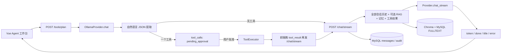

# PrivateAgent 现代化改造审计

审计日期：2026-08-02
审计基线：`main` / `19ea237`，工作区存在用户未提交的桌面端改动
审计范围：Python sidecar、FastAPI API、LLM/工具/记忆/RAG、MySQL/Alembic、Tauri/Rust、Vue/TypeScript、测试与发布脚本

> **历史执行台账（不得当作当前状态）**（2026-08-05 补注，2026-08-06 复核）：本文是 2026-08-02 对变更前基线 `19ea237` 的历史审计快照；文中「当前数据库 `0012 (head)`」「应用主库仍为 `0012`」等描述只反映该审计时间点，属于历史证据。此后应用主库已获授权迁移到 `0020 (head)`（2026-08-05，48 张原表行数零变化，回滚克隆 `personal_assistant_preupgrade_20260805111304` 保留），versioned RAG indexing/retrieval 已生产启用；Agent Runtime、MCP、自动摘要仍保持默认关闭。最新状态以 `docs/agent-runtime.md`、`docs/rag-design.md`、`docs/database-design.md`、`docs/migration-plan.md`、`docs/testing-guide.md` 顶部「当前状态（2026-08-06）」摘要为准。

## 1. 结论先行

PrivateAgent 不是从零开始的普通聊天 Demo。项目已经具备 FastAPI sidecar、SSE 流式聊天、MySQL 业务库、ChromaDB 向量索引、混合检索、长期记忆、工具审批、项目任务状态机、Tauri 桌面壳和较大规模测试资产，现有模块中有相当一部分应保留。

但当前聊天主链路还不是真正的 Agent Runtime：桌面端先调用一次“工具规划”接口，后端要求模型输出自然语言 JSON，再执行至多一个工具，随后由前端把工具结果重新提交给普通聊天接口。系统没有统一 Agent Run、模型原生工具调用、多轮工具循环、上下文预算、运行级超时/取消、Trace ID 或可恢复检查点。README 中“Agent”一词同时指 UI 工作台、固定任务状态机和聊天能力，需要在后续文档中拆清语义。

本轮还发现四项必须先处理的 P0 风险：测试直接连接主数据库并执行清理、无认证 loopback API 配合通配 CORS、桌面凭据明文存储/回传渲染层、RAG 重建索引先删除旧索引再构建新索引。未解决这些风险前，不应继续在当前主库上运行完整后端测试或实施大规模数据库改造。

## 2. 审计边界与工作区状态

- 当前分支为 `main`，跟踪 `origin/main`。
- 审计开始时已有用户修改：`README.md`、`apps/desktop/src/App.vue`、多个 Agent 工作台组件、设计 token、`apps/desktop/src/types.ts` 等；还有多个未跟踪 UI 组件和设计截图。
- 本次 Phase 0 不覆盖或回滚上述修改。后续涉及同一文件时，必须基于当前工作树增量修改并先复核 diff。
- 项目没有 GitHub Actions 工作流、Dockerfile 或 Compose 文件；发布校验由 `scripts/release-check*.bat` 等本地脚本承担。

证据：`git status --short --branch`、`README.md:167-194`、`scripts/run_release_checks.py`。

## 3. 当前技术栈与实际版本

| 层 | 当前实现 | 审计环境实际版本 | 证据 |
|---|---|---:|---|
| Python | `requires-python >=3.12`，uv 管理 | Python 3.13.13，uv 0.11.26 | `pyproject.toml:5-8`、`uv.lock` |
| API | FastAPI + Uvicorn + Pydantic Settings | FastAPI 0.139.0，Uvicorn 0.49.0，Pydantic Settings 2.14.2 | `src/personal_assistant/main_api.py:74-99`、`uv tree --depth 1` |
| 数据访问 | SQLAlchemy 2 async + aiomysql | SQLAlchemy 2.0.51，aiomysql 0.3.2 | `src/personal_assistant/core/db.py:16-31` |
| 迁移 | Alembic | 1.18.5，数据库 head `0012` | `alembic/versions/0012_rag_fulltext_bm25.py:17-34` |
| LLM | LangChain Ollama；远程 OpenAI-compatible/Claude 使用 httpx | langchain-ollama 1.1.0，httpx 0.28.1 | `src/personal_assistant/core/provider.py:79-203` |
| Agent 编排 | 自定义计划/审批状态机；`langgraph` 已安装但未使用 | langgraph 1.2.7 | `src/personal_assistant/core/tasks.py:57-327`、全仓 `StateGraph` 无命中 |
| RAG | ChromaDB + MySQL FULLTEXT/ngram + RRF + embedding rerank | ChromaDB 1.5.9 | `src/personal_assistant/core/hybrid_retrieval.py:1-8` |
| 数据库 | MySQL 8 / InnoDB / utf8mb4 | MySQL 8.0.41，`utf8mb4_unicode_ci` | 只读数据库审计查询 |
| 桌面端 | Tauri 2 + Vue 3 + TypeScript + Vite | Tauri 2.11.5，Vue 3.5.39，TS 5.6.3，Vite 6.4.3 | `apps/desktop/package.json`、`apps/desktop/src-tauri/Cargo.lock` |
| UI | 自建 design tokens / `pa-*` primitive、Phosphor Icons、anime.js | anime.js 4.5.0 | `apps/desktop/src/design/tokens.css`、`components.css` |
| 测试 | pytest、Vitest、Playwright、Cargo check | pytest 9.1.1，Vitest 2.1.9，Playwright 1.61.1 | `pyproject.toml:37-41`、`apps/desktop/package.json` |

依赖声明大多使用无上界范围，例如 `langchain>=0.3` 最终锁定到 1.3.11。`uv.lock` 和 npm/Cargo 锁文件提供了可重复解析，但声明范围允许未来重新锁定时跨越大版本，需在依赖治理阶段收紧并记录兼容矩阵。证据：`pyproject.toml:11-34`、`requirements.txt:1-29`。

## 4. 当前结构与职责

### 4.1 后端与 API

- `src/personal_assistant/main_api.py`：FastAPI 应用、CORS、34 个路由模块、提醒后台循环。
- `src/personal_assistant/api/`：共 197 个路由定义，覆盖会话、聊天、文档、工具、项目、任务、记忆、提醒、诊断、备份、集成等。
- `src/personal_assistant/core/`：领域服务、Repository、Provider、RAG、权限、审批、任务状态机。
- `src/personal_assistant/workers/`：文档导入、OCR、项目扫描后台任务。
- `src/personal_assistant/server_entry.py`：打包 sidecar 入口、自动迁移、父进程 watchdog。

FastAPI 本身已经是合理目标框架，不需要迁移框架或新建平行后端。

### 4.2 数据层

- 47 个 SQLAlchemy ORM 模型集中在 `src/personal_assistant/core/models.py`。
- 12 个 Alembic 迁移，当前数据库处于 `0012 (head)`。
- 当前实际数据库 47 张 InnoDB 表；核心精确行数快照：sessions 927、messages 1078、documents 1117、doc_chunks 358、tool_calls 657、agent_tasks 155、agent_task_steps 212、trusted_paths 364、memory_items 0。
- `doc_chunks.bm25_text` 有 `ft_chunk_bm25` FULLTEXT/ngram 索引。
- 当前数据量明显混有自动化测试记录；不能把这些计数解释为真实用户数据规模。
- 没有 `users`/`owner_id`/`tenant_id`，属于单本机、单隐式用户模型。

证据：`src/personal_assistant/core/models.py:32-1724`、`tests/conftest.py:20-159`、实际只读 information_schema 查询。

### 4.3 桌面端

- `apps/desktop/src/App.vue` 负责启动、会话、聊天流、工具规划/审批、视图切换和全局 overlay。
- `apps/desktop/src/api.ts` 与 `apps/desktop/src/api/*.ts` 是 HTTP/Tauri 边界；组件基本没有散落 URL。
- `WorkspaceShell` 维持 rail/list/main/inspector/statusbar 桌面工作台结构。
- Tauri Rust 层管理配置、sidecar、端口、更新器与生命周期。
- 前端通过 `fetch + ReadableStream` 消费 POST SSE，并使用 AbortController 停止连接。

证据：`apps/desktop/src/App.vue:335-630`、`apps/desktop/src/api.ts:1972-2035`、`apps/desktop/src/api/http.ts:1-38`、`apps/desktop/src-tauri/src/lib.rs:390-575`。

### 4.4 扩展与 MCP

`ExtensionRegistry` 是进程内描述符注册表，声明 kind、risk、permissions、schema 和启用状态；它不是动态插件加载器，也不是 MCP。仓库中没有 MCP Client、Server、transport、tools/resources/prompts discovery 实现。

证据：`src/personal_assistant/core/extensions.py:52-166`；全仓 MCP 关键词扫描无实现命中。

## 5. 当前系统与数据流

关键代码链路：

1. `App.vue:421-473` 先调用 `planTools`。
2. `routes_tools.py:93-97` 调用 `plan_tool_call`。
3. `tools.py:1023-1095` 要求模型输出 JSON，并用文本清理/括号配对解析。
4. `routes_tools.py:100-117` 审批后调用 `ToolExecutor`。
5. `App.vue:566-589` 把工具结果再次传给聊天流。
6. `chat.py:82-133` 读取全部历史，拼接 RAG、记忆和工具结果。
7. `provider.py:167-178` 输出模型 token；`chat.py:173-203` 流式推送并持久化。

### Agent 能力判定

| 能力 | 当前状态 | 判定依据 |
|---|---|---|
| 普通流式聊天 | 已实现 | SSE + Provider stream |
| 模型原生结构化工具调用 | 未实现 | 模型返回文本 JSON，`_parse_plan` 解析 |
| 多轮工具循环 | 未实现 | plan-then-one-tool-then-chat，由前端串联 |
| 规划/执行 | 部分实现 | 固定项目任务状态机，不是 LLM Agent 循环 |
| 工具结果回到模型 | 已实现但由前端重提 | `tool_result` 进入 `/chat/stream` |
| 最大 Agent 步数/工具数 | 未实现 | 聊天无 run loop |
| 单命令超时 | 已实现 | `code_tools.py:347-386` |
| 工具统一超时 | 未实现 | `ToolExecutor` 直接 await handler |
| 用户取消 | 部分实现 | 取消 SSE/任务状态；没有持久化运行取消令牌 |
| 受控重试 | 部分实现 | 项目任务步骤/导入支持，聊天 Agent 不支持 |
| 运行状态/Trace ID | 未实现 | 无 agent_runs/run_steps/trace_id |
| 公开工具过程展示 | 部分实现 | 工具卡与活动流；不是统一 Agent 事件流 |
| 人工审批 | 已实现基础状态机 | pending/running/succeeded 等 |
| 中断恢复 | 部分实现 | 未决工具卡重水合；没有 Agent checkpoint |
| 隐藏推理泄露 | 未发现显式展示 | UI 展示整理状态，不展示 CoT |

## 6. 记忆、上下文与 RAG 现状

### 上下文

`ChatService` 读取并注入会话全部消息，没有独立 ContextBuilder、模型级 token 预算、内容优先级、会话摘要或长历史压缩。只有工具结果 2000 字符和记忆 2000 字符的局部字符截断。证据：`chat.py:82-136`、`memory.py:23-24,108-121`。

### 记忆

当前 `memory_items` 支持 kind、来源、confidence、敏感标记、draft/confirmed/archived、CRUD 和使用事件；聊天只注入 confirmed + enabled + 非敏感项。检索为 MySQL 全量读取后 Python n-gram 评分，没有语义向量、稳定 key、importance、expires_at、冲突解决或用户归属。删除记忆会级联删除事件，代码已明确承认无法保留删除审计。证据：`memory.py:50-77,175-181`、`models.py:688-781`。

### RAG

已有向量、FULLTEXT、RRF、embedding rerank、来源片段和注入防护，这是应保留的核心资产。但解析结果被压成纯文本，统一按 500 字符 + 80 overlap 切分；PDF 页码、Markdown 章节、代码符号、语言、content_hash、embedding_version、token_count 没有完整落到 chunk。证据：`rag.py:23-107,127-257`、`workers/importer.py:51-91`。

## 7. 最严重的十个问题

### P0-1 测试直接使用主数据库并执行破坏性清理

- 位置：`tests/conftest.py:20-32,38-95,98-141`。
- 当前实现：所有 fixture 使用 `cfg.db_url`；session 自动 fixture 会无条件删除全部 `IntegrationImport`、`IntegrationSource`、`UpgradeSmokeRun`，其余测试共享数据且多数不回滚。
- 问题：运行 `pytest` 可能删除真实集成配置/历史并污染 sessions、documents、projects、trusted_paths 等业务表。本次基线已证明主库积累大量测试记录。
- 推荐：强制 `PA_TEST_DB_URL`；数据库名必须匹配明确 test 后缀且不得等于 `PA_DB_URL`；测试启动前 fail closed；每个测试使用事务/命名空间，整库清理仅限专用测试库。
- 是否立即修改：是，继续后端测试前必须完成。
- 修改风险：低到中；主要风险是 CI/本地开发需要新增测试库配置。
- 影响范围：全部后端测试、开发数据安全、发布可信度。
- 验证：主库表计数前后不变；专用测试库全套 pytest 通过；错误配置时测试在收集阶段拒绝运行。

### P0-2 无认证 loopback API + 通配 CORS 可被任意网页调用

- 位置：`main_api.py:88-99`、`routes_files.py:34-56,84-94`、197 个未认证路由。
- 当前实现：允许任意 Origin、无 cookie、无 bearer token；任意调用者可先把绝对路径写入 trusted_paths，再调用文件/项目/设置/删除/执行类接口。
- 问题：loopback 不等于认证。浏览器恶意页面、同机低权限进程或 DNS rebinding 场景可以跨源操纵本地 Agent 数据与权限。
- 推荐：Tauri 每次启动生成随机会话令牌并通过环境变量传给 sidecar；API 强制 `Authorization` 或自定义 nonce；校验 Host/Origin；CORS 仅放行 Tauri origin 与显式 dev origin；高风险审批绑定 run/tool/input hash。
- 是否立即修改：是。
- 修改风险：中；需要同步 Rust、API 和前端请求层。
- 影响范围：所有 API、浏览器预览、sidecar 启动、E2E。
- 验证：无 token 401，错误 Origin 403，Tauri 正常启动，伪造 `/files/authorize` 和工具审批失败。

### P0-3 数据库密码/API Key 明文存储，数据库密码回传渲染层

- 位置：`src-tauri/src/lib.rs:152-213,323-338`、`api/tauri.ts:40-49,85-92`、`core/settings.py:36-61`、`tauri.conf.json:23`。
- 当前实现：数据库 URL 写入 `.env`；`read_config` 解析并返回完整密码到 Vue；远程 Provider key 以 settings TEXT 明文保存；Tauri CSP 为 null。
- 问题：渲染层被注入、日志/诊断错误或本机文件读取都可能扩大凭据泄露面；不满足方案的敏感配置保护要求。
- 推荐：Rust 层用 Windows Credential Manager/系统 keychain 或 DPAPI 保存秘密，数据库只存 secret reference；渲染层只得到 `configured=true`；sidecar 启动时以进程环境或受限 IPC 注入；启用最小 CSP。
- 是否立即修改：是，至少先停止回传密码并加文件 ACL/脱敏。
- 修改风险：中到高；需要迁移已有 `.env` 且必须支持回滚。
- 影响范围：配置向导、sidecar、Provider、备份与诊断。
- 验证：前端 DevTools/API 无原始秘密，配置文件/数据库无明文 key，旧配置迁移与回滚演练通过。

### P0-4 RAG 重试/重建先删旧索引，失败会失去可用知识

- 位置：`workers/importer.py:198-220`。
- 当前实现：先删除 Chroma 向量和 MySQL chunks 并提交，再解析/embedding/写新索引。
- 问题：解析、Ollama、Chroma 或 MySQL 任一失败都会让原本可用的文档变为无索引状态；MySQL 与 Chroma 也没有共同事务。
- 推荐：版本化 staging chunks/vector；新版本完整验证后原子切换 active_version，再异步清理旧版本；失败保留旧索引并记录 index job。
- 是否立即修改：是，在开放批量 reindex 前。
- 修改风险：中高；涉及迁移和最终一致性。
- 影响范围：文档重试、重建索引、删除、备份恢复。
- 验证：在 parse/embed/vector/write 各阶段注入失败，旧检索仍可用；补偿任务可重入。

### P1-1 聊天主链路没有统一 Agent Runtime

- 位置：`App.vue:421-589`、`routes_tools.py:93-117`、`chat.py:69-203`。
- 当前实现：前端串联 plan → 单工具审批/执行 → chat；固定 AgentTaskService 是另一套独立状态机。
- 问题：没有 run/step 生命周期、多工具循环、统一终止条件、运行超时、持久化取消、验证重试或 trace；前端承担了后端 Runtime 职责。
- 推荐：后端建立唯一 AgentRuntime；`/chat/stream` 作为兼容适配层；AgentTaskService 逐步接入同一执行内核而不是再建第三套框架。
- 是否立即修改：是，Phase 1 核心。
- 修改风险：高，需兼容现有会话和工具卡。
- 影响范围：聊天、工具、任务、活动流、前端状态。
- 验证：直接回答、单工具、多工具、审批暂停/恢复、取消、超时、最大步数集成测试。

### P1-2 工具调用依赖文本 JSON，Schema 仅展示未强制验证

- 位置：`tools.py:62-96,971-1018,1023-1140`。
- 当前实现：`input_schema`/`output_schema` 是普通 dict；模型输出经 markdown 清理和括号扫描解析；Executor 不验证输入/输出 schema，也没有统一 per-tool timeout/cancel。
- 问题：违反模型原生结构化工具调用要求；参数漂移、返回值异常和超长工具执行无法在统一边界阻断。
- 推荐：Pydantic ToolSpec/ToolCall/ToolResult；Provider 返回原生 tool calls；Executor 强制参数/结果校验、风险/权限/超时/取消/脱敏；保留现有 handler 作为 builtin adapter。
- 是否立即修改：是，随 Phase 1/2 渐进替换。
- 修改风险：中。
- 影响范围：21 个现有工具、审批 UI、AgentTask。
- 验证：非法参数、非法输出、未知工具、权限不足、超时、取消和并发审批测试。

### P1-3 没有 ContextBuilder、预算和长会话压缩

- 位置：`chat.py:82-136`、`history.py:63`。
- 当前实现：每轮加载全部历史；RAG、记忆和工具结果按固定字符截断拼接。
- 问题：长会话会超过模型窗口或挤掉关键安全/任务信息，且无法观察选取依据；字符数/4 只是审计估算，不是预算器。
- 推荐：独立 ContextBuilder，按模型能力和内容类型预算；最近消息、摘要、任务状态、工具/RAG/记忆分别裁剪、去重并记录 selection trace；原始消息保留。
- 是否立即修改：是，Phase 3；Phase 1 先定义上下文接口。
- 修改风险：中，可能改变回答质量。
- 影响范围：聊天、远程隐私范围、token/成本、记忆/RAG。
- 验证：预算边界、否定/数字保留、长工具输出、去重、来源保留和降级测试。

### P1-4 Provider 边界不完整且调用散落

- 位置：`provider.py:120-460`、`routes_tools.py:67-74`、`files.py:46-57`、`workers/importer.py:56-63`。
- 当前实现：多个业务模块直接构造 `OllamaProvider`；工具规划忽略 ProviderRouter；OpenAI/Claude 的 `chat_stream` 实际为一次性非流式；没有统一 capability、tool calls、structured output、usage/cost、request trace 或受控重试。OpenAI-compatible base URL 可由设置直接控制。
- 问题：业务逻辑与 Provider 细节耦合；远程/本地行为不一致；自定义 URL 缺少 SSRF/协议策略。
- 推荐：单一 ModelGateway + capability descriptor + typed response/event；业务代码只依赖协议；URL 进行 scheme/host/redirect 策略校验；第一版完整支持一个 Provider。
- 是否立即修改：是，Phase 1。
- 修改风险：中高。
- 影响范围：聊天、标题、工具规划、摘要、学习、RAG embedding/rerank。
- 验证：Provider contract、真实流式、usage、错误映射、超时/重试、URL 安全测试。

### P1-5 数据模型缺少 principal 隔离、Agent Run 与不可变审计

- 位置：`models.py:32-1724`、`server_entry.py:105-118`。
- 当前实现：单隐式用户；没有 users/agents/agent_runs/run_steps/tool_approvals/audit_logs；打包启动迁移失败后继续启动。
- 问题：无法程序化保证用户/知识库/记忆隔离，也无法查询完整 Agent trace；schema 旧于代码时仍对外服务会产生不确定失败。
- 推荐：新增本地 principal 并逐表回填 owner_id；新增 run/step/approval 记录；审计追加写；迁移前备份和 schema compatibility gate，失败进入只读诊断模式。
- 是否立即修改：run/step 是 Phase 1；principal 和审计为 Phase 2/数据库阶段；迁移 fail-open 应尽快修复。
- 修改风险：高，必须 additive migration + 校验 + 回滚。
- 影响范围：全部持久化数据与 API。
- 验证：跨 principal 访问、旧数据回填计数、迁移升级/降级、只读故障模式测试。

### P1-6 RAG 切块与元数据不足以支撑可靠引用

- 位置：`rag.py:28-107,127-140`、`workers/importer.py:68-90`、`models.py:76-169`。
- 当前实现：所有类型固定字符切分；PDF 页边界丢失；没有代码解析；token_count 写 null；引用只有文档名/ordinal/heading/chunk_id。
- 问题：语义边界被破坏，PDF 无法给页码，代码无法按符号召回，embedding 版本切换难追踪。
- 推荐：typed ParsedBlock/Chunk；Markdown 标题、PDF 页、代码 symbol、文本段落策略；保存 page/section/language/hash/token/model/version/metadata；引用只从持久化字段生成。
- 是否立即修改：Phase 4 前必须完成。
- 修改风险：中高，需要版本化重建，不能覆盖旧索引。
- 影响范围：导入、检索、引用、删除、备份。
- 验证：各文件类型切块快照、页码/章节引用、幂等重建、旧索引保留测试。

## 8. 其他能力缺口

- MCP：完全未实现；应在 Function Tool 稳定后增加 client manager，不把内部函数全部 MCP 化。
- 语义记忆：未实现；现有结构化记忆可保留并扩展。
- 会话/任务摘要：未实现。
- 成本统计：只有字符估算，没有 Provider usage 或价格版本。
- 结构化 JSON 日志：structlog 最终仍经普通文本 formatter 输出；没有 run trace context 和 AUDIT sink。证据：`logging_setup.py:24-55`。
- Docker/Compose/CI：未提供。
- Python lint/type check：项目未配置 Ruff/Mypy/Pyright；前端已有 vue-tsc。
- 依赖治理：`langgraph` 和顶层 `langchain` 当前无直接运行代码使用，应在依赖审查确认后移除，直到出现明确需求。

## 9. 技术处理清单

### 保留

- FastAPI + Uvicorn sidecar 与 Tauri 端口协商。
- MySQL 8、SQLAlchemy async、Alembic 迁移历史与现有 47 张表。
- Vue 3/Tauri 工作台、自建 token/primitive、集中 API 边界。
- POST SSE 与 AbortController 交互模式。
- ChromaStore 的“向量只存最小元数据、原文回查 MySQL”原则。
- MySQL FULLTEXT/ngram、HybridRetriever、RRF、embedding rerank 与 RAG 注入防护。
- 路径 resolve 防穿越、`create_subprocess_exec` 无 shell、白名单命令与输出截断。
- Approval 状态机的原子 claim、现有工具 handler、活动流和任务证据。
- Repository/Service/Route 分层、备份/诊断/完整性修复资产。
- 现有测试用例本身；先修复数据库隔离与过期 E2E 选择器。

### 封装

- `provider.py` 封装成 ModelGateway/Provider contract，保留现有 Ollama/远程实现作为 adapter。
- `core/tools.py` 的 handler 封装到 typed ToolSpec/Executor，不重写业务函数。
- `ChatService` 封装为 AgentRuntime 兼容入口。
- `AgentTaskService` 接入统一 Runtime 的 run/step/approval，不并行维护另一执行循环。
- `MemoryService` 分为结构化记忆仓储与未来语义检索 adapter。
- `RagService`/HybridRetriever/ChromaStore 放在统一 Retriever/Indexer 边界后。
- 大型 `api.ts` 按领域渐进拆分，保持组件不直接 fetch。

### 替换

- 文本 JSON 工具规划 → 模型原生 tool calls / structured output。
- 全量历史拼接 → ContextBuilder + budget + summary。
- 固定字符切块 → 文件类型感知切块。
- 先删旧索引重建 → 版本化 staging/switch/cleanup。
- 通配 CORS + 无认证 → 每启动令牌 + Origin/Host 策略。
- 明文秘密与渲染层回传 → 系统凭据存储 + secret reference。
- 主库测试 → 强制专用测试数据库。
- 迁移失败继续服务 → schema gate/只读诊断模式。

### 删除候选

- 未使用的 `langgraph` 直接依赖；只有在 Phase 6 评估门槛满足时再引入。
- 未被直接使用的顶层 `langchain` meta 包；保留实际使用的官方 adapter 依赖。
- Tauri 示例命令 `greet`（确认无调用后删除）。
- 后续 Runtime 稳定后删除 `_PLAN_PROMPT`、`_parse_plan` 和前端 plan-then-reply 编排。

删除项都必须先用静态调用扫描、测试和运行验证确认，不能在 Phase 0 直接移除。

## 10. 基线验证结果

| 验证 | 结果 | 说明 |
|---|---|---|
| API 启动 | 通过 | 临时端口 8765；`/`、`/health` 返回 200；进程随后退出 |
| `/health` | 部分健康 | API/MySQL/Chroma 正常；Ollama 当前未运行 |
| Alembic | 通过 | `0012 (head)` |
| Rust | 通过 | `cargo check --locked`，23.90s |
| Vue 类型检查/生产构建 | 通过 | `npm run build`，Vite 构建成功 |
| Vitest | 通过 | 7 files / 24 tests |
| pytest 首轮 | 未通过 | 219 passed、1 failed、53 errors；53 个 errors 为沙箱临时目录权限，真实失败为 BM25 测试数据隔离 |
| pytest 重跑 | 已停止 | 确认测试直连主库并有破坏性清理后，不再继续全套测试 |
| Playwright | 未通过 | 3 个 animation 测试等待旧 `.nav-item` 文案“对话”各超时 60s；当前未提交 UI 已改为“Agent”，总命令 184s 超时 |

Playwright 证据：`apps/desktop/e2e/animation.spec.ts:258,287,312` 与 `apps/desktop/test-results/*/error-context.md`。该失败属于当前工作树与测试选择器不同步，不能据此否定生产构建通过。

## 11. Phase 0 出口判定

项目结构、运行方式、关键依赖、核心数据流、数据库、最严重风险和处理清单已完成审计。下一步按照 `docs/migration-plan.md`：

1. 先建立测试数据库硬隔离和 API 安全门槛。
2. 在不改变现有 `/chat/stream` 行为的前提下定义 Model/Run/Event/Tool typed contracts。
3. 以兼容适配器方式实施最小 AgentRuntime 切片。

在专用测试库可用前，不运行会写入当前 `personal_assistant` 数据库的全套测试。

## 12. 首轮执行结果（2026-08-02）

### 12.1 数据与测试安全

- 新增 `personal_assistant.testing.resolve_test_database_url`，测试默认派生到 `personal_assistant_test`，并拒绝与应用库相同、非 MySQL 或没有独立 `test` 名称段的目标。
- `tests/conftest.py` 在导入全局 engine 和 FastAPI 应用前切换到验证后的测试 URL，覆盖测试 fixture、后台 worker 和直接读取 `cfg.db_url` 的既有测试。
- 新增 `scripts/prepare_test_database.py --yes`，只创建并迁移经过守卫的测试库，输出不包含凭据；`--verify-reversible` 可在该专用库执行一次降级/再升级验证。当前测试库后续已升级到 `0020 (head)`，应用库保持 `0012`。
- 应用库关键表在完整测试前后逐项不变：sessions 927、messages 1078、documents 1117、doc_chunks 358、tool_calls 657、agent_tasks 155、agent_task_steps 212、memory_items 0、trusted_paths 364、integration_sources 0、integration_imports 0。

### 12.2 Phase 1 已落地的隔离切片

- 新增 `personal_assistant.agents`：类型化消息、工具调用、用量、run/step/event、限制和取消契约，以及真正可执行的有界 `AgentRuntime`。
- Runtime 已支持无工具回答、单/多工具循环、工具错误回传模型、未注册工具拒绝、协议错配、非 JSON 结果、取消、总超时、最大步骤和最大工具调用数。
- 新增 `personal_assistant.llm`：`ModelGateway`、能力声明、请求超时、有限重试、错误归一化，以及 Ollama Chat、OpenAI Chat Completions-compatible、Claude Messages 的原生工具调用适配器。
- OpenAI-compatible 远程基础 URL 默认只允许 HTTPS，并拒绝本地、私网、链路本地、保留地址和 URL 内嵌凭据；私有开发端点必须由调用方同时显式放开 HTTP 和私网策略。
- `ProviderRouter.model_gateway()` 已提供兼容桥，但现有 `chat_provider()` 和 `/chat/stream` 尚未切换，因此这一切片不会改变当前用户聊天行为。
- 新增 `0013_agent_runtime_persistence`：`agent_runs` 保存一次执行的状态、限制、用量、trace 和终态，`run_steps` 保存有序模型/工具步骤，`agent_run_events` 保存可重放公开事件。旧 `agent_tasks` 和聊天表未改名、未回填、未接管。
- `AgentRunRepository` 用 run 行锁绑定单调事件序号，并在一次事务内写事件和投影；相同事件重放幂等，冲突或跳号失败。`PersistentAgentRunner` 在首次模型调用前创建 run，并逐事件提交，进程中断后已完成的证据不会只存在内存。

### 12.3 前端基线修复

- 导航 E2E 改用稳定 `data-testid`，不再依赖“对话/Agent”等可见文案和默认首屏假设。
- chat animation 同时支持旧消息 DOM 和新的 activity timeline DOM。
- ToolApprovalCard 暴露 idle/executing 动画状态；TaskComposer 暴露稳定输入与提交测试钩子。
- 修复卡片卸载时只移除监听器、却残留 anime inline `transform/opacity` 的资源清理缺陷。

### 12.4 当前验证结果

| 验证 | 结果 |
|---|---|
| Python 全套 | 403 passed，159.42s，专用测试库；Windows named-pipe 子进程场景在沙箱外验收 |
| Runtime + Gateway 合同 | 25 passed，含 MockTransport 原生工具两轮闭环和 event sink 失败传播 |
| Run 持久化 | 3 passed，含完整投影、跨会话中断态和事件序号幂等/冲突 |
| API 安全 | 8 cases：Bearer、Host、Origin、CORS 预检与配置 fail-closed；sidecar 迁移失败拒绝启动另有 1 case |
| Vue/Vitest | 9 files / 28 tests passed，含启动 token 请求注入和 MCP 设置面板 |
| Playwright | 13 passed，22.2s |
| Vue/TypeScript 生产构建 | passed，1731 modules transformed |
| Rust | 6 tests passed；`cargo check --locked` passed |
| Alembic | 测试库 `0020 (head)`；新增迁移均完成真实 downgrade/upgrade 演练；应用库按计划保持 `0012` |

### 12.5 尚未解除的高优先级风险

P0-2 本地 API 认证/CORS 与 P0-3 Windows 凭据/CSP 已在后续隔离切片完成；P0-4 RAG 版本化重建已实现默认关闭的迁移链，但尚未完成既有文档迁移、质量门禁与默认启用。Phase 1 Runtime 已具备隔离的持久化执行器，但尚未通过 API 完整接管聊天。这些项目必须继续按迁移计划分阶段完成，不能把当前“隔离切片全绿”解释为整体改造完成。

### 12.6 P0 本地 API 安全门槛

- P0-2 本地 API 认证/CORS 已实施：打包态由 Tauri 用 OS 随机源生成 256-bit 单次启动 token，经 `PA_API_TOKEN` 注入 sidecar，并通过内存连接 DTO 交给当前 WebView；token 不写配置文件、不写日志。
- FastAPI 对所有非 CORS 预检 HTTP/SSE 请求执行常量时间 Bearer 比较，同时拒绝非 loopback bind、通配 Host/Origin、恶意 `Host` 和不在白名单的 `Origin`。CORS 只开放确定的 Vite/Tauri 来源、方法与请求头。
- 前端现有 175 个请求入口统一经过 `apiFetch`，包括旧 `/chat/stream` 的 fetch/SSE 读取；显式 Authorization 不会被覆盖。开发手动后端必须配置 `PA_API_TOKEN` + `VITE_API_TOKEN`，或显式设置 `PA_API_AUTH_ENABLED=false` 承担开发风险。
- 打包入口的 schema 迁移失败不再继续启动可写 API；日志只保留异常类型。发布 smoke/启动测量脚本已同步发送临时 token。
- P0-3 的 Windows 路径已完成：Tauri CSP 已启用，数据库与 Provider 凭据使用系统凭据存储且不进入 renderer/HTTP/备份；macOS/Linux 尚未完成原生凭据输入实机验收。P0-4 已具备默认关闭的安全重建实现；在固定语料评测和既有文档迁移完成前不会默认开启。

### 12.7 默认关闭的 AgentRun API

- `PA_AGENT_RUNS_API_ENABLED` 默认 false；关闭时 `/agent-runs` 返回 404，不暴露半成品入口。
- 开启后支持后台创建一次无工具运行、读取 run/step/usage/trace、按事件序号重放，以及持久化取消意图并取消当前进程中的挂起模型调用。创建在启动任务前先提交 run，因此即使进程随后异常退出也留下可诊断记录。
- API 使用动态 ProviderRouter/ModelGateway，但不写入旧 `messages`，不启用工具、RAG 或记忆，不改变 `/chat/stream`。这避免把聊天、上下文和权限迁移揉进同一个开关。
- 新增 3 条 API 集成场景：默认隐藏、创建到完成及断点事件重放、挂起模型主动取消与重复取消冲突。跨进程 lease/reconciler、实时 SSE 长连接和旧聊天兼容映射仍待实现。

### 12.8 默认关闭的旧聊天兼容映射

- `PA_CHAT_AGENT_RUNTIME_ENABLED` 默认 false。开启时仅无 RAG、无 `tool_result` 的普通聊天创建持久化 AgentRun；其他请求保留旧 ChatService，避免工具、记忆和检索语义在同一步骤改变。
- 兼容 SSE 首先公开 `run_id`，随后把非流式 ModelGateway 的最终响应映射为单个旧 `token`、`done` 和首轮 `title`；不把一次性响应伪装成 provider token stream。
- 新路径继续写旧 `messages`，现有 Vue 无需切换数据源；前端将 `run_id` 保存到当前助手消息的内存投影，后续可据此实现刷新恢复。
- 兼容与回退测试覆盖普通聊天进入新 Runtime，以及开关开启时 RAG 仍停留在旧路径。ContextBuilder 已先接入原生 `/agent-runs` 开发入口；旧聊天兼容映射的 RAG/记忆接管、实时 run SSE、工具审批闭环和跨进程恢复仍待后续切片。
- 后续切片已缩小上述 RAG 边界：聊天 Runtime、RAG 工具、输出验证三项默认关闭开关同时开启时，`knowledge_base=true` 进入同一 durable Runtime；结构化答案验证通过后才投影为旧 SSE 的 answer/sources，来源展示字段来自复核过大小与 SHA 的工具结果。任一开关缺失或请求带旧 `tool_result` 时继续精确回退 ChatService，因此默认路径不变；记忆接管仍未迁移。

### 12.9 Phase 2 首批统一工具契约

- 新增版本化 `ToolSpec`、`VersionedToolRegistry` 和 `ValidatedToolDispatcher`。统一入口使用 JSON Schema Draft 2020-12 校验 schema 本身及调用输入/输出，并拒绝远程 `$ref`；校验错误不回显参数值。
- 执行器采用默认拒绝的 capability policy，区分 `safe`、`confirm`、`restricted`；capability 已授予的 `safe` 工具可直接暴露，`confirm` 只有在审批 requester 可用时才暴露并返回 `approval_required`，`restricted` 默认拒绝。
- 工具调用统一受输入/输出字节上限、超时、取消发布、JSON 可序列化、敏感键/常见凭据文本脱敏和结构化 `error_code` 约束。幂等工具的调用键绑定工具名、版本和规范化参数；当前仅在单次 dispatcher 生命周期内复用成功结果。
- 首批只包装 `search_files`、`grep_code`、`get_git_status`、`get_git_diff`，并收紧其输入/输出 schema；后续收口切片再迁入 `read_file`、`read_code_file` 与纯预览 `propose_patch`。两个本地读取工具固定为 `confirm`，沿用 durable approval/checkpoint/execution；`propose_patch` 为 `safe`，diff 有 200,000 字符硬上限。文件写入、知识库导入和命令执行仍没有迁移到 Runtime。
- `PA_AGENT_RUN_READ_ONLY_TOOLS_ENABLED` 独立且默认 false。与聊天 Runtime 开关同时开启时，旧 `/tools/plan` 会从候选中排除这七个 Runtime-owned 工具，且对模型强行返回的同名选择失败关闭；尚未迁移的旧工具与单开关兼容行为不变。
- 已验证模型原生 tool call 经 dispatcher、持久化 tool step/event、工具消息回传和第二次模型调用完成闭环。已知边界：`grep_code` 的线程工作及旧 git helper 尚非完全协作式取消，因此 metadata 明确标记 `supports_cancellation=false`；在进程清理强化前不扩大默认启用范围。

### 12.10 Phase 2 参数绑定审批底座

- 新增 additive `0014_tool_approvals`，不改写旧 `tool_calls`。每条审批绑定 `run_id`、`step_id`、provider `tool_call_id`、工具名/版本、规范化参数及 SHA-256、风险等级、能力集合和过期时间；同一 run/call 只能绑定一次。
- 审批令牌由 256-bit CSPRNG 生成，数据库只存 SHA-256；消费时使用常量时间比较。批准后的工具名、版本、风险、能力或参数任一变化都会拒绝执行，成功消费后重放也被拒绝。
- `ToolApprovalRepository` 以行锁维护 `pending → approved → consumed`、`pending → rejected`，以及活动审批到 `expired/cancelled` 的状态。并发消费测试证明同一批准只有一个调用能获得执行 claim。
- 测试库完成真实 `0014 → 0013 → 0014` 往返；首次降级演练发现 MySQL 外键依赖 `step_id` 索引，降级已修正为直接删除新增表，由 MySQL 原子清理索引和约束。
- 当前仍是安全底座而非已开放功能：API 不会把批准令牌暴露给 Vue。必须先完成可恢复 checkpoint、后端进程内唤醒和跨进程恢复，再把 `confirm` 工具加入模型可见清单。
- Runtime 现已具备显式 `waiting_approval` run/step 状态和 `tool.approval_required` 事件。SQL requester 会在 dispatcher 返回等待结果前，将审批绑定到已提交的 running tool step；Runtime 随后安全结束当前后台任务，不生成 `run.completed/run.failed`，也不把等待审批当作普通工具错误继续交给模型。
- 新增 additive `0015_agent_run_checkpoints`。`tool.approval_required` 与 checkpoint 在同一事务提交；checkpoint v1 保存暂停时的 conversation、尚未处理的 tool calls、事件序号、工具调用计数和累计 usage。相同事件/相同 checkpoint 可幂等重放，冲突 continuation state 会失败关闭。
- 后端可用一次性批准 token 消费精确审批，从 checkpoint 恢复原 waiting tool step，写入 `tool.approval_resolved`，完成剩余工具/模型循环，并在终态事务中删除 checkpoint。人工等待由审批 expiry 管理；每个活动恢复段继续受 Runtime wall-time 限制。
- 本小节记录的是审批底座刚落地时的历史边界；后续切片已开放 approve/reject、coordinator 唤醒、checkpoint 恢复与一次性 token，并把两个本地读取工具按 `confirm` 接入默认关闭的 tool bundle。

### 12.11 Phase 2 持久化工具执行 claim 与审计

- 新增 additive `0016_agent_tool_executions`，记录 run/step/call、工具名和版本、规范化参数及哈希、风险与能力、审批关联、执行状态、attempt、租约、脱敏输出哈希/字节数和有界错误。claim token 使用 CSPRNG，数据库只保存 SHA-256。
- claim 在 run 行锁下完成首次查询/插入，唯一约束同时覆盖 `(run_id, tool_call_id)` 和幂等执行键，避免双 worker 首次执行竞态。活动租约返回 `in_progress`；过期的幂等调用可用新 token 续租，非幂等不确定状态写为 `unknown` 并拒绝自动重试。
- `ValidatedToolDispatcher` 现在先完成 schema、capability 和审批校验，再获取持久化 claim；只有脱敏、JSON 校验和字节上限均通过且成功结果已提交后，结果才返回 Runtime。超时、执行器异常、输出非法和协作式取消均写入终态审计；缓存回放会复核输出大小和 SHA-256。
- `confirm` 执行必须关联状态为 `consumed` 且 run/call/tool/version/参数/风险/能力完全匹配的审批。同一次审批已经消费后，崩溃恢复可在不重放原始 token 的前提下重新验证这一不可变绑定；执行表随后返回已提交结果、活动租约或非幂等未知态。
- 默认关闭的 AgentRun 只读工具 bundle 已接入 execution store；普通聊天和旧工具 API 不变。专用测试库完成 `0016 → 0015 → 0016`，并覆盖并发首次 claim、租约过期、错误 token、审批精确绑定、脱敏持久化、终态错误、级联清理，以及“执行成功但 Runtime 事件尚未提交”的恢复回放。
- 当前边界：审批 HTTP API、reject 语义、coordinator 唤醒与跨进程 reconciler 仍未开放；因此真实模型仍看不到 `confirm` 工具。`agent_tool_executions` 是可恢复执行事实，不替代后续不可变安全审计日志。

### 12.12 Phase 3 首批 ContextBuilder

- 新增 provider-neutral `ContextBuilder`，系统策略、当前请求和未完成工具调用/结果属于不可丢弃区段；最近历史、确认记忆、摘要和 RAG 各有独立预算，并共同受硬总预算约束。必要上下文本身超限时失败关闭，不静默删除安全策略或当前请求。
- 历史只接受已完成的 user/assistant 纯文本，按最新优先选择后恢复时间顺序；system 历史和可能产生孤立调用的 tool-call 历史会被拒绝。记忆/RAG/摘要按分数选择，单片段可有界截断，所有 included/dropped/truncated/sensitive 原因形成 selection trace。
- 记忆、摘要和 RAG 以 JSON 数据 envelope 注入；统一系统策略明确这些内容不能改变权限、审批、工具参数或泄露边界。标记为 sensitive 的 fragment 无论预算是否充足都不会进入模型消息；RAG 明确标记 `UNTRUSTED_EXTERNAL_DATA`。
- `PA_AGENT_CONTEXT_BUILDER_ENABLED` 默认 false，当前只接管同样默认关闭的原生 `/agent-runs`。SQL source 最多读取最近 200 条会话消息，只取已确认、启用、非敏感记忆，并按请求开关读取 RAG；旧 `/chat/stream` 行为不变。
- Runtime 新增 `context.prepared` 公开事件。事件仅保存估算 token、区段计数、选择 ID/理由和截断标记，不保存历史、记忆或 RAG 正文；repository 对必要计数和类型进行投影校验。
- 当前边界：可追溯 conversation summaries、记忆版本/冲突/软删除以及默认关闭的版本化 RAG 安全重建已由后续切片实现；provider 精确 tokenizer 与旧聊天上下文接管仍未完成。

### 12.13 Phase 3 可追溯摘要与记忆事实模型

- 新增 additive `0017_context_memory_facts`。`memory_items` 获得稳定键、单调版本、内容 SHA-256、重要度、有效期、敏感级别、确认时间和软删除时间；`memory_revisions` 保存每个逻辑版本的不可变完整快照，且刻意不设外键，以便未来物理清理当前投影时仍保留版本证据。
- `MemoryRepository` 的创建、编辑、确认和软删除在同一事务写当前快照与 revision。默认列表/详情不返回 tombstone；上下文检索同时排除删除、过期、`sensitive/restricted` 和旧布尔敏感标记。旧 DELETE API 保持 204/404 契约，但语义已变为保留审计的软删除。
- `memory_conflicts` 对记忆 ID 对排序并唯一约束。冲突登记幂等，不能自冲突，也不会用“最后一次写入”静默覆盖；只有显式 resolution 才进入 resolved。API 已支持列出、登记和解决冲突。
- `conversation_summaries` 绑定同一 session 的精确首尾消息、消息数和源内容 SHA-256，并记录 prompt/provider/model/token、summary version、敏感标记和状态。相同来源与正文幂等；更正生成新版本；重叠的 active 摘要会被 supersede。
- ContextBuilder SQL source 优先装载 active summary，并从最近历史中剔除已被摘要覆盖的消息范围。摘要以 model-generated data envelope 注入，保留 `summary_id/source_sha256/range` provenance；敏感摘要继续由统一敏感过滤拒绝进入模型。
- `0017` 首次在测试库升级时，MySQL 把旧列名 `sensitive` 解析为关键字，且非事务 DDL 已留下九个新增列。修复后先通过 `information_schema` 精确确认只存在这九列、版本仍为 `0016`，再仅在受守卫的 `personal_assistant_test` 删除这些部分列；随后完成真实 `0016 → 0017 → 0016 → 0017` 往返。应用主库全过程未迁移。
- 测试清理适配软删除：业务测试仍验证 tombstone/revision，fixture 仅按本用例创建的确切 ID 物理清除测试数据。Python 3.13 在 Windows 沙箱中以 `0700` 创建 pytest 临时目录会产生 ACL 冲突，因此测试层使用工作区内随机、边界校验的临时叶子；四个需要异步 named pipe 的 Git/命令用例在沙箱外复核 `6 passed`，全量最终为 `372 passed`。
- 当前边界：摘要已有事实仓储与上下文消费，但尚未加入自动摘要 worker、生成阈值和失败重试；记忆 revision 尚未建立恢复/合并 UI。版本化 RAG 的旁路构建、校验、active version 原子切换与回滚已由下一切片完成。

### 12.14 Phase 4 版本化 RAG 安全重建

- 新增 additive `0018_versioned_rag_indexes`，完全保留 legacy `doc_chunks`。`document_index_versions` 记录 source/chunker/embedding、维度、chunk/vector 计数、manifest、状态与失败事实；`document_index_chunks` 保存每版不可变正文、内容哈希和独立 FULLTEXT/ngram 索引；`document_index_heads` 只保存每个文档的 active/previous 指针与单调 lock version。
- 新 Chroma collection `document_index_chunks_v2` 使用 `v2:<chunk_id>` ID，并在 metadata 绑定 `doc_id/index_version_id/chunk_id`。staging 只 upsert 目标版本；在线查询必须携带数据库 active version 集合，因此 failed/retired/orphan 向量不会被召回。
- 构建顺序固定为：解析与 embedding → 创建 version → 写不可变 MySQL chunks → 写版本隔离向量 → 精确比较 DB/Chroma chunk ID → 重算每片内容哈希和整体 manifest → 标记 validated → 在单一 MySQL 事务锁定 document/version/head 并切换 active。旧 active 只在最后一步变为 retired，任一前序失败都不会改变 head。
- 回滚不是盲目交换指针：切换前重新检查 chunk/vector 计数、实际向量 ID、内容哈希和 manifest。目标版本损坏时返回冲突并保持当前 active。inactive 清理先在 head 行锁下把版本 claim 为 `deleting`，使其无法再激活，然后清理向量并最终删除 DB 行；向量删除失败会保留 durable claim 供启动恢复，active 版本不可删除。
- `PA_VERSIONED_RAG_INDEXING_ENABLED` 与 `PA_VERSIONED_RAG_RETRIEVAL_ENABLED` 独立且默认 false。只开 indexing 时 reindex 旁路构建新版本、legacy 在线索引仍可查询；打开 retrieval 后，有 active head 的文档只读新表/新 collection，无 head 文档继续 legacy fallback，可逐文档迁移且不重复召回 stale legacy chunks。
- 新索引来源进入 RAG/ContextBuilder 时携带 `index_version_id`；RRF 身份为 `(index_version_id|legacy, chunk_id)`，避免两张自增表出现相同整数 ID 时错误融合。版本化引用使用独立详情 API。
- 进程崩溃后，`building` 版本可从持久化 chunks 重新 embedding/upsert/validate/activate；`validated` 版本直接复核向量和 manifest 后激活。启动 reconciler 仅在 indexing 开关开启时运行；失败版本必须经显式 retry API 重开，不会无限自动重试。已有 ready 文档重建失败时保持 ready 投影和旧 active 可用。
- 管理 API 已提供版本列表、active/previous head、版本化 chunk 详情、校验后回滚和 failed version 后台重试。删除文档同时清理 legacy 与全部 versioned vectors，再由 MySQL 级联删除版本事实。
- Retention reconciler 在启动恢复后续做中断的 `deleting` claim，并按默认 14 天窗口清理 retired；每文档至少保留一个 retired 回滚版本，active/previous 永远受保护。并发构建还增加单调版本保护：较早启动、较晚完成的旧 build 不能覆盖较新的 active。
- 新增通用 RAG rollout gate，统一计算 Recall@K、MRR、引用正确率、空召回率、P50/P95，并输出精确失败指标。`scripts/evaluate_rag.py` 对固定 JSON case set 和现有文档执行只读评测，失败返回非零退出码；`scripts/migrate_versioned_rag.py` 默认 dry-run，只有 `--yes` 才按 ID/limit 顺序旁路迁移，跳过缺源文件且不会自动开启 retrieval。
- 专用测试库完成真实 `0017 → 0018 → 0017 → 0018`。测试覆盖两版并存、失败注入不换 head、逐文档 legacy fallback、哈希篡改、向量损坏回滚拒绝、active 清理拒绝、崩溃/删除恢复、保留窗口、并发旧 build、worker 非破坏分支、ready 状态保留、评测指标及 API；全量最终 `387 passed`。应用主库复核仍为 `0012`，`sessions 927 / documents 1117 / memory_items 0 / agent_tasks 155`。
- 当前边界：两个开关仍默认关闭；尚未为实际资料填充并执行固定 benchmark case set，也未在应用主库迁移 1117 个既有文档。完成真实质量基线、备份和小批迁移前，legacy 破坏性分支仍作为回退代码存在，不能宣布 P0-4 已在生产默认解除。

### 12.15 P0-3 Windows 凭据边界与 CSP

- Tauri `ConfigData` 删除数据库密码字段，只返回 `db_password_configured`。桌面配置文件不再写 `PA_DB_URL`，只保存数据库主机、端口、用户、库名和固定 `PA_DB_SECRET_REF=secret://os-keyring/database/password`；配置字段拒绝换行注入，数据库 URL 只在 Rust 内存中按组件转义后组装。
- 数据库密码、OpenAI key 与 Claude key 使用固定 service/account 写入 Windows Credential Manager。Vue 不再渲染 password input，也不把 secret 作为 Tauri invoke 参数；用户点击配置按钮后由 `CredUIPromptForCredentialsW` 原生窗口收集，Rust 写入系统凭据库并把内存缓冲区零化，返回值只有 configured/cancelled 状态。
- 打包 sidecar 启动时，Rust 从系统凭据库读取秘密，只通过当前子进程环境注入 `PA_DB_URL`、`PA_OPENAI_API_KEY` 和 `PA_CLAUDE_API_KEY`。后端 settings 仅接受两个固定 Provider secret reference，拒绝 HTTP 写入明文或任意引用；读取接口只返回 configured/available/storage。
- 兼容迁移仅在打包启动路径触发：旧用户 `.env` 的数据库 URL 可被解析、迁入系统凭据库，并在成功后改写为非敏感配置；凭据库写入或配置改写失败会拒绝启动，不静默回退明文。项目根 `.env` 继续作为明确的源码开发配置，Tauri debug 配置隔离在 `.run/desktop-config`，不会改写开发者文件。
- 备份导出把旧 Provider 明文值置空并声明 `os_credentials=false`；恢复无条件跳过 Provider secret 行，旧备份不能重新引入明文 key。数据库密码原本不属于数据库备份，系统凭据也不会进入备份包。
- CSP 从 `null` 改为最小本地策略：脚本只允许 self，object 禁止，frame ancestor 禁止；连接只开放 Tauri IPC、Vite 开发端口和动态 loopback sidecar，不开放远程 Provider 域名。Provider 网络请求仍由 sidecar 发出。
- 回滚策略是不复制秘密：可回滚到旧应用版本后由用户重新输入连接信息，但新版本不会把系统凭据导出回旧明文格式。当前正式边界为 Windows；非 Windows 实现会明确返回“不支持原生凭据窗口”，待对应 keychain/secret-service UI 和实机 QA 完成后再宣称跨平台。
- 本切片回归：Rust 单测 6 passed、`cargo check --locked` 通过、Vue 生产构建通过、Vitest 26 passed、Playwright 13 passed、Python 全量 390 passed。全量前后应用主库均为 `0012 / sessions 927 / documents 1117 / memory_items 0 / agent_tasks 155`；测试库仍为 `0018 (head)`。

### 12.16 Phase 5 MCP Client Slice 1

本节记录审计基线之后的新增实现，取代 4.4 和 8.4 中“仓库无 MCP 实现”的时间点结论；原段落保留为改造前证据。

- 新增 `0019_mcp_client_registry`，保存服务器信任/启用/allowlist/发现状态与 metadata-only 调用事实。调用日志不保存参数、结果或秘密；未加密备份只保留非敏感环境变量名并清空值。
- 官方 MCP Python SDK 已用于真实 stdio 初始化、tools/resources/prompts discovery 和工具调用。Streamable HTTP 使用禁重定向、`trust_env=false`、小连接池和统一超时的客户端；连接前拒绝 URL 凭据、非法端口、明文非 loopback、私网/保留 IP 及解析到私网的域名。
- stdio 命令必须是已存在的绝对文件路径，不搜索 PATH，也不允许 cmd/PowerShell/bash/sh/WSL 等 shell；参数数组、工作目录、环境、发现页数/数量/schema 和输出字节均有上限。Slice 1 当时只固定了 OS keyring MCP 引用格式；12.22 已补齐 resolver 与静态 HTTP 认证。
- 只有显式 trusted、enabled 且进入 allowlist 的远程工具才转换为内部 `ToolSpec`。所有 MCP 工具固定需要确认并声明外部 MCP 与进程/网络能力；远程 schema 引用被隔离，远程描述、资源、提示和结果都进入不可信数据边界。
- 持久化 approve/reject API、审批过期/取消收敛、聊天等待/恢复 SSE、桌面待审批 rehydrate 和一次性批准 token 已接通。API/Vue 只暴露工具、版本、能力、参数 SHA-256 和过期时间，raw token 只在后端内存流转；进程退出丢失 token 后必须由用户再次明确批准以轮换。
- 桌面设置增加 MCP 服务器面板，读取 DTO 不返回环境值或凭据引用值。Slice 1 当时凭据表单未开放；12.22 已增加不经过 renderer 的原生凭据窗口。
- 不实现本应用 MCP Server：尚无明确外部客户端、最小能力清单或跨进程复用需求。DNS 预解析不是网络栈级 pinning；12.22 已完成静态认证互操作，但 OAuth 和具体生产服务验收仍保持默认关闭前提。
- 验证结果：Python 全量 400 passed；真实 `0019 → 0018 → 0019` 只在守卫后的测试库完成；Vitest 9 files / 28 tests、前端生产构建、Rust 6 tests 与 `cargo check --locked` 通过。应用主库只读复核仍为 `0012 / sessions 927 / documents 1117 / memory_items 0 / agent_tasks 155`。

完整设计、回滚和限制见 `docs/mcp-design.md`。

### 12.17 生产升级全库克隆与真实数据演练

- 审查发现现有 ZIP 备份虽然完整导出业务表并校验 checksum，但自动恢复刻意只覆盖 settings；因此它适合取证和低风险设置恢复，却不能单独满足主库 schema 升级的完整回滚要求。
- 新增 `database_clone` 和 `clone_application_database.py`。目标名称必须是源库专属且唯一的 `*_preupgrade_<UTC timestamp>`，已存在库拒绝覆盖；`mysqldump/mysql` 使用固定参数数组，密码只进入子进程环境，逻辑 dump 只存在于自动删除的匿名临时文件。输出和 manifest 只包含库名、head、表/行计数及 SHA-256。
- 实际主库克隆验证为 `0012 / 48 tables / 10579 rows / aa5a2cca…096db`。新增 `rehearse_database_upgrade.py` 只允许操作该命名边界内的克隆；真实数据完成 `0012 → 0019 → 0012`，升级到 head 时所有 48 张原表精确行数保持，回退后表集合、10,579 行和计数哈希完全恢复。
- 主库迁移请求被安全审批拒绝，原因是最初“开始执行”不足以明确授权生产 schema 变更。没有尝试旁路执行；最终只读复核主库仍为 `0012 / sessions 927 / documents 1117 / memory_items 0 / agent_tasks 155`。
- 新增三项克隆边界单元测试后，Python 全量为 403 passed。完整操作与回滚步骤见 `docs/database-upgrade-runbook.md`。

### 12.18 实际 RAG 语料质量与 canonicalization 审计

- 新增 `rag_benchmark` 的有源候选生成和 privacy-bounded `rag_data_quality` profile。候选 query 使用完整标点边界 clause；内容等价文档共享 qrels，自动生成 case 标记为 `generated`，默认不能充当正式门禁。BM25 对 4 个去重逻辑 case 达到 Recall@K 1.0、MRR 0.96875、citation correctness 1.0；该结果只证明检索器能找回四份重复内容，不代表实际知识覆盖充足。
- 主库聚合画像为 1,117 个 document rows、358 个 legacy chunks、383 个 ready/enabled、357 个 ready/enabled with chunks、4 个 ordered chunk-manifest groups。独立 MySQL `SHA2(GROUP_CONCAT ... ORDER BY ...)` 精确复核五个关键计数；4 组规模为 `180 / 59 / 59 / 59`，对应 353 个 excess duplicate rows。
- Chroma legacy collection 当前没有向量，358 个 MySQL chunks 全部缺向量；54 个 chunk 缺 BM25，76 个文档的声明/实际 chunk count 不一致。19 条有效声明 hash 均属于无 chunk 文档，因此 chunked population 无声明 hash 可用于独立 partition 对照，审计明确标记为不可比较而不是“一致”。
- 可恢复来源并未完全丢失：32 个有 chunk 行可解析源文件并覆盖 4 个逻辑组。新增 `plan_rag_canonicalization.py` 只读生成 local-ID 计划，为每组优先选择有源文件、BM25 完整、chunk count 一致的 canonical 文档；计划为 4 个 canonical / 353 个 duplicate，未执行更新或删除，也不输出名称、路径、正文或 hash。
- 初次 Ollama CLI/预检暴露旧 Desktop wrapper 的 `0xC0000142` 初始化失败；随后用同一安装中的 `ollama.exe serve` 直接启动本地服务，已完成真实 `bge-m3` embedding 和 legacy/versioned hybrid 评测。依赖已恢复，但 GPU 路径 P95 仍为约 13.4 秒，超过正式 2 秒阈值。主库 schema 仍为 `0012`；`migrate_versioned_rag.py` 在 schema 非 `0019` 时先结构化阻断，dry-run 控制台不再暴露文档名称。
- 执行 notebook 位于 `docs/analysis/rag-data-quality-audit-20260802.ipynb`，4 个代码单元从头执行且无 error output。报告 artifact 通过 Data Analytics MCP validator（6 datasets / 3 sources / 2 native charts / 2 native tables）并成功 render；独立验证记录见 `docs/analysis/rag-data-quality-validation.md`。
- 新增 `rehearse_versioned_rag.py`，在全新来源受限克隆和独立 Chroma 中完成 `0012 → 0019`、4 个 canonical 文档版本化构建、hybrid 评测、`0019 → 0012` 和临时克隆删除。active chunks/vectors 为 `4 / 4`，Recall@K `1.0`、MRR `0.8333`、引用正确率 `1.0`、空召回率 `0`；因 case 未人工审阅且 P95 `13,402.64 ms`，rollout gate 正确失败。
- 延迟根因不在 GPU 推理：Ollama 日志显示热态 `/api/embed` 为约 40–370 ms 且 RTX 4070 完成 25/25 层 CUDA offload；`OllamaProvider` 原来在每次 query/rerank embedding 前重建客户端，各增加约 6 秒。缓存 provider 内 embedder 后，legacy P95 降到 `452.45 ms`，第二次完整 versioned 演练 P95 为 `437.78 ms`，质量指标不变且正式 2 秒技术 gate 通过。新临时克隆同样完成回退和删除，主库当次哈希不变。
- 结论分为两层：数据质量审计和隔离完整性/性能演练可分享；生产 versioned hybrid RAG rollout 仍被 schema `0012`、未审 benchmark 和不稳定的 Ollama Desktop 启动方式阻断。主库没有因 RAG 演练发生 schema 或业务数据写入，revision 与计数哈希在各次演练前后相同。
- 本轮完整门禁：Ruff（本轮 Python 文件）通过；最终发布报告 `10 passed / 0 failed / 0 skipped`；Python `445 passed`；Vitest `9 files / 28 tests passed`；Vue/Vite production build 通过；Rust `6 passed` 且 `cargo check --locked` 通过；Playwright `13 passed`；Docker Compose 两个 profile 配置门禁通过。最终只读主库复核为 `0012 / sessions 927 / documents 1117 / memory_items 0 / agent_tasks 155 / inbox_items 34 / app_notifications 320 / doc_chunks 358`。
- 发布门禁自审发现并修正三个 Windows/数据安全问题：裸 `npm` 被错误标记 skipped，pipe 捕获会让 Node worker 阻塞，Playwright 通过嵌套 `npm → cmd → Vite` 启动开发服务器时会在测试通过后卡住回收。现改为 `npm.cmd`、缺失即 failed、临时文件捕获，并由 Python 在随机 loopback 端口直接管理和核验 Vite 进程；最终 9 步无跳过且没有残留 E2E 子进程。`diagnostic_redaction_smoke` 原来连接 `PA_DB_URL`，两次成功检查在主库留下 `diagnostic_runs` ID 36、37；现改为受守卫的测试库并在成功/失败后清理自身记录和临时包，验证两库表计数前后不变。
- 当前主库为 `0012 / 48 tables / 10581 rows / counts SHA-256 a4075821…f033`；与升级前保留克隆唯一计数差异为上述 `diagnostic_runs +2`，业务关键表未变化。精确删除请求因缺少生产数据删除授权被拒绝，未尝试绕过。

### 12.19 可选容器交付补齐

- 完成审计重新对照原始方案后，确认“没有 Dockerfile/Compose、仅以不适用于桌面模式关闭”仍不满足明确的最终交付物要求。新增 `Dockerfile`、`compose.yaml`、`.dockerignore` 和 `.env.container.example`，但不改变 Tauri 默认路径，也不连接现有桌面主库。
- Python 3.13.13、uv 0.11.26、MySQL 8.0.41 和可选 Ollama 0.32.3 均锁定；应用安装使用 `uv.lock --frozen`。API 以 UID/GID 10001、只读根文件系统、零 Linux capabilities 和 `no-new-privileges` 运行；宿主只发布 `127.0.0.1`，MySQL 不发布端口。
- 本地 API 默认 loopback 规则未放宽。新增 `PA_API_ALLOW_NON_LOOPBACK_BIND` 默认 false；只有显式启用、目标为 `0.0.0.0/::` 且 Bearer 认证开启时，才允许容器网络命名空间内 wildcard bind。具体 LAN 地址和主机名继续拒绝。
- API token、MySQL 应用密码和 root 密码改用 Compose secret files。`Settings` 拒绝直接值/文件双来源，限制文件大小与编码，并用 SQLAlchemy URL 组件编码数据库密码。`generate_container_secrets.py` 只在项目内创建、拒绝覆盖、失败清理，且从不打印值。
- `docker compose --profile ollama-gpu config --quiet`、安全、secret-file、容器静态契约和发布 runner 定向测试通过。完整发布 runner 已新增强制 `docker_compose_config` 步骤，并用短生命周期随机 secret files 验证后清理。
- Docker Desktop 实机成功构建 `private-agent-api:0.1.2`；镜像用户为 `10001:10001`，关键 `onnxruntime`/Chroma/应用导入通过，构建上下文未带入 `.env` 或 `.secrets`。独立 Compose 项目的 API/MySQL 均健康，认证为 401/200，新库为 `0019 / 62 tables`，运行态只读根文件系统、零 capabilities 和 `no-new-privileges` 均得到 Docker inspect 证据。
- 首次容器启动还揭示非 editable wheel 中 `server_entry.__file__` 位于 site-packages，旧算法因此在 `.venv/lib/python3.13` 查找 Alembic 并对空库假健康。入口现按实际资源解析源码根、工作目录和解释器父目录；缺失资源改为 fail-closed。修复后的新库完整执行 `0001 → 0019`，不再出现缺表告警。冒烟项目的容器、网络、卷和短生命周期秘密已精确清理；可选 GPU Ollama profile 仅完成配置解析，尚未做镜像/模型/GPU 运行态验收。
- 最终发布复跑还发现诊断导出虽然把写入切到测试库，MySQL 健康探测却仍使用全局主库 engine，并在 event loop 关闭后留下 aiomysql 析构警告。`HealthService` 现支持注入调用方 session，`DiagnosticsService` 因此严格留在同一测试数据库边界；定向 smoke 和最终 10 步发布报告均无连接清理警告。

### 12.20 自动会话摘要 worker

- 原始方案明确要求分层会话压缩，而此前只有 `conversation_summaries` 存储与 ContextBuilder 选择逻辑，没有生成器。新增 `ConversationSummaryService` 与默认关闭的 lifespan worker；只在 revision `0017+` 上运行，主库 0012 不启用也不写入。
- 候选从 active 摘要最高水位后继续，保留最近消息，并同时限制最小/最大消息数、最大字符数与单 tick 一条。跨进程 MySQL `GET_LOCK` 防止多个 sidecar 重复生成；仓储落库前再次验证精确消息范围和 source SHA-256，原消息始终保留。
- 模型必须返回固定结构 JSON，缺字段、额外字段或非 JSON 均 fail closed；provider/model/token usage 与 prompt version 入库。疑似含密钥的来源把摘要标为 sensitive。自动摘要默认只调用本地 Ollama，远程 provider 需要独立 `PA_CONVERSATION_SUMMARY_ALLOW_REMOTE_PROVIDER` 许可。
- 定向回归覆盖连续分块、最近消息保留、来源 ID、token/provider 追踪、无效输出不落库、敏感标记、配置反转拒绝和 0017 schema 门槛；Ruff 与 14 项相关摘要/记忆/配置测试通过。功能开关保持 false，待主库迁移授权和真实摘要质量评测后再灰度。

### 12.21 Agent 单进程 ownership 与崩溃 reconciler

- 运行证据此前能持久化，但异常退出会让非审批 run 永久停在 `running`。新增 `AgentRuntimeProcessGuard`：只有 Agent API 或聊天接管开关开启时才尝试获得按数据库目标哈希隔离的 MySQL named lock，并在整个进程生命周期持有；第二进程拒绝启动 Agent 能力。每 10 秒验证 owner connection，丢失时收拢 coordinator，后续创建/恢复返回 503，读取历史仍可用。
- 新 owner 获得锁后执行 fail-closed reconciliation。普通 orphan running 变为 `failed/process_restarted`；已有取消意图的变为 cancelled；waiting approval checkpoint 与 created 记录不被伪造接管。terminal run 下遗留的幂等 execution 标 failed，非幂等 execution 标 unknown，并清除 claim token hash 与 lease。
- guard 要求 schema `0016+`；主库 0012 且所有 Agent 开关为 false，因此未在生产库获取锁或写入。测试库覆盖 failed/cancelled event、step 投影、created 保留、幂等/非幂等 execution 清理、重复 reconciler 幂等和真实 MySQL 双 owner 竞争；相关 API/聊天兼容回归与 Ruff 通过。
- 该实现不自动重放中断中的模型调用或非幂等工具，也不声明支持多副本分布式调度；当前单机拓扑下把未知副作用显式暴露为 unknown 是安全终态。

### 12.22 MCP OS keyring 引用与静态 HTTP 认证

- Rust 为 MCP 凭据增加严格别名命名空间，每个秘密仍存入 `com.personal-assistant.desktop` 的独立 OS keyring account；普通配置目录只保存最多 32 个非敏感别名索引。Vue 只调用原生 prompt/status/delete 命令并提交 `secret://os-keyring/mcp/<alias>`，从不接收输入值。
- 只有显式 `PA_MCP_ENABLED=true` 时，打包 sidecar 才从索引解析仍存在的系统凭据，生成不超过 16 KiB 的引用映射并只注入该子进程；关闭时只注入空映射。Python MCP 模块一次性消费 `PA_MCP_SECRETS_JSON` 后立即从环境删除；畸形映射整体失败关闭，不进行部分降级或数据库明文回退。
- secret target 与传输绑定：stdio 只允许合法 `env:NAME`；HTTP 支持固定 `http-bearer` 和受限 `http-header:<name>`。Host、Cookie、原始 Authorization、代理/hop-by-hop、`Mcp-*`、`Sec-*` 等请求头被拒绝，Bearer 只能由专用 target 生成。
- 解析值只进入目标 stdio 子进程环境或受限 `httpx2` client headers，不进入 server DTO、MCP metadata-only 日志或未加密备份。新增/替换凭据需重启 sidecar；删除凭据保留引用并使连接返回 `credential_unavailable`，避免共享别名被静默重绑定。
- 互操作回归使用官方 MCP server/client 完成真实 loopback Streamable HTTP initialize、tools/resources/prompts discovery 和 tool call，分别验证 Bearer 与 `X-API-Key`；stdio fixture 验证目标子进程能看到解析后的秘密但测试输出不返回值。聚焦结果为 Python 13 passed、Vitest 3 passed、Rust 8 passed、前端生产构建通过。
- 仍未实现 OAuth 授权/刷新/device flow、具体第三方生产服务证书与限流验收，以及网络栈级 DNS pinning/企业代理/证书 pinning。因此 MCP 仍默认关闭；主库仍停在 `0012`，也未获授权升级到当前 `0020` head。

### 12.23 多 Provider 原生流式 Agent 输出

- `OllamaChatAdapter` 已把能力声明改为 `streaming=true`，使用 `/api/chat` NDJSON 逐帧解析文字、结构化工具调用、完成原因和 usage，并施加单帧 1 MiB、累计文字 8 MiB 与既有请求/运行时超时上限。流结束而没有 `done=true`、非法帧或超限均按无效 provider 响应失败关闭。
- `OpenAIChatAdapter` 已实现 Chat Completions SSE：累积 text delta 和按 index 分片的 tool call JSON，读取 `[DONE]` 前的可选 usage chunk；`ClaudeMessagesAdapter` 已实现 Messages SSE：校验 message/content-block 生命周期、重组 `input_json_delta`、采用累计 usage，并忽略 thinking/signature 与未来未知事件的可见输出。旧 `OpenAICompatibleProvider/ClaudeProvider.chat_stream` 同样消费原生 SSE，不再一次性返回完整文本。
- `ModelGateway.complete_stream` 仍返回一个完整 `ModelResponse`。瞬时网络错误只可在尚未发布任何 delta 时有界重试；首个 delta 发布后禁止重试，防止 SSE 文本重复。OpenAI `[DONE]` 缺失、Claude message lifecycle 不完整、事件错配、流内错误或任一大小上限超出均失败关闭。
- `AgentRuntime` 增加可选输出 sink，并校验 delta 拼接必须与最终文本完全一致。无工具回合立即转发；工具启用回合先缓冲，若响应包含 `tool_calls` 则丢弃中间草稿，只有最终无工具回合才发布。Coordinator 为聊天创建容量 256 的进程内队列；旧 SSE 保持 `run/token/done/title`，终态不会再次发送已流出的完整文本。
- delta 不逐条写入 `agent_run_events`，避免数据库写放大和把中间文本变成审计事实；完整输出、usage、step 和终态仍持久化。进程重启/队列缺失时 continuation SSE 使用完整输出恢复，当前单消费者边界不变。
- 聚焦回归为 52 passed，覆盖真实 HTTPX NDJSON 消费、完整响应/usage、首帧前后重试差异、取消传播、工具草稿隔离、聊天多 token 且无尾包重复，以及 Agent API、审批和崩溃恢复兼容；相关 Ruff `E/F/I` 检查通过。
- 远程原生流式追加回归为 61 passed，覆盖 OpenAI/Claude text/tool/usage 累积、Claude thinking 隐藏、OpenAI 缺 `[DONE]` 且已发 delta 时不重试、Claude 流内 overload 分类、旧聊天兼容层以及 AgentRuntime/API 兼容；compileall 和 Ruff 通过。证据为无密钥 MockTransport 协议测试，不等于真实付费端点 smoke。

### 12.24 版本化 RAG 结构化来源追溯

- 新增 additive `0020_document_chunk_provenance`，以一对一独立表保存 versioned chunk 的 source kind、parser version、页/字符/行范围、标题路径和独立 SHA-256。没有给 legacy `doc_chunks` 或 `0012` 主库会读取的现有表加列，所以默认关闭的新路径不改变旧 schema 的 ORM 查询形状。
- 版本化导入改用结构化 block：PDF 按页，Markdown 将标题、正文和围栏代码分块，TXT 按段落，DOCX 按正文段落、Heading 和文档顺序中的表格，Python 按顶层 AST 类/函数，其他常见代码按类/函数/Vue section 线索；切片只发生在单一 block 内，PDF chunk 不跨页，围栏代码内的标题字符不会污染标题路径，DOCX 表格不与前后段落混合，代码优先保持符号边界。API 接受 Python/JS/TS/Vue/Rust/Go/Java/C/C++/C#，chunk 写入保守 token 估算，index source hash 改为原始文件字节 SHA-256。Markdown/DOCX parser version 已升级为 `markdown:v2` / `python-docx:v2`。超长 block 仍按字符窗口切分；复杂/合并表格结构保真和 provider tokenizer 精确预算仍是明确缺口。
- 每批 chunk 与 provenance 在同一事务写入。校验和回滚前复核要求来源行一一齐全、范围合法、字符跨度等于正文长度且来源哈希一致；versioned vector/BM25 检索缺少来源行时跳过该片段，详情 API 返回页/行/标题路径/parser，缺失时 `409`。
- versioned indexing 在解析和 embedding 前读取 Alembic revision，低于 `0020` 直接失败关闭。旧 `0019` chunks 只回填 `unspecified / legacy-index:v1` 和固定可复算哈希，不伪造页码或标题。
- 专用测试库完成真实 `0020 → 0019 → 0020`；演练首次发现 MySQL 外键复用复合页面索引导致显式 drop-index 失败，downgrade 改为直接 drop table 后往返通过。另在 `0019` 造一条旧 chunk，升级后确认回填字段/哈希并清理测试行。当前测试库为 `0020 / 63 tables`，应用主库未参与迁移或写入。
- 聚焦结果增至 52 passed，覆盖 Markdown/TXT 精确偏移与段落、Python AST/装饰器、TypeScript 符号、非法 Python 解析错误、PDF 不跨页、token 估算、代码上传分类、来源持久化与篡改拒绝、API 字段、active/legacy 混合检索和数据质量兼容；相关 compileall 与 Ruff `E/F/I`（忽略仓库既有长行）通过。当前全量发布门禁和纯 schema `0012 → 0020 → 0012` 真实克隆演练均已重跑；structured parser 的 RAG 索引/评测演练已由 2026-08-05 最新 `0020` 克隆重跑（`data/rehearsals/versioned-rag-canonical-0020-20260805.json`，`rollout_ready=true`），历史 `0019` 质量证据仅保留为历史记录。
- 后续 parser v2 专项为 12 passed；与 versioned RAG、legacy RAG 和四个只读 RAG ToolSpec 的联合回归为 53 passed，相关 Ruff 全绿。该结果不替代完整发布门禁，也不替代 structured parser 在隔离克隆中的真实索引、检索质量与人工引用复核。
- 最新完整发布报告（在下述 RAG ToolSpec/collection isolation 变更之前生成）为 `10 passed / 0 failed / 0 skipped`：Python 494、Vitest 29、Playwright 13、Vue 生产构建、Rust 9/cargo check、Alembic 主库只读 revision、Compose 配置、诊断脱敏和 updater JSON 均通过。首次受限沙箱运行的 MCP/Git/Node 子进程被 `WinError 5` 拒绝；相同命令在允许子进程的发布环境重跑后全绿。
- `private-agent-api:0.1.2` 已用最新源码重建。隔离 Compose 项目实机达到 API/MySQL healthy，认证 401/200，新库 `0020 / 63 tables`，运行用户 `10001:10001`、只读 rootfs、`cap_drop=ALL`、`no-new-privileges` 均通过；随后只删除本项目容器、网络、测试卷和秘密，残留为 0。仍未完成可选 GPU Ollama profile 的镜像/模型/GPU 运行态验收。
- 新建 `personal_assistant_preupgrade_20260803081120`，不会覆盖旧克隆或主库；它精确匹配主库 `0012 / 48 tables / 10581 rows / a407…f033`。该克隆完成 `0012 → 0020 → 0012`，head 保持全部原表行数，回退计数/哈希一致且 `primary_database_modified=false`；克隆和无凭据 manifest 保留。主库最终只读快照仍为相同 revision、计数与哈希。
- RAG 工具化新增默认关闭的 `PA_AGENT_RAG_TOOLS_ENABLED`。开启后 durable Agent 获得 `search_knowledge_base / get_document_chunk / get_document / list_knowledge_bases` 四个 safe/read-only 工具；模型按需提交严格 JSON，结果包含有界原文、完整引用坐标和真实知识库名称。片段详情只读取 active version 并复核正文/provenance 哈希，文档详情不暴露本地路径；collection ID 在向量和 BM25 两路及详情读取中同时强制，空集合在 embedding 前返回。聚焦回归为 42 passed，相关 compileall、Ruff 与差异检查通过。该切片之后的完整发布复跑因平台提权额度耗尽未能执行；不得把 42 项聚焦结果表述为新的完整 10/10 发布证据。

### 12.25 受控反思与真实输出验证

- 新增可选 `OutputVerifier` 契约及非空、Draft 2020-12 JSON Schema、组合验证器。Runtime 只在最终无工具回答上验证；失败反馈给模型修正，最多重试 0–2 次。验证器不能调用工具、增加 capability、消费审批或绕过既有限制。后续新增 `RagCitationOutputVerifier`：输入最多 128 个、合计 2 MiB 的可信召回源；结构化答案最多 32 个引用，每个引用的 version/chunk 身份必须存在且 quote 必须是对应正文的精确子串，错误事件不回显正文。
- 启用验证时所有候选 delta 先缓冲；仅验证通过的最终候选发送 UI。失败记录 `output.validation_started/passed/failed`，绑定原 model step，包含有界 code/message/correction、attempt、retry count、最大重试和 will_retry；达到上限用稳定 `output_validation_failed` 结束。
- durable repository 在现有 VARCHAR/JSON 事件与 step 表上投影并复核字段/计数，无需 schema 0021。审批 checkpoint 会从可信内部反馈恢复已用重试数，暂停/恢复不会新增预算；JSON Schema 错误记录只保存路径与规则，不回显可能敏感的无效字段值。
- 初始 Agent Runtime/repository/recovery/chat/model 回归为 65 passed，compileall 与 Ruff 通过。后续新增默认关闭的 `PA_AGENT_OUTPUT_VERIFICATION_ENABLED`，由 coordinator 在 Agent API 与 AgentRuntime 兼容聊天的开始/审批恢复路径固定注入非空验证器；`PA_AGENT_OUTPUT_VERIFICATION_MAX_RETRIES` 仅允许 0–2。API 集成用例确认空候选不发布、失败事件持久化、一次反馈修正后完成。引用验证补充覆盖有效引用、缺失引用、未知身份、伪造 quote 和一次受控修正，联合回归为 71 passed。引用验证现已在两个相关开关同时开启时接入 durable Agent RAG 工具流；三项聊天/RAG/验证开关同时开启时，知识库兼容聊天也接入该链，任一条件缺失则回退旧路径。代码测试、diff、Shell/API 和数据库验证器仍未实现，因此不能宣称 Phase 6 整体完成。
- JSON/RAG 验证器现会生成固定的 `ModelOutputFormat`：Schema 根限 object，序列化后最多 64 KiB、32 层、2,048 节点，只接受本地 `$ref`/`$dynamicRef` 并先做 Draft 2020-12 元 Schema 校验。OpenAI/Claude/Ollama 的普通与原生流式路径分别下发 `response_format`、`output_config.format` 和 `format`；适配器能力不支持时在网络调用前以 `unsupported_capability` 拒绝。Provider 约束后 Runtime 仍按同一可信 Schema 复核和有界修正，不能用原生 Structured Output 取代本地验收。
- 新增合同测试覆盖三家六条请求路径、安全 Schema 和零调用能力拒绝。随后新增 `ReloadingRagCitationOutputVerifier` 与 durable evidence loader：只读取同一 run 的成功 `search_knowledge_base/get_document_chunk` 执行，复核持久化 JSON 大小/SHA，合并同一 chunk 的 excerpt/full content，冲突、篡改、超过 128 源或 2 MiB 时失败关闭；错误反馈不回显正文。端到端用例验证实际检索、伪造 quote 拒绝和一次修正。最新 Agent Runtime/repository/API/recovery/chat/model、RAG、MCP 与设置组合回归为 `148 passed, 2 deselected`；compileall、定向 Ruff `E/F/I`（按仓库既有门禁忽略 E501）、`uv lock --check`（139 packages）和差异检查通过。随后受限沙箱的近全量 Python 回归为 `519 passed, 4 failed, 2 deselected`：两个 deselected 是官方 MCP stdio，用例的 4 个失败均来自 legacy 项目任务/Git 子进程 `WinError 5`，不计全绿且未提权重试。未调用真实付费端点，也未获得新的完整发布报告。全规则 Ruff 仍报告历史 Runtime/API 风格债务，本次未扩张范围修改。
- RAG 聊天接管切片补上兼容入口初始启动时漏传 workflow verifier 的缺口。知识库请求在三项开关同时启用时不再进入旧 RAG 链；验证期间不创建 token 队列，完成后重新加载同一 run 的 durable evidence，再将 answer 与可信 doc/ordinal/score/命中信息投影到旧 SSE 和消息表，原始 JSON 仅保留在 run。元数据冲突同样失败关闭。聊天专项 `7 passed`（含缺少 RAG 工具或输出验证时的两条回退），与引用验证、RAG 工具和 ModelGateway 的聚焦回归 `47 passed`，compileall 与定向 Ruff 通过。更宽的 Agent/RAG/MCP/tool/context/summary/memory/model 集合为 `223 passed, 1 failed, 303 deselected`；唯一失败是同一受限沙箱中的 legacy Python 子进程 `WinError 5`，因此仍不替代新的完整发布门禁。
- 工具兼容收口切片先把 `read_file`、`read_code_file` 以 `confirm` 风险迁入同一 Runtime 注册表；当时目标回归 `44 passed`，扩大到 Runtime/repository/recovery/审批/execution 后为 `91 passed`。随后把纯预览 `propose_patch` 作为第五个 safe 工具接入，并给输入、输出及 diff 增加硬边界；新增无残留聚焦回归 `14 passed`。双开关下旧 `/tools/plan` 现排除全部七个 Runtime-owned 工具，陈旧模型强行选择同名工具也不会写旧调用记录。compileall、139-package lock check 与差异检查通过；当前沙箱没有 Ruff 可执行文件，因此不新增 lint 通过声明，也没有重跑被平台拒绝的完整发布门禁。
- `/tools/plan` 兼容遥测已接入：响应带标准弃用信号，调用写低基数结构化日志，诊断中心返回进程启动以来的 full/filtered 与 planned/not-planned/error 计数。计数和日志都不记录消息、参数或输出；4 个 API/诊断回归通过。进程计数不是 durable 审计，聊天/执行兼容端点也尚未接同等级遥测，因此当前不能据此删除旧链。
- `/chat/stream` 随后接入同一遥测，固定区分原生 Runtime 与四种 legacy 回退原因，且不读取消息内容来生成标签。3 个聚焦用例覆盖正常 Runtime、旧结果、Runtime 关闭及两种 RAG 缺项；旧执行/审批端点仍未覆盖，进程计数也仍非 durable，因此不能据此删除旧链。
- 旧 approve/reject 写端点及 tool-call 列表/详情也已接入规范化低基数遥测与弃用头，动态 call ID、参数和结果不进入标签；聚焦用例覆盖成功执行、明确拒绝、拒绝后批准冲突、按会话列表、详情命中与未命中，并在清理前复核计数。所有遥测仍是当前进程视图。
- 工具所有权、`propose_patch` 边界、planner/chat/旧 tool-call 遥测、诊断字段与 Agent bundle 的最终无残留联合回归为 `26 passed`；compileall、139-package lock check 与差异检查通过。Ruff 和完整发布门禁仍受当前环境限制，未新增通过声明。
- 桌面端不再在所有新消息前无条件运行旧 `/tools/plan`。后端新增只返回固定非敏感门禁的 `GET /capabilities`；当其报告 `agent_runtime` 时，Vue 直接调用 `/chat/stream`，从入口消除同一请求的双 planner。旧后端探测失败按 legacy 兼容，升级前 pending 旧工具卡仍可恢复。新增后端 3 项、路由决策 3 项回归通过，浏览器级用例实际断言 chat stream 一次且 planner 零次；完整 Vitest 为 32 passed，Vue/TypeScript 生产构建通过。仍未取得新的完整发布报告。
- continuation SSE 原先会在每次重连时重新插入 assistant 消息。现在 `AgentRunRepository.persist_chat_output_message_once` 在 completed run 行锁内原子创建消息并追加 `chat.output_persisted`；事件只保存 message ID，不复制回答正文。重复/并发重连必须复核 session、role 和 content 后复用同一行，任何绑定损坏失败关闭。测试同时覆盖初始 SSE 后重连和两个 continuation 并发，assistant/message ID/投影事件均保持唯一；复用 `agent_run_events`，没有新增 0021 迁移。

### 12.26 MCP Streamable HTTP DNS 地址钉扎

- 旧连接会先用 asyncio 解析并检查目标，但 `httpx2` 建立 TCP 时仍按域名再次解析，留下 DNS rebinding/TOCTOU 时间窗。现在预检返回完整、规范化的地址集；任一地址非 global 时整体拒绝，显式私网例外仍按服务器配置处理。
- 新 `_PinnedNetworkBackend` 只接受配置中的原 hostname/port，并只向预检地址集建立 TCP；多地址按确定顺序故障切换，不能跳到重新解析的地址。HTTP/TLS 仍由 `httpx2` 处理，因此 Host、SNI 和证书校验保持原域名。重定向和环境代理继续关闭。
- 因该边界直接使用 transport network backend，`httpcore2==2.9.1` 从 MCP SDK 传递依赖提升为显式精确依赖；`mcp==2.0.0`、`httpx2==2.9.1` 同步保持锁定。升级风险集中在连接池 backend 接口，必须用专项安全/互操作测试先行验证；未新增下载，锁文件沿用已有 2.9.1 artifact 与哈希。
- `uv lock --check` 解析 139 个包通过；Ruff/compileall 通过。受限环境中除两个需要 Windows stdio Named Pipe 子进程的既有用例因 `WinError 5` 无法启动外，13 个 MCP 策略、DNS pinning 和真实 loopback HTTP 认证互操作用例通过。该结果不替代完整发布复跑，也不代表 OAuth、第三方证书/限流或企业代理验收完成。
