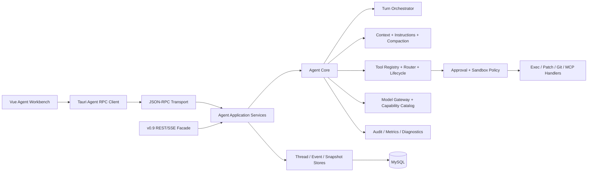

# PrivateAgent v1.0.0 Agent 架构代际升级开发计划书

> 制定日期：2026-08-24  
> 计划状态：S1 已评审完成；干净候选提交全量门禁通过后进入 S2
> 实施基线：`fe7bd1a`（`dev/0.9.0` 封版提交）
> 开发主线：`dev/1.0.0`
> 版本主题：Codex-inspired Local Agent Platform  
> 替代计划：[2026-08-20 旧版 1.0 稳定收口计划](./v1.0.0-development-plan-20260820.md)  
> 前置决议：[v0.9.0 封版决议](../v0.9.0/v0.9.0-freeze-decision-20260824.md)

## 1. 执行摘要

`v1.0.0` 不再只是 v0.9 的“稳定发布收口”，而是 Agent 子系统的一次代际升级。目标不是复制 OpenAI Codex 的代码或绑定单一 Provider，而是吸收其已经验证的架构分层：独立 Agent Core、稳定的 app-server 风格协议、Thread/Turn/Item 生命周期、工具路由与生命周期、沙箱与审批分离、可恢复事件流、生成式客户端契约以及分层项目指令。

本计划作出以下决定：

1. **先封 v0.9，再开 v1.0。** v0.9 停止功能扩张，只保留维护修复和发布收拢。
2. **保留 Python + Tauri + Vue 产品栈。** v1.0 不进行全量 Rust 重写；用端口/适配器隔离实现语言，避免版本目标被重写工程吞没。
3. **重建 Agent 边界，不重建整个产品。** 项目、知识库、记忆、设置、安装器和 updater 继续复用；Agent Runtime、协议、工具执行、权限与前端投影重点重做。
4. **采用兼容替换，不双执行。** v2 Runtime 可做只读 shadow projection/replay，但同一 Turn 永远只有一个执行器，禁止重复 Patch、命令或外发。
5. **原 1.0 计划大部分并入末端 Release Train。** 契约冻结、安全、升级回退、可靠性、文档、安装包和 14 天观察仍属于 1.0；旧链物理删除、多 Agent、远程执行和跨平台延后。
6. **1.0 的正式版本语义重新定义。** 它是新的 Agent Platform 稳定版，不是旧 Runtime 的最终封口标签。

### 1.1 2026-08-24 执行口径

| 事项 | 决议 | 阻断边界 |
|---|---|---|
| v0.9 安装/签名流水线 | NSIS、updater minisign、manifest/SHA 和四项 smoke 已完成；Authenticode 以 unsigned note 记录 | 干净候选全量门禁通过后允许 S2；Authenticode 未补齐前禁止公开 `v0.9.0` tag、updater `latest` 和正式发布 |
| Python 依赖 | `pyproject.toml` 定义依赖，`uv.lock` 是唯一发布锁；`requirements.txt` 仅供 pip 本地开发 | 发布流水线不得从 `requirements.txt` 解析依赖 |
| v0.9 Git 基线 | `release/0.9.x` 已指向 `fe7bd1a`；Authenticode + 公开发布授权完成后再创建 annotated `v0.9.0` tag | S2 不依赖公开 tag；tag 与 updater `latest` 保持公开发布阻断 |
| 执行人力 | 当前按单人全职档执行，工程 24–32 周 + RC 14 天 | S1–S9 主线串行；不把 AI 或临时审查折算为第二名工程师 |
| transport 预倾向 | 优先验证 Tauri Rust bridge 管理的 sidecar stdio/JSONL；loopback WebSocket 仅作备选 | 若 bridge 无法达到断线恢复、背压和打包稳定性指标，再由 ADR-002 切换为仅环回 WebSocket |
| 测试数据库 | 使用本地独立 MySQL 实例/独立测试库；真实升级演练另用 `clone_application_database.py` 生成只读基线克隆 | 禁止对日常应用库或回退克隆运行破坏性测试 |
| 性能 ADR 审批 | 由项目/发布负责人审批；实施者只能提案和附基线证据 | 阈值只能在 S1 基线锁定时调整，测试失败后不受理放宽申请 |
| RC 观察 | 单人模式下由项目/发布负责人每日执行并签署，AI 可辅助采集/汇总但不代替人工验收 | S8 前必须准备 Python、Vue/Node、Rust 三类真实试用项目及本地 + 至少一个远程 Provider 凭据 |

## 2. 参考基线与采用边界

### 2.1 固定参考快照

规划参考 OpenAI Codex `main` 在 2026-08-23 的提交 `2161ec272a7d6b775c9c721e6206f4fe63e383f2`，避免开发过程中以漂移的 `main` 作为验收标准。

重点参考：

- [Codex App Server 官方说明](https://developers.openai.com/codex/app-server/)：富客户端、会话历史、审批和流式 Agent 事件的集成边界；
- [openai/codex 仓库](https://github.com/openai/codex/tree/2161ec272a7d6b775c9c721e6206f4fe63e383f2)；
- [app-server](https://github.com/openai/codex/tree/2161ec272a7d6b775c9c721e6206f4fe63e383f2/codex-rs/app-server)：JSON-RPC、Thread/Turn/Item、协议 schema 与通知；
- [codex-core](https://github.com/openai/codex/tree/2161ec272a7d6b775c9c721e6206f4fe63e383f2/codex-rs/core)：与 UI 解耦的业务核心；
- [tools 分层](https://github.com/openai/codex/tree/2161ec272a7d6b775c9c721e6206f4fe63e383f2/codex-rs/core/src/tools)：registry、router、handlers、approvals、sandboxing、lifecycle、parallel；
- [AGENTS.md 官方说明](https://developers.openai.com/codex/guides/agents-md/)：全局到项目目录的分层指令发现与覆盖；
- [Sandbox 官方说明](https://developers.openai.com/codex/sandboxing/)：技术边界与审批策略是两个协同但独立的控制面。

### 2.2 采用原则

| Codex 思路 | PrivateAgent 1.0 采用方式 |
|---|---|
| Core 与 UI 解耦 | 建立 `agent_v2` 应用核心，FastAPI/Tauri/Vue 仅是适配器 |
| app-server 协议 | 建立版本化 JSON-RPC 2.0 Agent 协议和双向通知；保留 REST 兼容层 |
| Thread → Turn → Item | 作为 1.0 Agent 公共模型；映射现有 Conversation → Run → Step/Event |
| schema 生成客户端类型 | 从单一协议 schema 生成 Python/TypeScript 契约与 fixtures |
| 工具 registry/router/lifecycle | 重构现有 registry/dispatcher/approval/execution 为明确流水线 |
| sandbox 与 approval 分离 | 引入可验证的 OS 执行沙箱；审批不再等价于技术隔离 |
| 项目指令发现 | 支持有界、带 provenance 的 `AGENTS.md`/override 分层装配 |
| rollout/replay | 复用 MySQL durable facts，新增统一 Item/Event envelope 与可重放投影 |
| MCP/Skills/多 Agent | 1.0 只做扩展接口和受限 MCP/指令 MVP；完整 Skills、Hooks、子 Agent 延后 |

### 2.3 明确不照搬

- 不复制 Codex 的产品身份、登录、ChatGPT 套餐或 OpenAI 专属服务；
- 不把 Codex 的 Rust crate 拆分数量当作本项目模块数量目标；
- 不把 Codex 当前 experimental API 直接声明为 PrivateAgent 稳定契约；
- 不放弃 Ollama、Claude 和 OpenAI-compatible 多 Provider；
- 不用 JSON-RPC 替换全部业务 API；知识库、记忆、设置等仍可保留 REST；
- 不在 1.0 同时完成 Rust Core 重写、跨平台、云端和多 Agent。

## 3. 当前基线评估

### 3.1 已有资产，应保留并迁移

v0.9 已经具备一组可靠的 Agent 基础，不应推倒重来：

- 有界 Agent 循环、结构化 tool call、取消、超时和 token/tool/step 限制；
- MySQL durable run/step/event/checkpoint 以及严格 sequence；
- waiting approval 暂停/恢复、审批 token、防重放和参数 hash；
- 非幂等执行 lease、unknown 状态和人工处置；
- 工具 schema、risk/capability/idempotency/redaction 和结果验证；
- ModelGateway、多 Provider 能力声明和 model profile；
- Project/Workspace 绑定、Git facts、worktree、PatchSet 和命令 profile；
- ContextBuilder、真实 usage、压缩事件和预算失败关闭；
- 前端事件投影、快照纠偏、SSE 断线续读和未知事件安全忽略；
- 发布、升级、故障、视觉、a11y 和性能测试资产。

### 3.2 需要大改的结构性问题

本次审查的直接事实：

| 现状 | 风险 | 1.0 处置 |
|---|---|---|
| `routes_agent_runs.py` 约 2455 行 | HTTP 层同时组装模型、工具、权限、上下文、迁移和业务规则 | 拆为薄 transport adapter + application use cases |
| `agents/runtime.py` 约 1195 行 | 循环、事件、校验、恢复细节耦合，扩展新 Item 类型成本高 | 拆 Session/Turn orchestrator、model loop、item lifecycle、budget |
| `agents/repository.py` 约 1258 行 | 写模型、投影、幂等和兼容查询集中 | 拆 command store、event store、snapshot/read model |
| Python 与 TS 手写镜像事件 union | 新事件可能出现协议漂移，靠人工和测试追赶 | schema-first 生成类型、validator、fixtures 和 compatibility report |
| REST + SSE 以 Run 为中心 | 审批、steer、状态更新和事件订阅分散，多连接生命周期复杂 | Agent 专用双向 JSON-RPC channel；REST 作为 v0.9 facade |
| `Project → Workspace → Conversation → Run → Step/Event` 概念层次 | UI 的“对话/任务/运行”语义交叉，工具/消息/计划是多个旁路 DTO | 对外统一 Thread → Turn → Item，Project/Workspace 作为执行环境 |
| 能力位布尔字段持续增加 | 客户端组合逻辑膨胀，难表达 stable/beta/disabled/reason | 版本化 capability catalog + stage + constraints |
| 权限模式主要是策略与受控命令 profile | “批准”不能证明进程受 OS 技术边界约束 | 统一 exec 进入 Windows sandbox；approval policy 与 sandbox policy 独立 |
| Patch、command、HTTP、SQL、RAG 各自工作流 | 生命周期、审计、取消、输出和验证实现容易分叉 | 全部进入统一 Tool Lifecycle，领域 handler 只负责具体行为 |
| legacy UI/planner/Agent Runtime 多代兼容 | flags、API 和 DTO 长期叠加 | Strangler 迁移；1.0 默认 v2，1.1 物理删除 |
| Tauri CSP 当前为 `null` | 富客户端 + 本地 API 边界缺少浏览器侧硬化 | S7 安全门禁前启用最小 CSP、严格 Origin/Host/token |

### 3.3 架构目标指标

1. transport 层不出现 Provider、工具注册、权限推导或数据库事务编排。
2. Agent Core 不依赖 FastAPI、Vue、Tauri 或具体数据库 ORM。
3. 同一协议方法和事件只有一个 schema 事实源。
4. 所有副作用都经过 Tool Lifecycle 和 Sandbox/Policy Gate。
5. Thread 可恢复，Turn 可中断，Item 可重放，客户端可从 cursor 无损续读。
6. 任何 legacy adapter 都不能创建第二个执行循环。

## 4. 版本范围

### 4.1 1.0 必须交付（P0）

- 新 Agent Core 分层和依赖规则；
- `Project/Workspace + Thread/Turn/Item` 公共领域模型；
- 版本化 JSON-RPC Agent protocol、握手、capabilities、错误 envelope 和双向通知；
- schema → Python/TypeScript 类型、validator、mock fixture 和兼容性报告生成链；
- 单执行器 Turn Runtime、steer/interrupt、状态机、budget、compaction、replay；
- 统一 Tool Registry/Router/Lifecycle/Handler/Execution Store；
- 受沙箱约束的统一命令执行和 apply-patch/PatchSet handler；
- sandbox policy 与 approval policy 分离，Windows 原生强制边界和失败关闭；
- Provider capability catalog、model profile 快照、流式 item delta 和 usage；
- `AGENTS.md` 分层发现、provenance、大小预算和指令快照；
- 新前端 thread store、turn/item projector、审批/命令/补丁/计划/终态 UI；
- v0.9 数据迁移、兼容 facade、回退和 legacy 调用归零；
- 安全、可靠性、性能、安装、升级、文档和 14 天 RC 观察。

### 4.2 1.0 可选交付（P1，不能阻塞 P0）

- 现有 MCP server 接入统一 Tool Registry 的只读/审批型 MVP；
- Thread fork、archive、search 和 history pagination；
- 用户主动触发的 compaction；
- `AGENTS.override.md` 与项目 fallback 文件名配置；
- 协议 inspector 和只读 replay 调试器；
- 单机后台 terminal 列表与显式清理。

### 4.3 延后

| 能力 | 目标版本 | 原因 |
|---|---|---|
| 旧 planner/UI/REST 物理删除 | `v1.1.0` | 先用 1.0 RC 证明调用归零与回退不再需要 |
| 完整 Skills 包发现/安装/执行 | `v1.1.0` | 先稳定指令与工具扩展接口 |
| Hooks 生命周期 | `v1.1.0` | 涉及第三方副作用与签名/策略边界 |
| 子 Agent / 多 Agent | `v1.1+` | 需要父子线程、预算、权限继承和取消语义专项设计 |
| 浏览器/Computer Use | `v1.1+` | 需要独立高风险策略和证据模型 |
| macOS/Linux 正式支持 | `v1.2+` | 1.0 只承诺 Windows 沙箱和安装链 |
| 远程执行、云同步、多人协作 | `v2.0+` | 超出本地单用户信任模型 |
| Agent Core 全量 Rust 化 | 不预设 | 仅在性能/隔离数据证明 Python 成为瓶颈后立项 |

## 5. 原 1.0 计划并入/延期结论

| 原计划事项 | 决策 | 新归属 |
|---|---|---|
| 公开契约冻结 | 并入，但不在开工时冻结旧契约 | S2 冻结 protocol v1 draft，Beta 1 后只 additive |
| 旧链默认隔离 | 并入 | S7；v2 默认后保留显式 v0.9 回退 |
| 旧链物理删除 | 延后 | v1.1 独立清理版本 |
| v0.5/v0.8/v0.9 升级与回退 | 并入并扩展 | S7；增加 v0.9 → v1 Thread/Turn/Item 映射 |
| 安全门禁 | 并入并升级 | S4/S8；新增 OS 沙箱、IPC、CSP、schema fuzz |
| 可靠性与 unknown 处置 | 并入并升级 | S3/S6/S8 |
| 性能、视觉、a11y | 并入 | S6/S8 |
| 文档与发布物 | 并入 | S8/S9 |
| `rc.1` 14 天观察 | 保留 | S9；候选代码变化则升 RC 并 Day 1 重启 |
| Windows 10/11 x64 | 保留 | 1.0 正式支持平台 |
| “不提供任意 Shell” | 修改 | 1.0 提供受 OS 沙箱、审批和策略约束的统一 exec，不提供无边界 Shell |
| “不新增工具类别” | 修改 | 新增统一 exec/apply-patch 是架构主线；其他产品工具冻结 |
| 新 Provider | 延后 | 1.0 只迁移现有 Provider，不扩张列表 |
| 自动化/插件市场 | 延后 | 保留现状，不纳入 1.0 Agent P0 |
| `requirements.txt` 历史漂移 | 提前处理 | S0 封版收拢项 |
| 原生 prompt/confirm 视觉债 | 并入 | S6 使用统一 PaDialog/审批组件 |

原计划预计“7–10 个工作日 + 14 天观察”只适用于稳定收口，不适用于本次全面改造。该估算作废。

## 6. 目标架构



### 6.1 后端包结构

目标结构可在 S1 spike 后微调，但依赖方向不可反转：

```text
src/personal_assistant/agent_v2/
  protocol/          # methods/events/errors/schema/codegen inputs
  domain/            # ProjectRef, WorkspaceRef, Thread, Turn, Item, policies
  application/       # use cases, transactions, DTO mapping
  runtime/           # turn loop, context, compaction, budgets, cancellation
  tools/
    registry.py
    router.py
    lifecycle.py
    handlers/        # exec, apply_patch, git, rag, http/sql adapters
  policy/            # permissions, approvals, sandbox, network, redaction
  execution/         # process host, PTY, output, kill tree, filesystem facts
  providers/         # provider-neutral port + existing adapters
  persistence/       # command/event/snapshot/read-model stores
  instructions/      # AGENTS discovery, provenance, content kinds
  observability/     # audit, metrics, trace, diagnostics
  adapters/
    jsonrpc/
    rest_v090/
    mcp/
```

依赖规则：`domain <- runtime/application <- adapters`；domain 不导入 FastAPI、SQLAlchemy、Tauri 或具体 Provider SDK。

### 6.2 前端结构

```text
apps/desktop/src/features/agent-v2/
  protocol/generated/   # 禁止手改
  transport/            # initialize/reconnect/request/notification
  model/                # threadStore, itemProjector, selectors
  components/           # thread/turn/item renderers
  approvals/
  commands/
  patches/
  diagnostics/
```

`App.vue` 只选择工作区和装配 transport；不能判断工具是否执行、重写 plan、拼接 tool result 或推导权限。

## 7. 公共领域模型

### 7.1 模型映射

| v0.9 | v1.0 公共模型 | 说明 |
|---|---|---|
| Project | Project | 产品资源容器，保持现有 ID |
| ProjectWorkspace | Workspace/Environment | cwd、root、Git/worktree、权限根 |
| Session/Conversation | Thread | 持久对话与设置容器 |
| AgentRun | Turn | 一次用户输入到终态的执行单元 |
| RunStep/Event | Item + lifecycle event | 消息、命令、补丁、审批、计划、Artifact 都是 typed item |
| RunPlan | Plan Item | 作为 Item，而不是独立旁路状态机 |
| ToolApproval/Execution | Tool Item 的状态与独立审计事实 | UI 从统一 item 观察，审计表继续保留 |
| Artifact | Artifact Item/Reference | 大内容仍放有界存储，事件只带引用 |

### 7.2 Thread

Thread 至少包含：`id`、`project_id`、`workspace_id`、`status`、`title`、`created_at`、`updated_at`、`archived_at`、`settings_snapshot`、`instruction_snapshot_id`、`protocol_version`。

支持：start、resume、read、list、archive、rename；fork 和分页为 P1。Thread 只保存公开上下文和可审计 facts，不持久化隐藏 chain-of-thought。

### 7.3 Turn

Turn 状态：

```text
queued → running ↔ waiting_approval → completed
                 ↘ interrupted / failed / timed_out / limit_exceeded
```

规则：

- 一个 Thread 同时最多一个有副作用的 active Turn；
- `turn/start` 必须支持 `client_request_id` 幂等；
- `turn/steer` 只增加新的用户输入 Item，不偷偷创建第二个 Turn；
- `turn/interrupt` 必须取消模型、工具、进程树和流；
- unknown 副作用阻止自动继续，必须人工 resolve/revalidate。

### 7.4 Item

1.0 P0 Item 类型：

- `user_message`、`agent_message`、`public_reasoning_summary`；
- `plan`、`plan_step`；
- `command_execution`、`file_change`、`patch_set`、`tool_call`；
- `approval_request`、`approval_resolution`；
- `verification`、`artifact`、`context_compaction`、`error`。

每个 Item 具备 `item_id`、`thread_id`、`turn_id`、`kind`、`status`、`sequence`、`created_at`、`completed_at`、`public_payload`、`content_ref`、`schema_version`。大输出只在 payload 中存摘要和引用。

## 8. Agent 协议

### 8.1 传输与握手

- Agent 主通道采用 JSON-RPC 2.0 语义；线格式含显式 `jsonrpc: "2.0"`，不复制 Codex 的省略行为；
- 桌面 transport 预倾向 Tauri Rust bridge 管理的 sidecar stdio/JSONL，以避免新增本地监听端口；S1 必须与仅环回 WebSocket 实测对比安全性、背压、断线恢复、开发复杂度和打包稳定性，由 ADR-002 决策最终 transport；
- 该预倾向与 Codex App Server 当前以 stdio/JSONL 为默认、将 WebSocket 标记为 experimental/unsupported 的官方口径一致，但 PrivateAgent 仍以本项目 S1 数据作最终决策；
- 无论选哪种 transport，都必须有一次性高熵 bearer、严格 Host/Origin、消息大小限制、连接初始化和 bounded queue；
- 首个方法必须是 `initialize`，交换 client info、protocol versions、capabilities 和 notification preferences；
- 连接断开不等于 Turn 取消；客户端凭 cursor 恢复订阅。

### 8.2 P0 方法

```text
initialize
server/capabilities
thread/start
thread/resume
thread/read
thread/list
thread/archive
thread/name/set
turn/start
turn/steer
turn/interrupt
turn/read
turn/items/list
approval/resolve
execution/output/read
execution/unknown/resolve
context/compact
```

### 8.3 P0 通知

```text
thread/started
thread/status/changed
turn/started
turn/status/changed
item/started
item/delta
item/completed
item/failed
approval/required
turn/completed
server/overloaded
```

### 8.4 协议规则

1. 每个请求有 request id；写操作另有 idempotency key。
2. 每个通知有 `thread_id`、`turn_id`、`sequence`、`schema_version`。
3. sequence 对同一 Turn 单调递增；重连可按 `after_sequence` 补读。
4. 未知 additive 字段必须忽略；未知 Item kind 安全展示为通用卡片并记录诊断。
5. 破坏性方法/事件变化必须升 protocol major；1.x 只 additive。
6. 错误 envelope 固定 `code`、`message`、`retryable`、`details`、`trace_id`，不暴露秘密、路径原文或 Provider body。
7. transport ingress、runtime queue、output stream 都有容量和 backpressure；过载明确返回 retryable error。

### 8.5 契约生成

- 单一 schema 源存放在 `agent_v2/protocol/schema/`；
- 生成 Pydantic models、TypeScript types、JSON Schema bundle 和 method registry；
- CI 校验生成物无 diff；
- 每个稳定方法和 Item 至少一个 golden request/response/event fixture；
- 自动生成协议兼容报告，禁止人工维护 TS union 作为唯一事实源。

## 9. Runtime、Context 与 Provider

### 9.1 Turn Orchestrator

拆分为：

1. Turn admission：幂等、并发、owner、workspace 和 permission snapshot；
2. Context assembly：系统/项目指令、历史、@ 文件、RAG、工具结果和预算；
3. Model loop：流式响应、tool calls、usage、finish reason 和有界重试；
4. Item lifecycle：started/delta/completed/failed 原子持久化；
5. Tool lifecycle：路由、策略、审批、执行、验证；
6. Terminalization：终态、artifact、usage、公开报告；
7. Recovery：进程重启、断线、unknown、waiting approval 和 owner 迁移。

### 9.2 Context 与指令

- 指令装配顺序：产品系统指令 → 用户全局指令 → 项目根到 cwd 的 `AGENTS.md`/override → Turn 输入；
- 每个来源记录 path scope、hash、bytes、加载顺序和信任类型；
- 项目指令和工具/MCP 输出都是“不可信内容”，不能自行升级 capability；
- 总指令默认上限 32 KiB，可配置但有硬上限；
- Context fragment 显式标注 kind：instruction、user_input、project_file、retrieval、tool_output、summary；
- compaction 生成公开 summary item 和 provenance，保留最近消息、未决审批、关键执行事实与 artifact refs；
- provider usage 缺失时显示 unavailable，不用字符数伪造 token。

### 9.3 Provider

- 保留现有 Ollama、OpenAI-compatible、Claude adapters；
- capability catalog 明确 tools、streaming、structured output、usage、reasoning effort、context window；
- Turn 创建时冻结 provider/model/profile/capabilities snapshot，运行中不受设置页修改影响；
- Provider 特有事件只在 adapter 内归一化，不泄漏到 UI 公共协议；
- 1.0 不新增 Provider，只完成现有迁移和一致性测试。

## 10. 工具、审批与沙箱

### 10.1 统一 Tool Lifecycle

```text
register → validate input → resolve policy → request approval
        → acquire execution lease → sandbox execute → stream output
        → verify result → persist item/audit → release/terminalize
```

所有内建工具和 MCP 工具必须经过同一主链，handler 不能自行绕过审批、sandbox、redaction 或 execution store。

### 10.2 工具接口

每个 ToolSpec 声明：

- namespace/name/version/schema；
- risk、required capabilities、idempotency；
- sandbox requirements、network requirements；
- approval preview builder；
- output truncation/redaction policy；
- cancellation/timeout contract；
- verifier；
- telemetry labels（低基数）。

### 10.3 统一 exec

1.0 用受控统一 exec 替代“只能执行少量命令 profile”的产品限制，但不提供无边界 Shell：

- 支持 argv 和 shell 两种显式模式；默认优先 argv；
- cwd 必须来自 Workspace/Environment；
- 所有子进程进入同一沙箱、环境白名单、超时和进程树；
- 输出有 byte/line/time 上限和续读引用；
- 网络、workspace 外写入、提升权限、敏感路径和解释器链按 policy 提升审批；
- 命令审批绑定 canonical argv/cwd/env diff/sandbox hash，批准后不得替换参数；
- unknown 非幂等执行永不自动重放。

### 10.4 Windows 沙箱

S1 必须完成可行性 spike；S4 交付生产实现。最低要求：

- restricted token / AppContainer / Job Object 等可验证的 Windows 原生限制组合；
- 工作区可写、系统依赖可读、敏感目录拒绝、网络默认关闭；
- `.git`、凭据、PrivateAgent 配置和密钥目录单独只读/拒绝；
- 进程树统一回收，取消后无孤儿进程；
- 无法表达策略时失败关闭，不能静默降级为 full access；
- `full_access` 是用户显式关闭部分沙箱限制的策略，不等于管理员权限；仍受秘密、审计和远程外发硬边界约束。

### 10.5 Patch

保留 v0.9 PatchSet 的 SHA、HEAD、TOCTOU、rollback、partial/unknown 资产，重构为标准 handler：

- proposal 与 apply 分离；
- 预览绑定内容 hash；
- apply 前重验 workspace/Git/file facts；
- 失败优先原子回滚；无法确定时进入 unknown；
- UI 只展示公开 diff/artifact，不读取运行时内部对象。

## 11. 持久化、事件与恢复

### 11.1 数据策略

继续使用 MySQL 作为 durable fact store。新增表/列全部 additive：

- `agent_threads_v2`
- `agent_turns_v2`
- `agent_items_v2`
- `agent_events_v2`
- `agent_snapshots_v2`
- `agent_instruction_snapshots`
- 必要的 protocol/idempotency/projection metadata

表名在 S2 ADR 最终确认；不得直接重命名或删除 v0.9 表。

### 11.2 写模型与读模型

- Command store 负责 Thread/Turn/Item 状态事务；
- Event store 负责 append-only sequence；
- Snapshot store 加速恢复，不取代事件事实；
- Read model 为列表、搜索、历史分页和 UI 快照服务；
- 投影可从事件重建，checksum 不一致时失败并报警。

### 11.3 恢复语义

- waiting approval 可跨重启恢复；
- running model call 在无法证明完成时终止为 interrupted/failed，不伪造 continuation；
- 幂等工具可在 lease 证明未提交时重试；
- 非幂等 unknown 必须人工处置；
- reconnect 先取快照，再补 event gap，再订阅实时通知；
- owner lock 丢失立即停止接收新 Turn 并收拢本进程任务。

## 12. 前端改造

### 12.1 状态管理

- `ThreadStore` 维护 thread metadata、active turn、cursor、connection state；
- `ItemProjector` 仅按协议事件投影，不解析模型自由文本推断工具/计划；
- 请求、通知和 snapshot 都经过生成类型验证；
- reconnect 不清空 transcript；事件按 `(turn_id, sequence)` 幂等；
- unknown item 提供通用安全渲染和诊断入口。

### 12.2 体验范围

- Thread 列表、搜索、重命名、归档和恢复；
- Turn 内用户消息、Agent 输出、计划、命令、Patch、审批、验证、Artifact；
- in-flight steer、interrupt、连接恢复和 blocked recovery；
- 权限 profile 与 sandbox summary 清晰分开；
- context/usage/compaction 来源可解释；
- 原生 `prompt/confirm` 全部替换为设计系统对话框；
- 5000+ Item 使用虚拟化或分页，不在 DOM 全量挂载。

### 12.3 兼容 UI

v0.9 Coding Workbench 作为 `rest_v090` adapter 的显式回退 UI。Beta 1 后默认 v2；回退开关必须记录原因和调用计数，但不能在同一 Thread 上并行消费两个 Runtime。

## 13. 扩展边界

### 13.1 AGENTS.md（1.0 P0）

- 全局 → project root → cwd 分层加载；
- 同目录 `AGENTS.override.md` 优先；
- 每目录最多一个指令文件；
- 有界总大小、hash、provenance 和诊断可见性；
- 指令只影响行为建议，不改变 sandbox/approval/capability。

### 13.2 MCP（1.0 P1）

- 将现有 MCP 工具桥接到统一 registry；
- 连接初始化时冻结 capability profile；
- MCP 返回视为不可信内容；
- 本地 stdio 与远程 HTTP 的网络/secret 策略分开；
- 1.0 只承诺经过 allowlist、schema、审批和审计的 MVP。

### 13.3 延后能力的接口预留

Thread 必须能表达 `parent_thread_id`、`source_kind` 和 budget inheritance 的 nullable 字段，但 1.0 不启用子 Agent。Tool lifecycle 可扩展 hooks，但 1.0 不执行第三方 hook。预留不等于公开承诺。

## 14. 迁移策略

### 14.1 Strangler 阶段

1. `agent_v2` 在 v0.9 主链旁构建，默认关闭；
2. 协议 fixtures 与 v0.9 公开事件做离线映射；
3. shadow 模式只生成投影和差异报告，不调用模型、不执行工具；
4. internal dogfood 创建全新 v2 Thread；
5. 显式迁移选定 v0.9 Conversation；
6. Beta 1 新 Thread 默认 v2，旧 Thread 继续由兼容 adapter 读取；
7. Beta 2 验证回退、归零和升级；
8. RC 冻结后停止 schema/feature 变化。

### 14.2 数据映射

- v0.9 Session → v2 Thread，保留原 ID 映射表；
- 每个 v0.9 AgentRun → v2 Turn；
- message、step、event、approval、execution、plan、artifact → typed Item 或 reference；
- 原始 v0.9 表保持只读，不回写改造后的事件；
- migration 可暂停、续跑、重入，记录 source hash/count 和 failure cursor；
- 不完整/冲突记录隔离到 migration report，不静默丢弃。

### 14.3 禁止双副作用

- shadow 仅消费已落库 facts；
- v0.9 与 v2 executor 使用互斥 ownership key；
- 同一 `client_request_id` 只能归属一个 protocol/runtime；
- adapter 不得把 v2 tool result 再提交给旧 planner；
- 迁移测试故意注入重复请求、断线、进程杀死和 owner 切换。

## 15. 里程碑与工作包

当前执行基准为单人全职，S1–S9 串行推进，总工程工期 24–32 周，另加 14 个自然日 RC 观察。只有当第二名工程师连续投入并拥有明确模块 owner 时，才可通过计划变更切换为并行估算。

### S0 · v0.9 不可变封版（2–3 个工作日）

任务：

- 收拢当前工作区；完成版本号、依赖口径和 migration head 一致性；
- 运行完整 release check、安装/升级/回退 smoke；
- 生成 v0.9 freeze commit、证据和维护分支；
- 从冻结提交创建 `dev/1.0.0`。

退出：v0.9 有可复现 commit；1.0 不携带未知工作区状态。NSIS、updater minisign、manifest/SHA 和升级/回退 smoke 已完成；干净候选全量门禁通过后可进入 S2。Authenticode 继续阻断公开发布，不阻断 S2。

### S1 · ADR 与技术 Spike（1 周）

任务：

- ADR-001 Thread/Turn/Item；ADR-002 protocol/transport；ADR-003 persistence；
- ADR-004 Windows sandbox；ADR-005 legacy migration；
- 实作 JSON-RPC initialize + ping + bounded queue spike，对比 Rust bridge 管理的 stdio/JSONL 与 loopback WebSocket；
- 实作 Windows sandbox 对 cwd/read/write/network/process tree 的最小证明；
- 建立 protocol schema/codegen 骨架和依赖检查。

退出：所有 P0 架构风险有可执行结论；sandbox 无法达标则 1.0 暂停而不是退化。

### S2 · Domain、Protocol 与 Store（2 周） → `1.0.0-alpha.1`

任务：

- Thread/Turn/Item/errors/capabilities v1 schema；
- 生成 Python/TS 契约与 fixtures；
- 新表 additive migration、event/snapshot/read model；
- initialize、thread start/read/list、turn start/read、items list；
- v0.9 event → v2 Item 离线 mapper；
- contract/golden/migration/replay tests。

数据库供给：日常自动化使用本地 MySQL 中的独立可重建测试库；发布前升级演练先执行 `scripts/clone_application_database.py --yes` 生成带行数和 checksum 证据的时间戳克隆，再对演练副本执行 migration/replay。

退出：空模型/假工具下可完整创建并重放 Turn；前后端零手写漂移。

### S3 · Runtime、Provider 与 Context（2 周）

任务：

- Turn orchestrator、model loop、item delta、budget、interrupt/steer；
- 迁移现有 Provider adapters 和 profile snapshot；
- Context fragments、usage、compaction 和输出验证；
- `AGENTS.md` 发现、provenance 和 size budget；
- 崩溃/断线/owner/recovery tests。

退出：无副作用工具时新 Runtime 可在三类 Provider 完成、取消和恢复 Turn。

### S4 · Tool Engine、Sandbox 与 Approval（3 周） → `1.0.0-alpha.2`

任务：

- registry/router/lifecycle/handlers/lease/audit；
- 统一 exec、PTY/stdio、输出续读、超时和 kill tree；
- Windows sandbox production backend；
- approval policy、preview、canonical request binding、防重放；
- apply-patch/PatchSet、Git/worktree handler；
- RAG/HTTP/SQL/现有工具 adapters；
- fuzz、路径、网络、命令、secret 和 unknown 测试。

退出：读取、修改、测试、验证主链完全走 v2；workspace 外写入和未授权网络无法发生。

### S5 · Agent RPC 与桌面主链（2 周） → `1.0.0-beta.1`

任务：

- Tauri transport、token、Origin/Host、reconnect/backpressure；
- ThreadStore、ItemProjector、generated client；
- thread/turn/item UI、steer/interrupt、审批、命令、Patch、Artifact；
- 长 transcript 分页/虚拟化；
- 设计系统对话框替换原生 prompt/confirm；
- 新安装默认 v2，保留显式 v0.9 回退。

退出：真实 Windows 安装版可完成端到端编码任务；Beta 后 protocol v1 只 additive。

### S6 · 扩展、管理与产品闭环（1–2 周）

任务：

- Thread 搜索/归档/重命名/分页；
- capability catalog 和 feature maturity UI；
- context/instruction diagnostics；
- MCP P1 MVP（若不影响 P0）；
- model/profile、permission/sandbox 和 recovery 设置闭环。

退出：核心管理场景不依赖 legacy UI；P1 未完成项可无损延期。

### S7 · 数据迁移与 Legacy 隔离（2 周） → `1.0.0-beta.2`

任务：

- v0.5/v0.8/v0.9 → v1 升级矩阵；
- v0.9 Conversation/Run 显式/批量受控迁移；
- v1 应用回退到 v0.9 只读核心历史；
- legacy REST/SSE facade、调用 telemetry 和归零报告；
- 故障注入、重复副作用、unknown、未决审批和 orphan migration；
- database upgrade/rollback runbook。

退出：数据丢失 0、重复副作用 0、迁移可续跑；旧新 executor 不并行。

### S8 · 发布硬化（2 周）

任务：

- 全量安全威胁矩阵、CSP、IPC、本地 token、secret/redaction；
- 24 小时 soak、5000+ Item、大输出、大 Diff、磁盘满和强杀；
- 性能、资源、视觉、a11y、安装版和 updater；
- 用户、架构、协议、安全、部署、故障和已知限制文档；
- release report、manifest、SHA 和签名。

S8 沿用 S1 已锁定的性能阈值。如测量方法本身有错，只能由项目/发布负责人批准“测量修正 ADR”并以原阈值重跑；不得因验收失败降低标准。

退出：P0/P1=0；所有证据绑定同一候选 commit/installer。

### S9 · RC 观察与稳定发布（14 个自然日 + 2–3 个工作日）

- 发布 `1.0.0-rc.1`；候选代码、schema、安装包和 updater 资产冻结；
- 项目/发布负责人作为观察 owner，每日记录版本/commit、项目、Provider、场景、结果、缺陷和证据链接；
- Python、Vue/Node、Rust 三类项目，根 workspace/worktree、本地/远程 Provider；
- S8 前准备三个可重置、不含生产秘密的试用项目，并在 OS keyring/本机安全配置中准备本地 Provider 与至少一个远程 Provider 凭据，凭据不入库、不进观察报告；
- 审批/拒绝/取消/steer/冲突/unknown/恢复/升级/updater 全矩阵；
- 功能代码变化必须升 `rc.N+1` 并从 Day 1 重启；
- 观察通过后统一版本 `1.0.0`，重跑完整门禁并发布稳定资产。

## 16. Release Train

| 节点 | 定义 | 允许变化 |
|---|---|---|
| `alpha.1` | 协议/领域/Store 骨架可重放 | 允许 schema 演进，必须带 migration |
| `alpha.2` | Runtime + Tool + Sandbox 主链完成 | 允许修正 Item/方法，不允许绕过审计 |
| `beta.1` | 桌面默认 v2，范围完整 | protocol v1 只 additive；不再新增 P0 |
| `beta.2` | 迁移/回退/legacy 隔离完成 | 只修复集成、安全和发布问题 |
| `rc.1+` | 唯一候选二进制 | 只修阻断；代码变更升 RC 并重启观察 |
| `1.0.0` | Agent Platform 稳定发布 | 正式支持契约生效 |

## 17. 测试与质量门禁

### 17.1 自动化层级

1. Domain/unit：状态机、policy、budget、schema、redaction；
2. Contract/golden：所有方法、事件、Item、errors、codegen；
3. Property/fuzz：事件顺序、重复/缺口、JSON 大小、路径、命令、审批参数；
4. Adapter：Provider、MySQL、MCP、Tauri transport、Windows sandbox；
5. Replay：固定事件日志重建完全相同 snapshot；
6. Integration：model → tool → approval → sandbox → verification → terminal；
7. E2E：真实桌面、安装版、升级、回退和 updater；
8. Soak/chaos：强杀、断网、数据库中断、磁盘满、输出洪泛、进程泄漏；
9. Security：路径逃逸、符号链接/重解析点、ADS、secret、prompt injection、网络外发；
10. UX：a11y、视觉、键盘、缩放、长 transcript 和资源清理。

### 17.2 硬门槛

- schema/codegen diff 为 0；
- 10,000 次重复/断线事件模拟中丢失和重复可见 Item 为 0；
- 1,000 个混合 Turn soak 中永久 orphan、重复副作用和残留进程为 0；
- 未审批的 workspace 外写入、网络外发、权限提升为 0；
- unknown 非幂等执行自动重试为 0；
- secret/用户代码进入日志、诊断、通知和发布证据为 0；
- 5000 Item 页面不全量挂载，交互与内存相对冻结基线无未解释退化；
- P0/P1 缺陷为 0；P2 必须有 owner、影响和延期理由。

## 18. 安全模型

威胁边界至少覆盖：

- WebView → Tauri → sidecar transport 身份与重放；
- 模型/项目文件/RAG/MCP 输出的提示注入；
- workspace root、symlink、junction、reparse point、ADS、device path；
- command/shell/interpreter/package-manager 二次执行；
- approval 参数替换、过期、双消费和跨 Turn 使用；
- sandbox policy 无法表达时的降级；
- Provider endpoint SSRF、代理、redirect 和 secret；
- updater、sidecar、schema migration 和备份；
- event/item 大载荷、日志注入和磁盘耗尽。

安全原则：内容信任、授权决策和技术执行边界三者分离；任何一层的“允许”都不能替代其他层。

## 19. 可观测性与性能

### 19.1 Trace

统一关联：`trace_id → thread_id → turn_id → item_id → tool_call_id → execution_id/approval_id`。公开事件、运维日志、安全审计分开存储和保留。

### 19.2 指标

- Turn 完成/失败/中断/恢复率；
- 首 delta、总延迟、Provider 错误和 usage；
- tool/approval/sandbox 决策、等待时长、拒绝和 unknown；
- reconnect、event gap、projection rebuild 和 queue saturation；
- context 各 fragment token、compaction 次数、budget exceeded；
- 进程、内存、文件句柄、SSE/WebSocket/计时器生命周期；
- legacy facade 调用和回退原因。

### 19.3 性能验收

S1 记录 v0.9 基线，S8 以“基线 + 明确预算”验收。默认预算：

- 无模型首屏和 Thread 列表不比 v0.9 p95 退化超过 20%；
- 本地事件从持久化到 UI 可见 p95 ≤ 200 ms；
- interrupt 到子进程树终止 p95 ≤ 2 s；
- 5000 Item 历史首次可交互 p95 ≤ 1.5 s（分页/虚拟化）；
- reconnect 后 1000 事件 gap 在 2 s 内收敛；
- bounded queue 饱和时显式拒绝，不发生无界内存增长。

阈值只能在 S1 基线测量阶段由实施者提交 ADR，附原始样本、测量脚本、方差和建议预算，经项目/发布负责人明确批准后锁定。测试失败后不得临时放宽；实施者、AI 或测试执行者无权自批。

## 20. 回退与事故策略

- Beta 前保留 `agent_protocol_v2=false` 总开关；
- Beta 后保留按 Thread/source 的 v0.9 只读/执行回退，但同一 Turn 不切换 executor；
- schema 全 additive，不执行破坏性 downgrade；
- 回退应用忽略 v2 表并继续读取 v0.9 历史；
- 发现数据损坏、审批绕过、重复副作用或秘密泄漏时立即停止 latest/updater；
- 不以热修隐藏 unknown 或把失败标为完成；
- RC 期间任何功能代码变化升 RC 并重启观察。

## 21. 人力与工期

当前生效档位：**单人全职**。以下多人档位仅作增员后重排参考，未经计划变更不得引用其并行工期。

| 配置 | 工程工期 | RC 观察 | 风险 |
|---|---:|---:|---|
| 单人全职 | 24–32 周 | +14 天 | 协议、sandbox、UI 无法真正并行，风险最高 |
| 2 名工程师 + QA/安全兼职 | 16–19 周 | +14 天 | 推荐最低配置 |
| 3 名工程师（Core/Execution/Desktop）+ QA/安全 | 12–15 周 | +14 天 | 可并行，但 schema/ADR 必须先行 |

估算不包含多 Agent、跨平台、云同步或完整插件生态。任何把这些能力加入 1.0 的决定都必须重新估算，不能挤压 S8/S9。

## 22. 风险登记

| 风险 | 概率/影响 | 缓解 | 停止条件 |
|---|---|---|---|
| Windows 沙箱无法表达目标策略 | 中/极高 | S1 最先 spike；平台原生测试 | 只能以弱化权限运行时停止 1.0 主线 |
| 新旧模型映射导致重复副作用 | 中/极高 | shadow 只读、ownership key、idempotency | 任一重复 Patch/命令即阻断 |
| 协议过早冻结 | 中/高 | alpha 可演进，Beta 1 才冻结 v1 | UI 仍依赖内部 DB 字段时不得进 Beta |
| Python Runtime 拆分期间回归 | 中/高 | characterization/replay tests、端口适配 | v0.9 golden replay 不一致且无迁移说明 |
| 工期被 MCP/Skills/多 Agent 扩张 | 高/高 | P0/P1/延期清单；S6 可裁剪 | P1 影响 P0/S8 时立即延期 |
| 长历史迁移性能/数据质量 | 中/高 | 分批、cursor、checksum、clone 演练 | 行数/hash/关系不一致 |
| IPC/WebView 安全退化 | 中/极高 | token、Origin/Host、CSP、size/backpressure | 可从非授权页面调用 Agent 时阻断 |
| Provider 差异泄漏公共协议 | 中/中 | adapter contract suite | UI 出现 provider-specific 分支时阻断 |

## 23. 交付物

### 23.1 设计与契约

- ADR-001～ADR-005；
- protocol v1 schema、生成器、TypeScript/Python artifacts；
- Thread/Turn/Item 状态机和兼容矩阵；
- Tool/Sandbox/Approval/Context/Provider 契约；
- threat model、data migration spec、rollback runbook。

### 23.2 实现

- `agent_v2` Core、application、adapters；
- JSON-RPC server/client 与 v0.9 REST facade；
- Windows sandbox、unified exec、apply-patch 和 tool lifecycle；
- v2 stores/migrations/replay；
- Vue Agent v2 workbench；
- protocol/codegen/replay/security/performance test suites。

### 23.3 发布证据

- `release-check-1.0.0.json/.md`
- `release-manifest-1.0.0.md`
- `qa-evidence-1.0.0.json`
- `protocol-compatibility-1.0.0.json`
- `migration-report-v090-to-v100.json`
- `sandbox-security-report-1.0.0.md`
- installer/sidecar/updater SHA 与签名状态
- 14 天 RC 观察报告
- 已知问题、支持矩阵和 legacy 延期清单

## 24. Definition of Done

`v1.0.0` 只有在以下条件全部满足时完成：

1. v0.9 已形成独立、可回退、可复现封版基线。
2. Agent 公共模型统一为 Project/Workspace + Thread/Turn/Item。
3. Vue/Tauri 只通过稳定协议驱动 Agent，不参与模型或工具决策。
4. 协议 schema 是 Python/TS/fixtures 的唯一事实源，Beta 后无破坏性变化。
5. 同一 Turn 只有一个 Runtime；shadow/legacy 不产生重复副作用。
6. 所有工具经过 registry、policy、approval、sandbox、lease、verification 和 audit。
7. 统一 exec 在 Windows 技术沙箱中执行，策略无法满足时失败关闭。
8. 读取、修改、测试、验证、Artifact、取消、steer、审批和恢复主链稳定。
9. 指令、Context、RAG、MCP 内容有 provenance、预算和不可信边界。
10. v0.9 数据迁移、v1 应用回退和旧历史读取不丢数据。
11. legacy 默认隔离且调用归零；物理删除明确延后到 v1.1。
12. 安全、可靠性、性能、a11y、视觉、安装、升级和 updater 门禁全绿。
13. `1.0.0-rc.N` 完成连续 14 天观察，无未处置 P0/P1。
14. 正式版本、commit、schema、installer、签名、manifest、Release 和 updater 完全一致。

## 25. 开工顺序

本计划批准后，唯一正确的启动顺序是：

```text
完成 v0.9 不可变封版
  → 创建 dev/1.0.0
  → S1 ADR + protocol/sandbox spikes
  → 收拢干净候选提交并跑通全量内部门禁
  → 锁定 S2 schema draft
  → 进入实现
```

当前 S1 已完成评审，v0.9 安装/updater 签名/升级回退工程证据已具备。S2 唯一剩余开工条件是在干净候选提交上复跑并通过全量内部门禁。Authenticode、公开 tag 和 updater `latest` 保持公开发布阻断；ADR-004 网络强制门禁保持 S4/`alpha.2` 阻断。
