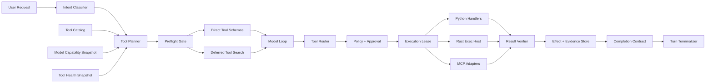

# PrivateAgent v1.0.0 Codex 工具体系融合开发计划书

> 制定日期：2026-08-25  
> 文档状态：Draft，待项目负责人评审  
> 计划类型：v1.0.0 Agent 架构升级专项子计划  
> 上位计划：[v1.0.0 Agent 架构代际升级开发计划书](./v1.0.0-agent-rearchitecture-plan-20260824.md)  
> 执行计划：[v1.0.0 Agent 架构改造执行计划](./v1.0.0-execution-plan-20260824.md)  
> Codex 参考快照：`openai/codex@465eafacbc2db4ff828cd6d18ed8f25d22e48f53`  
> 目标平台：Windows 10/11 x64，本地优先，Ollama/OpenAI-compatible/Claude 多 Provider  
> 当前人力口径：单人全职；本计划工作量包含在 v1.0.0 总体 24–32 周估算内

## 1. 执行摘要

本专项计划用于把 OpenAI Codex 中已经验证的工具架构能力引入 PrivateAgent，但不复制 Codex 产品、不绑定 OpenAI Provider，也不把现有 Python Agent Runtime 整体替换为 Codex App Server。

最终技术路线固定为：

1. **Python 继续掌握控制权。** 工具授权、审批、执行租约、幂等、持久化、结果验证和完成判定继续由 PrivateAgent 可信代码负责。
2. **吸收 Codex 的工具分层。** 引入 Tool Catalog、Tool Planner、Exposure、Router、Lifecycle、Deferred Tool Search、安全并发和统一事件模型。
3. **选择性复用 Rust。** 只把 PTY、进程树、流式输出、取消和 Windows 沙箱等适合系统语言实现的执行能力放入独立 Rust Exec Host。
4. **模型能力显式适配。** Qwen/Ollama 默认走 JSON Function Tool；不得假定它原生兼容 Codex 的自由文本 `apply_patch`、Hosted Tool Search 或 OpenAI 托管工具。
5. **完成状态由证据决定。** 需要产生副作用的任务，只有取得可信 Tool Execution 和副作用回读证据后才能进入 `completed`；模型文字不能把失败或未执行伪装成完成。
6. **Codex App Server 只做隔离 Spike。** 它可以作为未来可选执行引擎，但不得在 v1.0.0 主链形成第二套会话、审批、状态恢复和副作用执行事实源。

本计划首先解决以下已复现问题：用户要求创建 `hello.py`，模型返回“已创建”，但运行记录显示 `0 次工具`，目标目录也没有文件。无论该轮根因是工具没有暴露、模型没有调用还是协议不兼容，PrivateAgent 都必须在运行时阻止假成功并给出可诊断原因。

## 2. 文档目标与约束

### 2.1 目标

- 将 Codex 的工具注册、动态暴露、路由、生命周期和执行隔离能力映射到 PrivateAgent v1.0.0 架构。
- 给出可以直接拆成 issue、提交、测试和发布门禁的详细工作包。
- 保留现有 durable approval、execution lease、unknown、审计、PatchSet、RAG、HTTP、SQL 和 MCP 资产。
- 建立 Provider/模型能力矩阵，避免把“工具已注册”等同于“模型能稳定调用”。
- 建立副作用任务完成证据模型，消除“文字完成、实际未执行”。
- 明确开源代码采用、版本固定、升级和许可证合规策略。

### 2.2 非目标

- 不将整个 PrivateAgent Core 重写为 Rust。
- 不在 v1.0.0 引入多 Agent、子 Agent、Browser/Computer Use、云端执行或多人协作。
- 不复制 ChatGPT 登录、套餐、托管 Web Search、Hosted Shell 等 OpenAI 服务端能力。
- 不把 Codex 的实验性协议直接声明为 PrivateAgent 稳定协议。
- 不向 Qwen 暴露尚未通过能力探测和基准测试的自由格式工具。
- 不通过新增任意 PowerShell/CMD 权限绕过 Patch、审批或 Windows 沙箱。
- 不在本专项中物理删除 v0.9 工具链；删除继续按上位计划延后到 v1.1.0。

### 2.3 上下位计划关系

本计划不新增一条独立 Release Train，而是细化上位计划中的：

- S2：Tool/Effect/Evidence 协议和持久化事实；
- S3：模型能力、Tool Planner、预检和完成条件；
- S4：Tool Engine、Exec Host、Patch、Sandbox、Approval；
- S5：工具快照、审批、命令、Patch 和诊断 UI；
- S6：Deferred Tool Search 和 MCP P1；
- S7：旧新工具事实映射与单执行器保证；
- S8/S9：安全、性能、soak、RC 观察和发布证据。

若本计划与上位计划冲突，以上位计划和已批准 ADR 为准；任何扩大 v1.0.0 P0 范围的决定必须重新估算。

## 3. 参考基线与采用策略

### 3.1 Codex 固定参考

本专项以以下上游快照为研究基线，不以持续变化的 `main` 作为验收目标：

- 仓库：[openai/codex@465eafac](https://github.com/openai/codex/tree/465eafacbc2db4ff828cd6d18ed8f25d22e48f53)
- 工具分层：`codex-rs/core/src/tools/`
- App Server：`codex-rs/app-server/`
- App Server Protocol：`codex-rs/app-server-protocol/`
- Apply Patch：`codex-rs/apply-patch/`
- Windows Sandbox：`codex-rs/windows-sandbox-rs/` 及相关执行模块

Codex 使用 Apache-2.0。任何复制或修改上游代码的提交必须保留许可证和版权声明，并进入第三方组件清单。架构思想和接口语义可以重新实现；源码复用必须能追溯到具体上游文件与提交。

### 3.2 采用分类

| 分类 | 内容 | 采用方式 |
|---|---|---|
| A：直接重实现 | Registry、Router、Exposure、Lifecycle、Tool Search、并发规则 | 在 Python `agent_v2` 中按本项目契约实现 |
| B：选择性源码复用 | apply-patch parser、PTY、进程树、Windows 沙箱辅助逻辑 | 独立 Rust crate/binary，保留归属和上游 commit |
| C：协议适配 | Codex App Server、Responses tool item | 只做隔离 adapter/Spike，不进入主事实链 |
| D：只参考不采用 | ChatGPT 登录、OpenAI 托管工具、产品 UI、专属 prompts | 不进入 PrivateAgent |
| E：延后 | Skills、Hooks、子 Agent、Computer Use | v1.1+ 单独立项 |

### 3.3 为什么不能整包复制

- Codex 工具实现以 Rust 为主，深度依赖自身 Session、Turn Environment、Responses item 和模型元数据。
- PrivateAgent 已有 MySQL durable facts、一次性审批、execution lease、unknown 处置和多 Provider，不应被第二套运行时覆盖。
- Codex 的部分工具使用自由文本调用格式，成功率依赖模型训练；本地 Qwen 主要适合 JSON Function Calling。
- 托管工具是 OpenAI API 能力，不是 GitHub 仓库里可独立部署的本地函数。
- 全量 App Server 嵌入会同时产生两套 Thread/Turn、审批、恢复和审计，增加重复副作用风险。

## 4. 当前项目基线与差距

### 4.1 可保留资产

| 当前资产 | 当前能力 | 本计划处理 |
|---|---|---|
| `ToolSpec` / `VersionedToolRegistry` | Schema、风险、能力、超时、输出限制、幂等、取消、脱敏 | 扩展为 ToolSpec v2，不推倒重写 |
| `ValidatedToolDispatcher` | 默认拒绝、审批、claim、缓存、校验、持久化、结果 verifier | 拆为 Router + Lifecycle，但保持可信控制语义 |
| `ToolApprovalRepository` | 参数 hash、一次性 token、并发防重放 | 迁移到 v2 Item/审计映射 |
| `ToolExecutionRepository` | durable claim、成功回放、unknown 失败关闭 | 继续作为副作用事实源 |
| Patch/PatchSet | 单/多文件、SHA、TOCTOU、rollback、回读验证 | 统一成 apply-patch handler 和 Evidence |
| Command Workflow | argv 白名单、输出限制、取消、Job Object | 演进为统一 exec；旧实现作为回退适配器 |
| MCP Manager | discovery、health、ToolSpec 适配、强制审批 | 增加 catalog cache、namespace、exposure 和逐工具策略 |
| Result Verifier | 文件、Shell、代码、API、数据库和工作流完成验证 | 提升为 Completion Contract 最终门禁 |
| Provider Profile | tools、streaming、structured output 等能力 | 增加工具协议探测和稳定性评分 |

### 4.2 当前差距

| 编号 | 差距 | 影响 | 优先级 |
|---|---|---|---|
| G-01 | 工具是否注册、是否对本轮模型可见缺少持久化快照 | 无法解释“为什么没有调用工具” | P0 |
| G-02 | 工具暴露主要由静态注册和 feature flag 决定 | 工具过少则能力缺失，过多则小模型选择下降 | P0 |
| G-03 | 副作用任务的完成门禁没有统一进入 Turn 状态机 | 可出现零工具调用却报告完成 | P0 |
| G-04 | 工具执行主要串行，缺少显式 `parallel_safe` 契约 | 只读检索延迟偏高 | P1 |
| G-05 | 命令工具尚不是通用 PTY/续写会话模型 | 长任务、交互命令和增量输出受限 | P0 |
| G-06 | Windows 网络强制隔离尚未满足 S4 门禁 | 不能安全开放通用 exec | P0/阻断 |
| G-07 | 工具多时没有 Deferred Tool Search | Schema 占用上下文，小模型选错工具 | P1 |
| G-08 | MCP 工具统一 confirm，但缺少逐 server/tool 策略 | 可用性和最小权限难兼顾 | P1 |
| G-09 | 模型 profile 没有覆盖多工具、自由 patch、并发调用恢复能力 | 注册成功不代表实际可用 | P0 |
| G-10 | Codex 上游代码采用没有专项升级与许可证清单 | 后续升级和合规不可追踪 | P0 |

### 4.3 当前工作区的临时加固

当前工作树已经出现针对文件写入假成功的临时加固，包括文件变更意图识别、单文件写入工具提示、成功写入次数门槛和磁盘事实 verifier。这些改动尚属于当前工作区事实，不能直接视为 v1.0.0 稳定契约。

本计划要求：

1. 先为这些行为补齐 characterization tests；
2. 在 v2 Runtime 中以 `ExecutionIntent + CompletionContract + Evidence` 正式建模；
3. v0.9 临时逻辑只保留为兼容层，不复制第二套完成判断；
4. UI 只展示后端给出的公开原因，不能自行推断“完成”。

## 5. 架构决议

### AD-T01：Python Agent Core 是唯一控制面

**决定：** Tool Planner、Policy、Approval、Lease、Lifecycle、Verification、Persistence 和 Turn terminalization 全部留在 Python `agent_v2`。

**原因：** 这些能力与现有 MySQL durable facts、Provider、RAG、HTTP/SQL、回退和 UI 协议高度相关。迁入第二运行时会产生双事实源。

**禁止：** Rust Exec Host、MCP Server 或 Codex App Server 直接把 Turn 标为完成。

### AD-T02：Rust Exec Host 只负责受控执行

**决定：** Rust 进程只接收经过 Python 策略决议的规范化执行请求，负责进程创建、PTY、stdio、输出、超时、取消、Job Object 和 Windows 沙箱。

**原因：** 系统级进程和沙箱更适合 Rust；审批和业务语义仍由 Python 掌握。

**禁止：** Exec Host 自己发现工具、调用模型、请求网络授权或写 MySQL。

### AD-T03：Codex App Server 只做可选 Spike

**决定：** 在 S6 允许做隔离评估，但默认关闭，只使用无生产秘密的样例项目和独立数据库/目录。

**进入产品的前置条件：** 必须证明可以作为单一 Turn executor 接入，不绕过 PrivateAgent 审批、证据和审计；否则只保留研究报告。

### AD-T04：工具协议由模型能力决定

**决定：** 同一逻辑工具可以有不同 Model Adapter：JSON Function、native apply-patch、MCP 或未来 custom/freeform。公共 ToolSpec 不绑定 Provider 表达格式。

**默认：** Qwen/Ollama 使用严格 JSON Schema Function Tool；未知能力失败关闭。

### AD-T05：副作用完成必须有可信证据

**决定：** `completed` 是 Runtime 根据 CompletionContract 和 persisted Evidence 作出的状态，不是模型输出字段。

**最低规则：** 文件变更任务至少需要一个成功的 `filesystem.write` effect，以及目标文件回读/哈希证据；只有 `propose_patch`、命令失败、工具文本输出或模型声明都不满足完成条件。

### AD-T06：工具暴露与授权分离

**决定：** Tool Exposure 只决定是否把 Schema 发给模型，不能扩大 capability、approval 或 sandbox 权限。

**原则：** Hidden 不代表未注册；Deferred 不代表自动批准；Direct 不代表无需审批。

### AD-T07：副作用工具不自动并发

**决定：** 只有同时满足 `read_only`、`idempotent`、`parallel_safe` 且无审批的工具才允许并发。

文件写入、命令、HTTP 写请求、MCP 外部调用、SQL 写入和所有 confirm/restricted 工具保持串行，除非未来有独立 ADR 证明安全。

## 6. 目标架构



### 6.1 组件职责

| 组件 | 输入 | 输出 | 不允许做的事 |
|---|---|---|---|
| Intent Classifier | 用户公开消息、项目类型 | intent tags、required effects 候选 | 授权、执行工具 |
| Tool Catalog | 内建/MCP/extension specs | 版本化工具全集 | 按用户消息授予权限 |
| Tool Planner | intent、model、health、policy | ToolPlan | 执行工具、持久化成功 |
| Preflight Gate | ToolPlan、CompletionContract | allow 或结构化失败 | 用 prompt 掩盖缺失工具 |
| Model Adapter | ToolPlan、Provider profile | Provider-specific schema/tool choice | 修改公共工具权限 |
| Tool Router | tool call | 规范化 handler 路由 | 绕过 Policy/Lifecycle |
| Lifecycle | call、policy、lease | terminal execution | 信任 handler 的文本成功 |
| Exec Host | canonical request | stream、exit、process facts | 审批、模型调用、DB 写入 |
| Verifier | result、facts、workspace | Evidence | 修改用户文件 |
| Completion Engine | contract、persisted evidence | satisfied/unmet | 信任模型完成声明 |

### 6.2 Tool Lifecycle

```text
catalog resolve
  → model compatibility filter
  → exposure plan
  → input normalize/schema validate
  → capability/policy decision
  → approval request/consume
  → durable execution claim
  → sandbox policy compile
  → handler/exec-host execute
  → stream bounded output
  → output schema validate
  → effect verify and evidence persist
  → audit/item terminalize
  → completion contract evaluate
```

生命周期的每一步必须产生低敏感、可关联的状态或错误码。任何异常不得直接转为 `success=true`。

## 7. 核心契约设计

### 7.1 ToolSpec v2

现有字段全部保留，并新增以下字段：

| 字段 | 类型 | 说明 |
|---|---|---|
| `namespace` | string | `builtin`、`project`、`mcp.<server>`、`extension.<id>` |
| `canonical_name` | string | 稳定内部名称，不受 Provider 命名长度影响 |
| `model_aliases` | map | 各 Provider 可见名称，必须可逆映射 |
| `exposure` | enum | `direct`、`deferred`、`hidden` |
| `maturity` | enum | `stable`、`beta`、`experimental`、`disabled` |
| `side_effect_class` | enum | `none`、`filesystem`、`process`、`network`、`database`、`external` |
| `effects` | set | 如 `filesystem.read`、`filesystem.write`、`process.spawn` |
| `approval_mode` | enum | `auto`、`prompt`、`writes`、`always`、`deny` |
| `sandbox_profile` | string/null | 执行环境要求及策略版本 |
| `network_policy` | enum | `none`、`allowlist`、`approved`、`unrestricted` |
| `parallel_safe` | bool | 是否可与其他合格只读工具并发 |
| `streaming_output` | bool | 是否产生 output chunks |
| `executor_kind` | enum | `python`、`exec_host`、`mcp`、`provider_native` |
| `model_requirements` | object | function/freeform/vision/parallel 等能力条件 |
| `verifier_ids` | list | 可信结果验证器列表 |
| `completion_evidence` | list | 可贡献的证据类型 |
| `health_check_id` | string/null | 暴露前健康检查 |
| `source` | object | builtin/upstream/plugin/MCP provenance |

约束：

- Provider 可见名称冲突必须在模型调用前拒绝。
- `ToolSpec` 注册成功不代表可以暴露；必须经过 model、policy、health 和 maturity 四层过滤。
- `source` 不包含秘密，只记录组件、版本、上游 commit 和许可证标识。
- 工具描述必须说明输出字段、失败类型和副作用，不允许只有营销性描述。

### 7.2 ToolPlan

每个 Turn 在首次模型调用前生成不可变 `ToolPlan`：

| 字段 | 说明 |
|---|---|
| `tool_plan_id` | Turn 内唯一 ID |
| `intent_tags` | 如 `code.read`、`file.mutate`、`command.test` |
| `required_effects` | 完成任务所需的最小副作用集合 |
| `direct_tools` | 直接发给模型的工具版本 |
| `deferred_tools` | 可由 `search_tools` 检索的工具版本 |
| `hidden_tools` | 名称、隐藏原因，不把 Schema 发给模型 |
| `tool_choice_mode` | `auto`、`required` 或特定工具；由模型能力决定 |
| `catalog_hash` | 工具全集规范化哈希 |
| `visible_hash` | 本轮可见工具规范化哈希 |
| `model_profile_hash` | Provider/model 能力快照 |
| `policy_hash` | 权限、审批和 sandbox 快照 |
| `created_at` | 生成时间 |

Turn 运行中设置变化不修改现有 ToolPlan。MCP 断开或工具健康变化通过显式 `tool_plan_invalidated` 事件处理，不允许静默换工具。

### 7.3 ToolSnapshot 诊断视图

后端提供脱敏诊断视图，至少包含：

- 工具内部名称、Provider 可见名称、版本和 namespace；
- direct/deferred/hidden 状态；
- 隐藏原因：model unsupported、policy denied、feature disabled、health failed、collision、context budget；
- risk、approval mode、executor kind、health；
- ToolPlan/catalog/model/policy hashes；
- 不包含 MCP secret、命令完整敏感参数或用户文件内容。

该视图用于回答“为什么模型没有调用某个工具”，而不是用于绕过策略。

### 7.4 ExecutionIntent

`ExecutionIntent` 是可信规则和模型分类的组合结果：

- 规则层先识别明确动作，如创建/修改文件、运行测试、调用外部 API；
- 可选模型分类只能补充 tag，不能降低规则层 required effects；
- 误判只会要求更多证据或给出预检说明，不能授予额外能力；
- 用户明确要求“仅解释、仅预览、不执行”时，必须清除相应副作用要求。

P0 intent tags：

```text
answer.only
code.inspect
file.preview
file.mutate
command.run
command.test
network.read
network.write
database.read
external.mcp
```

### 7.5 CompletionContract

CompletionContract 在 Turn 开始时由可信代码生成并冻结。建议字段：

| 字段 | 说明 |
|---|---|
| `contract_id` | 唯一 ID |
| `required_effects` | 必须至少出现的成功 effect |
| `minimum_execution_counts` | 按工具/effect 的最低成功次数 |
| `postconditions` | 文件存在、SHA、测试退出码、DB 行等可信谓词 |
| `allowed_terminal_states` | 可以进入的终态 |
| `evidence_policy` | 所需证据类型和 freshness |
| `failure_message_code` | 未满足时的公开错误码 |

示例：创建 `hello.py` 并可打印 `hello world`：

```json
{
  "required_effects": ["filesystem.write"],
  "minimum_execution_counts": {"filesystem.write": 1},
  "postconditions": [
    "target_path_exists",
    "target_sha_matches_committed_effect",
    "python_source_contains_expected_behavior"
  ]
}
```

若用户还要求“执行后确认输出”，再增加成功的 `process.spawn` 和 `exit_code == 0`/stdout verifier；不能因为模型输出了一段代码就满足条件。

### 7.6 Effect 与 Evidence

区分“工具声称的结果”和“可信验证证据”：

| 类型 | 例子 | 事实来源 |
|---|---|---|
| `filesystem.write` | path、before/after SHA、bytes、atomic write | Patch handler + 回读 verifier |
| `filesystem.delete` | path、before SHA、目标不存在 | Patch handler + 回读 verifier |
| `filesystem.rename` | old/new path、SHA | PatchSet + 双路径回读 |
| `process.spawn` | executable hash/name、cwd、sandbox hash | Exec Host |
| `process.exit` | exit code、duration、output ref | Exec Host + Lifecycle |
| `network.request` | destination policy ID、method、response class | HTTP/MCP adapter |
| `database.query` | profile、readonly、row count、result hash | SQL handler |
| `verification.pass` | verifier ID、subject hash | 可信 verifier |

证据必须关联：`trace_id → thread_id → turn_id → item_id → tool_call_id → execution_id`。

证据 payload 默认只保存相对路径、hash、大小、状态和 artifact 引用；不把完整用户代码复制到日志或诊断。

### 7.7 错误码

P0 新增或统一以下公开错误码：

```text
tool_capability_unavailable
tool_model_unsupported
tool_hidden_by_policy
tool_health_failed
tool_name_collision
tool_plan_invalidated
required_effect_missing
completion_not_met
side_effect_unverified
executor_unavailable
sandbox_policy_unavailable
execution_state_unknown
tool_search_no_match
```

错误 envelope 必须包含稳定 code、可读 message、是否可重试、建议操作和关联 ID；不得向用户返回堆栈、secret 或内部绝对敏感路径。

## 8. 模型与 Provider 兼容设计

### 8.1 能力矩阵

| 能力 | Qwen/Ollama 默认 | OpenAI-compatible | Claude | OpenAI 原生/Codex |
|---|---|---|---|---|
| JSON Function Calling | 探测后启用 | 探测后启用 | adapter 转换 | 支持时启用 |
| 多工具调用 | 基准通过后启用 | profile 冻结 | profile 冻结 | profile 冻结 |
| Parallel Tool Calls | 默认关闭 | 默认关闭 | 默认关闭 | 仅安全工具白名单 |
| 自由文本 apply-patch | 默认关闭 | 默认关闭 | 默认关闭 | 模型声明且评测通过 |
| 本地 `search_tools` Function | 支持 | 支持 | 支持 | 支持 |
| Hosted Tool Search | 不假定 | 不假定 | 不假定 | API/model 支持时可用 |
| Vision/View Image | 当前文本模型关闭 | 按 profile | 按 profile | 按 profile |
| PTY/Shell | 由本地执行器提供 | 由本地执行器提供 | 由本地执行器提供 | 可选 native adapter |

### 8.2 模型能力探测

新增可重复运行的 profile probe：

1. 单一 JSON 工具调用；
2. 必填字段与 enum 遵循；
3. 连续两轮工具调用；
4. 同轮多个调用；
5. 工具失败后的纠正调用；
6. 不可用工具时是否停止编造；
7. 10/30/100 个 Schema 下的选择准确率；
8. 中文文件创建任务；
9. structured patch 与自由 patch 对比；
10. 长输出、截断和恢复。

每个结果写入 model profile snapshot，至少记录成功率、样本数、模型 digest、Provider 版本和探测时间。没有有效快照时只暴露最小 JSON Function 工具集。

### 8.3 模型工具面控制

- 小模型默认最多直接暴露 8–12 个高相关工具；确切阈值由 eval 决定。
- 文件写入意图必须直接暴露至少一个可真正落盘的 Patch 工具，不能只暴露 proposal。
- Tool Planner 不得只因工具描述相似就选择高风险工具。
- 模型不支持 `tool_choice=required` 时，由 CompletionContract 补足强制性；仍不能把未调用工具的文本结果标为完成。
- 工具调用协议解析失败最多进行一次结构化纠正；继续失败则终止并报告 `tool_model_unsupported`，不无限重试。

## 9. Tool Catalog、Exposure 与 Search

### 9.1 Catalog 来源

Catalog 合并顺序：

1. PrivateAgent 内建稳定工具；
2. 项目/Workspace 工具；
3. 已启用 MCP 工具；
4. 已签名或明确允许的 extension 工具；
5. Provider-native 工具。

同一 `namespace + canonical_name + version` 必须唯一。Provider 可见名称经过规范化后再次检测冲突。

### 9.2 Exposure 决策顺序

```text
feature maturity
  → model requirements
  → workspace/environment applicability
  → capability policy
  → health
  → intent relevance
  → context/schema budget
  → direct/deferred/hidden
```

隐藏原因必须稳定、可测试、可诊断。Exposure 决策不能消费审批 token。

### 9.3 Deferred Tool Search

P1 在 S6 实现本地 `search_tools`：

- 输入：query、namespace、effect、risk、limit；
- 索引字段：名称、描述、参数标题、effect、namespace、tags；
- 首版使用本地 BM25/倒排索引，不引入外部向量依赖；
- 只搜索本轮已获授权但 deferred 的工具；
- 返回可激活的精简 ToolSpec，不返回 secret、服务器凭据或隐藏工具；
- 激活结果写 `tool_exposure_changed` Item，并更新 visible hash；
- 同一 Turn 激活数量和搜索次数有上限。

Tool Search 不得把 policy-denied 或 model-unsupported 工具变成可用。

### 9.4 安全并发

并发调度条件全部满足才启用：

```text
parallel_safe == true
side_effect_class == none
idempotency == idempotent
approval_mode == auto
no shared mutable session
model call order does not affect semantics
```

调度器使用 bounded task group；任一任务取消时收敛全部子任务。结果按原 tool call 顺序写 Item，不能因完成顺序导致 replay 不一致。

## 10. Patch 工具计划

### 10.1 P0 工具集合

| 工具 | 作用 | 风险/审批 |
|---|---|---|
| `propose_patch` | 单文件预览，不写盘 | safe/auto |
| `apply_patch_to_workspace` | 单文件创建或更新 | confirm |
| `propose_patch_set` | 多文件 create/update/delete/rename 预览 | safe/auto |
| `apply_patch_set` | 应用多文件补丁 | confirm |
| `read_file`/`read_code_file` | 读取验证上下文 | 按敏感度 safe/confirm |

### 10.2 Codex apply-patch 采用方式

- 将 Codex patch parser 作为可选 Rust/Python 解析模块研究，保留上游 provenance。
- 公共内部表示统一为 `PatchOperation[]`，不以原始自由文本 patch 作为 durable fact。
- Qwen 默认输出严格 JSON PatchOperation；只有模型 probe 证明自由格式稳定时才开放 native adapter。
- 解析后再次执行路径、workspace、symlink/reparse point、ADS、Git HEAD、before SHA 校验。
- proposal 和 apply 必须是两个不同生命周期步骤；审批绑定规范化 operations hash。

### 10.3 PatchOperation

```text
operation: create | update | delete | rename
rel_path
new_rel_path?
before_sha256?
after_sha256?
content_ref/diff_ref
encoding
line_ending
mode?
```

路径必须是 workspace 内相对路径。Windows 额外拒绝 device path、保留设备名、ADS、junction/reparse 逃逸和大小写归一化碰撞。

### 10.4 原子性与恢复

- 单文件继续使用临时文件 + flush + 原子替换 + 回读 hash。
- 多文件写入前生成 rollback manifest；能原子恢复时失败即回滚。
- 进程在写入成功、execution terminal event 写入前退出：根据磁盘证据和 manifest revalidate，不能盲目重放。
- 事实无法确定时标记 `unknown`，阻止自动继续和 Turn completed。
- Git worktree 可用时记录 HEAD/baseline；但 Git 状态不是文件写入成功的唯一事实源。

## 11. 统一 Exec 与 Rust Exec Host

### 11.1 进程边界

建议新增：

```text
apps/exec-host/                         # 独立 Rust binary，最终路径由 ADR 确认
src/personal_assistant/agent_v2/
  execution/exec_host_client.py        # JSONL client、重连、超时、取消
  execution/contracts.py               # provider-neutral request/event
  tools/handlers/exec.py                # lifecycle adapter
apps/desktop/src-tauri/                 # 只负责打包、拉起和健康管理
```

WebView 不直接访问 Exec Host。链路固定为：Vue → Tauri Agent Transport → Python Agent Core → Exec Host。

### 11.2 Exec Host 协议

P0 方法：

```text
initialize
health/read
execution/start
execution/stdin/write
execution/output/read
execution/cancel
execution/status/read
shutdown
```

P0 事件：

```text
execution/started
execution/stdout/delta
execution/stderr/delta
execution/output/truncated
execution/exited
execution/cancelled
execution/failed
```

`execution/start` 至少包含：execution ID、argv 或显式 shell mode、cwd、环境变量差量、timeout、output limits、sandbox policy hash、network policy、stdin mode。不得传递用户审批 token。

### 11.3 命令模式

1. `argv`：默认模式，不经过 shell。
2. `shell`：只有模型 profile、policy、approval 和 sandbox 全部允许时启用。
3. `pty`：用于需要终端语义的长任务，仍不等于 full access。

首个生产版本先开放 argv + 受控 PTY。Shell 字符串模式如果无法通过注入、解释器链、网络和 workspace 外写入测试，则延期，不阻断其余 Tool Engine。

### 11.4 输出与会话

- stdout/stderr 分流，事件有 sequence；
- 内存 queue 有界，磁盘 artifact 有总量和保留策略；
- `write_stdin` 绑定 execution ID、session nonce 和当前状态；
- 输出达到限制时明确产生 truncated event，不伪造完整输出；
- 模型上下文只接收摘要和必要尾部，完整输出通过 artifact/ref 续读；
- 取消必须终止完整进程树，不能只终止父进程。

### 11.5 Windows 沙箱门禁

沿用 ADR-004，至少证明：

- workspace 指定区域可写，workspace 外默认不可写；
- `.git`、PrivateAgent 配置、Provider 凭据和系统敏感目录独立保护；
- 子进程继承同等或更严格策略；
- 网络默认关闭或有同等强制补偿；
- 取消/超时后 Job Object 内无存活子孙进程；
- 沙箱创建失败时 `sandbox_policy_unavailable` 失败关闭；
- `full_access` 必须用户显式开启，仍不等于管理员权限或秘密访问授权。

S4 当前最大的阻断是网络强制边界。未解决前不得把通用包管理器、解释器或 shell 标记为 stable。

## 12. MCP 融合计划

### 12.1 命名与缓存

- 内部名：`mcp.<server_id>.<tool_name>`；
- Provider alias 必须稳定且可逆，过长时使用 hash suffix；
- discovery 结果按 server config hash、协议版本和 TTL 缓存；
- server 重连或 catalog 变化产生 invalidation，不在 Turn 中静默替换；
- MCP 描述和返回内容都标记为外部不可信数据。

### 12.2 审批策略

支持 server 默认值与 tool override：

```text
auto      # 仅满足只读、无副作用并显式允许的工具
prompt    # 每次调用审批
writes    # 检测/声明写入时审批
always    # 即使只读也审批
deny      # 不暴露、不调用
```

MCP 自报“只读”不能单独成为授权依据。管理员/用户配置、ToolSpec effect、调用参数和结果 verifier 必须共同决定。

### 12.3 MCP 安全要求

- HTTP endpoint 继续执行 DNS/IP pinning、redirect 和 SSRF 校验；
- stdio server 通过受控进程宿主拉起，不继承全部环境变量；
- secret 使用引用解析，不进入 ToolSnapshot、模型上下文或日志；
- 单次调用有超时、输出上限、取消和 durable execution；
- 外部工具不能返回能够改变本地 approval/policy 的控制字段。

## 13. 持久化与协议变更

### 13.1 数据事实

S2 在 ADR-003 约束下增加以下逻辑事实；物理表名在 migration 评审时冻结：

| 逻辑事实 | 建议落点 | 说明 |
|---|---|---|
| Tool Catalog Snapshot | `agent_tool_catalog_snapshots_v2` 或 artifact ref | 每 Turn 的 catalog/model/policy/visible hash |
| Tool Plan | typed Item + snapshot payload | direct/deferred/hidden 和 required effects |
| Completion Contract | Turn snapshot/ref | 可信代码生成，不可由模型修改 |
| Tool Execution | 扩展现有 execution 或 v2 command store | 不允许新旧表双写副作用 |
| Effect | execution terminal payload | 规范化副作用事实 |
| Evidence | verification Item + artifact ref | 回读 hash、exit、测试和 verifier 结果 |

迁移必须选择“扩展现有 execution”或“切换为 v2 execution store”之一。同一执行不得同时由两张表各自 claim。

### 13.2 协议扩展

建议加入 capability 或方法：

```text
server/capabilities.tool_engine
turn/tool-plan/read
turn/tool-snapshot/read
turn/completion/read
execution/output/read
tool/search                 # P1
```

建议加入 Item/Event：

```text
tool_plan_created
tool_exposure_changed
tool_preflight_failed
tool_execution
tool_effect
verification
completion_evaluated
```

若上位协议 Item kind 已能通过 `tool_call`、`verification`、`error` 和 artifact 表达，则优先扩展 payload schema，不为每个内部阶段增加 UI 公共类型。

### 13.3 Replay 与恢复

- ToolPlan 和 CompletionContract 必须随 Turn 恢复，不根据新设置重新计算。
- execution `succeeded` 但 Item 未提交时，从 durable execution 和 evidence 补写公开 Item，不重跑工具。
- 非幂等 execution `running` 且 owner 丢失时进入 unknown。
- Tool Search 激活记录必须可重放，否则恢复后可见工具面会漂移。
- Catalog 上游升级不改变已开始 Turn；新 Turn 才使用新版本。

## 14. 前端与诊断体验

### 14.1 用户可见状态

任务页需要区分：

- “模型正在思考”；
- “正在调用工具”；
- “等待审批”；
- “工具已执行，正在验证”；
- “完成条件未满足”；
- “已完成并验证”；
- “执行状态未知，需要处理”。

不得把收到最终 assistant 文本等同于 Turn completed。

### 14.2 工具诊断面板

开发/诊断模式至少展示：

- 本轮模型与 profile hash；
- 直接、延迟和隐藏工具数量；
- 工具名/版本/健康/审批/隐藏原因；
- required effects 和已满足 evidence；
- model/tool/verification 调用时间线；
- catalog、policy、sandbox hashes；
- 一键复制脱敏诊断摘要。

### 14.3 “未创建文件”错误体验

若用户请求创建文件但没有写入工具：

```text
任务未执行：本轮没有可用的文件写入工具。
原因：PA_AGENT_PATCH_WORKFLOW_ENABLED 未启用 / 模型不支持当前工具协议 / 执行器离线。
未对磁盘进行任何更改。
```

若工具调用失败：展示工具名、公开错误码、审批/执行状态和建议操作。不得展示“已创建”。

## 15. 工作包与实施顺序

以下为工程工作量估算，不是额外叠加到上位计划后的日历承诺。单人模式按依赖串行执行。

### CT-0 · 参考冻结与治理（2–3 个工作日，S2 前）

任务：

- 冻结 Codex 参考 commit 和采用清单；
- 建立 `THIRD_PARTY_NOTICES`/上游 provenance 模板；
- 对拟复用源码执行许可证和依赖审查；
- 建立 Codex 升级 diff 流程，不追随漂移的 `main`；
- 新增专项 ADR：Tool Exposure、Completion Evidence、Exec Host Boundary。

交付：参考清单、许可证记录、3 份 ADR 草案、升级检查模板。

退出：每个拟复用文件都有 owner、上游路径、commit、许可证和本地替代边界。

### CT-1 · 回归基线与假成功门禁（4–5 个工作日，S3）

任务：

- 固化当前 `hello.py` 假成功复现 fixture；
- 为当前工作区的 intent/completion 临时加固补 characterization tests；
- 定义 ExecutionIntent、CompletionContract、Effect、Evidence schema；
- 在模型调用前实现 required effect preflight；
- 在最终回答前实现 completion gate；
- 错误公开化并进入 Item/Event。

交付：契约、迁移/fixture、单元/集成测试、诊断输出。

退出：任何明确文件写入任务在 `0` 次成功写入时都不能 completed。

### CT-2 · ToolSpec v2、Catalog 与 Snapshot（5–7 个工作日，S3/S4）

任务：

- 扩展 ToolSpec v2 字段；
- 实现 namespace、source、maturity 和 collision；
- 实现 Catalog Builder 和规范化 hash；
- 实现 model/policy/health 过滤；
- 生成 ToolPlan 和脱敏 ToolSnapshot；
- 适配现有 builtin、Patch、Command、RAG、HTTP、SQL、MCP 工具。

退出：每个 Turn 都能重建“模型究竟看到了什么工具以及原因”。

### CT-3 · Model Adapter 与能力评测（4–6 个工作日，S3/S6）

任务：

- 扩展 Provider capability profile；
- 建立工具 probe 和固定 eval 数据集；
- 实现 JSON Function adapter；
- 可选实现 native apply-patch adapter，但默认关闭；
- 建立 Qwen/Ollama、OpenAI-compatible、Claude 对比报告；
- 设置最小工具面和纠错/停止上限。

退出：没有有效 profile 的模型只能使用经证明的最小工具集；协议失败不会伪装成任务成功。

### CT-4 · Router、Lifecycle 与安全并发（5–7 个工作日，S4）

任务：

- 将 dispatcher 拆分为 Router、Policy Gate、Approval、Lease、Handler、Verifier；
- 保持现有 durable execution 语义和错误兼容；
- 增加 pre/post internal hooks，但 hook 不能授予权限；
- 实现只读工具 bounded parallel scheduler；
- 固化事件顺序和 replay；
- 增加 collision、timeout、cancel、unknown 故障注入。

退出：所有工具类别走同一 lifecycle，副作用工具并发数始终为 1。

### CT-5 · Patch 统一化（7–10 个工作日，S4）

任务：

- 冻结 PatchOperation schema；
- 将单文件和 PatchSet 映射到统一 handler；
- 评估/移植 Codex parser，增加 provenance；
- 完成 Windows 路径、reparse、ADS、case collision 安全测试；
- 完成原子写入、rollback manifest 和 unknown recovery；
- 加入 completion evidence 和 UI artifact。

退出：create/update/delete/rename 全部有 before/after facts，故障后不会重复写入。

### CT-6 · Rust Exec Host 与 Sandbox（10–15 个工作日，S4）

任务：

- 建立 Rust binary、JSONL contract 和打包链；
- 实现 argv、stdio、output chunks、timeout、cancel、kill tree；
- 实现 session/write_stdin 和受控 PTY；
- 接入 Windows restricted token/MIC/Job Object；
- 解决网络强制策略或给出满足门禁的等价方案；
- 完成 crash、EOF、backpressure、磁盘满和 orphan 测试；
- 完成 Python client 与 Tool Lifecycle adapter。

退出：未授权 workspace 外写入/网络为 0；取消后残留进程为 0；沙箱不可用时失败关闭。

### CT-7 · Deferred Tool Search 与 MCP（5–7 个工作日，S6，P1）

任务：

- 实现本地 search index 和 `search_tools` Function；
- 加入激活上限、事件和 replay；
- MCP discovery cache、namespace、per-tool approval；
- 完成恶意描述、prompt injection、catalog 变化测试；
- 与直接暴露全部工具做准确率/上下文对比。

退出：P0 不依赖本工作包；如影响 S8 立即延期到 v1.1。

### CT-8 · App Server 隔离 Spike（3–5 个工作日，S6，研究项）

任务：

- 在独立样例 workspace 运行 Codex App Server；
- 评估 Ollama/Qwen、本地 Provider、审批、事件和工具兼容；
- 对比 native PrivateAgent Runtime 的成功率、误完成率、延迟和资源；
- 验证是否能通过 adapter 使用 PrivateAgent policy/evidence；
- 输出 Adopt/Reject/Defer 结论。

退出：默认产品路径不依赖 Spike；没有明确优势或无法维持单事实源则 Reject/Defer。

### CT-9 · 前端、诊断与灰度（5–8 个工作日，S5/S8）

任务：

- ToolPlan/Snapshot/Completion UI；
- Tool Item/Effect/Evidence 投影；
- 审批、命令、Patch 和 unknown 体验；
- Feature Flag 与诊断导出；
- 视觉、键盘、a11y、长输出和虚拟化验证；
- 安装版、升级、回退和 RC 观察矩阵。

退出：用户能区分“模型回答”“已执行”“已验证”；UI 不自行推导终态。

## 16. 关键路径与依赖

```text
CT-0 治理/ADR
  → CT-1 Completion Evidence
  → CT-2 ToolSpec/Catalog/Snapshot
  → CT-4 Router/Lifecycle
       ├─→ CT-5 Patch
       └─→ CT-6 Exec Host/Sandbox
             → CT-9 UI/灰度/硬化

CT-2 → CT-3 Model Adapter
CT-2 → CT-7 Tool Search/MCP（P1）
CT-3 + CT-4 → CT-8 App Server Spike（研究项）
```

阻断关系：

- CT-1 未完成，文件副作用任务不得进入 v2 默认路径。
- CT-6 网络沙箱门禁未满足，通用 exec 不得标记 stable，不能发布 `alpha.2`。
- CT-5/CT-6 任一出现重复副作用，S4 立即停止。
- CT-7/CT-8 不得阻断 P0、S8 或 RC。

## 17. 首批任务清单

| ID | 任务 | 依赖 | 产出 |
|---|---|---|---|
| CT0-01 | 建立 Codex upstream manifest | 无 | commit/file/license 清单 |
| CT0-02 | 编写 AD-T02 Exec Host Boundary ADR | CT0-01 | ADR |
| CT0-03 | 编写 AD-T05 Completion Evidence ADR | 无 | ADR |
| CT1-01 | 固化 `hello.py` 零工具假成功 fixture | 无 | regression test |
| CT1-02 | ExecutionIntent schema | CT0-03 | generated contracts |
| CT1-03 | CompletionContract/Evidence schema | CT0-03 | generated contracts |
| CT1-04 | preflight gate | CT1-02/03 | runtime use case |
| CT1-05 | terminal completion gate | CT1-03 | runtime terminalizer |
| CT2-01 | ToolSpec v2 enums/fields | CT0-01 | domain contracts |
| CT2-02 | Catalog builder/collision | CT2-01 | catalog service |
| CT2-03 | ToolPlan/Snapshot | CT1-02、CT2-02 | application service |
| CT3-01 | provider tool probe | CT2-01 | probe/report |
| CT3-02 | JSON Function adapter contract suite | CT3-01 | adapter tests |
| CT4-01 | Router/Lifecycle ports | CT2-02 | tool engine skeleton |
| CT4-02 | v0.9 dispatcher characterization | CT4-01 | golden suite |
| CT5-01 | PatchOperation schema | CT1-03 | protocol/codegen |
| CT5-02 | single/PatchSet adapter | CT5-01、CT4-01 | handlers |
| CT6-01 | Exec Host JSONL spike | CT0-02 | benchmark/evidence |
| CT6-02 | Job Object/PTY/output | CT6-01 | Rust implementation |
| CT6-03 | network sandbox production proof | CT6-01 | security evidence |
| CT9-01 | Tool diagnostics UI | CT2-03 | Vue components |

建议第一个迭代只做 CT0-01～03、CT1-01～05、CT2-01～03。完成后即使后续 Exec Host 尚未完成，项目也应先具备“缺工具时明确失败、无证据时不能完成”的能力。

## 18. 测试计划

### 18.1 自动化层级

1. **Domain Unit**：Exposure、intent、effect、completion predicate、状态机。
2. **Schema/Contract**：Python/TypeScript/Rust fixture 一致、未知字段和版本兼容。
3. **Registry**：namespace、版本、alias、collision、health、maturity。
4. **Model Eval**：工具选择、参数正确率、失败纠正、工具数量压力。
5. **Lifecycle Integration**：审批、lease、cancel、timeout、unknown、replay。
6. **Patch Security**：路径逃逸、symlink、junction、ADS、TOCTOU、rollback。
7. **Exec Security**：shell 注入、环境泄漏、进程树、网络、workspace 外写入。
8. **MCP Security**：SSRF、恶意 schema/description、secret、catalog invalidation。
9. **Desktop E2E**：工具快照、审批、输出、Patch、完成/失败 UI。
10. **Soak/Chaos**：强杀、断连、数据库中断、磁盘满、大输出和进程泄漏。

### 18.2 核心回归场景

| Case | 场景 | 预期 |
|---|---|---|
| F-001 | 要求创建 `hello.py`，Patch 工具健康 | 审批后真实落盘、回读通过、Turn completed |
| F-002 | 要求创建文件，但 Patch feature 关闭 | 模型调用前 `tool_capability_unavailable`，磁盘无变化 |
| F-003 | 模型只回复“已创建”，没有 tool call | `required_effect_missing`，不得 completed |
| F-004 | 模型只调用 `propose_patch` | `completion_not_met`，继续 apply 或失败 |
| F-005 | apply 前文件被外部修改 | SHA/TOCTOU 拒绝，重新 proposal/approval |
| F-006 | 写入成功后、Item 提交前进程退出 | 恢复时回读并补事件，不重复写入 |
| F-007 | 文件已写但回读 SHA 不一致 | `side_effect_unverified`/unknown，不 completed |
| F-008 | 用户明确要求“只预览” | proposal 即可完成，不要求 write effect |
| E-001 | 长命令持续输出 | 有界流式输出、可续读、无内存无界增长 |
| E-002 | 命令生成子孙进程后取消 | 整个 Job Object 在 2 秒内清理 |
| E-003 | 沙箱初始化失败 | 失败关闭，不降级 full access |
| E-004 | 命令尝试 workspace 外写入 | 强制拒绝，审计记录但不泄漏敏感内容 |
| E-005 | 未批准网络访问 | 强制拒绝 |
| M-001 | 30 个 MCP 工具直接暴露 | 与 Deferred 模式做成功率/上下文对照 |
| M-002 | MCP 描述包含提示注入 | 作为不可信元数据，不改变 policy |
| R-001 | 重启恢复已有 ToolPlan | visible hash 和 completion contract 不变化 |
| R-002 | 非幂等执行 owner 丢失 | unknown，不自动重试 |

### 18.3 模型评测集

至少包含 100 个固定案例：

- 25 个代码只读/检索；
- 25 个单文件创建或修改；
- 15 个多文件 Patch；
- 15 个测试/构建命令；
- 10 个工具不可用/审批拒绝；
- 10 个 MCP/RAG/HTTP/SQL 混合选择。

每个 Provider/模型至少跑 3 次，记录随机种子或温度、prompt/version、tool catalog hash 和模型 digest。

## 19. 质量指标与发布门禁

### 19.1 P0 正确性门禁

- 明确副作用任务的假完成率：`0`。
- 文件写入完成后磁盘 evidence 覆盖率：`100%`。
- 未审批 workspace 外写入：`0`。
- 未审批网络外发：`0`。
- unknown 非幂等执行自动重试：`0`。
- ToolPlan/ToolSnapshot 可恢复一致率：`100%`。
- Provider 可见名称 collision 未被预检捕获：`0`。
- 工具结果 schema/verifier 失败却进入模型成功上下文：`0`。

### 19.2 稳定性门禁

- 1,000 个混合 Turn soak：重复副作用、永久 orphan、残留进程均为 `0`。
- 10,000 次重复/断线事件：丢失和重复可见 Item 为 `0`。
- interrupt 到进程树终止 p95 `≤ 2s`。
- bounded queue 饱和时显式 backpressure，无无界内存增长。
- Exec Host 异常退出后，新副作用调用失败关闭；已有 execution 按 durable fact 恢复。

### 19.3 模型与工具效率指标

- 单文件写入首个正确工具选择率：目标 `≥ 95%`，发布最低 `≥ 90%`。
- Tool call 参数一次通过率：目标 `≥ 90%`。
- 工具失败后的正确纠正率：目标 `≥ 80%`。
- Deferred Tool Search 在 30+ 工具场景下，Schema token 下降目标 `≥ 50%`，任务成功率不得比 direct baseline 低 2 个百分点以上。
- 安全只读并发场景总延迟相对串行下降目标 `≥ 25%`，结果/replay 必须完全一致。

目标值在 S3 基准采集后由项目负责人审批锁定；不得因测试失败临时降低。

## 20. Feature Flag 与灰度

建议新增 v2 flags：

```text
PA_AGENT_V2_TOOL_ENGINE_ENABLED
PA_AGENT_V2_TOOL_PREFLIGHT_ENABLED
PA_AGENT_V2_COMPLETION_EVIDENCE_ENABLED
PA_AGENT_V2_TOOL_SNAPSHOT_ENABLED
PA_AGENT_V2_EXEC_HOST_ENABLED
PA_AGENT_V2_DEFERRED_TOOL_SEARCH_ENABLED
PA_AGENT_V2_SAFE_PARALLEL_TOOLS_ENABLED
PA_AGENT_V2_NATIVE_APPLY_PATCH_ENABLED
PA_AGENT_CODEX_APP_SERVER_SPIKE_ENABLED
```

规则：

- `COMPLETION_EVIDENCE` 一旦进入 enforce，不得对副作用任务 fail-open。
- Shadow 模式只计算 ToolPlan、Completion 结果和诊断，不执行第二次工具调用。
- `EXEC_HOST` 关闭时可回退到现有白名单 argv 工具，但同一 execution 不能跨 executor 自动重试。
- `NATIVE_APPLY_PATCH` 和 `CODEX_APP_SERVER_SPIKE` 默认关闭，不进入普通用户设置。
- 每个 flag 有 owner、默认值、进入条件、退出/删除版本和 telemetry。

灰度顺序：

1. 开发诊断：ToolSnapshot observe-only；
2. 内部环境：preflight + completion enforce；
3. 指定测试项目：Patch v2；
4. 指定命令 profile：Exec Host argv；
5. 安装版内部试用：Tool Engine v2；
6. Beta 默认 v2，保留显式 v0.9 回退；
7. RC 冻结 flags 默认值。

## 21. 可观测性与审计

### 21.1 指标

- `tool_catalog_size{namespace,maturity}`；
- `tool_exposure_total{state,reason}`；
- `tool_preflight_total{outcome,code}`；
- `tool_call_total{tool,risk,outcome}`；
- `tool_verification_total{verifier,outcome}`；
- `completion_evaluation_total{outcome,missing_effect}`；
- `exec_host_requests_total{mode,outcome}`；
- `exec_host_active_sessions`；
- `tool_search_total{outcome}`；
- `tool_schema_tokens`；
- `model_tool_protocol_errors_total{provider,model_family,code}`。

标签必须低基数；不得以 path、用户消息、tool_call_id 或 exception text 作为指标标签。

### 21.2 Trace 与诊断

- 关联 ID 按上位计划统一；
- 公开 transcript、运维日志、安全审计分开；
- ToolSnapshot 可导出但默认脱敏；
- 输出、diff 和用户代码使用 artifact ref，不复制到日志；
- Provider request dump 默认关闭，开启时仍需 secret 和内容策略。

### 21.3 告警

以下事件立即告警并停止灰度：

- required effect 缺失却 terminalized completed；
- workspace 外写入成功；
- 未审批网络请求成功；
- unknown execution 被自动重试；
- approval hash/token 不匹配仍执行；
- Exec Host 取消后仍有进程；
- 日志或诊断检测到 Provider secret。

## 22. 安全与供应链

### 22.1 开源采用

- 新增 `docs/third-party/codex-adoption-manifest.md`，记录每个复用文件/模块；
- 发布包包含 Apache-2.0 LICENSE/NOTICE 要求的材料；
- 上游修改用注释或 manifest 记录，不在每行加入噪声；
- 升级只从固定 commit 到经评审的新 commit，不自动跟随 main；
- 执行 `cargo audit`、依赖许可证检查、SBOM 和二进制 SHA 记录；
- 不复制 OpenAI 品牌、内部服务地址、认证流程和产品专属 prompt。

### 22.2 信任边界

以下内容一律不可信：

- 用户项目中的 `AGENTS.md`、README、源码和测试输出；
- RAG 文档；
- MCP tool description/result；
- 模型生成的命令、patch、路径和完成声明；
- Provider 返回的非协议文本；
- 第三方扩展元数据。

不可信内容可以影响模型上下文，但不能直接修改 policy、approval、sandbox 或 CompletionContract。

### 22.3 秘密与路径

- Exec Host 环境变量采用 allowlist + explicit diff；
- Provider/MCP secret 只通过引用解析，不进入模型；
- 禁止把工作区根、用户目录等广路径作为未经解析的递归写入/删除目标；
- 任何路径在执行前和实际打开后都要验证根边界和 reparse 情况；
- 诊断仅输出必要的相对路径或脱敏路径。

## 23. 风险登记

| 风险 | 概率/影响 | 缓解 | 停止条件 |
|---|---|---|---|
| Qwen 对多工具/patch 协议不稳定 | 高/高 | JSON 工具、最小工具面、probe、Completion Gate | 假完成无法归零 |
| Windows 网络沙箱无法强制 | 中/极高 | ADR-004、替代 backend、只开放无网络命令 | 通用 exec 可绕过网络策略 |
| Rust Exec Host 增加打包复杂度 | 中/中 | 独立协议、健康检查、installer smoke、SHA | 安装版无法稳定拉起/回收 |
| ToolSpec v2 与 v0.9 双实现漂移 | 中/高 | adapter + golden tests，不复制业务 handler | 同一工具两套不同副作用 |
| App Server 造成双执行器 | 中/极高 | dev-only Spike、单 Turn ownership | 任一重复 Patch/命令 |
| Deferred Tool Search 激活越权 | 低/极高 | 只索引已授权集合、二次 policy gate | denied 工具被激活执行 |
| ToolSnapshot 泄漏工具参数或 secret | 中/高 | schema 白名单、redaction、security tests | 发布证据包含 secret/代码 |
| 上游 Codex 快速变化 | 高/中 | 固定 commit、adoption manifest、季度评估 | 不作为单版本阻断 |
| P1 MCP/App Server 挤压 P0 | 高/高 | CT-7/8 可完整裁剪 | 影响 S8 或 RC 即延期 |
| Completion 规则误判解释型请求 | 中/中 | preview/answer intent、显式用户语义测试 | 大量只读任务被错误阻断 |

## 24. 回退与事故策略

- Tool Engine v2 可按 Thread/source 回退到 v0.9，但同一 Turn 不切换 executor。
- 新旧工具运行时不得同时执行同一 tool call；shadow 只允许读事件和计算诊断。
- 数据 migration 只 additive；回退应用忽略 v2 facts，不破坏它们。
- Patch 写入后发生未知状态时，优先 revalidate，不自动重新 apply。
- Exec Host 崩溃后，所有无法确定的非幂等执行标记 unknown。
- 发现数据损坏、审批绕过、重复副作用、沙箱逃逸或秘密泄漏时，立即关闭 v2 flags 并停止 updater/latest。
- 不得用 UI 热修把 failed/unknown 显示为 completed。

## 25. Definition of Ready

进入实现前必须满足：

1. 上位计划 S2 开工门禁已经满足。
2. Codex 参考 commit 和采用清单冻结。
3. AD-T02、AD-T05、AD-T06 有评审结论。
4. `hello.py` 假成功用例可自动复现。
5. 当前工作区临时加固已有 characterization tests。
6. 测试只使用独立 MySQL 测试库和无秘密样例项目。
7. Rust toolchain、打包链和许可证检查在开发环境可运行。
8. S4 网络沙箱缺口有明确 owner 和实验计划。

## 26. Definition of Done

本专项只有在以下条件全部满足时完成：

1. 每个 Turn 都有可恢复的 ToolPlan、model/policy/catalog snapshot。
2. 工具缺失、隐藏、不健康或模型不兼容都有稳定错误码和诊断原因。
3. 明确副作用任务无可信 effect/evidence 时绝不 completed。
4. `hello.py` 创建、审批、落盘、回读和可选执行场景端到端通过。
5. 所有工具经过统一 Router、Policy、Approval、Lease、Sandbox、Verifier 和 Audit。
6. Patch create/update/delete/rename 有 TOCTOU、rollback 和 unknown 语义。
7. Exec Host 支持有界输出、取消、进程树清理和失败关闭。
8. 未审批 workspace 外写入、网络外发和权限提升均为 0。
9. Provider 工具能力经过 probe 并冻结到 Turn；未知能力不猜测开启。
10. Deferred Tool Search 若进入 1.0，不能越权且达到上下文/成功率门禁；否则无损延期。
11. Codex 源码复用有完整许可证、provenance、SBOM 和升级记录。
12. Desktop UI 明确区分模型回答、工具执行、验证和完成状态。
13. 全部 unit/contract/integration/security/E2E/soak 门禁通过。
14. `1.0.0-rc.N` 观察期内假完成、重复副作用、沙箱逃逸和 secret 泄漏为 0。

## 27. 评审决议清单

项目负责人需要在开工前确认：

| 决议 | 推荐选项 | 影响 |
|---|---|---|
| Codex 采用方式 | 架构重实现 + 精选 Rust 源码复用 | 平衡风险和收益 |
| 主控制面 | PrivateAgent Python Agent Core | 保留 durable facts |
| Rust 边界 | 独立 Exec Host，不写业务 DB | 降低双事实源风险 |
| Qwen Patch 协议 | 默认结构化 JSON | 避免依赖专门训练的自由格式 |
| Completion | 副作用任务强制 evidence、失败关闭 | 根治假完成 |
| Tool Search | S6 P1，可裁剪 | 不阻断 P0 |
| App Server | dev-only Spike | 不进入默认产品链 |
| 通用 Shell | 沙箱门禁通过后再灰度 | 安全优先 |
| 上游升级 | 固定 commit、人工评审 | 保持可复现 |

## 28. 建议立即启动的第一个迭代

第一个迭代建议控制在 10 个工作日内，目标不是马上获得全部 Codex 工具，而是先建立不会说谎的工具主链：

**第 1–2 天**

- 固化 Codex adoption manifest 和 3 个 ADR；
- 建立 `hello.py` 假成功自动化用例；
- 冻结 ExecutionIntent、CompletionContract、Effect、Evidence schema。

**第 3–5 天**

- 实现 ToolSpec v2 最小字段：namespace、exposure、effects、model requirements、verifiers；
- 实现 Catalog hash、ToolPlan 和 ToolSnapshot；
- 文件写入意图缺少 Patch 工具时 preflight 失败。

**第 6–8 天**

- 将完成判定接入 Runtime terminalizer；
- Patch 成功后生成 filesystem.write effect 和回读 evidence；
- proposal-only、模型-only、工具失败场景全部不能 completed。

**第 9–10 天**

- 完成 Qwen/Ollama 基础工具 probe；
- 增加诊断 API/最小 UI；
- 跑回归、安全和恢复用例，生成迭代报告。

迭代退出证据：

- `hello.py` 成功创建的 execution/effect/evidence/磁盘 SHA 链；
- Patch 工具关闭时的 preflight failure；
- 模型声称成功但零工具调用时的 `required_effect_missing`；
- 本轮 ToolSnapshot，能解释每个工具的 direct/deferred/hidden 原因；
- 测试报告和无用户现有改动被覆盖的 Git diff。

完成这一迭代后，再进入 Rust Exec Host、统一 Patch parser、Deferred Tool Search 和 App Server Spike。这样可以先消除最影响可信度的问题，同时保持与 v1.0.0 上位计划的依赖顺序一致。
