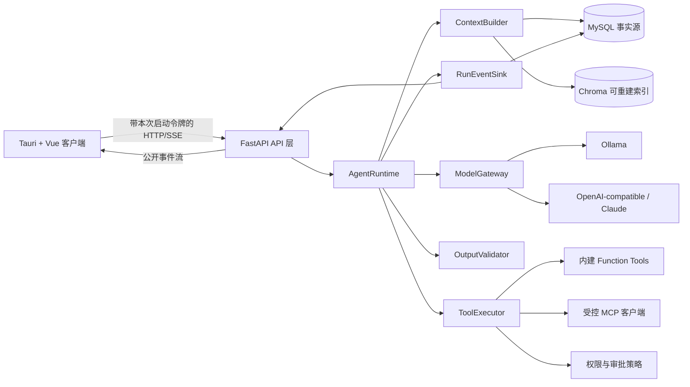

# PrivateAgent 目标架构

> 状态：Phase 0 基线设计
> 日期：2026-08-02
> 依据：[现代化审计](./modernization-audit.md) 与现有代码、数据库、构建和测试证据

## 1. 架构结论

PrivateAgent 的现代化采用“保留产品骨架、替换核心执行闭环”的路线：

- 保留 Tauri 2、Vue 3、FastAPI、MySQL、Chroma、SSE 和现有领域功能。
- 将当前由前端拼接的“规划—审批—执行—再次提交”流程收回后端，形成唯一的 `AgentRuntime`。
- 将模型访问统一为有能力声明、结构化工具调用、用量、追踪和取消语义的 `ModelGateway`。
- 内建能力继续使用 Function Tools；MCP 只承载外部或跨进程能力，不把所有内建工具强行 MCP 化。
- MySQL 继续作为业务事实源；Chroma 继续作为可重建的向量索引，不新增第二套向量数据库。
- 不立即引入 LangGraph。只有当持久化图执行、复杂分支和人工中断无法由轻量运行时清晰维护时，才重新评估。
- 所有数据库演进采用新增表、字段和兼容层；现有会话、消息、文档、记忆、任务和工具调用数据不做破坏性改名或重写。

## 2. 设计目标与非目标

### 2.1 设计目标

1. 一个后端可持久化、可取消、可恢复、可观测的 Agent 执行闭环。
2. 原生结构化工具调用，严格输入输出验证，明确权限和审批边界。
3. 确定性的上下文预算、压缩和来源标注，避免无限追加历史。
4. 可追踪、可纠错、可过期的结构化记忆，以及独立的语义检索索引。
5. 可回滚、可核验、不会先删旧索引的 RAG 重建流程。
6. 受控的 MCP 客户端和服务端扩展边界。
7. 本地桌面默认安全：随机会话凭证、严格 Origin/Host、CSP、密钥不进入渲染进程。
8. 兼容现有 API 和 UI 的渐进迁移，任一阶段可以回退到前一稳定状态。

### 2.2 当前阶段非目标

- 不把应用改造成云端多租户 SaaS。
- 不替换 Tauri、Vue、FastAPI、MySQL 或 Chroma。
- 不以“框架完整度”为理由引入 LangGraph、消息队列、服务网格或新的向量数据库。
- 不执行全量目录重排；只有当某一能力进入实现时，才迁移与其直接相关的文件。
- 不暴露模型隐式思维过程。观测事件只包含可审计的状态、输入输出摘要、工具结果和错误。

## 3. 目标逻辑架构



核心约束：API、桌面 UI、后台任务和未来 MCP 入口都调用同一个运行时；任何入口都不能自行实现第二套工具循环。

## 4. 建议的源码边界

以下是随功能逐步形成的目标边界，不要求一次性移动现有文件：

```text
src/personal_assistant/
  agents/
    contracts.py          # run、step、公开事件、限制和取消契约
    runtime.py            # 唯一 Agent 循环
    context_builder.py    # 上下文选择、预算与压缩
    validation.py         # 最终输出和结构化输出验证
  llm/
    contracts.py          # 模型请求、响应、tool_calls、usage、capabilities
    gateway.py            # 路由、超时、取消、重试和追踪
    ollama.py
    openai_compatible.py
    claude.py
  tools/
    contracts.py          # ToolSpec、风险、权限和审批契约
    registry.py
    executor.py
    builtin/              # 仅在迁移某个现有工具时创建
  mcp/
    client.py
    registry.py
    policy.py
  core/                   # 现有领域服务与仓储；按需迁移，不批量搬家
  api/                    # 认证、DTO、SSE 与兼容适配
```

迁移期间允许旧的 `core/provider.py`、`core/tools.py` 等通过适配器调用新边界。新代码不得反向依赖旧的 API 路由或 Vue 数据结构。

## 5. AgentRuntime

### 5.1 运行模型

一次运行由 `agent_run` 和有序 `run_step` 组成：

```text
created -> running -> waiting_approval -> running -> completed
                    \-> cancelled
                    \-> failed
                    \-> timed_out
```

运行时负责：

1. 装载会话、Agent 配置和运行限制。
2. 调用 `ContextBuilder` 生成有预算的模型输入。
3. 调用 `ModelGateway`，只接收结构化 `tool_calls` 或最终响应。
4. 对每个工具调用执行注册、权限、参数、审批和超时检查。
5. 把规范化工具结果追加为新的运行步骤，然后继续模型循环。
6. 达到最大步骤、工具调用数、令牌、耗时或取消信号时确定性终止。
7. 在事务边界保存步骤和公开事件；SSE 断开不能中止持久化状态机。

### 5.2 强制运行限制

每次运行必须显式拥有：

- `max_steps`
- `max_tool_calls`
- `max_wall_time_ms`
- `max_input_tokens`
- `max_output_tokens`
- `max_cost`（远程模型启用时）
- `cancellation_token`

缺少限制的调用不得进入运行循环。限制命中是正常终态，不等同于内部异常。

### 5.3 公开事件

建议的稳定事件集合：

- `run.started`
- `context.prepared`
- `model.started`
- `model.delta`
- `model.completed`
- `tool.requested`
- `tool.approval_required`
- `tool.started`
- `tool.completed`
- `tool.failed`
- `run.completed`
- `run.failed`
- `run.cancelled`

事件携带 `run_id`、`step_id`、`sequence`、`timestamp`、`trace_id` 和最小必要载荷。事件中不记录密钥、完整敏感文件内容或模型隐式推理。

## 6. ModelGateway 契约

每个模型适配器必须声明能力，调用者不能从提供商名称猜测能力：

```text
streaming
native_tool_calls
structured_output
vision
max_context_tokens
usage_reporting
cancellation
```

统一响应至少包含：

- 文本增量或最终文本；
- 结构化 `tool_calls[]`，每项含调用 ID、工具名和 JSON 参数；
- 完成原因；
- 输入、输出和缓存令牌用量（提供商可得时）；
- 模型、提供商、延迟、重试次数和追踪 ID；
- 规范化错误类别。

远程模型基址必须通过配置策略校验：默认 HTTPS；拒绝环回、链路本地、私网和云元数据地址，除非用户对该具体地址显式授信。重试只适用于幂等模型请求，并采用带抖动的有界退避；工具执行不会因模型重试而重复提交。

当前落地状态：Ollama 使用 `/api/chat` 原生 NDJSON；OpenAI-compatible 使用 Chat Completions SSE；Claude 使用 Messages SSE。三者都在返回完整响应前逐片回调，并聚合最终文本、工具调用和可得 usage；Claude thinking/signature 不进入可见文本。任何 provider 在发布首个 delta 后都不得自动重试，缺终止帧/未闭合 block 会失败关闭。聊天 SSE 的 delta 是容量受限的进程内传输优化，不逐 token 写数据库；`model.completed` 和 `run.completed` 保存的完整响应才是恢复事实。工具可用时先缓冲当前回合文字，确认无结构化工具调用后再发布，避免向用户泄露中间草稿。带 Schema 的统一请求映射为 OpenAI `response_format`、Claude `output_config.format` 或 Ollama `format`，普通与流式路径一致；适配器未声明能力时先于网络调用拒绝。远程协议目前通过 MockTransport 合同回归，真实付费端点 smoke 仍需用户提供授权环境。

可选的 Runtime 输出验证层位于最终无工具回答与 `run.completed` 之间。验证器由可信调用方固定，当前支持非空、JSON Schema、组合和 RAG 引用验证；失败生成有界反馈并最多修正两次，所有尝试写 durable events，审批恢复不重置计数。结构化 Schema 在下发 Provider 前限制大小、深度、节点数并拒绝远程引用；Provider 原生约束后仍在本地复核最终文本，避免把拒答、截断或仅部分支持 Schema 的响应误判为完成。引用验证要求召回身份真实且 quote 为 chunk 精确子串，只证明可追溯性，不自动证明全部推论。durable Agent 的 RAG 工作流从同一 run 已成功持久化的检索工具输出重载证据并复核大小/SHA，因此开始、重试和审批恢复不依赖易失内存，也不接受模型自报来源。验证器不能授予 capability、消费审批或直接执行副作用。默认关闭的固定非空策略已接入 Agent API 与 AgentRuntime 兼容聊天；RAG 引用工作流要求 RAG 工具与输出验证两个开关同时开启，三项聊天/RAG/验证开关同时启用时知识库兼容聊天也进入该链并把验证后的 answer/sources 投影回旧 SSE，缺少任一开关则精确回退。代码测试、diff、Shell/API 响应等领域验证仍需逐项实现，不能用通用“自我反思”代替。

## 7. 工具、权限与审批

### 7.1 ToolSpec

每个工具通过一个类型化规范注册：

```text
name / version / description
input_schema / output_schema
risk_level
required_capabilities
timeout_ms / max_output_bytes
idempotency
supports_cancellation
redaction_policy
executor
```

输入在进入执行器前验证，输出在写入模型上下文前验证。验证失败是工具错误，不把任意文本包装成成功结果。

### 7.2 权限模型

权限粒度采用能力而不是工具名，例如：

- `filesystem.read`
- `filesystem.write`
- `process.execute`
- `network.fetch`
- `database.query`
- `external.mcp`

策略由以下因素共同决定：本地用户、Agent 配置、会话、工具、参数范围、受信路径、目标域名和风险等级。

### 7.3 审批安全

审批记录绑定：

- `run_id` 和 `tool_call_id`
- 工具名和版本
- 规范化参数哈希
- 风险说明和能力集合
- 过期时间
- 一次性批准令牌

批准后参数有任何变化都必须重新审批。`safe` 工具可由策略自动批准，`confirm` 工具必须等待用户，`restricted` 工具默认拒绝并要求更高等级的显式授权。

## 8. ContextBuilder

上下文不再由 `chat.py` 直接追加全部历史。`ContextBuilder` 按固定优先级和令牌预算组成上下文：

1. 系统策略和 Agent 指令；
2. 当前用户请求；
3. 待处理的工具调用及结果；
4. 最近、未压缩的对话窗口；
5. 经确认且与当前任务相关的结构化记忆；
6. 有来源和权限标记的 RAG 片段；
7. 较早对话的可追溯摘要。

每个区段有独立上限和总预算。超限时先降低低相关 RAG、再压缩旧历史，永远不删除当前请求、系统策略、未完成工具结果或安全约束。压缩结果记录覆盖的消息范围、生成模型、时间和校验摘要，原消息继续保留在数据库。

提示注入防护在 ContextBuilder 和 ToolExecutor 两侧生效：外部文档明确标记为不可信数据，文档中的指令不能改变系统策略、权限或审批要求。

## 9. 记忆架构

记忆分成两个层面：

- 结构化记忆：用户偏好、事实、项目约束、决定和待办，存 MySQL，是可查看和修改的事实源。
- 语义索引：结构化记忆的可重建向量表示，存 Chroma，只服务召回。

结构化记忆逐步补充：`owner_id`、稳定键、来源消息、置信度、重要度、首次/最后确认时间、过期时间、敏感级别、冲突关系和版本。自动抽取只生成候选项；敏感信息、低置信度事实和与既有记忆冲突的内容不自动启用。

删除采用软删除并写审计事件。物理清理由单独维护任务完成，不能通过级联删除同时抹去审计证据。

## 10. RAG 与索引一致性

### 10.1 文档处理

解析层输出带结构的块，而不是把全部内容拼成字符串：

- PDF：页码、块序、标题线索；
- DOCX：标题层级、段落、表格位置；
- Markdown：标题路径、代码块和段落；
- TXT：行范围和编码信息。

切分器按文档类型、标题边界和模型 token 计数切分，保留 `document_id`、页码/标题路径、字符或行范围、内容哈希、解析器版本和索引版本。

当前落地状态：版本化路径已按 PDF 页、DOCX 段落/Heading、Markdown/TXT 段落、Python 顶层 AST 类/函数和常见代码类/函数/Vue section 保留页、字符、行、标题路径、source kind、parser version 与独立来源哈希；片段不会跨来源块，缺失或哈希不一致会失败关闭。chunk 写入保守 token 估算且索引 source hash 绑定原始文件字节。超长 block 仍是字符窗口，不是 provider tokenizer 窗口；DOCX 表格、Markdown 代码块语义和编码信息尚未达到上述完整目标。legacy `doc_chunks` 保持原行为，但已能导入同一组代码扩展名并写 token 估算。

### 10.2 版本化重建

重建采用“旁路构建—核验—原子切换—延迟清理”：

1. 创建新的 `index_version` 和导入任务；
2. 在新版本写 MySQL chunks 和 Chroma collection/namespace；
3. 校验数量、哈希、抽样召回和失败率；
4. 在短事务中切换 `active_index_version`；
5. 保留旧版本到回滚窗口结束后再清理。

任何失败都保持旧版本可查询。MySQL 是元数据和状态事实源；Chroma 丢失时可从 MySQL 和原文重建。

### 10.3 检索

保留现有 BM25、向量检索、RRF 和重排资产，增加：

- 查询改写的可关闭开关；
- 文档/项目/权限过滤；
- 相似片段去重和每文档配额；
- 召回、重排和最终引用的独立追踪；
- 离线固定数据集上的 Recall@K、MRR、引用正确率和延迟回归。

## 11. MCP 边界

MCP 是受控扩展机制，不是 Agent 核心：

- `McpRegistry` 保存服务器配置、传输、能力、信任状态和启用范围。
- `McpClient` 负责初始化、能力发现、调用、取消、超时和协议错误归一化。
- MCP 工具发现结果转换为内部 `ToolSpec`，继续经过相同的验证、权限和审批链。
- 服务器进程使用固定命令和参数数组，不经过 shell；环境变量使用白名单；stdio 和 HTTP 传输均有限流和输出上限。
- 外部 MCP 返回的文本、资源和提示一律视为不可信输入。
- 只有明确需要被其他 MCP 客户端复用的少量能力，才通过本应用的 MCP Server 暴露。

当前落地状态：默认关闭的 MCP Client 已实现服务器注册、官方 SDK stdio/Streamable HTTP、发现到 `ToolSpec` 的适配、统一确认审批、持久化恢复与 metadata-only 审计。OS keyring 引用可安全注入 stdio 环境、HTTP Bearer 或受限 API-key header，官方 SDK 的真实 loopback server 已完成两种静态认证互操作；HTTP 解析结果已钉到 TCP backend，且保留原域名 TLS 身份校验。本应用 MCP Server 因无真实外部客户端需求而不实施；OAuth、第三方生产服务验收、企业代理和证书 pinning 仍是显式缺口，详见 `docs/mcp-design.md`。

## 12. 数据库演进

### 12.1 保留的事实表

保留现有物理表和主键，包括 `sessions`、`messages`、`tool_calls`、`documents`、`doc_chunks`、`memory_items`、`agent_tasks`、`agent_task_steps`、`trusted_paths` 和集成相关表。新代码通过适配层读取旧字段，不在首个迁移中重命名。

### 12.2 建议的新增实体

- `users` 或 `local_principals`：先支持单本地用户，为未来所有权提供稳定键。
- `agents`：Agent 配置、提示版本、模型路由和默认限制。
- `agent_runs`：运行状态、会话、模型、限制、用量、追踪和终态。
- `run_steps`：模型、工具、审批、压缩和最终输出的有序步骤。
- `tool_approvals`：参数哈希、决策、过期和一次性令牌。
- `agent_tool_executions`：工具调用 claim、租约、attempt、审批关联、脱敏结果哈希和不确定状态，是运行恢复的执行事实表。
- `tool_configs`：工具级启用和权限配置。
- `conversation_summaries`：覆盖范围、版本和生成证据。
- `mcp_servers`：受信服务器及传输配置；秘密只保存凭据引用。
- `knowledge_bases`、`document_index_versions`、`document_index_jobs`：版本化索引状态。
- `audit_logs`：不可变安全和高风险操作事件。

现有表只做可空字段和索引的增量扩展，例如 `owner_id`、`run_id`、`active_index_version_id`、`deleted_at`。先双写和回填，后切读；兼容期结束前不删除旧列。

### 12.3 迁移规则

1. 迁移前记录 schema 版本、关键表行数和备份位置。
2. 每个迁移可重复检测当前状态，并在测试数据库和主数据库副本验证。
3. 大回填分批、可续跑，不持有长事务。
4. 先增加、再双写、再切读、最后在独立版本清理。
5. 应用启动时迁移失败必须阻止服务进入可写状态；不得记录错误后继续运行。

## 13. API 与前端

### 13.1 目标 API

核心入口逐步收敛为：

```text
POST   /agent-runs
GET    /agent-runs/{run_id}
GET    /agent-runs/{run_id}/events
POST   /agent-runs/{run_id}/cancel
POST   /agent-runs/{run_id}/approvals/{approval_id}
```

现有 `/chat/stream`、工具规划和执行端点在兼容期内部映射到新运行时，并带弃用日志和调用计数。当前 `/tools`、`/tools/plan`、旧 approve/reject 及 tool-call 列表/详情均返回弃用头；tool registry、planner、chat 路由及旧 tool-call 端点记录固定标签结构化日志并在诊断快照暴露当前进程计数。桌面端通过轻量 `/capabilities` 选择唯一执行链：Runtime 模式的新消息直接进入 `/chat/stream`，legacy 模式才调用旧 planner；升级前 pending 调用仍可耗尽。兼容调用在足够长观察窗口内归零后才删除旧端点。

### 13.2 前端职责

Vue 客户端只负责：

- 创建运行并订阅事件；
- 将事件投影为消息、计划、工具卡片和状态；
- 提交审批、取消和重试意图；
- 断线后按 `run_id` 与最后事件序号恢复；
- 展示来源、耗时、模型、用量和可公开错误。

`App.vue` 不再判断工具是否应执行，也不把工具结果拼成新的用户请求。长期异步工作放入可清理的 composable/service；组件卸载时释放 SSE、计时器和监听器。

### 13.3 兼容映射

| 现有能力 | 迁移期行为 | 最终归属 |
|---|---|---|
| `/chat/stream` | 适配到单次 `AgentRun`，保持 SSE 事件兼容 | `/agent-runs/{id}/events` |
| 工具 plan/approve/execute | 旧 API 查询或推进同一运行 | Runtime + approval API |
| `agent_tasks` | 保持现有任务功能，逐步映射 run/step | 统一运行状态与任务视图 |
| 前端工具结果二次提交 | 兼容期保留开关和告警 | 删除，由后端循环接续 |

## 14. 本地安全模型

“仅监听 127.0.0.1”不是认证。目标默认值：

1. sidecar 每次启动生成高熵随机令牌，通过 Tauri 进程边界注入；渲染进程仅持有本次会话令牌。
2. 所有 API 和 SSE 校验 Bearer 令牌；健康检查仅暴露最低限度信息。
3. CORS 只允许 Tauri/WebView 的确定来源，严格校验 `Origin` 和 `Host`。
4. 启用 CSP，默认拒绝外部脚本和任意连接，只开放所需本地 API。
5. 数据库、模型和 MCP 密钥进入系统凭据存储；Vue 配置 DTO 只返回是否已配置和脱敏标识。
6. 日志默认结构化并脱敏；高风险操作进入独立审计流。
7. 文件路径、进程参数、URL 和 MCP 配置在使用点再次验证，避免只依赖 UI 校验。

## 15. 可观测性

所有请求、运行、步骤、模型调用和工具调用共享 `trace_id`，并各自拥有稳定 ID。建议指标：

- 运行完成率、取消率、等待审批时长和恢复成功率；
- 模型首 token、总延迟、错误率、重试和 token/cost；
- 工具执行、拒绝、超时、输出截断和重复调用；
- ContextBuilder 各区段 token、压缩次数和超预算终止；
- RAG 召回/重排延迟、空召回率、引用率和版本切换结果；
- MCP 握手、调用、协议错误和策略拒绝。

日志以 JSON 输出到轮转文件和开发控制台。公开事件、运维日志与安全审计是三种不同用途的数据，不共享无限制载荷。

## 16. 部署形态

主要交付仍是 Tauri 桌面应用和 Python sidecar。可选 `Dockerfile`/`compose.yaml` 提供与桌面模式分离的单机后端：容器内 wildcard bind 需要独立显式开关和强制 Bearer，宿主只发布 loopback；API 非 root/只读运行，API/MySQL 密码使用 secret files，MySQL、Chroma 和可选 Ollama 使用独立持久卷。它不能复用 Windows Credential Manager、动态 WebView token 或桌面文件授权，也不代表公网、多租户或水平扩容支持。

容器 API 启动前等待独立 MySQL 并执行 Alembic；任何迁移失败都会拒绝提供可写服务。命名卷不是备份，桌面主库和容器新库不得通过同名数据库或未审计挂载混用。完整运行和回滚边界见 `docs/deployment-guide.md` §8。

会话压缩由默认关闭的单实例逻辑 worker 承担，不进入请求内同步链路。它使用跨进程 MySQL 命名锁、固定来源范围和 hash、结构化输出验证以及消息/字符预算；每个 tick 最多生成一条，保留最近消息和全部原始记录。远程摘要调用另设二次许可，schema 低于 0017 时 fail closed。

离线是可预期状态：Ollama 不可用时健康状态应明确退化；远程提供商不可用时保留可选择的本地模型，不用无界重试阻塞运行。

## 17. LangGraph 引入门槛

只有同时出现以下证据时才引入：

- 至少两个真实流程需要多分支、循环和跨进程恢复；
- 当前轻量状态机产生了重复持久化或补偿代码；
- 需要人工中断后跨版本恢复，且自研协议成本已可测量；
- 用代表性流程完成 PoC，证明收益大于依赖、迁移和调试成本。

若引入，LangGraph 只能实现 `AgentRuntime` 内部编排，不能成为 API、工具协议、数据库模型或 UI 的公共契约。

## 18. 架构验收标准

目标架构完成时应满足：

- 一次用户请求由一个后端运行闭环完成，可取消、可审批、可恢复。
- 所有工具调用均为结构化参数，并经过 schema、权限、超时和输出校验。
- 运行在固定预算内确定性终止，长会话不再无限追加历史。
- RAG 重建失败不会影响现有索引；引用可定位到原文结构。
- 记忆可查看、纠错、禁用、过期和审计。
- MCP 与内建工具走同一策略链，任意外部内容不能升级权限。
- 主数据没有因测试、迁移或索引失败而丢失。
- Vue 不再实现 Agent 决策循环；刷新或断线后能恢复运行视图。
- 后端、前端、Rust、数据库迁移和端到端测试在隔离环境持续通过。
