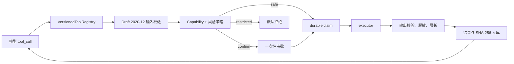

# 工具系统、权限与审批设计

> 状态：类型契约、审批、checkpoint 恢复和 durable execution 已实现；高风险通用 Shell、任意写文件和部署工具未向新 Runtime 注册。

## 1. 组件边界

工具执行链路由以下组件组成：

- `ToolSpec`：`src/personal_assistant/agents/tools.py`
- `VersionedToolRegistry`：按名称和版本注册，重复定义拒绝。
- `ToolCapabilityPolicy`：按 capability 决策，不以工具名称代替权限。
- `ValidatedToolDispatcher`：输入/输出 Schema、风险、审批、超时、取消、大小限制和脱敏。
- `ToolApprovalRepository`：`src/personal_assistant/agents/approvals.py`
- `ToolExecutionRepository`：`src/personal_assistant/agents/executions.py`
- 旧工具适配：`src/personal_assistant/core/tool_adapter.py`



## 2. ToolSpec

`ToolSpec` 至少声明：

- 稳定 `name` 与 `version`
- `description`
- Draft 2020-12 `input_schema` 与 `output_schema`
- `risk_level`
- `required_capabilities`
- `timeout_ms` 与 `max_output_bytes`
- `idempotency`
- `supports_cancellation`
- `redaction_policy` 与敏感字段集合
- executor

远程 `$ref` 被拒绝，避免执行期加载外部 Schema。模型参数先规范化并校验，工具结果必须再次校验后才能进入模型上下文；任意字符串不会被包装成伪成功结果。

## 3. 权限和风险

能力枚举定义在 `ToolCapability`，当前包括文件读取、进程执行、数据库查询和外部 MCP 等边界。默认策略是 deny；只在本次 Agent 配置、工具声明、参数范围和用户授权同时满足时允许。

风险级别：

| 级别 | 行为 |
|---|---|
| `safe` | 策略允许后可自动执行，仍记录 execution |
| `confirm` | 必须生成审批并暂停 run |
| `restricted` | 默认拒绝，需要更高层明确授权和单独实现 |

新 Runtime 当前注册七个无副作用能力：`search_files`、`grep_code`、`get_git_status`、`get_git_diff`、`propose_patch` 为 `safe`；可能读取敏感本地内容的 `read_file`、`read_code_file` 为 `confirm`，必须经过 durable approval/checkpoint/execution 闭环。`propose_patch` 只生成预览，不写文件，diff 硬限制为 200,000 字符并声明截断状态。旧工具仍由 `src/personal_assistant/core/tools.py` 服务兼容页面；不能因为旧 API 存在就视为已获新 Runtime 授权。

当 `PA_CHAT_AGENT_RUNTIME_ENABLED` 与 `PA_AGENT_RUN_READ_ONLY_TOOLS_ENABLED` 同时开启时，旧 `/tools/plan` 的候选注册表会排除上述七个 Runtime-owned 工具；即使旧规划模型仍返回其中一个名称，也不会创建旧 `tool_call`。现代桌面端还会先读取 `/capabilities`，在聊天 Runtime 模式下让新消息直接进入 `/chat/stream`，因此不会同时运行旧 planner 与 Runtime planner。旧后端、明确 legacy 模式和升级前 pending 调用继续保留兼容行为；观察期归零后再删除旧端点。

旧规划端点与旧 approve/reject 写端点返回 `Deprecation: true`，并按固定 path/mode/outcome 标签写结构化日志和进程级计数；动态工具调用 ID 不进入标签。聊天入口也区分 Runtime 与四种 legacy 回退原因。诊断快照只暴露低基数计数与进程启动时间，不包含用户消息、参数或工具结果；重启会清零，因此删除判断必须使用足够长的日志/版本观察窗口。

## 4. 审批安全

迁移 `0014_tool_approvals.py` 创建 `tool_approvals`。审批精确绑定：

- run、step、tool call
- 工具名称和版本
- 规范化参数 SHA-256
- 风险级别和 capability 集合
- 过期时间
- 一次性 token 的哈希

原始 token 只在后端内存中流转，不返回 Vue，也不写数据库。参数、工具版本、run/step 或 token 任一不匹配都拒绝；并发双消费只有一个事务成功。批准后参数变化必须重新审批。

迁移 `0015` 的 checkpoint 允许等待批准后从确定状态恢复。API 只返回审批元数据和脱敏参数摘要；刷新后的 UI 可重新加载未决审批。

## 5. Durable execution

迁移 `0016_agent_tool_executions.py` 创建 `agent_tool_executions`。执行前用规范化幂等键和哈希 claim；结果在返回 Runtime 前完成：

1. output Schema 校验；
2. 敏感值脱敏；
3. 字节上限裁剪或拒绝；
4. 结果和 SHA-256 持久化；
5. 记录成功、失败、超时或取消终态。

幂等工具在进程于“执行结果已提交、Runtime 事件未提交”之间退出时可以回放已提交结果。非幂等且结果不确定的 execution 失败关闭，不自动重复副作用。

## 6. MCP 与内置工具

内置、本地且与产品强耦合的能力继续作为 Function Tool。只有外部、跨进程或需要独立生命周期的能力才通过 MCP 接入。`src/personal_assistant/mcp/manager.py` 会把发现的 MCP 工具转换成内部 `ToolSpec`，统一固定为 `confirm`，并要求 `external.mcp` capability；MCP 不能绕过审批链。

完整 MCP 边界见 `docs/mcp-design.md`。

## 7. 已知边界

- 旧 `grep_code` 线程任务和 Git 子进程的强取消清理仍需加固。
- `read_file` 和 `read_code_file` 的底层线程读取不可强制中止，因此声明 `supports_cancellation=false`；取消后 Runtime 不发布迟到结果。
- 通用 Shell、删除、部署、消息发送和系统配置能力没有进入新注册表；未来每个能力需独立 Schema、allowlist、审批和恢复语义。
- 旧文本 JSON 规划器只承载 Runtime 关闭或旧后端的兼容工具；Agent Runtime 模式的新桌面消息已不再进入它。旧审批卡片仍保留重载/耗尽路径，端点删除还需兼容遥测观察窗归零。
- Agent-enabled API 通过连接级 MySQL owner lock 和启动 reconciler 避免两个进程同时执行；崩溃后幂等 execution 可安全标记失败，非幂等 execution 一律标为 unknown。reconciler 不自动重放未知副作用，后续处置必须基于审计和人工决定。

## 8. 验证

```powershell
uv run pytest -q tests/test_tool_contracts.py tests/test_tool_approvals.py `
  tests/test_tool_executions.py tests/test_tools.py tests/test_agent_runs_api.py
```

覆盖输入/输出校验、远程 Schema 引用拒绝、参数替换、token 重放、并发消费、结果脱敏、大小限制、claim 冲突和审批恢复。上线与回滚顺序见 `docs/deployment-guide.md`。
