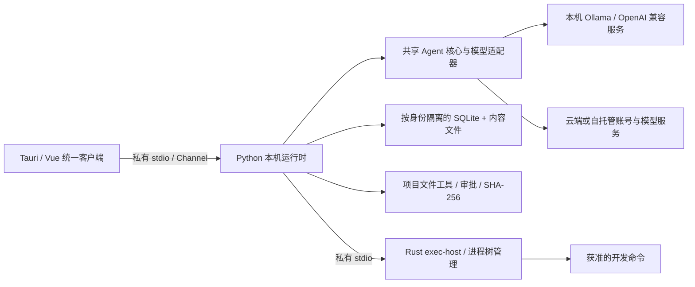

# 统一客户端实现与验收说明

本说明记录 `E:\Program\Agent` 统一客户端的实现与本机隔离验证。在该实现验收阶段没有发布、覆盖现有安装、迁移真实账号记录或修改服务器。后续按用户要求提交、推送与预览包发行的范围及服务器操作步骤，见[统一客户端预览版与服务器更新](./unified-preview-server-update.md)。`docs/project-state.md` 保留原有历史快照，本说明不将历史部署状态改写为上线成功。

## 1. 统一后的边界

统一的是桌面入口、Coding 执行核心和本机记录，不是把整个业务后端换成 SQLite。参考 Codex 的共享核心与 app-server 进程分离方式，以及提供的 Grok Bot 压缩包中的客户端组织思路；没有执行压缩包中的程序，也没有复制第三方实现。保留 Python 核心以复用现有模型契约和测试，避免为了统一客户端再维护一套 Rust Agent 业务逻辑。

记录层选择 SQLite 加内容文件：SQLite 负责关联、事务和恢复，较大正文按摘要落盘。纯 JSON/JSONL 更适合简单追加日志，但本项目还需要账号隔离、审批状态与关联迁移；只用日志文件会增加索引和一致性恢复工作。共享核心替代两套执行逻辑，私有管道替代默认回环 HTTP，是这次采用的替代方案。



| 连接方式 | 身份与记录 | 模型 | 本机依赖 |
| --- | --- | --- | --- |
| 本地模型 | 当前系统用户下的本机身份，独立 SQLite | 回环地址 Ollama / 无密钥 OpenAI 兼容服务 | 所选模型服务、实际需要的开发工具 |
| 云端账号 | 服务源站 + 用户 ID，独立 SQLite | 账号服务模型，或切换成本机模型 | 开发工具；使用本机模型时还需模型服务 |
| 自托管账号 | 与云端相同规则，自托管源站独立隔离 | 自托管模型服务，或本机模型 | 同上 |

切换同一账号的模型执行位置不会另建账号记录库；切换账号、源站或本机身份不自动合并记录。连接设置只保存地址、协议、模型名和容量，不保存模型密钥。远程账号服务必须 HTTPS；HTTP 仅允许回环地址。直接本机模型连接目前只支持回环地址，不支持携带 API key 的服务。

项目目录、文件修改、审批、运行和命令均由本机处理，失联时不回退到服务器执行。模型请求仍会把必要的对话、选中的代码及工具结果发送给所选模型服务；本机存储不等于远程模型看不到这些请求内容。

旧完整后端继续提供账号、管理、知识库、记忆等可选业务服务；这些服务的 MySQL/ChromaDB 数据不在本次 SQLite 迁移范围内。本地模型模式不具备这些业务服务，相关旧页面可能提示不可用；需要时切换到提供对应能力的账号服务。工作树创建、上下文自动压缩等尚未移植的能力不会声明为已支持。

## 2. 代码归属与传输

- `src/private_agent_core/`：共享契约、AgentRuntime、模型网关/适配器和 Rust 执行器客户端，不依赖完整业务后端。
- `src/personal_assistant/`：保留业务功能；原共享模块路径用兼容别名转到公共核心，保持类型身份与已有调用路径。
- `src/private_agent_local/`：SQLite、身份绑定、项目工具、审批、上下文计量、历史迁移和本机服务生命周期。
- `apps/exec-host/`：命令进程、输出、取消、超时和 Windows Job 生命周期，不决定用户审批策略。
- `apps/desktop/src-tauri/src/local_executor.rs`：运行时进程与私有管道；前端不获得运行时端口或启动凭证。
- `apps/desktop/src/services/privateTransport.ts`：将有界管道帧适配为既有 Response/SSE 接口，保留取消和流式消费。

统一安装包默认不启动本机 HTTP 监听。旧 `--port` 接口仅保留兼容入口，不是新客户端的传输方式。每条请求正文最多 2 MiB，管道帧最多 8 MiB，同时请求最多 64 条；读取停滞、错误身份或损坏协议会关闭请求，不静默转发到云端。

## 3. SQLite 与恢复

Windows 默认数据位置为当前用户的 `%LOCALAPPDATA%\com.personal-assistant.desktop\local-projects\<账号摘要>\projects.sqlite3`。账号摘要是 `SHA-256(服务源站 + NUL + 用户 ID)`；本机身份使用 `local://device` 和本机用户 ID。旧 Remote 安装使用独立的 `com.personal-assistant.desktop.remote` 应用目录。

当前 SQLite schema 为 3：项目、工作区、会话、消息、运行、追加事件、审批、执行、限时授权、审计与迁移批次分别保存。采用 WAL、foreign_keys、5 秒 busy timeout 和 FULL 同步。较大的内容存入同目录 `artifacts/<SHA-256>`，读取时校验长度及摘要。SQLite 不加密；账号目录是应用层隔离，不阻止同一系统用户自行读取磁盘。不要把它当作多用户操作系统安全隔离。

旧轻量 `objects/runs` 表在首次打开时事务迁移，原始表保留为 legacy 表；schema 2 升级到 3 同样先生成备份。备份命名沿用 `*.pre-v2-<唯一标识>.sqlite3`，实际版本以备份内的 `PRAGMA user_version` 为准。迁移记录包含备份摘要与完整性检查结果。

启动恢复不会重放命令：未完成运行标记失败，待审批记录取消，执行中的命令记为结果未知，完全访问授权撤销。未知结果应人工检查项目文件后再决定下一步，不自动重试副作用操作。

## 4. 四种权限与上下文修复

| 模式 | 文件修改 | 命令 |
| --- | --- | --- |
| 只读 | 拒绝 | 拒绝 |
| 总是询问 | 预览后逐次批准 | 已登记测试/构建及诊断命令逐次批准 |
| 替我批准 | 项目内写入自动批准并审计 | 精确匹配的 Git 诊断自动批准；项目测试/构建脚本仍询问 |
| 完全访问 | 用户确认限时授权后允许普通绝对路径 | 授权内自动执行登记的开发程序及动作；拒绝直接 shell 拼接、内联求值、提权等入口 |

完全访问授权最长 4 小时，绑定会话和项目；每次操作前、等待审批后再次验证。撤销、退出账号、切换连接/项目会撤权，正在进行的完全访问任务会取消。非活动工作区不能开始任务。审批绑定参数、工具、项目位置及预览摘要，只能消费一次。文件写入核对原内容 SHA-256，并记录写后摘要，防止批准期间文件发生变化后被静默覆盖。

文件工具拒绝路径回退、链接、敏感文件和客户端内部目录。命令采用参数数组、登记规则和清理后的环境，通过 `exec-host` 执行；发布包运行前验证宿主 SHA-256。Windows Job 回收命令后代，输出有界，超时停止。客户端强制关闭还需回收 PyInstaller 引导进程树。

**安全边界：以上属于工具策略和进程生命周期控制，不是完整 OS 沙箱。** 获准的项目脚本可使用当前系统用户的文件和网络权限，间接行为不能仅靠命令白名单阻止。“完全访问”也不代表管理员权限。宿主实测报告 `sandbox_available=false`；未对外宣称网络沙箱。宿主与旁置摘要同时被系统用户篡改的情况不由 SHA 文件单独防护，正式发行仍需既有签名和可信安装链。

上下文不再因为本机能力开关关闭而永久不可用。容量来自当前所选模型配置；占用来自该模型最近一次请求的供应商 input tokens，不使用整段对话累计 token 或字符估算。缓存命中率明确标为“最近请求”。切换模型后旧模型用量不混入新容量。未知容量、尚未请求或供应商不返回 usage 时显示具体原因；不会伪造一个精确比例。本地 Ollama 的配置容量同时发送为模型请求的 num_ctx。

## 5. 两类旧历史如何迁移

在统一客户端“设置 → 备份”中打开本机历史迁移，先登录与旧记录相同的账号。

1. **旧联网轻量版**：先正常退出旧客户端，选择其账号目录下的 `projects.sqlite3`。保留整个原账号目录，尤其是 WAL/SHM 和 `artifacts`，不要只复制数据库主文件后误认为备份完整。导入器只读打开旧库并核对账号目录摘要，不读取其他账号。
2. **旧完整后端**：账号服务先部署包含 `GET /desktop/history/export` 的本次代码，再通过“导出旧完整后端历史”下载 JSON。导出按当前用户过滤，字段采用白名单；无 owner 的遗留数据不猜测归属。反向代理必须正确传递外部源站，否则导出来源与登录源站不一致时会拒绝导入。当前任务未部署该接口。
3. 选择文件后查看摘要和各类记录数量，逐个为需要继续使用的 Coding 项目选择本机目录；未选目录的项目、非根工作区、普通聊天和旧 AgentTask 只进入只读归档。
4. 确认后重新读取并校验 SHA，生成当前库备份，再在单个事务中重映射主键及关联。同一个文件摘要不会重复导入。原始归档、AgentTask 计划/步骤/证据与运行步骤保持可读，审批和授权不会恢复，命令不会重放。
5. 导入后从项目页刷新任务。每个批次支持只读查看与“导出原始归档”；“导出当前工作记录”只导出当前可用记录，不包含所有历史导入批次的原始归档，完整备份应另外保存各批次归档。
6. 仅在导入后数据库未发生其他修改时支持自动回滚；回滚校验备份摘要且保留备份。若已创建任务、撤权或发生其他写入，会拒绝覆盖新数据，需先另行备份并人工处理。

历史 JSON 上限为 64 MiB、总记录 50000 条。超限会拒绝，不静默截断；当前界面没有大库分批导出功能，超限需另行制定分批迁移。JSON 包含对话与代码内容，应妥善保存。文件正文即使曾由用户输入敏感内容，也不能保证自动脱敏；字段白名单只是排除配置和有效授权字段。

## 6. 构建和兼容

统一客户端主构建入口是 `scripts/build-client.cmd`，复用现有构建工具链。它同时打包 Python 运行时、Rust exec-host 与 SHA 清单。现有 `.venv`、桌面 node_modules、Node、Rust/MSVC、WebView2 和所需开发工具应已经就绪；本次未更换依赖或再生成锁文件。

在仓库根目录的 PowerShell 中：

```powershell
# 只核对构建配置
node scripts/build-client.cjs --dry-run

# 生成本地模型默认模式的便携验证包
.\scripts\build-client.cmd

# 生成未签名安装包，用于本机 QA，不安装、不发布
$env:CARGO_BUILD_JOBS = '1'
.\scripts\build-client.cmd --preview-installer --version 1.0.0

# 可选：预置账号服务地址，仍可在客户端中切换
.\scripts\build-client.cmd "https://agent.example.com"
```

输出在新的 `.run/unified-client-*` 目录。便携运行须保留同目录的 `PrivateAgent-windows-x64.exe`、`private-agent-local.exe`、`exec-host.exe`、`exec-host.sha256`。不要拿缺少 sidecar 的单独 EXE 交付。

统一包沿用普通版 application identifier，主程序名为 `privateagent`，专用更新目标为 `unified-windows-x86_64`。预览版关闭更新 endpoint，不生成 latest.json。正式签名构建要求干净工作树、既有安全签名环境及显式独立的 `--update-url`；不会默认使用旧普通版/联网版更新源。

旧 `build-remote-client.cmd` 是同一套核心的 Remote 兼容包装，仍使用独立应用 ID 和 `remote-windows-x86_64` 目标。旧 `build-release.bat`/基础 tauri.conf 仅保留完整后端维护路径：该脚本显式 `VITE_LOCAL_EXECUTOR=false`，不能从统一客户端的已保存配置误启动不存在的轻量 sidecar。手工直接运行旧基础 Tauri 构建时也必须显式设置该标志；新统一包应使用主构建入口，不直接使用旧基础配置。

旧普通安装与统一包共享应用身份，正式替换前需要备份并验证升级/卸载回归。当前只生成预览安装包，没有覆盖用户安装。应用 ID、schema、签名、更新目标和历史迁移是独立边界，不能靠把 Remote 安装包改名来合并。

## 7. 实际验证与未验证事项

所有 Python 测试均在 `.run/unified-tests` 的独立数据库/项目目录运行，使用 `--noconftest` 避免生产配置。实际完成的命令与结果：

- 本机运行时、模型契约、上下文、迁移、公共核心及 Rust 宿主 Python 回归：121 passed。
- 桌面最终全量 Vitest：80 文件、463 passed；兼容配置与状态改动定向回归：32 passed。
- `node --test scripts/build-remote-client.test.cjs`：9 passed。
- `vue-tsc --noEmit`、Rust 桌面 `cargo check --locked`、Ruff 和 `git diff --check`：通过；Git 仅提示部分文件的 CRLF/LF 规范化。
- `cargo test --release --target x86_64-pc-windows-msvc --jobs 1 --locked --manifest-path apps/desktop/src-tauri/Cargo.toml local_executor::tests::forced_stop_reaps_bootloader_descendants -- --exact`：1 passed，验证强制关闭不会留下引导进程后代。首次默认并行 debug 编译因内存不足失败，改用 release 缓存与单任务编译后通过；未清理其他用户构建数据。
- 实际 Vue 组件在隔离页面用合成数据验证：连接方式/推理位置切换、权限选项、上下文悬浮窗、迁移预览和只读归档；已查看截图。这不是原生安装后的真实账号验收。
- 未签名 NSIS 和便携内容构建成功。打包运行时实测验证文件写入、人工批准 pytest、完全访问脚本、真实 exec-host、usage、撤权、历史导出、篡改宿主摘要后拒绝执行、正常退出；模型是回环 HTTP 替身，没有付费调用。

复测打包结果：

```powershell
.\.venv\Scripts\python.exe scripts/verify-unified-client.py --bundle ".run\unified-client-z96sXu" --work-dir ".run\unified-tests"
```

脚本只复制构建产物到新测试目录，不改构建包和真实记录。测试产物保留在 `.run/unified-tests/packaged-runtime-*`。Python 测试可重现命令见下文。

本次最终安装包：`.run/unified-client-z96sXu/PrivateAgent_1.0.0_x64-setup.exe`，30078408 字节，SHA-256 为 `e926d4e0eac93a46096b2e7c8ebbb671a31e000f9569aefd9f1d410b3bb561d0`。同目录便携客户端 SHA-256 为 `fcf6345a82a92365481c30d56964a3b339207de184221f1fcdb9b376432aeb7a`。已重新计算清单内每个文件的摘要，全部一致；最终包的隔离运行验证也已再次通过。

桌面和静态检查的命令（在对应目录执行，Node/Python 使用当前环境已有安装）：

```powershell
Set-Location E:\Program\Agent\apps\desktop
node node_modules/vitest/vitest.mjs run
node node_modules/vue-tsc/bin/vue-tsc.js --noEmit
Set-Location E:\Program\Agent
node --test scripts/build-remote-client.test.cjs
.\.venv\Scripts\python.exe -m ruff check src/private_agent_core src/private_agent_local src/personal_assistant/api/routes_desktop_history.py src/personal_assistant/main_api.py tests/unit/test_local*.py tests/unit/test_desktop_history.py scripts/verify-unified-client.py
git diff --check
```

进程回收测试首次失败命令为 `cargo test --locked --manifest-path apps/desktop/src-tauri/Cargo.toml local_executor::tests::forced_stop_reaps_bootloader_descendants -- --exact`；原因是默认并行 debug 编译内存不足。重跑时设置 `TAURI_CONFIG={"bundle":{"externalBin":[]}}`、测试 TEMP/TMP 指向 `.run/unified-tests`，并使用上面列出的 `--release --target x86_64-pc-windows-msvc --jobs 1` 命令后通过。

```powershell
$env:PYTHONPATH = 'E:\Program\Agent\src'
$env:PYTHONDONTWRITEBYTECODE = '1'
$env:PYTHONIOENCODING = 'utf-8'
$testFiles = @(Get-ChildItem E:\Program\Agent\tests\unit -Filter 'test_local*.py' | ForEach-Object FullName)
Set-Location E:\Program\Agent\.run\unified-tests
& E:\Program\Agent\.venv\Scripts\python.exe -m pytest --noconftest -p no:cacheprovider --basetemp=E:\Program\Agent\.run\unified-tests\final-python2 @testFiles E:\Program\Agent\tests\unit\test_desktop_history.py E:\Program\Agent\tests\test_agent_runtime.py E:\Program\Agent\tests\test_model_gateway.py E:\Program\Agent\tests\test_v100_ct6_exec_host_client.py E:\Program\Agent\tests\test_v100_ct6_rust_host_e2e.py E:\Program\Agent\tests\test_v100_ct6_sandbox_enforcement.py -q
```

验证过程发现并修正了私有管道退出时的标准流锁问题和工作区测试夹具缺少活动状态的问题。沙箱内测试目录/子进程权限失败后，在同一隔离目录提升执行权限重跑通过。临时 Vite QA 服务在后续原生构建期间因监听被锁的 target 文件而退出；先前界面截图和交互已完成，生产构建通过，不将该临时服务退出算作产品验收通过。

尚未验证：真实云端/自托管账号、真实模型容量是否与手工配置一致、生产 MySQL 历史导出、真实大库、安装升级/卸载、正式签名及更新发布、非 Windows 发行包、完整 OS 网络/文件沙箱。这些状态不因本机单元测试或安装包构建成功而视为完成。

## 8. 本次文件清单与项目记忆

以下是实现阶段新增或修改的源码、测试、脚本和说明。共享实现从原模块提取到 `private_agent_core`，原路径保留兼容别名，没有删除公共入口。实现验收当时尚未提交或发布；后续发行单独记录，未更改锁文件。

| 状态 | 文件 |
| --- | --- |
| 修改 | `apps/desktop/src-tauri/src/lib.rs` |
| 修改 | `apps/desktop/src-tauri/src/local_executor.rs` |
| 修改 | `apps/desktop/src/api.ts` |
| 修改 | `apps/desktop/src/api/http.ts` |
| 修改 | `apps/desktop/src/components/SettingsView.vue` |
| 修改 | `apps/desktop/src/features/agent/ContextUsageRing.spec.ts` |
| 修改 | `apps/desktop/src/features/agent/ContextUsageRing.vue` |
| 修改 | `apps/desktop/src/features/agent/model/contextRing.ts` |
| 修改 | `apps/desktop/src/features/coding/api/fullAccess.ts` |
| 修改 | `apps/desktop/src/features/coding/components/CodingComposer.vue` |
| 修改 | `apps/desktop/src/features/coding/components/CodingThreadWorkspace.vue` |
| 修改 | `apps/desktop/src/features/coding/model/codingWorkspaceStore.ts` |
| 修改 | `apps/desktop/src/features/coding/model/runContracts.ts` |
| 修改 | `apps/desktop/src/pages/AuthPage.vue` |
| 修改 | `apps/desktop/src/services/auth.ts` |
| 修改 | `apps/desktop/src/services/localExecutor.spec.ts` |
| 修改 | `apps/desktop/src/services/localExecutor.ts` |
| 修改 | `apps/desktop/src/stores/auth.ts` |
| 修改 | `apps/exec-host/src/main.rs` |
| 修改 | `apps/exec-host/src/sandbox.rs` |
| 修改 | `pyproject.toml` |
| 修改 | `scripts/build-release.bat` |
| 修改 | `scripts/build-remote-client.cjs` |
| 修改 | `scripts/build-remote-client.test.cjs` |
| 修改 | `src/personal_assistant/agent_v2/execution/contracts.py` |
| 修改 | `src/personal_assistant/agent_v2/execution/exec_host_client.py` |
| 修改 | `src/personal_assistant/agents/contracts.py` |
| 修改 | `src/personal_assistant/agents/runtime.py` |
| 修改 | `src/personal_assistant/agents/verification.py` |
| 修改 | `src/personal_assistant/llm/adapters.py` |
| 修改 | `src/personal_assistant/llm/contracts.py` |
| 修改 | `src/personal_assistant/llm/gateway.py` |
| 修改 | `src/personal_assistant/llm/sse.py` |
| 修改 | `src/personal_assistant/llm/url_policy.py` |
| 修改 | `src/personal_assistant/main_api.py` |
| 修改 | `src/private_agent_local/app.py` |
| 修改 | `src/private_agent_local/cloud.py` |
| 修改 | `src/private_agent_local/entry.py` |
| 修改 | `src/private_agent_local/files.py` |
| 修改 | `src/private_agent_local/runtime.py` |
| 修改 | `src/private_agent_local/store.py` |
| 修改 | `tests/unit/test_local_executor.py` |
| 修改 | `tests/unit/test_local_model_contract.py` |
| 新增 | `apps/desktop/src/components/ConnectionSettings.vue` |
| 新增 | `apps/desktop/src/components/HistoryMigration.vue` |
| 新增 | `apps/desktop/src/services/connectionProfile.spec.ts` |
| 新增 | `apps/desktop/src/services/connectionProfile.ts` |
| 新增 | `apps/desktop/src/services/privateTransport.spec.ts` |
| 新增 | `apps/desktop/src/services/privateTransport.ts` |
| 新增 | `docs/unified-desktop-runtime.md` |
| 新增 | `scripts/build-client.cjs` |
| 新增 | `scripts/build-client.cmd` |
| 新增 | `scripts/verify-unified-client.py` |
| 新增 | `src/personal_assistant/api/routes_desktop_history.py` |
| 新增 | `src/private_agent_core/__init__.py` |
| 新增 | `src/private_agent_core/contracts.py` |
| 新增 | `src/private_agent_core/execution/__init__.py` |
| 新增 | `src/private_agent_core/execution/contracts.py` |
| 新增 | `src/private_agent_core/execution/exec_host_client.py` |
| 新增 | `src/private_agent_core/history.py` |
| 新增 | `src/private_agent_core/llm/__init__.py` |
| 新增 | `src/private_agent_core/llm/adapters.py` |
| 新增 | `src/private_agent_core/llm/contracts.py` |
| 新增 | `src/private_agent_core/llm/gateway.py` |
| 新增 | `src/private_agent_core/llm/sse.py` |
| 新增 | `src/private_agent_core/llm/url_policy.py` |
| 新增 | `src/private_agent_core/runtime.py` |
| 新增 | `src/private_agent_core/verification.py` |
| 新增 | `src/private_agent_local/connections.py` |
| 新增 | `src/private_agent_local/context.py` |
| 新增 | `src/private_agent_local/core_adapter.py` |
| 新增 | `src/private_agent_local/executor.py` |
| 新增 | `src/private_agent_local/ipc.py` |
| 新增 | `src/private_agent_local/local_models.py` |
| 新增 | `src/private_agent_local/migration.py` |
| 新增 | `src/private_agent_local/policy.py` |
| 新增 | `tests/unit/test_desktop_history.py` |
| 新增 | `tests/unit/test_local_context.py` |
| 新增 | `tests/unit/test_local_exec_host.py` |
| 新增 | `tests/unit/test_local_history.py` |
| 新增 | `tests/unit/test_local_ipc.py` |
| 新增 | `tests/unit/test_local_models.py` |
| 新增 | `tests/unit/test_local_permissions.py` |
| 新增 | `tests/unit/test_local_store.py` |

`README.md` 的 128 行新增、39 行删除是接手前已有改动，未由本次修改。已读 `AGENTS.md`、`docs/project-state.md` 与全局记忆中的接手约定，并以当前源码和实测为准。项目记忆中的 HEAD `0c170557` 是历史快照，当前实测 HEAD 为 `6241369`；新统一实现也不属于原快照。遵守项目入口“仅明确要求时更新项目记忆”的约定，未改写 `docs/project-state.md` 或全局记忆，本说明单独记录新的实现与验证范围。
