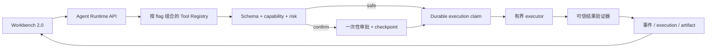

# PrivateAgent v0.5.0 开发计划书

> 制定日期：2026-08-09  
> 当前开发基线：`0.4.0-alpha.2`  
> 基线代码提交：`9127ef2`  
> 基线检查点提交：`a5e05f8`  
> 当前数据库 schema：`0022`  
> 发布目标：`0.5.0-beta.1 → 0.5.0-beta.2 → 0.5.0-rc.1 → 0.5.0`  
> 观察策略：中间检查点不等待；仅 `0.5.0-rc.1` 执行一次 14 个自然日整体观察  
> 前置验收：[`v0.4.0-alpha.2-checkpoint-20260808.md`](./v0.4.0-alpha.2-checkpoint-20260808.md)

## 1. 计划结论

`v0.5.0` 的主题不是继续重做 Runtime 或 UI，而是把现有 Runtime、审批、验证器和 Workbench 2.0 组合成可以真实使用的**可信执行工作流**。

本版本完成后，PrivateAgent 应能在用户明确授权的边界内完成：

1. 读取项目、搜索代码并生成 Diff；
2. 经审批把已预览的补丁原子写入工作区，并回读验证；
3. 经审批运行固定白名单命令，支持超时、取消和进程树清理；
4. 调用用户预先配置的 HTTP/API 目标，严格执行域名、方法、Schema、大小和秘密边界；
5. 对用户预先配置的只读数据库连接执行有界查询；
6. 组合上述能力形成可暂停、可审批、可恢复、可审计的多步骤工作流；
7. 在新工作台中清楚展示计划、风险、Diff、命令输出、验证结果和产物；
8. 完成从公开稳定版 `0.2.1` 直升 `0.5.0` 的安装、数据保留与应用回退验收；
9. 只在 RC 功能冻结后进行一次 14 天真实使用观察。

## 2. 当前实际基线

### 2.1 已完成，禁止重复建设

以下能力已经在 `0.4.0-alpha.2` 或更早版本实现，`v0.5.0` 应直接复用：

- durable Agent Runtime、ContextBuilder、RAG、SSE、取消、断线恢复和摘要 worker；
- `ToolSpec`、`VersionedToolRegistry`、capability policy、输入/输出 Schema 校验；
- 一次性审批 token、参数哈希绑定、过期、拒绝和并发单消费；
- `agent_run_checkpoints` 与审批后恢复；
- `agent_tool_executions`、幂等 claim、结果 SHA、失败关闭和崩溃 reconcile；
- 七个新 Runtime 只读工具：`search_files`、`grep_code`、`read_file`、`read_code_file`、`get_git_status`、`get_git_diff`、`propose_patch`；
- 六类结果验证器：文件 Diff、Shell、代码命令、API、数据库和工作流完成验证器；
- Workbench 2.0、统一审批卡、活动流、ContextRail、Sources、Artifacts 和状态组件；
- 设计系统、动画、reduced-motion、视觉回归、性能和资源清理门禁；
- NSIS、updater 签名资产、manifest、release-check 和安装升级回滚证据链。

当前门禁基线：pytest 637、Vitest 95、Playwright 47、release-check 14/14，`P0/P1 = 0`。

### 2.2 当前未完成，属于 v0.5.0 主线

- `apply_patch_to_workspace` 与 `run_whitelisted_command` 仍属于 legacy 工具注册表，尚未接入新 Runtime；
- 命令取消目前只结束直接子进程，尚未完成 Windows 进程树级清理；
- Patch 写入仍需补强原子替换、符号链接/重解析点和 TOCTOU 防护；
- `ApiResultVerifier`、`DatabaseResultVerifier` 已实现，但没有真实 HTTP/SQL 工具接入；
- 多步骤 checkpoint 主要服务审批恢复，尚未形成用户可见的完整工作流产品；
- ContextRail 的 Files/Diff 入口和部分产物展示仍是占位或轻量实现；
- 新工作流缺少独立 feature flag、设置入口、诊断快照和安装版故障注入；
- 尚未完成 `0.2.1 → 0.5.0` 直升、updater、回滚和 14 天 RC 观察。

## 3. 版本范围

### 3.1 必须交付

| 领域 | v0.5.0 交付范围 |
|---|---|
| Patch 工作流 | Diff 预览、参数绑定审批、原子应用、冲突拒绝、回读验证、产物展示 |
| 命令工作流 | 固定 argv、项目根目录、白名单、审批、流式输出、超时、取消、进程树清理 |
| HTTP/API 工作流 | 固定 profile、目标/方法 allowlist、TLS/SSRF 防护、Schema、限流、幂等键、秘密引用 |
| 只读 SQL 工作流 | 固定连接 profile、只读事务、单语句、超时、行数/字节上限、结果验证 |
| 多步骤工作流 | 计划、步骤状态、checkpoint、审批暂停、重启恢复、失败关闭、完成条件验证 |
| 桌面 UI | 风险预览、Diff、终端输出、HTTP/SQL 摘要、恢复入口、验证结果、Artifacts |
| QA/发布 | 全门禁、安装升级、数据保留、应用回退、RC 证据包、一次 14 天观察 |

### 3.2 明确不做

- 任意 Shell、PowerShell 或命令字符串执行；
- 任意路径写入、目录递归删除、自动部署和系统配置修改；
- 任意 URL、任意请求头或任意外网访问；
- 数据库写入、DDL、存储过程和多语句 SQL；
- 自动发送邮件、消息、支付、下单或发布内容；
- 绕过审批、验证器或 capability policy 的“快速模式”；
- MCP OAuth、大规模第三方生产服务验收；
- macOS/Linux 正式支持、移动端和公网多租户；
- legacy API/表的物理删除；
- 无用户确认的长期自动运行；
- 深色主题全面上线。

这些能力如有明确需求，进入 `0.6.0+` 独立设计与验收。

## 4. 目标架构



### 4.1 复用原则

1. 不建立第二套 Runtime、审批表或 execution 表；
2. 新工具必须转换为 `ToolSpec`，不能直接把 legacy executor 暴露给模型；
3. 每类工作流使用独立 registry builder 和独立 flag；
4. 验证器由可信代码固定注入，模型不能选择或声明验证通过；
5. Vue 只显示脱敏 DTO，不持有审批 token、数据库密码、API key 或完整环境变量；
6. sidecar/API 是唯一执行边界，Vue 组件不得直接执行命令或发任意网络请求；
7. 所有执行结果先验证、脱敏、限长并持久化，再返回模型和 UI。

### 4.2 建议代码边界

| 责任 | 主要位置 | 计划动作 |
|---|---|---|
| ToolSpec/dispatcher | `src/personal_assistant/agents/` | 复用，不重写 |
| 只读工具 | `core/tool_adapter.py` | 保持现状，补取消清理测试 |
| Patch/命令适配 | `core/` 新增独立适配模块 | 从 legacy 工具迁入 versioned registry |
| HTTP 边界 | `core/` 新增可信 HTTP 服务 | 复用 MCP 的 URL/DNS/TLS 防护，不复制弱实现 |
| SQL 边界 | `core/` 新增只读查询服务 | profile、只读事务、限时限量 |
| Registry 组合 | `api/routes_agent_runs.py` | 按独立 flag 组合 registry 和 verifier |
| 设置/诊断 API | `api/` | 管理非敏感 profile、开关状态和诊断摘要 |
| 桌面 API | `apps/desktop/src/api/` | 类型化封装，不在组件散落 fetch/invoke |
| 工作流 UI | `features/agent/`、`ContextRail.vue` | 复用审批、活动、Diff、Artifacts 组件 |

## 5. 工作流安全契约

| 工具 | 风险 | capability | 幂等策略 | 必须验证器 | 独立开关 |
|---|---|---|---|---|---|
| `propose_patch` | safe | filesystem.read | idempotent | FileDiff | 已有只读工具开关 |
| `apply_patch_to_workspace` | confirm | filesystem.read/write | 不自动重放未知副作用 | FileDiff | `PA_AGENT_PATCH_WORKFLOW_ENABLED` |
| `run_whitelisted_command` | confirm | process.execute/filesystem.read | 不自动重放 | Shell + CodeCommand | `PA_AGENT_COMMAND_WORKFLOW_ENABLED` |
| `call_allowlisted_api` | confirm | network.fetch | GET 可重试；写方法必须幂等键 | API | `PA_AGENT_HTTP_WORKFLOW_ENABLED` |
| `query_readonly_sql` | confirm | database.query | idempotent | Database | `PA_AGENT_SQL_READONLY_WORKFLOW_ENABLED` |

所有名称以最终实现为准，但一类高风险能力不能借用另一类 flag。

### 5.1 Patch 边界

- 只允许已授权项目根目录内的相对路径；
- 拒绝绝对路径、`..`、符号链接、目录联接和 Windows 重解析点越界；
- 审批绑定 `project_id + rel_path + old_sha256 + new_sha256 + tool_version`；
- 预览被截断时不允许直接应用，必须重新生成可完整审查的分块 Diff；
- 写入前再次校验 old SHA，写入采用同目录临时文件和原子替换；
- 写入后重新读取磁盘，核对 new SHA；
- 冲突、权限错误、磁盘错误或回读不一致一律失败关闭；
- 不在 v0.5.0 支持目录删除、批量删除和二进制 patch。

### 5.2 命令边界

- 只接受参数数组，不经 shell，不支持管道、重定向、变量展开或命令替换；
- 工作目录固定为已授权项目根目录或 profile 声明的子目录；
- 复用并收紧 `project_command_profiles`，不允许模型临时扩大白名单；
- 环境变量采用固定 allowlist，清除代理、凭据和无关继承变量；
- 命令、子命令、参数模式、超时和输出上限都由 profile 固定；
- Windows 使用进程组/Job Object 或等价可靠方案清理整个进程树；
- 超时和用户取消后必须验证无子进程、端口和临时锁残留；
- stdout/stderr 流式显示但持久化有界，敏感内容先脱敏。

### 5.3 HTTP/API 边界

- 模型不能提供任意 URL；只能选择用户已保存并启用的 endpoint profile；
- profile 固定 scheme、host、port、path 前缀、方法、请求/响应 Schema 和大小上限；
- 默认只允许 HTTPS；拒绝 URL 凭据、环境代理、环回、私网、链路本地和云元数据地址；
- DNS 解析结果必须全部校验并钉住连接目标；重定向默认禁用；
- secret 只能通过 OS keyring 引用注入，模型、Vue、数据库和日志不接触明文；
- GET/HEAD 可在有界条件下重试；POST 仅对显式 profile、固定 Schema 和幂等键开放；
- PUT/PATCH/DELETE 在 v0.5.0 默认不开放；
- 响应先校验状态码、Schema、重试次数和大小，再进入模型上下文。

### 5.4 只读 SQL 边界

- 模型不能提供 DSN、用户名或密码，只能选择已保存的只读连接 profile；
- secret 仅存 OS keyring，数据库只保存非敏感连接元数据和 secret reference；
- 强制只读事务、单语句、超时、最大行数和最大字节数；
- 只允许 SELECT/EXPLAIN/SHOW 等明确只读语句；
- 拒绝 DDL、DML、存储过程、临时表、锁、`FOR UPDATE` 和多语句；
- 不能只依靠字符串前缀判断，必须使用可靠解析和数据库只读事务双重限制；
- 默认隐藏大字段和疑似秘密列，UI 仅显示有界表格预览；
- 结果验证器核对只读状态、返回行数、截断标记和事务结果。

## 6. 里程碑计划

### B0：契约冻结与风险基线

建议工期：2–3 个工作日。

任务：

1. 冻结五类工具名称、版本、input/output Schema、risk、capability 和 idempotency；
2. 增加四个独立 feature flag 和 `/capabilities` 状态；
3. 明确 beta/RC 默认值、设置页呈现和回退顺序；
4. 对 Patch、命令、HTTP、SQL 分别完成威胁清单；
5. 确认现有 `0014–0016` 是否足够承载 execution；
6. 决定是否需要 additive `0023` 保存 HTTP/SQL 非敏感 profile；
7. 先提交公共 DTO、Schema 和测试夹具，再让前后端并行消费。

退出条件：

- 契约测试先落地并失败；
- 默认关闭高风险能力；
- 不存在一个总开关同时开启四类工作流；
- secret 生命周期和数据库字段明确；
- 不修改已冻结的 `0.3.0` 公开 DTO，新增字段保持向后兼容。

### B1：Patch 可信执行闭环

建议工期：4–6 个工作日。

任务：

1. 把 `apply_patch_to_workspace` 包装为 versioned `ToolSpec`；
2. 接入 `FileDiffResultVerifier` 与 durable execution；
3. 完成原子写、重解析点、TOCTOU 和冲突防护；
4. 完成参数变化、过期审批、token 重放和双消费拒绝；
5. ContextRail 接入真实授权文件、变更摘要和 Diff；
6. 新增 Diff 审批视图、应用结果、失败原因和产物入口；
7. 添加单文件修改、新文件创建、冲突、取消和重启恢复 E2E。

退出条件：

- 未审批时磁盘零写入；
- 审批参数与实际写入完全一致；
- 过期 Diff、路径越界和链接逃逸均拒绝；
- 成功写入后回读 SHA 一致；
- 崩溃后的未知写入不自动重放；
- 关闭 Patch flag 后只读工具仍可正常使用。

### B2：命令可信执行闭环

建议工期：4–6 个工作日。

任务：

1. 把 `run_whitelisted_command` 迁入 versioned registry；
2. 复用 `project_command_profiles`，统一全局默认与项目 profile；
3. 接入 Shell/CodeCommand 组合验证器；
4. 实现 Windows 整个进程树的取消、超时和退出清理；
5. 增加流式输出事件、截断、脱敏和最终结果；
6. UI 展示 exact argv、cwd、timeout、风险、实时输出和退出码；
7. 故障注入覆盖长任务、子进程、输出洪泛、编码错误和应用退出。

退出条件：

- shell 控制符和非白名单命令 100% 拒绝；
- 取消/超时/关闭应用后子进程残留为 0；
- stdout/stderr 不阻塞、不无限增长、不泄露 secret；
- 重试不重复运行未知状态命令；
- 安装版真实执行 pytest/npm/cargo 代表性命令通过。

### `0.5.0-beta.1` 检查点

Beta.1 只要求 Patch 与命令工作流完整，不强行夹带 HTTP/SQL。

门禁：

- Patch、命令相关单元/集成/E2E 全绿；
- Python、Vue、Rust 和 release-check 全绿；
- Windows 安装版完成 Patch、命令、取消和进程树清理 smoke；
- feature flag 独立回退通过；
- P0/P1 为 0；
- 生成 beta.1 checkpoint、manifest、flags、测试和已知问题报告；
- 门禁通过立即进入 Beta.2，不等待使用观察。

### B3：HTTP/API 可信工作流

建议工期：4–6 个工作日。

任务：

1. 建立 endpoint profile 的非敏感模型、API 和设置 UI；
2. 复用 MCP HTTP 的 TLS、DNS、私网拒绝和资源上限实现；
3. 实现固定目标/方法/Schema 的 executor；
4. 接入 `ApiResultVerifier`；
5. 实现 keyring secret reference、幂等键和 metadata-only 审计；
6. 建立真实 loopback 测试服务，覆盖认证、超时、错误 Schema 和重试；
7. UI 显示目标摘要、方法、字段级隐私预览和有界响应。

退出条件：

- 任意 URL、私网绕过、DNS 换址、重定向和环境代理均失败关闭；
- secret 不出现在 Vue、数据库、日志、报告或模型参数中；
- 状态码/Schema/大小/重试/幂等验证通过；
- 未配置 profile 时模型看不到 HTTP 工具；
- 删除或禁用 profile 后不能继续调用。

### B4：只读 SQL 可信工作流

建议工期：4–6 个工作日。

任务：

1. 建立只读 connection profile 和 keyring 凭据引用；
2. 实现只读 SQL parser/policy 与数据库只读事务；
3. 增加查询超时、行数/字节上限和字段脱敏；
4. 接入 `DatabaseResultVerifier`；
5. UI 显示连接别名、数据库、规范化 SQL、限制和结果预览；
6. 覆盖 MySQL 中断、权限不足、慢查询、截断和恢复；
7. 验证备份不会包含密码或可恢复明文。

退出条件：

- DDL/DML/多语句/锁查询全部拒绝；
- 数据库账号即使配置错误也不能通过应用层绕过只读策略；
- 查询超时可取消，无悬挂连接；
- 结果行数、字节数和敏感字段均受限；
- 关闭 SQL flag 不影响应用主数据库正常运行。

### B5：多步骤工作流、恢复与 UI 整合

建议工期：5–7 个工作日。

任务：

1. 把计划、步骤、审批、execution、验证结果和产物映射为统一状态；
2. 支持只读步骤自动执行，高风险步骤逐步审批；
3. 支持用户取消当前步骤或整个 run；
4. 支持 sidecar 重启、桌面重开和审批后续跑；
5. 对非幂等 unknown execution 提供人工处置，不自动猜测成功或重跑；
6. 使用 `WorkflowCompletionVerifier` 定义可信完成条件；
7. 完成计划视图、活动流、恢复提示、Artifacts 和失败建议；
8. 清理 ContextRail 的 Files/Diff 占位文案。

首批端到端场景：

1. 搜索代码 → 读取文件 → 生成 Diff → 审批 → 写入 → 运行测试 → 展示产物；
2. 查询只读数据库 → 整理结果 → 生成本地报告草稿；
3. 调用 allowlist API → 校验响应 → 生成结果摘要；
4. 命令运行中取消 → 清理进程树 → 恢复到可继续状态；
5. 审批等待时关闭应用 → 重开 → 加载未决审批 → 继续执行。

退出条件：

- 每个步骤只有一个 durable 终态；
- 刷新、切换会话和重启不会重复副作用；
- 失败步骤不被模型包装成“已完成”；
- 用户能从 UI 判断当前状态、风险、影响和下一步；
- 长日志、长 Diff、多产物和窄窗口可正常完成核心流程。

### `0.5.0-beta.2` 检查点

门禁：

- 四类可信工作流和多步骤场景全部通过；
- 自动化、视觉、可访问性、性能和资源清理全绿；
- 全新安装、Alpha.2 覆盖升级、应用回退和数据保留通过；
- 故障注入覆盖 sidecar、MySQL、模型、命令和网络；
- 所有默认开启功能拥有回退路径；
- 形成 RC 阻断问题清单；
- 门禁通过立即进入 RC 硬化，不等待观察。

### B6：RC 硬化与冻结

建议工期：5–7 个工作日。

任务：

1. 修复 Beta.2 的 P0/P1 和已选 P2；
2. 完成 Alpha.2 留下的真实功能逐项人工操作与键盘深度焦点检查；
3. 完成长时间流式输出、命令输出、Diff 和表格性能检查；
4. 完成 `0.2.1 → 0.5.0-rc.1` 覆盖安装与 updater 演练；
5. 完成 `0.4.0-alpha.2 → 0.5.0-rc.1` 开发连续升级；
6. 完成 `0.5.0-rc.1 → 0.2.1` 应用回退兼容说明和实机证据；
7. 绑定 commit、版本、schema、installer SHA、sidecar SHA 和 flag 快照；
8. 复核观察 runner、聚合器、告警和数据口径；
9. 冻结功能、公开 DTO、迁移和计划发布默认值。

进入 RC 观察前必须满足：

- release-check 全绿，工作区干净；
- pytest、Vitest、Playwright、Cargo 和安装版 smoke 全绿；
- P0/P1 为 0，P2 有负责人和处置；
- 新增迁移均为 additive，旧版应用回退可读取原有数据；
- 全新安装、覆盖升级、updater、回退和数据保留证据可审计；
- 观察 runner 不误计、不破坏业务数据；
- RC 期间所有默认开启功能已冻结。

### `0.5.0-rc.1`：唯一一次 14 天观察

观察期间停止新增功能，只允许缺陷、文案、布局和测试修复。

最低样本：

| 场景 | 最低数量 |
|---|---:|
| 有效 completed Agent run | 200 |
| 真实人工交互 run | 50 |
| 普通聊天 | 60 |
| RAG 聊天 | 40 |
| Patch 工作流 | 20 |
| 命令工作流 | 15 |
| HTTP/API 工作流 | 10 |
| 只读 SQL 工作流 | 10 |
| 多步骤审批/恢复 | 20 |
| 用户取消 | 10 |
| 断线、重启或续传恢复 | 10 |

必须包含的故障和安装场景：

- 10 次正常启动/退出；
- 2 次 sidecar 异常终止与 reconcile；
- 2 次模型服务中断；
- 1 次 MySQL 短暂中断；
- 1 次覆盖安装、1 次 updater、1 次应用回退；
- 1 次审批过期、1 次参数篡改拒绝；
- 1 次命令超时、1 次命令取消和进程树清理；
- 1 次 HTTP DNS/目标策略拒绝；
- 1 次 SQL 写语句拒绝；
- 1 次 Patch 冲突拒绝；
- 1 次结果验证失败关闭。

观察通过标准：

- 数据损坏、秘密泄漏、审批绕过、重复副作用均为 0；
- 不存在超过 10 分钟无状态推进且无法取消/恢复的 run；
- owner lock 无双 coordinator；
- 工具取消/超时后无残留子进程、连接、端口和监听器；
- Patch、HTTP、SQL 和工作流验证器均失败关闭；
- P0/P1 为 0，P2 有明确处置；
- UI 不存在阻断核心流程的溢出、遮挡、焦点或滚动问题；
- 安装、升级、回退、数据计数和 RC 报告完整可复核。

严重问题重新计时规则：只有数据损坏、秘密泄漏、审批绕过或重复副作用需要修复后重启完整 14 天；一般 P1 只对受影响场景连续复核 72 小时，普通 P2 不重启观察。

### `0.5.0` 正式发布

建议工期：1–2 个工作日。

任务：

1. 从通过观察的 RC commit 生成正式资产，不夹带新功能；
2. 统一所有版本源为 `0.5.0`；
3. 重跑完整 release-check；
4. 生成安装包、updater、manifest、SHA 和代码签名状态；
5. 发布升级说明、回退说明、已知问题和隐私边界；
6. 更新稳定 updater 通道；
7. 保留 RC 与正式版证据包。

若面向公开用户大规模分发，Authenticode 证书应升级为正式发布门槛；若仍是个人/内部使用，可以保留明确的未签名状态报告，但不得伪称已签名。

## 7. Feature Flag 与默认值策略

### 7.1 必需开关

```text
PA_AGENT_PATCH_WORKFLOW_ENABLED
PA_AGENT_COMMAND_WORKFLOW_ENABLED
PA_AGENT_HTTP_WORKFLOW_ENABLED
PA_AGENT_SQL_READONLY_WORKFLOW_ENABLED
```

继续保留：

```text
PA_AGENT_RUNS_API_ENABLED
PA_AGENT_RUN_READ_ONLY_TOOLS_ENABLED
PA_CHAT_AGENT_RUNTIME_ENABLED
PA_AGENT_RAG_TOOLS_ENABLED
PA_AGENT_OUTPUT_VERIFICATION_ENABLED
PA_CONVERSATION_SUMMARY_WORKER_ENABLED
```

### 7.2 开启规则

- Beta 开发初期四个新开关默认关闭，测试按场景显式开启；
- Beta.1 只允许内部构建开启 Patch/命令；
- Beta.2 才允许内部构建开启 HTTP/SQL；
- 未配置授权项目、endpoint profile 或 SQL profile 时，对应工具不注册给模型；
- RC 使用计划发布的最终默认值，并冻结 flags 快照；
- 单个工作流关闭后不需要数据库 downgrade；
- UI 必须显示“未启用、未配置、已禁用、等待审批、执行中、失败、完成”区别。

## 8. 数据库、凭据与备份策略

1. Beta.1 优先复用 schema `0022` 的 approvals、checkpoints 和 executions；
2. 如果 HTTP/SQL profile 需要持久化，新增 `0023` additive migration；
3. 数据库只保存 profile 名称、目标摘要、policy、enabled、版本和 secret reference；
4. 明文 API key、数据库密码和完整 DSN 只进入 OS keyring 与当前 sidecar 内存；
5. 备份导出清空 secret value，只保留“已配置”状态和不可用引用说明；
6. 所有新表加入备份、恢复、诊断和数据计数清单；
7. 不删除旧表/列，不把数据库 downgrade 作为普通应用回退手段；
8. 每次安装升级证据必须保存同一次演练的 pre/post 版本、schema 和表计数。

## 9. UI/UX 开发清单

### 9.1 复用现有组件

- `AgentWorkspace`、`ActivityFeedV2`、`ApprovalCardV2`；
- `ContextRail` 的 Files、Context、Sources、Artifacts；
- `PaDialog`、`PaTabs`、`PaButton`、通知/确认 store；
- 现有 design tokens、动画语义和 reduced-motion；
- UI Lab 状态 fixtures 和 Playwright 视觉基线。

### 9.2 新增/补全界面

- Patch：文件、old/new SHA、完整 Diff、风险、冲突和应用结果；
- 命令：argv、cwd、profile、超时、实时输出、取消、退出码和残留清理结果；
- HTTP：目标 profile、方法、字段级隐私摘要、响应 Schema 和状态；
- SQL：连接别名、只读标识、规范化查询、行数上限、结果表格和截断；
- 工作流：步骤列表、当前步骤、审批等待、恢复、失败处置和可信完成条件；
- Artifacts：Diff、日志、报告和导出文件的统一入口；
- Settings：四类能力的开关、profile 配置、风险说明和诊断状态。

### 9.3 每个界面的必测状态

- 未启用；
- 未配置；
- 空态；
- 加载中；
- 等待审批；
- 审批过期/拒绝；
- 执行中；
- 用户取消；
- 超时；
- 验证失败；
- 成功完成；
- 后端离线；
- 应用重开后恢复；
- 输出截断；
- 1280 窄窗口、长路径、长命令和长日志；
- 键盘操作、焦点锁定/恢复和 reduced-motion。

## 10. 测试与门禁矩阵

### 10.1 后端

- ToolSpec Schema、远程 `$ref`、risk、capability 和 output size；
- feature flag 组合和工具不可见性；
- 审批参数篡改、token 重放、过期和并发消费；
- execution claim、幂等缓存、unknown 副作用和 crash reconcile；
- Patch 路径穿越、链接逃逸、原子写、SHA 冲突和磁盘回读；
- 命令白名单、shell 控制符、环境变量、超时、取消和进程树；
- HTTP SSRF、DNS、TLS、重定向、代理、Schema、大小和幂等；
- SQL 写语句、多语句、锁、超时、行数、事务和脱敏；
- 多步骤恢复、失败关闭和 WorkflowCompletionVerifier。

### 10.2 前端

- 组件测试覆盖审批、Diff、命令、HTTP、SQL、恢复和 Artifacts；
- E2E 覆盖四类工作流的成功/拒绝/取消/失败；
- 审批等待期间刷新和应用重开；
- 视觉回归覆盖 1280/1440/1920；
- axe、键盘焦点、Dialog 焦点恢复和 reduced-motion；
- 页面/会话反复切换后 SSE、timer、listener 零增长；
- 长输出和高频进度下无不必要的 50ms 主线程长任务。

### 10.3 安装版

- sidecar 启动、端口协商、API token 和 schema 迁移；
- Patch 写入授权项目；
- 命令执行、取消和退出后进程树清理；
- keyring secret 注入但不进入日志；
- MySQL/Ollama/网络中断与恢复；
- 全新安装、覆盖安装、updater、卸载重装和应用回退；
- 同一次演练的 pre/post 数据计数和二进制 SHA。

### 10.4 必跑命令

```powershell
uv run ruff check src tests scripts
uv run pytest -q

cd apps/desktop
npm run test
npm run build
npm run e2e

cd src-tauri
cargo check --locked
cargo test --locked

cd F:\Program\Agent
scripts\release-check-full.bat
```

## 11. 工期与节奏

### 11.1 单执行者估算

| 阶段 | 工作日 |
|---|---:|
| B0 契约与风险基线 | 2–3 |
| B1 Patch | 4–6 |
| B2 命令 | 4–6 |
| Beta.1 收口 | 1–2 |
| B3 HTTP | 4–6 |
| B4 SQL | 4–6 |
| B5 多步骤/UI 整合 | 5–7 |
| Beta.2 收口 | 2–3 |
| B6 RC 硬化 | 5–7 |
| RC 正式观察 | 14 个自然日 |
| 正式发布 | 1–2 |

开发阶段约 31–48 个工作日，随后进行一次 14 天 RC 观察。估算不包含外部证书、第三方商业账号或新平台支持。

### 11.2 多 AI 并行估算

在 DTO 先冻结、工作区隔离且所有权清晰时，Patch/命令、HTTP/SQL、UI 和 QA 可以部分并行，开发阶段目标可压缩到约 20–30 个工作日；14 天 RC 观察不能并行压缩。

## 12. 多 AI 协作拆分

| 轨道 | 责任范围 | 禁止越界 |
|---|---|---|
| A：Runtime/契约 | ToolSpec、registry、dispatcher、审批、execution、flags | 不大改 Vue 页面 |
| B：Patch/命令 | 文件边界、原子写、命令 profile、进程树 | 不改 HTTP/SQL profile |
| C：HTTP/SQL | profile、keyring、网络/数据库策略、验证器 | 不改 Patch/命令实现 |
| D：桌面 UI | API DTO、审批/Diff/日志/结果/恢复界面、E2E | 不在组件实现执行逻辑 |
| E：QA/发布 | 故障注入、安装、升级、回退、证据包、观察 runner | 不修改事实口径掩盖失败 |

协作规则：

1. B0 的公共 DTO、Schema、flags 先合入；
2. 不允许两个 AI 同时大改 `routes_agent_runs.py`、`App.vue`、`types.ts` 或 migration；
3. 每个工作包使用小提交，包含测试和回退说明；
4. 共享文件改动由轨道 A/D 的负责人统一收口；
5. QA 使用独立数据库和临时工作区，不污染用户业务数据；
6. checkpoint、manifest 和完成状态只能根据实际证据更新。

## 13. 交付物

### Beta.1

- `docs/v0.5.0-beta.1-checkpoint-YYYYMMDD.md`；
- Patch/命令契约与安全说明；
- 测试、故障注入、安装版和进程树清理证据；
- beta.1 manifest、flags、SHA 和 release-check；
- 已知问题与回退说明。

### Beta.2

- `docs/v0.5.0-beta.2-checkpoint-YYYYMMDD.md`；
- HTTP/SQL profile 与秘密边界说明；
- 多步骤工作流状态矩阵；
- 四类工作流 E2E、视觉、性能和安装证据；
- beta.2 manifest、flags、SHA 和 release-check。

### RC/正式版

- `release-check-0.5.0-rc.1.json/.md`；
- `release-manifest-0.5.0-rc.1.md`；
- `qa-evidence-0.5.0-rc.1.json`；
- `observation-report-0.5.0-rc.1.json/.md`；
- `ui-design-qa-0.5.0-rc.1.md`；
- `upgrade-report-0.2.1-to-0.5.0.json`；
- `rollback-report-0.5.0-to-0.2.1.json`；
- `codesign-status-0.5.0.json`；
- 安装包、updater、manifest 和 SHA-256 清单；
- 最终发布说明、升级说明、回退说明和已知问题。

## 14. 完成定义

只有同时满足以下条件，才能宣布 `v0.5.0` 完成：

1. Patch、命令、HTTP 和只读 SQL 均在明确边界内真实可用；
2. 每类能力都有独立 flag、审批、验证器、诊断和回退；
3. 多步骤工作流可暂停、取消、重启恢复且不重复副作用；
4. 新工作台完整呈现计划、风险、Diff、输出、验证和产物；
5. secret 不进入模型参数、Vue、数据库、日志和发布证据；
6. 取消、超时和退出后子进程、连接、SSE、timer、listener 零残留；
7. `0.2.1 → 0.5.0` 全新安装、覆盖安装、updater、数据保留和应用回退通过；
8. 自动化、安装版、性能、视觉、可访问性和故障注入全部通过；
9. RC 功能冻结后完成唯一一次 14 天观察；
10. 数据损坏、秘密泄漏、审批绕过、重复副作用为 0；
11. P0/P1 为 0，P2 有明确处置；
12. 正式资产绑定同一 commit、版本、schema、flags 和 SHA；
13. 发布稳定版 `0.5.0`。

## 15. 立即执行顺序

1. 将本计划作为 `0.4.0-alpha.2` 之后的主计划；
2. 建立 B0 契约表、威胁清单和四个独立 flag；
3. 先迁移 Patch，再迁移命令，形成 `0.5.0-beta.1`；
4. 并行开发 HTTP/SQL profile 与 UI，但在公共 DTO 冻结前不同时修改共享文件；
5. 完成多步骤恢复和全工作台整合，形成 `0.5.0-beta.2`；
6. 完成安装升级、人工功能/键盘补强和 RC 硬化；
7. 冻结 `0.5.0-rc.1`，执行唯一一次 14 天观察；
8. 观察通过后从同一 RC commit 发布 `0.5.0`。

---

本计划接续并取代 [`integrated-0.5.0-development-plan-20260808.md`](./integrated-0.5.0-development-plan-20260808.md) 中已经完成的 T0–T3 与过时基线描述；旧文档仍保留为“取消逐版本观察、只保留一次 RC 观察”这一路线决策的历史记录。
